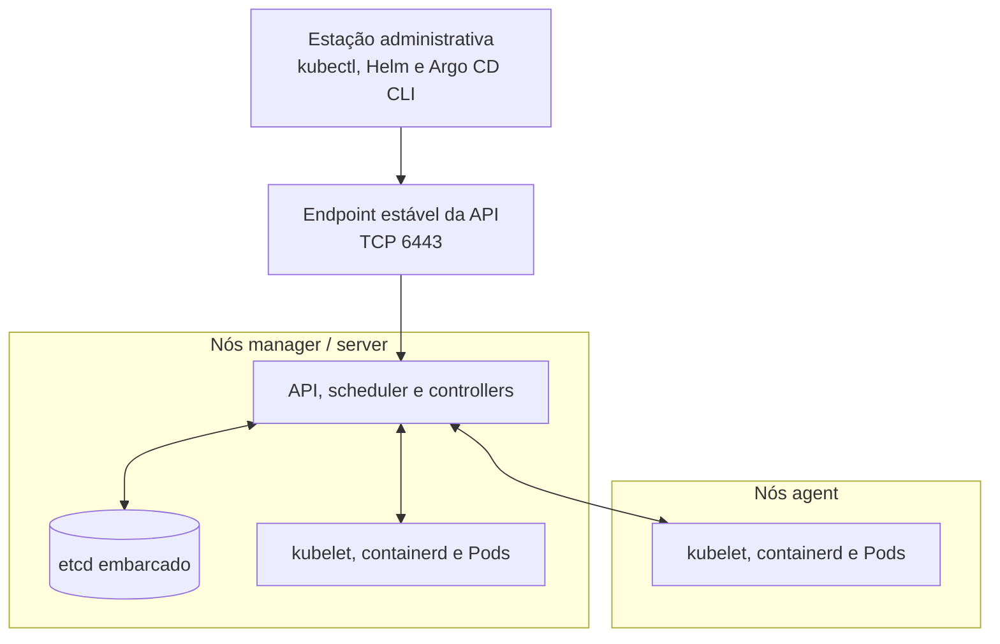
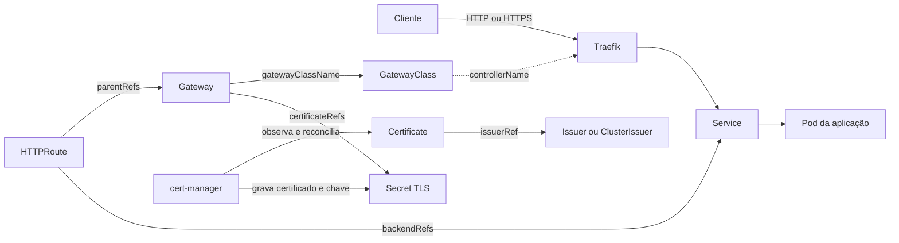
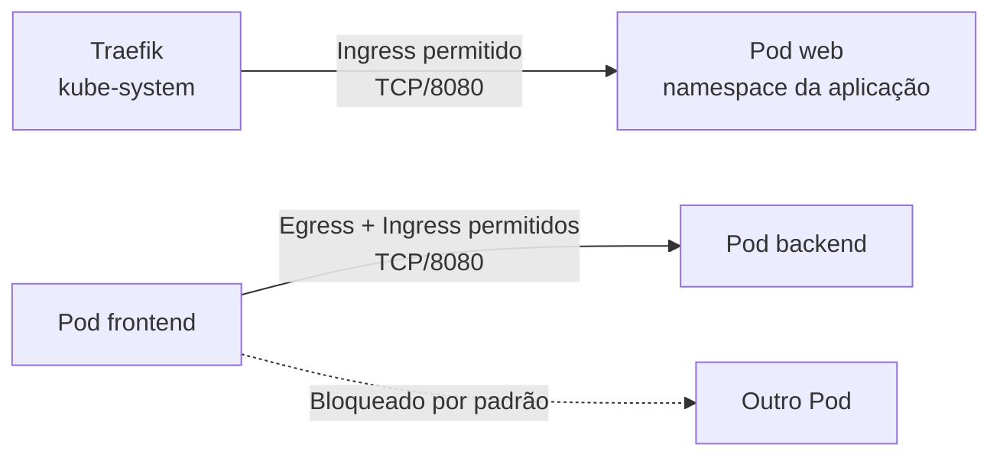
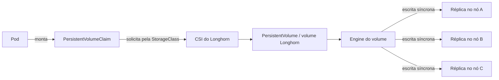
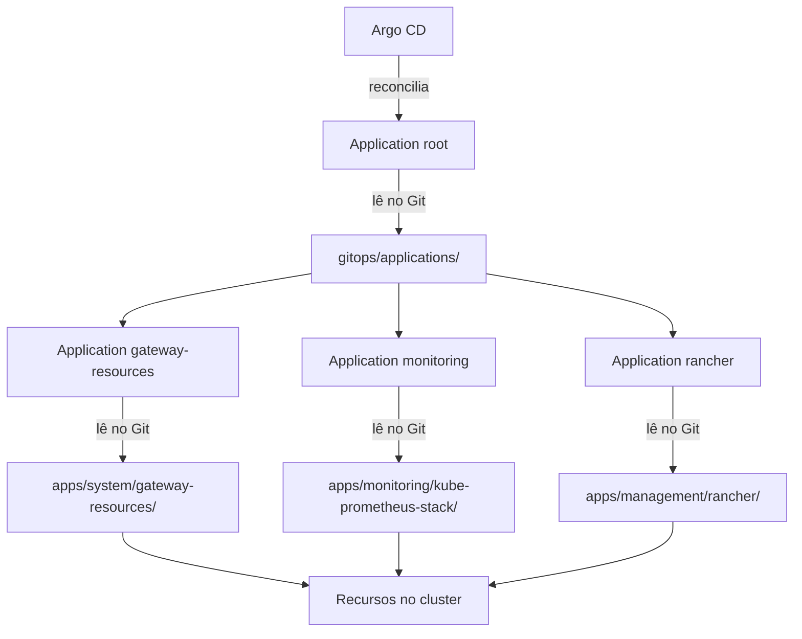

# cluster-management-notes

Runbook para preparar hosts Linux, criar e operar um cluster K3s e instalar os serviços básicos usados pelo cluster.

> [!NOTE]
> As anotações deste README foram elaboradas e revisadas com o apoio de inteligência artificial, especificamente o ChatGPT. Alguns scripts e outros conteúdos deste repositório também podem ter sido criados ou modificados com auxílio de IA. Valide o código, os comandos, as versões e as decisões de segurança de acordo com o seu ambiente antes de utilizá-los.

> [!CAUTION]
> Execute primeiro em um ambiente de teste. Os comandos alteram autenticação SSH, firewall, serviços do sistema e componentes do cluster. Mantenha uma sessão SSH funcional aberta durante mudanças de acesso e tenha acesso ao console da máquina antes de aplicar regras remotamente.

## Escopo e premissas

- Hosts Debian ou Ubuntu com `systemd`.
- Arquiteturas `amd64` e `arm64`.
- Comandos de administração do host executados como `root`. Quando estiver em uma conta comum, abra antes um shell com `sudo -i`.
- Nomes de nós, endereços IP e nomes DNS devem ser substituídos pelos valores do ambiente.
- O kubeconfig administrativo do K3s concede acesso total ao cluster e deve ser armazenado com permissão `0600`.
- As versões abaixo estão fixadas para tornar as instalações reproduzíveis. Elas são versões de referência, não uma matriz de compatibilidade homologada por este repositório. Valide o conjunto em homologação antes de atualizar produção.

> [!NOTE]
> Os blocos interativos usam `bash <<'EOF'`. Não acrescente `-c`: essa opção exige o script como argumento, enquanto o heredoc entrega o script pela entrada padrão. Dentro desses blocos, os prompts leem de `/dev/tty` para não consumir as próximas linhas do próprio heredoc.

| Componente | Versão usada nos exemplos |
| --- | --- |
| K3s | `v1.36.1+k3s1` |
| Gateway API, canal Standard | `v1.5.1` |
| cert-manager | `v1.20.0` |
| Longhorn e longhornctl | `1.12.0` |
| Chart Helm do Argo CD | `10.1.3` |

### Convenções de execução

Cada bloco shell informa onde deve ser executado:

- **nó alvo:** host Linux que será alterado; pode ser manager, agent ou uma máquina fora do cluster;
- **nó manager:** nó K3s com função server/control-plane;
- **nó agent:** nó K3s com função agent/worker;
- **máquina com KUBECONFIG:** qualquer manager ou estação administrativa que tenha `kubectl`, acesso à API e um kubeconfig com as permissões necessárias;
- **estação administrativa:** máquina de origem usada para SSH, túneis ou instalação de CLIs; não precisa pertencer ao cluster.

## Ordem recomendada

1. Preparar o firewall do host.
2. Validar as chaves e endurecer o SSH.
3. Instalar e validar o Fail2Ban.
4. Criar o primeiro servidor K3s.
5. Instalar os CRDs da Gateway API e configurar o Traefik.
6. Adicionar os demais servidores e agentes.
7. Instalar cert-manager, Longhorn e Argo CD.
8. Conectar o Argo CD ao repositório GitOps e aplicar a Application `root`.
9. Modelar NetworkPolicies em homologação e permitir explicitamente os fluxos necessários.
10. Configurar backups e registrar o procedimento de atualização.

## Sumário

- [Configuração dos hosts](#configuração-dos-hosts)
  - [Firewall](#firewall)
  - [Hardening do SSH](#hardening-do-ssh)
  - [Fail2Ban](#fail2ban)
- [Gestão dos nós K3s](#gestão-dos-nós-k3s)
  - [O que é e como o cluster se organiza](#o-que-é-e-como-o-cluster-se-organiza)
  - [Planejamento e segredos](#planejamento-e-segredos)
  - [Primeiro servidor](#primeiro-servidor)
  - [Gateway API e Traefik](#gateway-api-e-traefik)
    - [O que são e como se relacionam](#o-que-são-e-como-se-relacionam)
  - [Isolamento de rede com NetworkPolicy](#isolamento-de-rede-com-networkpolicy)
  - [Servidor adicional](#servidor-adicional)
  - [Agente](#agente)
  - [Backup, atualização e remoção](#backup-atualização-e-remoção)
- [Ferramentas de linha de comando](#ferramentas-de-linha-de-comando)
- [Serviços básicos](#serviços-básicos)
  - [cert-manager](#cert-manager)
    - [Como o cert-manager trabalha](#como-o-cert-manager-trabalha)
  - [Longhorn](#longhorn)
    - [Como o Longhorn fornece armazenamento](#como-o-longhorn-fornece-armazenamento)
  - [Argo CD](#argo-cd)
    - [O que é e para que serve](#o-que-é-e-para-que-serve)
    - [Próximo passo: conectar o repositório GitOps](#próximo-passo-conectar-o-repositório-gitops)
- [Templates copiáveis](#templates-copiáveis)
- [Checklist operacional](#checklist-operacional)

## Configuração dos hosts

### Firewall

O firewall do host controla quais conexões de rede podem chegar aos serviços da máquina. Ele é a primeira barreira contra portas expostas desnecessariamente, mas não substitui autenticação, atualização dos serviços nem políticas de acesso dentro do Kubernetes. Por padrão, bloqueie conexões de entrada e permita apenas o que for necessário.

#### Portas publicadas pelo Docker

> [!WARNING]
> Uma porta publicada pelo Docker pode não ser filtrada da maneira esperada pelo UFW ou pelo firewalld.

Com UFW, o Docker pode encaminhar o tráfego publicado antes que ele passe pelas chains normalmente gerenciadas pelo UFW. Com firewalld, o Docker cria uma zona chamada `docker`, cujo target padrão é `ACCEPT`.

Portanto, não considere uma porta publicada pelo Docker protegida apenas porque o firewall do host possui uma política padrão de bloqueio.

Para serviços que só devem ser acessados pelo próprio host, faça bind no loopback:

```yaml
ports:
  - "127.0.0.1:5432:5432"
```

Para serviços que devem ser acessados somente por uma rede específica, faça bind no endereço da interface correspondente:

```yaml
ports:
  - "192.168.1.10:5432:5432"
```

Evite publicar apenas como `5432:5432`, pois isso normalmente faz bind em todas as interfaces disponíveis.

#### UFW

Defina as políticas padrão:

> **Executar em:** nó alvo, como `root`.

```bash
ufw default deny incoming
ufw default allow outgoing
```

Antes de habilitar o UFW remotamente, escolha **uma** das regras abaixo para liberar o SSH. Ajuste a porta, a interface e a rede ao ambiente.

> **Executar em:** nó alvo, como `root`.

```bash
# TCP/22 por qualquer interface e origem.
ufw allow in 22/tcp

# TCP/22 apenas pela interface eth1.
ufw allow in on eth1 to any port 22 proto tcp

# TCP/22 apenas para a sub-rede indicada.
ufw allow in from 192.168.1.0/24 to any port 22 proto tcp

# TCP/22 apenas pela interface e sub-rede indicadas.
ufw allow in on eth1 from 192.168.1.0/24 to any port 22 proto tcp
```

Nos hosts K3s, libere também a comunicação interna do cluster. Restrinja `K3S_NODE_CIDR` à rede que contém somente os nós; nunca exponha VXLAN/UDP 8472 à Internet.

Nos managers e agents:

> **Executar em:** todos os nós manager e agent, como `root`.

```bash
K3S_NODE_CIDR="192.168.1.0/24"
K3S_POD_CIDR="10.42.0.0/16"
K3S_SERVICE_CIDR="10.43.0.0/16"

# Em todos os nós: Flannel VXLAN e métricas/API do kubelet.
ufw allow in from "${K3S_NODE_CIDR}" to any port 8472 proto udp
ufw allow in from "${K3S_NODE_CIDR}" to any port 10250 proto tcp

# CIDRs padrão dos pods e serviços do K3s.
ufw allow in from "${K3S_POD_CIDR}"
ufw allow in from "${K3S_SERVICE_CIDR}"
```

Somente nos managers:

> **Executar em:** todos os nós manager, como `root`.

```bash
K3S_NODE_CIDR="192.168.1.0/24"

# Supervisor e API Kubernetes.
ufw allow in from "${K3S_NODE_CIDR}" to any port 6443 proto tcp

# Comunicação entre managers com etcd embarcado.
ufw allow in from "${K3S_NODE_CIDR}" to any port 2379:2380 proto tcp
```

Se a API também for administrada por uma rede separada, acrescente uma regra TCP/6443 restrita a essa rede. Se usar Flannel WireGuard em vez de VXLAN, libere UDP/51820 e, para IPv6, UDP/51821 entre os nós no lugar de UDP/8472. Exponha TCP/80, TCP/443 e NodePorts somente quando a arquitetura dos serviços exigir.

Confira as regras antes de habilitar o firewall:

> **Executar em:** nó alvo, como `root`.

```bash
ufw show added
```

Habilite ou recarregue as regras:

> **Executar em:** nó alvo, como `root`.

```bash
# Primeira ativação.
ufw enable

# Alterações posteriores.
ufw reload
```

Valide o estado efetivo e teste uma nova conexão SSH antes de encerrar a sessão original:

> **Executar em:** nó alvo, como `root`.

```bash
ufw status verbose
```

#### firewalld

TODO.

### Hardening do SSH

Hardening é a redução deliberada da superfície de ataque de um serviço. Nesta seção, o SSH continuará aceitando administração remota por chave pública, mas recusará senhas, login direto de `root`, usuários fora do grupo autorizado e funcionalidades que não forem necessárias. Essa configuração reduz as formas de entrada; ela não substitui o firewall nem a proteção da chave privada usada pelo administrador.

#### Preparação

Escolha explicitamente a conta que continuará autorizada a entrar. Não use `$USER` em um shell de `root`, pois isso pode configurar a conta errada.

> **Executar em:** nó alvo que terá o SSH endurecido, como `root`.

```bash
bash <<'EOF'
set -euo pipefail

if (( EUID != 0 )); then
  printf 'Execute este bloco em um shell root aberto com sudo -i.\n' >&2
  exit 1
fi

read -r -p "Usuário que poderá acessar por SSH: " SSH_USER </dev/tty

if ! id "${SSH_USER}" >/dev/null 2>&1; then
  printf 'Usuário inexistente: %s\n' "${SSH_USER}" >&2
  exit 1
fi

SSH_HOME="$(getent passwd "${SSH_USER}" | cut -d: -f6)"
SSH_GROUP="$(id -gn "${SSH_USER}")"

if [[ -z "${SSH_HOME}" ]]; then
  printf 'Não foi possível identificar o home de %s.\n' "${SSH_USER}" >&2
  exit 1
fi

install -d \
  -o "${SSH_USER}" \
  -g "${SSH_GROUP}" \
  -m 0700 \
  "${SSH_HOME}/.ssh"

if [[ ! -s "${SSH_HOME}/.ssh/authorized_keys" ]]; then
  printf 'Chave ausente em %s/.ssh/authorized_keys.\n' "${SSH_HOME}" >&2
  exit 1
fi

chown "${SSH_USER}:${SSH_GROUP}" "${SSH_HOME}/.ssh/authorized_keys"
chmod 0600 "${SSH_HOME}/.ssh/authorized_keys"

groupadd --force ssh-users
usermod --append --groups ssh-users "${SSH_USER}"

printf '\nUsuário e grupo preparados:\n'
id "${SSH_USER}"
getent group ssh-users
EOF
```

Confirme, antes de alterar o servidor, que a conta entra usando uma chave e sem pedir a senha da conta:

> **Executar em:** estação administrativa com acesso SSH ao nó alvo.

```bash
ssh usuario@ip-do-servidor
```

Mantenha essa sessão aberta enquanto altera a configuração. Corrija também as permissões da chave autorizada com o bloco acima.

> [!IMPORTANT]
> A nova associação ao grupo só estará presente em novas sessões da conta.

#### Configuração

O bloco abaixo grava a configuração completa, pergunta se todos os encaminhamentos devem ser bloqueados, valida o resultado e só então oferece o reload do serviço:

> **Executar em:** nó alvo que terá o SSH endurecido, como `root`.

```bash
bash <<'EOF'
set -euo pipefail

if (( EUID != 0 )); then
  printf 'Execute este bloco em um shell root aberto com sudo -i.\n' >&2
  exit 1
fi

install -d -o root -g root -m 0755 /etc/ssh/sshd_config.d

cat >/etc/ssh/sshd_config.d/00-hardening.conf <<'SSHD_CONFIG'
# Exigir autenticação por chave pública.
PubkeyAuthentication yes
AuthenticationMethods publickey

# Desabilitar autenticação por senha.
PasswordAuthentication no
KbdInteractiveAuthentication no
PermitEmptyPasswords no

# Manter verificações de conta e sessão do PAM.
UsePAM yes

# Validar permissões do home, ~/.ssh e authorized_keys.
StrictModes yes

# Reduzir a janela e o número de tentativas de autenticação.
LoginGraceTime 30
MaxAuthTries 4

# Desabilitar funcionalidades não utilizadas.
X11Forwarding no
PermitTunnel no
PermitUserEnvironment no

# Restringir acesso e impedir login direto como root.
AllowGroups ssh-users
PermitRootLogin no

# Aumentar os detalhes úteis para auditoria.
LogLevel VERBOSE
SSHD_CONFIG

read -r -p \
  "Desabilitar todos os encaminhamentos SSH? [s/N]: " \
  DISABLE_FORWARDING \
  </dev/tty

if [[ "${DISABLE_FORWARDING,,}" == "s" ]]; then
  printf '\nDisableForwarding yes\n' \
    >>/etc/ssh/sshd_config.d/00-hardening.conf
fi

sshd -t

printf '\nConfiguração efetiva:\n'
sshd -T | grep -E \
  '^(authenticationmethods|allowgroups|disableforwarding|kbdinteractiveauthentication|maxauthtries|passwordauthentication|permitrootlogin|pubkeyauthentication|usepam) '

read -r -p "Recarregar o serviço SSH agora? [s/N]: " RELOAD_SSH </dev/tty

if [[ "${RELOAD_SSH,,}" == "s" ]]; then
  systemctl reload ssh
  systemctl --no-pager --full status ssh
else
  printf 'Configuração gravada, mas ainda não aplicada.\n'
fi
EOF
```

Não habilite `DisableForwarding` em servidores acessados por VS Code Remote SSH, túneis com `ssh -L`/`ssh -R`, bastion hosts ou conexões que usam `ProxyJump`.

#### Validação

O bloco anterior já valida a sintaxe antes de permitir o reload. Abra outro terminal e teste uma nova conexão:

> **Executar em:** estação administrativa, em outro terminal.

```bash
ssh usuario@ip-do-servidor
```

Confirme também que senha e keyboard-interactive não são aceitos:

> **Executar em:** estação administrativa.

```bash
ssh \
  -o PubkeyAuthentication=no \
  -o PreferredAuthentications=password,keyboard-interactive \
  usuario@ip-do-servidor
```

A tentativa deve terminar com uma mensagem semelhante a:

```text
Permission denied (publickey).
```

Somente encerre a sessão SSH original depois que a nova conexão por chave funcionar.

### Fail2Ban

O Fail2Ban observa os logs de autenticação, identifica endereços que repetem falhas dentro de uma janela e solicita ao firewall um bloqueio temporário. Ele complementa o firewall e o hardening do SSH, mas não torna uma senha fraca segura e não deve ser a única proteção de um serviço exposto.

As camadas usadas neste guia têm responsabilidades diferentes:

| Camada | Responsabilidade |
| --- | --- |
| Firewall | Permitir somente origens, protocolos e portas necessários |
| Hardening do SSH | Restringir usuários, métodos de autenticação e funcionalidades do servidor SSH |
| Fail2Ban | Reagir a tentativas repetidas registradas nos logs |

Instale os pacotes:

> **Executar em:** nó alvo protegido pelo Fail2Ban, como `root`.

```bash
apt-get update
apt-get install --yes fail2ban python3-systemd
```

Edite a jail do SSH:

> **Executar em:** nó alvo protegido pelo Fail2Ban, como `root`.

```bash
${EDITOR:-nano} /etc/fail2ban/jail.d/sshd.local
```

```ini
[DEFAULT]
# Endereços que nunca devem ser bloqueados.
# Acrescente redes administrativas somente quando necessário, por exemplo:
# ignoreip = 127.0.0.1/8 ::1 192.168.1.0/24 10.0.0.0/8
ignoreip = 127.0.0.1/8 ::1

# Bloqueio inicial.
bantime = 1h

# Janela na qual as falhas serão contabilizadas.
findtime = 10m

# Quantidade de falhas permitidas dentro da janela.
maxretry = 5

# Aumentar progressivamente o tempo de bloqueio para reincidentes.
bantime.increment = true
bantime.maxtime = 1w

# Não resolver DNS para os endereços encontrados nos logs.
usedns = no

[sshd]
enabled = true
# Ajuste se o SSH não usar a porta associada ao serviço "ssh".
port = ssh
# Ler eventos diretamente do journal do systemd.
backend = systemd
# Modos disponíveis: normal, ddos, extra e aggressive.
mode = normal
```

Valide antes de iniciar ou reiniciar:

> **Executar em:** nó alvo protegido pelo Fail2Ban, como `root`.

```bash
fail2ban-client -t
```

A validação deve terminar com:

```text
OK: configuration test is successful
```

Habilite e inicie o serviço:

> **Executar em:** nó alvo protegido pelo Fail2Ban, como `root`.

```bash
systemctl enable --now fail2ban
```

Depois de qualquer alteração, valide antes de reiniciar:

> **Executar em:** nó alvo protegido pelo Fail2Ban, como `root`.

```bash
fail2ban-client -t && systemctl restart fail2ban
```

Verifique o funcionamento:

> **Executar em:** nó alvo protegido pelo Fail2Ban, como `root`.

```bash
fail2ban-client ping
fail2ban-client status
fail2ban-client status sshd
```

A resposta do primeiro comando deve ser:

```text
Server replied: pong
```

Consulte os logs quando necessário:

> **Executar em:** nó alvo protegido pelo Fail2Ban, como `root`.

```bash
journalctl --unit fail2ban --follow
journalctl --unit ssh --follow
journalctl --unit fail2ban --since "1 hour ago" | grep -E 'Ban|Unban'
```

## Gestão dos nós K3s

### O que é e como o cluster se organiza

Kubernetes mantém aplicações em containers de acordo com recursos declarativos enviados à sua API. Em vez de descrever uma sequência de comandos para criar cada processo, o usuário declara o **estado desejado** em objetos como Deployments e Services. Controllers observam continuamente esses objetos, comparam o estado desejado com o estado atual e executam ações para aproximar os dois; esse ciclo é chamado de **reconciliação**.

Alguns recursos aparecem repetidamente neste guia e nos templates:

| Recurso ou conceito | Função |
| --- | --- |
| Pod | Menor unidade executável do Kubernetes; reúne um ou mais containers que compartilham rede e volumes |
| Deployment | Mantém a quantidade desejada de réplicas de uma aplicação e coordena atualizações dos Pods |
| Service | Fornece um nome e um endereço estáveis para alcançar um conjunto variável de Pods |
| Namespace | Separa logicamente recursos e ajuda a delimitar nomes, políticas e permissões |
| Secret | Armazena dados sensíveis usados por recursos do cluster; não é criptografado automaticamente apenas por existir como Secret |
| CRD | Estende a API Kubernetes com um novo tipo de recurso, como `Certificate`, `Gateway` ou `Application` |
| Controller | Observa recursos e reconcilia o sistema; Traefik, cert-manager, Longhorn e Argo CD adicionam controllers ao cluster |

O K3s é uma distribuição Kubernetes que empacota o control plane, o runtime de containers e componentes de rede e operação em uma instalação simplificada. Os recursos e as APIs continuam sendo Kubernetes; ferramentas como `kubectl`, Helm e Argo CD não precisam de um modo especial para trabalhar com K3s.

Um nó **server**, chamado de **manager** neste guia, executa a API Kubernetes, scheduler, controllers e o datastore, além dos componentes de agent. Por isso, um manager também pode executar Pods, salvo quando forem aplicados taints ou outras restrições de agendamento. Um nó **agent** executa kubelet, runtime de containers e componentes de rede, mas não hospeda o control plane nem o datastore.

O primeiro servidor deste guia usa `cluster-init: true`, portanto inicializa etcd embarcado. Os servidores adicionais participam do mesmo control plane e do quorum do etcd; os agents registram-se pelo endpoint estável da API e executam os workloads atribuídos pelo Kubernetes.



Referência: [arquitetura do K3s](https://docs.k3s.io/architecture).

### Planejamento e segredos

Antes da instalação:

- use um nome único para cada nó;
- defina um nome DNS ou IP estável para a API do cluster;
- para HA com etcd embarcado, use três ou mais servidores em quantidade ímpar;
- use o mesmo token e os mesmos valores críticos de configuração em todos os servidores;
- armazene o token fora dos nós, pois ele também é necessário em restaurações;
- confirme os requisitos de rede do K3s antes de adicionar nós.

Referências:

- [HA com etcd embarcado](https://docs.k3s.io/datastore/ha-embedded)
- [Requisitos de rede](https://docs.k3s.io/installation/requirements#networking)
- [Opções de configuração](https://docs.k3s.io/installation/configuration)

Os blocos das próximas seções são autocontidos: solicitam os valores pelo terminal, gravam a configuração persistente, instalam o K3s e executam as validações. Tokens informados são lidos com echo desabilitado para não aparecer no histórico ou na tela; um token gerado para o primeiro servidor é exibido uma única vez para que seja armazenado.

Depois da instalação, o token persistido pode ser consultado no primeiro servidor. Guarde-o imediatamente em um gerenciador de segredos:

> **Executar em:** primeiro nó manager, como `root`.

```bash
cat /var/lib/rancher/k3s/server/node-token
```

### Primeiro servidor

Execute em um host novo. Pressione Enter no prompt do token para gerar um valor aleatório. O script exigirá a confirmação de que o valor foi guardado antes de continuar.

> **Executar em:** host que será o primeiro nó manager, como `root`.

```bash
bash <<'EOF'
set -euo pipefail

if (( EUID != 0 )); then
  printf 'Execute este bloco em um shell root aberto com sudo -i.\n' >&2
  exit 1
fi

K3S_VERSION="v1.36.1+k3s1"

read -r -p "IP deste nó: " K3S_NODE_IP </dev/tty
read -r -p "Nome único deste nó: " K3S_NODE_NAME </dev/tty
read -r -p "Host ou IP estável da API: " K3S_API_HOST </dev/tty
read -r -s -p \
  "Token do cluster (Enter para gerar): " \
  K3S_TOKEN \
  </dev/tty
printf '\n' >/dev/tty

for REQUIRED_VAR in K3S_NODE_IP K3S_NODE_NAME K3S_API_HOST; do
  if [[ -z "${!REQUIRED_VAR}" ]]; then
    printf '%s não pode ficar vazio.\n' "${REQUIRED_VAR}" >&2
    exit 1
  fi
done

if [[ -z "${K3S_TOKEN}" ]]; then
  K3S_TOKEN="$(openssl rand -hex 64)"
  printf '\nToken gerado; guarde-o agora em um gerenciador de segredos:\n%s\n\n' \
    "${K3S_TOKEN}" \
    >/dev/tty

  read -r -p "O token foi guardado com segurança? [s/N]: " TOKEN_SAVED </dev/tty
  if [[ "${TOKEN_SAVED,,}" != "s" ]]; then
    printf 'Instalação cancelada antes de alterar o host.\n' >&2
    exit 1
  fi
fi

install -d -o root -g root -m 0700 /etc/rancher/k3s

umask 077
cat >/etc/rancher/k3s/config.yaml <<K3S_CONFIG
token: "${K3S_TOKEN}"
node-ip: "${K3S_NODE_IP}"
node-name: "${K3S_NODE_NAME}"
tls-san:
  - "${K3S_API_HOST}"
  - "${K3S_NODE_IP}"
disable:
  - local-storage
cluster-init: true
K3S_CONFIG

chmod 0600 /etc/rancher/k3s/config.yaml

curl -sfL https://get.k3s.io \
  | INSTALL_K3S_VERSION="${K3S_VERSION}" sh -s - server

export KUBECONFIG=/etc/rancher/k3s/k3s.yaml

systemctl --no-pager --full status k3s
kubectl wait --for=condition=Ready "node/${K3S_NODE_NAME}" --timeout=180s
kubectl get nodes -o wide
kubectl get pods --all-namespaces
EOF
```

### Gateway API e Traefik

#### O que são e como se relacionam

A Gateway API é uma especificação de recursos para configurar entrada e roteamento de tráfego no Kubernetes. Instalar seus CRDs ensina a API Kubernetes a armazenar objetos como `GatewayClass`, `Gateway` e `HTTPRoute`, mas os CRDs sozinhos não abrem portas nem encaminham tráfego. É necessário um controller que implemente a especificação.

O Traefik é o controller de entrada usado pelo K3s neste guia. Com o provider `kubernetesGateway` habilitado, ele observa os recursos da Gateway API, configura listeners HTTP/HTTPS e encaminha as requisições aceitas para Services Kubernetes.

| Recurso | Escopo e responsabilidade |
| --- | --- |
| `GatewayClass` | Recurso do cluster que identifica qual implementação controla um conjunto de Gateways; neste caso, Traefik |
| `Gateway` | Recurso de namespace que declara listeners, portas, protocolos, certificados e quais Routes podem se conectar |
| `HTTPRoute` | Recurso de namespace que associa hostnames, caminhos, filtros e regras aos Services de destino |
| `Service` | Backend estável que seleciona os Pods da aplicação |

O fluxo abaixo separa o caminho percorrido pela requisição das relações declarativas que configuram esse caminho:



Um `HTTPRoute` somente é aceito quando referencia um Gateway compatível e um listener desse Gateway permite a associação. A separação possibilita que a equipe responsável pela infraestrutura controle Gateways e certificados enquanto as equipes das aplicações mantêm suas próprias rotas. Referências: [introdução à Gateway API](https://gateway-api.sigs.k8s.io/docs/introduction/) e [provider Gateway API do Traefik](https://doc.traefik.io/traefik/reference/install-configuration/providers/kubernetes/kubernetes-gateway/).

Instale primeiro os CRDs Standard da Gateway API. O cert-manager e o provider Gateway API do Traefik dependem deles.

> **Executar em:** qualquer máquina com `KUBECONFIG` e acesso administrativo à API.

```bash
GATEWAY_API_VERSION="v1.5.1"

kubectl apply --server-side=true \
  -f "https://github.com/kubernetes-sigs/gateway-api/releases/download/${GATEWAY_API_VERSION}/standard-install.yaml"
```

Valide os CRDs principais:

> **Executar em:** qualquer máquina com `KUBECONFIG` e acesso à API.

```bash
kubectl get crd \
  gatewayclasses.gateway.networking.k8s.io \
  gateways.gateway.networking.k8s.io \
  httproutes.gateway.networking.k8s.io
```

Configure o Traefik empacotado pelo K3s:

> **Executar em:** qualquer máquina com `KUBECONFIG` e acesso administrativo à API.

```bash
kubectl apply -f - <<'EOF'
apiVersion: helm.cattle.io/v1
kind: HelmChartConfig
metadata:
  name: traefik
  namespace: kube-system
spec:
  valuesContent: |-
    providers:
      kubernetesGateway:
        enabled: true

    gateway:
      enabled: false

    ports:
      web:
        port: 80
        exposedPort: 80
        expose:
          default: true

      websecure:
        port: 443
        exposedPort: 443
        expose:
          default: true
EOF
```

Espere a reconciliação e confira os logs:

> **Executar em:** qualquer máquina com `KUBECONFIG` e acesso à API.

```bash
kubectl --namespace kube-system rollout status deployment/traefik --timeout=180s
kubectl --namespace kube-system get pods -l app.kubernetes.io/name=traefik
kubectl --namespace kube-system logs deployment/traefik --tail=100
```

O chart não cria um `Gateway` por padrão. Crie `GatewayClass`, `Gateway` e rotas de acordo com a topologia do ambiente.

### Isolamento de rede com NetworkPolicy

O modelo de rede Kubernetes permite comunicação entre Pods por padrão. Uma `NetworkPolicy` seleciona Pods por labels e determina quais conexões de entrada (`Ingress`) e saída (`Egress`) são aceitas nas camadas de rede e transporte. O K3s inclui um controller de NetworkPolicy baseado no kube-router; as políticas deixam de ser efetivas se o cluster for iniciado com `--disable-network-policy`.

As políticas são limitadas ao namespace em que existem e são aditivas. Um `default-deny-all` com `podSelector: {}` isola todos os Pods daquele namespace, enquanto outras políticas acrescentam fluxos permitidos. Para uma conexão entre dois Pods isolados funcionar, o egress da origem e o ingress do destino precisam permitir simultaneamente o protocolo e a porta.



O baseline mínimo normalmente contém:

| Política | Seleção | Permissão |
| --- | --- | --- |
| `default-deny-all` | Todos os Pods do namespace | Nenhuma; ativa isolamento de ingress e egress |
| `allow-dns` | Todos os Pods do namespace | Egress UDP/TCP 53 somente para CoreDNS |
| Fluxo de aplicação | Pods identificados por labels | Origem, destino, protocolo e porta necessários |
| Traefik para workload | Pods publicados | Ingress vindo apenas dos Pods Traefik na porta do workload |

Uma regra permitindo Traefik deve ser criada no namespace do workload publicado. Não crie isoladamente uma política egress selecionando Traefik em `kube-system`: a existência dessa política passaria a isolar o egress do Traefik e poderia interromper todas as rotas ainda não permitidas. Se os Pods Traefik não estiverem isolados para egress, basta liberar o ingress no destino.

O template [`templates/gitops/apps/security/network-policies`](templates/gitops/apps/security/network-policies/) oferece manifests independentes e um script que gera três tipos de configuração sem aplicar nada no cluster:

- `baseline`: deny de ingress/egress e liberação de DNS para um namespace;
- `flow`: egress na origem e ingress no destino para comunicação entre workloads isolados;
- `traefik`: ingress no workload para o tráfego encaminhado pelo Traefik.

Copie o template GitOps, entre no diretório e execute o gerador interativo:

> **Executar em:** estação administrativa, no repositório GitOps de destino.

```bash
cd gitops/apps/security/network-policies
./generate.sh baseline
./generate.sh flow
./generate.sh traefik
```

Os arquivos são gravados em `manifests/<namespace>/`. Revise labels, portas e namespaces, valide em homologação e somente depois habilite `applications/network-policies.yaml.example` no App-of-Apps. Não aplique primeiro em namespaces de infraestrutura como `kube-system`, `cert-manager`, `longhorn-system` e `argocd`, pois DNS, webhooks, métricas, acesso à API e APIs externas precisarão de permissões explícitas.

NetworkPolicy não seleciona Services por nome e não interpreta hostnames, URLs HTTP ou identidades de usuário. Ela também não substitui TLS, autenticação, RBAC ou backups. Consulte o [guia completo do template](templates/gitops/apps/security/network-policies/README.md), a [documentação de NetworkPolicy do Kubernetes](https://kubernetes.io/docs/concepts/services-networking/network-policies/) e a [documentação de rede do K3s](https://docs.k3s.io/networking/networking-services#network-policy-controller).

### Servidor adicional

Em cada servidor adicional, execute o bloco e informe o token recuperado do gerenciador de segredos:

> **Executar em:** host que será acrescentado como nó manager, como `root`.

```bash
bash <<'EOF'
set -euo pipefail

if (( EUID != 0 )); then
  printf 'Execute este bloco em um shell root aberto com sudo -i.\n' >&2
  exit 1
fi

K3S_VERSION="v1.36.1+k3s1"

read -r -p "IP deste nó: " K3S_NODE_IP </dev/tty
read -r -p "Nome único deste nó: " K3S_NODE_NAME </dev/tty
read -r -p "Host ou IP estável da API: " K3S_API_HOST </dev/tty
read -r -s -p "Token do cluster: " K3S_TOKEN </dev/tty
printf '\n' >/dev/tty

for REQUIRED_VAR in K3S_NODE_IP K3S_NODE_NAME K3S_API_HOST K3S_TOKEN; do
  if [[ -z "${!REQUIRED_VAR}" ]]; then
    printf '%s não pode ficar vazio.\n' "${REQUIRED_VAR}" >&2
    exit 1
  fi
done

install -d -o root -g root -m 0700 /etc/rancher/k3s

umask 077
cat >/etc/rancher/k3s/config.yaml <<K3S_CONFIG
server: "https://${K3S_API_HOST}:6443"
token: "${K3S_TOKEN}"
node-ip: "${K3S_NODE_IP}"
node-name: "${K3S_NODE_NAME}"
tls-san:
  - "${K3S_API_HOST}"
  - "${K3S_NODE_IP}"
disable:
  - local-storage
K3S_CONFIG

chmod 0600 /etc/rancher/k3s/config.yaml

curl -sfL https://get.k3s.io \
  | INSTALL_K3S_VERSION="${K3S_VERSION}" sh -s - server

export KUBECONFIG=/etc/rancher/k3s/k3s.yaml

systemctl --no-pager --full status k3s
kubectl wait --for=condition=Ready "node/${K3S_NODE_NAME}" --timeout=180s
kubectl get nodes -o wide
EOF
```

> [!NOTE]
> Um cluster de dois servidores com etcd embarcado não oferece o quorum esperado para HA. Prefira três servidores.

### Agente

Em cada agente, execute o bloco e informe o token recuperado do gerenciador de segredos:

> **Executar em:** host que será acrescentado como nó agent, como `root`.

```bash
bash <<'EOF'
set -euo pipefail

if (( EUID != 0 )); then
  printf 'Execute este bloco em um shell root aberto com sudo -i.\n' >&2
  exit 1
fi

K3S_VERSION="v1.36.1+k3s1"

read -r -p "IP deste nó: " K3S_NODE_IP </dev/tty
read -r -p "Nome único deste nó: " K3S_NODE_NAME </dev/tty
read -r -p "Host ou IP estável da API: " K3S_API_HOST </dev/tty
read -r -s -p "Token do cluster: " K3S_TOKEN </dev/tty
printf '\n' >/dev/tty

for REQUIRED_VAR in K3S_NODE_IP K3S_NODE_NAME K3S_API_HOST K3S_TOKEN; do
  if [[ -z "${!REQUIRED_VAR}" ]]; then
    printf '%s não pode ficar vazio.\n' "${REQUIRED_VAR}" >&2
    exit 1
  fi
done

install -d -o root -g root -m 0700 /etc/rancher/k3s

umask 077
cat >/etc/rancher/k3s/config.yaml <<K3S_CONFIG
server: "https://${K3S_API_HOST}:6443"
token: "${K3S_TOKEN}"
node-ip: "${K3S_NODE_IP}"
node-name: "${K3S_NODE_NAME}"
K3S_CONFIG

chmod 0600 /etc/rancher/k3s/config.yaml

curl -sfL https://get.k3s.io \
  | INSTALL_K3S_VERSION="${K3S_VERSION}" sh -s - agent

systemctl --no-pager --full status k3s-agent
EOF
```

Em um servidor ou estação com kubeconfig, valide o nó:

> **Executar em:** qualquer máquina com `KUBECONFIG` e acesso à API.

```bash
kubectl get nodes -o wide
```

### Acesso remoto ao cluster

O `kubectl` não precisa ser executado em um nó do cluster. Ele envia requisições HTTPS para a API Kubernetes e usa um **kubeconfig** para descobrir o endpoint, a autoridade certificadora, a identidade do usuário e o contexto selecionado. Portanto, qualquer máquina com conectividade até a API e credenciais autorizadas pode administrar o cluster.

Um contexto combina cluster, usuário e namespace padrão. O arquivo gerado pelo K3s para o administrador possui privilégios amplos; copiar esse arquivo equivale a copiar uma credencial administrativa, não apenas uma configuração de endereço. Use somente kubeconfigs confiáveis, mantenha permissões restritas e crie identidades com privilégios menores para outros usuários e automações. Referência: [organização de acesso com kubeconfig](https://kubernetes.io/docs/concepts/configuration/organize-cluster-access-kubeconfig/).

Copie `/etc/rancher/k3s/k3s.yaml` para `~/.kube/config` na estação administrativa, substitua o endereço `127.0.0.1` pelo endpoint estável da API e proteja o arquivo:

> **Executar em:** estação administrativa onde o kubeconfig foi copiado e que possui acesso à API.

```bash
chmod 0600 ~/.kube/config
kubectl cluster-info
kubectl auth can-i '*' '*' --all-namespaces
```

> [!WARNING]
> Esse kubeconfig é administrativo. Não o compartilhe com aplicações nem com usuários que não devam ter acesso total ao cluster.

### Backup, atualização e remoção

#### Snapshot do etcd

O etcd é o datastore consistente usado pelo control plane para guardar o estado da API Kubernetes: objetos, configurações, metadados e Secrets. Em um cluster com etcd embarcado, os managers mantêm cópias coordenadas desse estado e só podem confirmar mudanças enquanto existe quorum. Com três managers, o cluster tolera a indisponibilidade de um membro; adicionar apenas um quarto membro não aumenta essa tolerância e amplia a quantidade de membros necessários para o quorum.

Um snapshot do etcd permite recuperar o estado Kubernetes, mas não contém os dados gravados dentro dos volumes Longhorn, arquivos externos ao cluster nem imagens de containers. Por isso, snapshot do etcd, backup dos volumes e cópia segura do token do K3s são proteções diferentes e todas podem ser necessárias para uma restauração completa.

Em clusters com etcd embarcado, crie e liste um snapshot antes de alterações:

> **Executar em:** um nó manager com etcd embarcado, como `root`.

```bash
k3s etcd-snapshot save --name "manual-$(date +%Y%m%d-%H%M%S)"
k3s etcd-snapshot list
```

Copie os snapshots e o token de servidor para armazenamento externo. Um snapshot preso ao mesmo host não protege contra perda do nó ou do disco. Consulte o [procedimento oficial de backup e restauração](https://docs.k3s.io/datastore/backup-restore).

#### Atualização

1. Leia as notas da versão e verifique a compatibilidade dos componentes.
2. Crie e copie um snapshot.
3. Atualize um servidor por vez e valide o cluster entre os nós.
4. Atualize os agentes depois dos servidores.

Como a configuração está em `/etc/rancher/k3s/config.yaml`, a atualização não depende de repetir todos os argumentos:

> **Executar em:** nó manager que está sendo atualizado, como `root`.

```bash
K3S_VERSION="vX.Y.Z+k3sN"

curl -sfL https://get.k3s.io \
  | INSTALL_K3S_VERSION="${K3S_VERSION}" sh -s - server
```

Nos agents, use a mesma versão e execute:

> **Executar em:** nó agent que está sendo atualizado, como `root`.

```bash
K3S_VERSION="vX.Y.Z+k3sN"

curl -sfL https://get.k3s.io \
  | INSTALL_K3S_VERSION="${K3S_VERSION}" sh -s - agent
```

Em caso de falha, pare e siga o [procedimento oficial de rollback](https://docs.k3s.io/upgrades/roll-back); não remova o banco de dados manualmente sem um snapshot válido e uma janela de manutenção.

#### Remoção de nó

Antes de remover um agente ou servidor que hospeda workloads:

> **Executar em:** qualquer máquina com `KUBECONFIG` e acesso administrativo à API.

```bash
kubectl cordon nome-do-no
kubectl drain nome-do-no \
  --ignore-daemonsets \
  --delete-emptydir-data
```

> [!CAUTION]
> Confirme a réplica dos dados e o quorum do etcd antes de remover um servidor. Não execute o desinstalador no último servidor a menos que deseje apagar o cluster.

No nó removido, execute o desinstalador correspondente:

> **Executar em:** nó agent que será removido, como `root`.

```bash
/usr/local/bin/k3s-agent-uninstall.sh
```

> **Executar em:** nó manager que será removido, como `root`.

```bash
/usr/local/bin/k3s-uninstall.sh
```

Por fim, remova o objeto do cluster, se ainda existir:

> **Executar em:** qualquer máquina com `KUBECONFIG` e acesso administrativo à API.

```bash
kubectl delete node nome-do-no
```

## Ferramentas de linha de comando

As ferramentas desta seção são clientes administrativos. Elas podem ser instaladas em um manager ou em uma estação externa; pertencer ao cluster não é requisito. Para operar recursos remotamente, a máquina precisa alcançar a API correspondente e possuir credenciais com as permissões necessárias.

Os scripts deste repositório instalam binários em `/usr/local/bin` e usam `sudo` quando necessário. Revise o conteúdo antes de executar um script remoto. Para maior controle, clone o repositório e execute o arquivo localmente.

### kubectl

`kubectl` é o cliente principal da API Kubernetes. Ele cria, consulta, altera e remove objetos, acompanha logs e eventos e auxilia no diagnóstico de workloads. O comando lê o kubeconfig para decidir com qual cluster e identidade trabalhar; portanto, confira o contexto antes de qualquer alteração. O `kubectl` não acessa diretamente o banco do K3s nem os containers: suas operações passam pela API e pelas regras de autorização do Kubernetes. Referência: [introdução ao kubectl](https://kubernetes.io/docs/reference/kubectl/introduction/).

O instalador baixa a versão estável indicada por `dl.k8s.io` e valida o SHA-256:

> **Executar em:** máquina onde a CLI será instalada.

```bash
curl -sfL \
  https://raw.githubusercontent.com/guesant/cluster-management-notes/refs/heads/main/scripts/install/kubectl.sh \
  | bash -
```

### Helm

Helm é um gerenciador de pacotes para Kubernetes. Um **chart** reúne templates de manifests, valores padrão e metadados; um arquivo `values.yaml` ou opções `--set` personalizam esses templates; uma **release** é uma instalação identificada desse chart em um cluster. `helm upgrade --install` cria a release quando ela não existe ou gera uma nova revisão quando existe, permitindo consultar o histórico e realizar rollback.

Helm renderiza manifests e os envia à API Kubernetes usando o kubeconfig, mas não mantém um controller próprio reconciliando continuamente a release. Depois da instalação, uma alteração manual no cluster não é corrigida por Helm até uma nova operação; essa é uma diferença importante em relação ao Argo CD. Referência: [introdução ao Helm](https://helm.sh/docs/intro/introduction/).

O instalador usa o script oficial da linha Helm 3:

> **Executar em:** máquina onde a CLI será instalada.

```bash
curl -sfL \
  https://raw.githubusercontent.com/guesant/cluster-management-notes/refs/heads/main/scripts/install/helm.sh \
  | bash -
```

### Argo CD CLI

`argocd` é o cliente da API do Argo CD. Ele permite autenticar no servidor Argo CD, cadastrar repositórios, consultar diferenças e controlar sincronizações. Não substitui `kubectl`: a CLI `argocd` opera os conceitos do Argo CD, enquanto `kubectl` opera qualquer recurso exposto pela API Kubernetes, inclusive os CRDs `Application`.

O instalador baixa a versão do canal `stable` para `amd64` ou `arm64`:

> **Executar em:** máquina onde a CLI será instalada.

```bash
curl -sfL \
  https://raw.githubusercontent.com/guesant/cluster-management-notes/refs/heads/main/scripts/install/argocd.sh \
  | bash -
```

### longhornctl

`longhornctl` auxilia na preparação e no diagnóstico do Longhorn, principalmente por meio dos testes de preflight usados neste guia. Ele não monta volumes para as aplicações e não substitui a interface CSI; os Pods continuam solicitando armazenamento por PVCs Kubernetes.

Fixe a CLI na mesma versão do chart Longhorn:

> **Executar em:** máquina onde a CLI será instalada; não precisa ser um nó do cluster.

```bash
curl -sfL \
  https://raw.githubusercontent.com/guesant/cluster-management-notes/refs/heads/main/scripts/install/longhornctl.sh \
  | LONGHORNCTL_VERSION=v1.12.0 bash -
```

Depois de instalar as ferramentas, valide as versões:

> **Executar em:** máquina onde as CLIs foram instaladas.

```bash
kubectl version --client
helm version
argocd version --client
longhornctl version
```

## Serviços básicos

Os comandos desta seção podem ser executados em um servidor ou em uma estação administrativa que tenha `kubectl`, Helm, acesso à API e um kubeconfig válido.

### cert-manager

#### Como o cert-manager trabalha

O cert-manager é um controller que automatiza solicitação, emissão e renovação de certificados. Um `Issuer` representa uma autoridade ou um método de emissão limitado a um namespace; um `ClusterIssuer` oferece essa capacidade ao cluster inteiro. Um recurso `Certificate` declara nomes DNS, validade desejada, Secret de destino e qual Issuer deve ser usado. Quando a emissão termina, o cert-manager grava o certificado e a chave privada em um Secret e tenta renová-los antes do vencimento.

Com ACME e desafio DNS-01, o cert-manager comprova o controle de um domínio criando temporariamente um registro DNS TXT pelo provedor configurado. Esse método também pode emitir certificados wildcard e não exige que o serviço solicitado já esteja publicamente acessível. A credencial do provedor DNS pode alterar registros e deve permanecer em um Secret ou em um gerenciador de segredos, nunca no repositório Git.

Instalar o cert-manager não emite certificados por si só. Depois da instalação ainda é necessário criar um `Issuer` ou `ClusterIssuer` e recursos `Certificate`, como nos templates GitOps deste repositório. O Secret TLS resultante pode ser referenciado por um listener HTTPS do Gateway, conforme o diagrama da seção anterior. Referências: [configuração de Issuers](https://cert-manager.io/docs/configuration/) e [recurso Certificate](https://cert-manager.io/docs/usage/certificate/).

Os CRDs da Gateway API devem existir antes da instalação. Se forem instalados depois, reinicie o deployment do cert-manager para que a integração seja detectada.

> **Executar em:** qualquer máquina com `KUBECONFIG` e acesso administrativo à API.

```bash
CERT_MANAGER_VERSION="v1.20.0"

helm upgrade --install cert-manager \
  oci://quay.io/jetstack/charts/cert-manager \
  --version "${CERT_MANAGER_VERSION}" \
  --namespace cert-manager \
  --create-namespace \
  --set crds.enabled=true \
  --set config.gatewayAPI.enabled=true \
  --set-json 'extraArgs=[
    "--dns01-recursive-nameservers-only",
    "--dns01-recursive-nameservers=1.1.1.1:53,8.8.8.8:53"
  ]' \
  --wait \
  --timeout 10m
```

Valide a instalação:

> **Executar em:** qualquer máquina com `KUBECONFIG` e acesso à API.

```bash
kubectl --namespace cert-manager rollout status deployment/cert-manager --timeout=180s
kubectl --namespace cert-manager get pods
kubectl get crd certificates.cert-manager.io clusterissuers.cert-manager.io
helm --namespace cert-manager status cert-manager
```

Se os CRDs da Gateway API tiverem sido instalados depois do cert-manager:

> **Executar em:** qualquer máquina com `KUBECONFIG` e acesso administrativo à API.

```bash
kubectl --namespace cert-manager rollout restart deployment/cert-manager
kubectl --namespace cert-manager rollout status deployment/cert-manager --timeout=180s
```

Referência: [cert-manager com Gateway API](https://cert-manager.io/docs/usage/gateway/).

### Longhorn

#### Como o Longhorn fornece armazenamento

Containers e Pods são substituíveis; os dados que precisam sobreviver a essa substituição devem ficar em armazenamento persistente. No Kubernetes, uma aplicação cria um `PersistentVolumeClaim` (PVC) para solicitar capacidade e características de armazenamento. Uma `StorageClass` indica qual provisionador atende à solicitação, e o provisionador cria um `PersistentVolume` (PV) que é associado ao PVC.

Longhorn é um sistema de armazenamento distribuído em blocos e um provisionador CSI para Kubernetes. Para cada volume, ele executa um engine associado ao workload e mantém réplicas síncronas em discos elegíveis, preferencialmente em nós diferentes. Se uma réplica fica indisponível e ainda há uma cópia saudável, o Longhorn pode reconstruí-la em outro local.



O provisionador `local-storage` foi desabilitado na configuração K3s deste guia para que ele não se torne acidentalmente a classe padrão: seus dados ficam vinculados ao disco de um único nó e não recebem replicação Longhorn. Replicação, contudo, não é backup. Exclusão acidental, corrupção lógica ou credenciais comprometidas podem afetar todas as réplicas; mantenha backups em um destino independente do cluster. Referência: [arquitetura e conceitos do Longhorn](https://longhorn.io/docs/1.12.0/concepts/).

Consulte os [requisitos do Longhorn 1.12.0](https://longhorn.io/docs/1.12.0/deploy/install/) antes de preparar os nós. Todos os nós que receberão volumes precisam cumprir os requisitos.

#### Dependências dos nós

Em Debian e Ubuntu:

> **Executar em:** cada nó manager ou agent que armazenará volumes Longhorn, como `root`.

```bash
apt-get update
apt-get install --yes \
  bash \
  cryptsetup \
  curl \
  dmsetup \
  gawk \
  grep \
  nfs-common \
  open-iscsi \
  util-linux

systemctl enable --now iscsid.socket
systemctl start iscsid.service
```

`findmnt`, `blkid` e `lsblk` são fornecidos por `util-linux`; não instale `findmnt` como se fosse um pacote separado.

Carregue os módulos usados pelo engine V1 e por volumes criptografados:

> **Executar em:** cada nó manager ou agent que armazenará volumes Longhorn, como `root`.

```bash
modprobe iscsi_tcp
modprobe nfs
modprobe dm_crypt
```

Persista os módulos para os próximos boots:

> **Executar em:** cada nó manager ou agent que armazenará volumes Longhorn, como `root`.

```bash
cat >/etc/modules-load.d/longhorn.conf <<'EOF'
nfs
dm_crypt
iscsi_tcp
EOF
```

Valide cada nó antes de instalar o chart:

> **Executar em:** qualquer máquina com `KUBECONFIG`, acesso à API e `longhornctl`.

```bash
longhornctl check preflight
```

Se optar pelo instalador automático de dependências, revise o impacto e fixe a imagem na mesma versão:

> **Executar em:** qualquer máquina com `KUBECONFIG`, acesso administrativo à API e `longhornctl`.

```bash
longhornctl \
  --kubeconfig "${KUBECONFIG:-$HOME/.kube/config}" \
  --image longhornio/longhorn-cli:v1.12.0 \
  install preflight

longhornctl check preflight
```

#### Instalação

> **Executar em:** qualquer máquina com `KUBECONFIG`, Helm e acesso administrativo à API.

```bash
LONGHORN_VERSION="1.12.0"

helm upgrade --install longhorn longhorn \
  --repo https://charts.longhorn.io \
  --version "${LONGHORN_VERSION}" \
  --namespace longhorn-system \
  --create-namespace \
  --wait \
  --timeout 15m
```

Valide a instalação:

> **Executar em:** qualquer máquina com `KUBECONFIG`, acesso à API e `longhornctl`.

```bash
kubectl --namespace longhorn-system get pods
kubectl --namespace longhorn-system get daemonsets
helm --namespace longhorn-system status longhorn
longhornctl check preflight
```

#### Acesso à interface

Quando `kubectl` e o kubeconfig estiverem na estação local:

> **Executar em:** estação administrativa com `KUBECONFIG` e acesso à API.

```bash
kubectl --namespace longhorn-system \
  port-forward service/longhorn-frontend 8080:80
```

Acesse <http://127.0.0.1:8080> enquanto o comando estiver em execução.

Quando o port-forward precisar rodar em um manager, execute nele:

> **Executar em:** nó manager com `KUBECONFIG` e acesso à API.

```bash
kubectl --namespace longhorn-system \
  port-forward service/longhorn-frontend 8080:80
```

Em outro terminal da estação, crie o túnel:

> **Executar em:** estação administrativa com acesso SSH ao nó que executa o port-forward.

```bash
ssh -N -L 8080:127.0.0.1:8080 usuario@ip-do-servidor
```

O túnel depende de encaminhamento SSH; ele não funcionará se `DisableForwarding yes` estiver ativo no servidor.

> [!CAUTION]
> Antes de atualizar ou remover o Longhorn, confirme a saúde das réplicas, o destino de backup e o procedimento específico da versão. A remoção incorreta pode causar perda de dados.

### Argo CD

#### O que é e para que serve

O Argo CD é um controlador de entrega contínua para Kubernetes baseado em GitOps. Em vez de usar a estação administrativa para reaplicar os manifests a cada mudança, o Argo CD observa o estado desejado registrado em um repositório Git, compara esse conteúdo com os recursos existentes no cluster e informa quando há diferenças. Dependendo da política configurada, ele pode sincronizar essas diferenças automaticamente e corrigir alterações feitas diretamente no cluster.

O principal recurso do Argo CD é a `Application`. Cada `Application` informa qual repositório, revisão e caminho devem ser observados, em qual cluster e namespace o conteúdo será aplicado e qual política de sincronização será usada. Assim, o Git passa a registrar o estado desejado e o histórico das mudanças, enquanto o Argo CD faz a reconciliação com o cluster.

O Argo CD não substitui a revisão de código, o controle de acesso ao repositório nem um gerenciador de segredos. Não versione credenciais em manifests: forneça ao Argo CD apenas a credencial necessária para ler o repositório privado e use o mecanismo de segredos adotado pelo ambiente para os dados das aplicações.

Instale uma versão fixa do chart. O servidor permanece com TLS habilitado e sem Ingress; o acesso inicial será por port-forward.

> **Executar em:** qualquer máquina com `KUBECONFIG`, Helm e acesso administrativo à API.

```bash
ARGO_CD_CHART_VERSION="10.1.3"

helm upgrade --install argocd argo-cd \
  --repo https://argoproj.github.io/argo-helm \
  --version "${ARGO_CD_CHART_VERSION}" \
  --namespace argocd \
  --create-namespace \
  --set server.ingress.enabled=false \
  --set server.resources.requests.cpu=100m \
  --set server.resources.requests.memory=128Mi \
  --set server.resources.limits.cpu=500m \
  --set server.resources.limits.memory=512Mi \
  --wait \
  --timeout 10m
```

Valide a instalação:

> **Executar em:** qualquer máquina com `KUBECONFIG` e acesso à API.

```bash
kubectl --namespace argocd rollout status deployment/argocd-server --timeout=180s
kubectl --namespace argocd get pods
helm --namespace argocd status argocd
```

Encaminhe localmente o servidor HTTPS:

> **Executar em:** estação administrativa com `KUBECONFIG` e acesso à API.

```bash
kubectl --namespace argocd port-forward service/argocd-server 8080:443
```

Acesse <https://127.0.0.1:8080>. O certificado inicial é autoassinado.

Obtenha a senha inicial sem deixá-la sem newline no terminal:

> **Executar em:** qualquer máquina com `KUBECONFIG` e acesso à API.

```bash
kubectl --namespace argocd \
  get secret argocd-initial-admin-secret \
  --output jsonpath='{.data.password}' \
  | base64 --decode
printf '\n'
```

Troque a senha inicial imediatamente. Com a CLI instalada:

> **Executar em:** estação administrativa com a CLI e o port-forward ativos.

```bash
argocd login 127.0.0.1:8080 --username admin --insecure
argocd account update-password
```

Depois de trocar a senha, remova o secret inicial caso ele ainda exista:

> **Executar em:** qualquer máquina com `KUBECONFIG` e acesso administrativo à API.

```bash
kubectl --namespace argocd delete secret argocd-initial-admin-secret
```

#### Próximo passo: conectar o repositório GitOps

Depois da instalação, o próximo passo é fazer o Argo CD observar um repositório que contenha o estado desejado do cluster. O modelo disponível neste repositório usa o padrão App-of-Apps: uma `Application` chamada `root` observa o diretório `gitops/applications/`, e cada arquivo YAML desse diretório define uma `Application` independente para uma funcionalidade que o usuário decidiu instalar.



O termo `root` não indica um tipo especial de repositório no Argo CD. Ele é apenas o nome da Application de bootstrap. Seu manifesto aponta para `gitops/applications/`; as Applications encontradas nesse diretório passam a observar seus próprios caminhos em `gitops/apps/`. Como os manifests são independentes, mantenha somente os arquivos das aplicações que deseja usar.

Siga esta sequência:

1. Crie um repositório Git para a configuração do cluster ou escolha um repositório existente.
2. Copie [`templates/gitops`](templates/gitops/) para o diretório `gitops/` desse repositório.
3. Remova de `gitops/applications/` as Applications que não deseja instalar e remova também os respectivos diretórios em `gitops/apps/`.
4. Substitua `https://github.com/example/cluster-config.git` em `gitops/root/application.yaml` e nas Applications mantidas pela URL real do repositório. Revise também os domínios, versões, namespaces e valores dos charts.
5. Valide, faça commit e envie a estrutura para a branch indicada por `targetRevision`, que nos exemplos é `main`.
6. Se o repositório for privado, cadastre no Argo CD uma credencial somente de leitura. Um repositório público normalmente pode ser clonado diretamente pela URL informada nas Applications.
7. Aplique uma única vez a Application `root`; a partir dela, o Argo CD descobrirá e reconciliará as demais Applications.

Para um repositório privado acessado por SSH, registre uma chave de leitura dedicada depois de autenticar a CLI do Argo CD. Não reutilize uma chave administrativa pessoal:

> **Executar em:** estação administrativa com a CLI do Argo CD autenticada e acesso à chave de leitura do repositório.

```bash
argocd repo add git@github.com:ORGANIZACAO/REPOSITORIO.git \
  --ssh-private-key-path ~/.ssh/argocd_gitops
```

Depois de enviar o conteúdo personalizado para o Git, faça o bootstrap:

> **Executar em:** qualquer máquina com `KUBECONFIG` e acesso administrativo à API, na raiz do repositório GitOps clonado.

```bash
kubectl apply -f gitops/root/application.yaml
```

Confira se a Application raiz e as Applications escolhidas foram criadas e observe as colunas de sincronização e saúde:

> **Executar em:** qualquer máquina com `KUBECONFIG` e acesso à API.

```bash
kubectl --namespace argocd get applications.argoproj.io
kubectl --namespace argocd describe application root
```

Os templates começam com `prune: false`: o Argo CD corrige recursos alterados quando `selfHeal` está habilitado, mas não exclui automaticamente do cluster um recurso removido do Git. Revise os diffs e o comportamento de cada Application antes de habilitar `prune`, pois a exclusão no repositório poderá resultar na exclusão correspondente no cluster.

## Templates copiáveis

O diretório [`templates/gitops`](templates/gitops/) contém uma estrutura GitOps completa para ser copiada para outro repositório. Ela reaproveita as ideias encontradas em `.tmp`, mas remove referências a ambientes específicos, segredos versionados e charts `.tgz` gerados.

Os exemplos são opcionais e independentes: estar disponível em `templates/` não significa que um componente seja requisito do cluster. Escolha somente o que atende ao ambiente e revise capacidade, segurança, persistência e política de atualização antes de habilitar a respectiva Application.

| Template | O que apresenta | Para que serve |
| --- | --- | --- |
| `root/` | Application raiz | Iniciar o App-of-Apps no Argo CD |
| `applications/` | Manifests Argo CD independentes | Permitir que cada usuário selecione quais componentes serão reconciliados |
| `apps/system/gateway-resources/` | GatewayClass opcional, Gateways, Certificates, ClusterIssuer e HTTPRoutes | Publicar serviços e automatizar certificados usando os controllers instalados anteriormente |
| `apps/security/network-policies/` | Deny por padrão, DNS, Traefik e fluxos explícitos entre workloads | Gerar e versionar isolamento de rede por namespace sem aplicar políticas automaticamente |
| `apps/monitoring/kube-prometheus-stack/` | Prometheus Operator, Prometheus, Alertmanager, Grafana, exporters e rotas de exemplo | Coletar métricas, consultar séries temporais, visualizar dashboards e encaminhar alertas |
| `apps/management/rancher/` | Rancher com TLS terminado no Gateway e HTTPRoute | Oferecer uma interface e uma camada adicional de administração para clusters Kubernetes |

No template de monitoring, o Prometheus coleta métricas numéricas de endpoints e as armazena como séries temporais; o Grafana consulta essas métricas e as apresenta em dashboards; o Alertmanager recebe alertas gerados por regras, agrupa notificações e as encaminha aos destinos configurados. Essa pilha não substitui coleta de logs, backup nem monitoramento externo do próprio cluster. Antes de produção, defina retenção, armazenamento persistente, regras úteis e receptores reais. Referências: [visão geral do Prometheus](https://prometheus.io/docs/introduction/overview/) e [introdução ao Grafana](https://grafana.com/docs/grafana/latest/introduction/).

O Rancher é opcional. Ele adiciona interface, autenticação e recursos de gestão sobre Kubernetes e pode centralizar vários clusters, mas não é necessário para que K3s, `kubectl` ou Argo CD funcionem. Rancher e Argo CD também não têm o mesmo papel: Rancher oferece administração ampla do cluster, enquanto Argo CD reconcilia aplicações a partir do Git. Referência: [visão geral do Rancher](https://ranchermanager.docs.rancher.com/getting-started/overview).

Para iniciar outro repositório:

> **Executar em:** estação administrativa, na raiz deste repositório.

```bash
cp -R templates/gitops /caminho/do/seu-repositorio/gitops
```

Leia [`templates/gitops/README.md`](templates/gitops/README.md) antes do bootstrap. Os domínios `example.com`, a URL `example/cluster-config`, as versões das dependências e os nomes dos Services são exemplos e devem ser revisados no repositório de destino.

## Checklist operacional

Antes de considerar a instalação concluída:

- [ ] O acesso SSH por chave funciona em uma nova sessão.
- [ ] A autenticação SSH por senha foi rejeitada.
- [ ] UFW e Fail2Ban estão ativos e com regras revisadas.
- [ ] Todos os nós K3s estão `Ready` e possuem nomes únicos.
- [ ] O endpoint estável da API funciona a partir dos nós e da estação administrativa.
- [ ] Os CRDs da Gateway API existem e o Traefik não registra erros do provider.
- [ ] Os namespaces isolados possuem deny por padrão, DNS funcional e permissões explícitas testadas para cada fluxo necessário.
- [ ] cert-manager, Longhorn e Argo CD possuem pods saudáveis.
- [ ] A Application `root` e as Applications selecionadas estão sincronizadas e saudáveis no Argo CD.
- [ ] O preflight do Longhorn passa em todos os nós de armazenamento.
- [ ] Um snapshot do etcd foi criado e copiado para fora do cluster.
- [ ] O token do K3s e o kubeconfig administrativo estão protegidos.
- [ ] As versões realmente instaladas foram registradas.
- [ ] O procedimento de atualização e recuperação foi testado em homologação.
