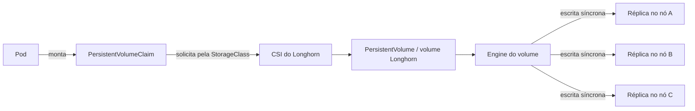
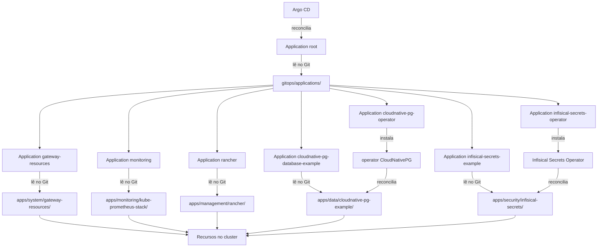
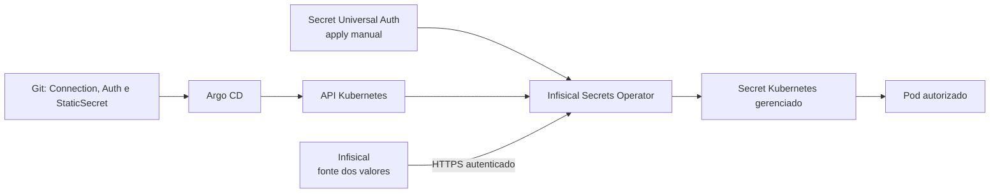

# Serviços básicos

[Voltar ao guia principal](../README.md)

Os comandos desta seção podem ser executados em um servidor ou em uma estação administrativa que tenha `kubectl`, Helm, acesso à API e um kubeconfig válido.

## cert-manager

### Como o cert-manager trabalha

O cert-manager é um controller que automatiza solicitação, emissão e renovação de certificados. Um `Issuer` representa uma autoridade ou um método de emissão limitado a um namespace; um `ClusterIssuer` oferece essa capacidade ao cluster inteiro. Um recurso `Certificate` declara nomes DNS, validade desejada, Secret de destino e qual Issuer deve ser usado. Quando a emissão termina, o cert-manager grava o certificado e a chave privada em um Secret e tenta renová-los antes do vencimento.

Com ACME e desafio DNS-01, o cert-manager comprova o controle de um domínio criando temporariamente um registro DNS TXT pelo provedor configurado. Esse método também pode emitir certificados wildcard e não exige que o serviço solicitado já esteja publicamente acessível. A credencial do provedor DNS pode alterar registros e deve permanecer em um Secret ou em um gerenciador de segredos, nunca no repositório Git.

Instalar o cert-manager não emite certificados por si só. Depois da instalação ainda é necessário criar um `Issuer` ou `ClusterIssuer` e recursos `Certificate`, como nos templates GitOps deste repositório. O Secret TLS resultante pode ser referenciado por um listener HTTPS do Gateway, conforme o [diagrama de Gateway API e Traefik](k3s.md#gateway-api-e-traefik). Referências: [configuração de Issuers](https://cert-manager.io/docs/configuration/) e [recurso Certificate](https://cert-manager.io/docs/usage/certificate/).

Os CRDs da Gateway API devem existir antes da instalação. Se forem instalados depois, reinicie o deployment do cert-manager para que a integração seja detectada.

> **Executar em:** qualquer máquina com `KUBECONFIG` e acesso administrativo à API.

```bash
read -r -p "Versão do cert-manager [v1.20.0]: " CERT_MANAGER_VERSION
read -r -p \
  "Resolvers para DNS-01 [1.1.1.1:53,8.8.8.8:53]: " \
  DNS01_RECURSIVE_NAMESERVERS

CERT_MANAGER_VERSION="${CERT_MANAGER_VERSION:-v1.20.0}"
DNS01_RECURSIVE_NAMESERVERS="${DNS01_RECURSIVE_NAMESERVERS:-1.1.1.1:53,8.8.8.8:53}"

helm upgrade --install cert-manager \
  oci://quay.io/jetstack/charts/cert-manager \
  --version "${CERT_MANAGER_VERSION}" \
  --namespace cert-manager \
  --create-namespace \
  --set crds.enabled=true \
  --set config.gatewayAPI.enabled=true \
  --set-json "extraArgs=[\
    \"--dns01-recursive-nameservers-only\",\
    \"--dns01-recursive-nameservers=${DNS01_RECURSIVE_NAMESERVERS}\"\
  ]" \
  --wait \
  --timeout 10m
```

Valide a instalação:

> **Executar em:** qualquer máquina com `KUBECONFIG` e acesso à API.

```bash
kubectl --namespace cert-manager rollout status deployment/cert-manager --timeout=180s
kubectl --namespace cert-manager get pods
kubectl get crd certificates.cert-manager.io clusterissuers.cert-manager.io
helm --namespace cert-manager status cert-manager
```

Se os CRDs da Gateway API tiverem sido instalados depois do cert-manager:

> **Executar em:** qualquer máquina com `KUBECONFIG` e acesso administrativo à API.

```bash
kubectl --namespace cert-manager rollout restart deployment/cert-manager
kubectl --namespace cert-manager rollout status deployment/cert-manager --timeout=180s
```

Referência: [cert-manager com Gateway API](https://cert-manager.io/docs/usage/gateway/).

## Longhorn

### Como o Longhorn fornece armazenamento

Containers e Pods são substituíveis; os dados que precisam sobreviver a essa substituição devem ficar em armazenamento persistente. No Kubernetes, uma aplicação cria um `PersistentVolumeClaim` (PVC) para solicitar capacidade e características de armazenamento. Uma `StorageClass` indica qual provisionador atende à solicitação, e o provisionador cria um `PersistentVolume` (PV) que é associado ao PVC.

Longhorn é um sistema de armazenamento distribuído em blocos e um provisionador CSI para Kubernetes. Para cada volume, ele executa um engine associado ao workload e mantém réplicas síncronas em discos elegíveis, preferencialmente em nós diferentes. Se uma réplica fica indisponível e ainda há uma cópia saudável, o Longhorn pode reconstruí-la em outro local.



O provisionador `local-storage` foi desabilitado na configuração K3s deste guia para que ele não se torne acidentalmente a classe padrão: seus dados ficam vinculados ao disco de um único nó e não recebem replicação Longhorn. Replicação, contudo, não é backup. Exclusão acidental, corrupção lógica ou credenciais comprometidas podem afetar todas as réplicas; mantenha backups em um destino independente do cluster. Referência: [arquitetura e conceitos do Longhorn](https://longhorn.io/docs/1.12.0/concepts/).

Consulte os [requisitos do Longhorn 1.12.0](https://longhorn.io/docs/1.12.0/deploy/install/) antes de preparar os nós. Todos os nós que receberão volumes precisam cumprir os requisitos.

### Dependências dos nós

Em Debian e Ubuntu:

> **Executar em:** cada nó manager ou agent que armazenará volumes Longhorn, como `root`.

```bash
apt-get update
apt-get install --yes \
  bash \
  cryptsetup \
  curl \
  dmsetup \
  gawk \
  grep \
  nfs-common \
  open-iscsi \
  util-linux

systemctl enable --now iscsid.socket
systemctl start iscsid.service
```

`findmnt`, `blkid` e `lsblk` são fornecidos por `util-linux`; não instale `findmnt` como se fosse um pacote separado.

Carregue os módulos usados pelo engine V1 e por volumes criptografados:

> **Executar em:** cada nó manager ou agent que armazenará volumes Longhorn, como `root`.

```bash
modprobe iscsi_tcp
modprobe nfs
modprobe dm_crypt
```

Persista os módulos para os próximos boots:

> **Executar em:** cada nó manager ou agent que armazenará volumes Longhorn, como `root`.

```bash
cat >/etc/modules-load.d/longhorn.conf <<'EOF'
nfs
dm_crypt
iscsi_tcp
EOF
```

Valide cada nó antes de instalar o chart:

> **Executar em:** qualquer máquina com `KUBECONFIG`, acesso à API e `longhornctl`.

```bash
longhornctl check preflight
```

Se optar pelo instalador automático de dependências, revise o impacto e fixe a imagem na mesma versão:

> **Executar em:** qualquer máquina com `KUBECONFIG`, acesso administrativo à API e `longhornctl`.

```bash
read -r -p "Versão da imagem longhorn-cli [v1.12.0]: " LONGHORN_VERSION
LONGHORN_VERSION="${LONGHORN_VERSION:-v1.12.0}"

longhornctl \
  --kubeconfig "${KUBECONFIG:-$HOME/.kube/config}" \
  --image "longhornio/longhorn-cli:${LONGHORN_VERSION}" \
  install preflight

longhornctl check preflight
```

### Instalação

> **Executar em:** qualquer máquina com `KUBECONFIG`, Helm e acesso administrativo à API.

```bash
read -r -p "Versão do chart Longhorn [1.12.0]: " LONGHORN_VERSION
LONGHORN_VERSION="${LONGHORN_VERSION:-1.12.0}"

helm upgrade --install longhorn longhorn \
  --repo https://charts.longhorn.io \
  --version "${LONGHORN_VERSION}" \
  --namespace longhorn-system \
  --create-namespace \
  --wait \
  --timeout 15m
```

Valide a instalação:

> **Executar em:** qualquer máquina com `KUBECONFIG`, acesso à API e `longhornctl`.

```bash
kubectl --namespace longhorn-system get pods
kubectl --namespace longhorn-system get daemonsets
helm --namespace longhorn-system status longhorn
longhornctl check preflight
```

### Acesso à interface

Quando `kubectl` e o kubeconfig estiverem na estação local:

> **Executar em:** estação administrativa com `KUBECONFIG` e acesso à API.

```bash
read -r -p "Porta local para a interface do Longhorn [8080]: " LOCAL_PORT
LOCAL_PORT="${LOCAL_PORT:-8080}"

kubectl --namespace longhorn-system \
  port-forward service/longhorn-frontend "${LOCAL_PORT}:80"
```

Acesse `http://127.0.0.1:PORTA_LOCAL` enquanto o comando estiver em execução, substituindo `PORTA_LOCAL` pelo valor informado.

Quando o port-forward precisar rodar em um manager, execute nele:

> **Executar em:** nó manager com `KUBECONFIG` e acesso à API.

```bash
read -r -p "Porta no manager para a interface do Longhorn [8080]: " MANAGER_PORT
MANAGER_PORT="${MANAGER_PORT:-8080}"

kubectl --namespace longhorn-system \
  port-forward service/longhorn-frontend "${MANAGER_PORT}:80"
```

Em outro terminal da estação, crie o túnel:

> **Executar em:** estação administrativa com acesso SSH ao nó que executa o port-forward.

```bash
read -r -p "Usuário SSH: " SSH_USER
read -r -p "Host ou IP do manager: " SSH_HOST
read -r -p "Porta usada pelo port-forward no manager [8080]: " MANAGER_PORT
read -r -p "Porta que será aberta nesta máquina [8080]: " LOCAL_PORT

MANAGER_PORT="${MANAGER_PORT:-8080}"
LOCAL_PORT="${LOCAL_PORT:-8080}"

ssh -N \
  -L "${LOCAL_PORT}:127.0.0.1:${MANAGER_PORT}" \
  "${SSH_USER}@${SSH_HOST}"
```

O túnel depende de encaminhamento SSH; ele não funcionará se `DisableForwarding yes` estiver ativo no servidor.

> [!CAUTION]
> Antes de atualizar ou remover o Longhorn, confirme a saúde das réplicas, o destino de backup e o procedimento específico da versão. A remoção incorreta pode causar perda de dados.

## Argo CD

### O que é e para que serve

O Argo CD é um controlador de entrega contínua para Kubernetes baseado em GitOps. Em vez de usar a estação administrativa para reaplicar os manifests a cada mudança, o Argo CD observa o estado desejado registrado em um repositório Git, compara esse conteúdo com os recursos existentes no cluster e informa quando há diferenças. Dependendo da política configurada, ele pode sincronizar essas diferenças automaticamente e corrigir alterações feitas diretamente no cluster.

O principal recurso do Argo CD é a `Application`. Cada `Application` informa qual repositório, revisão e caminho devem ser observados, em qual cluster e namespace o conteúdo será aplicado e qual política de sincronização será usada. Assim, o Git passa a registrar o estado desejado e o histórico das mudanças, enquanto o Argo CD faz a reconciliação com o cluster.

O Argo CD não substitui a revisão de código, o controle de acesso ao repositório nem um gerenciador de segredos. Não versione credenciais em manifests: forneça ao Argo CD apenas a credencial necessária para ler o repositório privado e use o mecanismo de segredos adotado pelo ambiente para os dados das aplicações.

Instale uma versão fixa do chart. O servidor permanece com TLS habilitado e sem Ingress; o acesso inicial será por port-forward.

> **Executar em:** qualquer máquina com `KUBECONFIG`, Helm e acesso administrativo à API.

```bash
read -r -p "Versão do chart Argo CD [10.1.3]: " ARGO_CD_CHART_VERSION
read -r -p "CPU solicitada pelo servidor [100m]: " ARGO_CD_CPU_REQUEST
read -r -p "Memória solicitada pelo servidor [128Mi]: " ARGO_CD_MEMORY_REQUEST
read -r -p "Limite de CPU do servidor [500m]: " ARGO_CD_CPU_LIMIT
read -r -p "Limite de memória do servidor [512Mi]: " ARGO_CD_MEMORY_LIMIT

ARGO_CD_CHART_VERSION="${ARGO_CD_CHART_VERSION:-10.1.3}"
ARGO_CD_CPU_REQUEST="${ARGO_CD_CPU_REQUEST:-100m}"
ARGO_CD_MEMORY_REQUEST="${ARGO_CD_MEMORY_REQUEST:-128Mi}"
ARGO_CD_CPU_LIMIT="${ARGO_CD_CPU_LIMIT:-500m}"
ARGO_CD_MEMORY_LIMIT="${ARGO_CD_MEMORY_LIMIT:-512Mi}"

helm upgrade --install argocd argo-cd \
  --repo https://argoproj.github.io/argo-helm \
  --version "${ARGO_CD_CHART_VERSION}" \
  --namespace argocd \
  --create-namespace \
  --set server.ingress.enabled=false \
  --set-string server.resources.requests.cpu="${ARGO_CD_CPU_REQUEST}" \
  --set-string server.resources.requests.memory="${ARGO_CD_MEMORY_REQUEST}" \
  --set-string server.resources.limits.cpu="${ARGO_CD_CPU_LIMIT}" \
  --set-string server.resources.limits.memory="${ARGO_CD_MEMORY_LIMIT}" \
  --wait \
  --timeout 10m
```

Valide a instalação:

> **Executar em:** qualquer máquina com `KUBECONFIG` e acesso à API.

```bash
kubectl --namespace argocd rollout status deployment/argocd-server --timeout=180s
kubectl --namespace argocd get pods
helm --namespace argocd status argocd
```

Encaminhe localmente o servidor HTTPS:

> **Executar em:** estação administrativa com `KUBECONFIG` e acesso à API.

```bash
read -r -p "Porta local para o Argo CD [8080]: " LOCAL_PORT
LOCAL_PORT="${LOCAL_PORT:-8080}"

kubectl --namespace argocd \
  port-forward service/argocd-server "${LOCAL_PORT}:443"
```

Acesse `https://127.0.0.1:PORTA_LOCAL`, substituindo `PORTA_LOCAL` pelo valor informado. O certificado inicial é autoassinado.

Obtenha a senha inicial sem deixá-la sem newline no terminal:

> **Executar em:** qualquer máquina com `KUBECONFIG` e acesso à API.

```bash
kubectl --namespace argocd \
  get secret argocd-initial-admin-secret \
  --output jsonpath='{.data.password}' \
  | base64 --decode
printf '\n'
```

Troque a senha inicial imediatamente. Com a CLI instalada:

> **Executar em:** estação administrativa com a CLI e o port-forward ativos.

```bash
read -r -p "Porta local usada pelo port-forward do Argo CD [8080]: " LOCAL_PORT
LOCAL_PORT="${LOCAL_PORT:-8080}"

argocd login "127.0.0.1:${LOCAL_PORT}" --username admin --insecure
argocd account update-password
```

Depois de trocar a senha, remova o secret inicial caso ele ainda exista:

> **Executar em:** qualquer máquina com `KUBECONFIG` e acesso administrativo à API.

```bash
kubectl --namespace argocd delete secret argocd-initial-admin-secret
```

### Próximo passo: conectar o repositório GitOps

Depois da instalação, o próximo passo é fazer o Argo CD observar um repositório que contenha o estado desejado do cluster. O modelo disponível neste repositório usa o padrão App-of-Apps: uma `Application` chamada `root` observa o diretório `gitops/applications/`, e cada arquivo YAML desse diretório define uma `Application` independente para uma funcionalidade que o usuário decidiu instalar.



O termo `root` não indica um tipo especial de repositório no Argo CD. Ele é apenas o nome da Application de bootstrap. Seu manifesto aponta para `gitops/applications/`; as Applications encontradas nesse diretório passam a observar seus próprios caminhos em `gitops/apps/`. Como os manifests são independentes, mantenha somente os arquivos das aplicações que deseja usar.

Siga esta sequência:

1. Crie um repositório Git para a configuração do cluster ou escolha um repositório existente.
2. Copie [`templates/gitops`](../templates/gitops/) para o diretório `gitops/` desse repositório.
3. Remova de `gitops/applications/` as Applications que não deseja instalar e remova também os respectivos diretórios em `gitops/apps/`.
4. Substitua `https://github.com/example/cluster-config.git` em `gitops/root/application.yaml` e nas Applications mantidas pela URL real do repositório. Revise também os domínios, versões, namespaces e valores dos charts.
5. Valide, faça commit e envie a estrutura para a branch indicada por `targetRevision`, que nos exemplos é `main`.
6. Se o repositório for privado, cadastre no Argo CD uma credencial somente de leitura. Um repositório público normalmente pode ser clonado diretamente pela URL informada nas Applications.
7. Aplique uma única vez a Application `root`; a partir dela, o Argo CD descobrirá e reconciliará as demais Applications.

Para um repositório privado acessado por SSH, registre uma chave de leitura dedicada depois de autenticar a CLI do Argo CD. Não reutilize uma chave administrativa pessoal:

> **Executar em:** estação administrativa com a CLI do Argo CD autenticada e acesso à chave de leitura do repositório.

```bash
read -r -p "URL SSH do repositório GitOps: " GITOPS_REPO_URL
read -r -p \
  "Caminho absoluto da chave privada [${HOME}/.ssh/argocd_gitops]: " \
  GITOPS_SSH_KEY

GITOPS_SSH_KEY="${GITOPS_SSH_KEY:-${HOME}/.ssh/argocd_gitops}"

argocd repo add "${GITOPS_REPO_URL}" \
  --ssh-private-key-path "${GITOPS_SSH_KEY}"
```

Depois de enviar o conteúdo personalizado para o Git, faça o bootstrap:

> **Executar em:** qualquer máquina com `KUBECONFIG` e acesso administrativo à API, na raiz da cópia local do repositório GitOps.

```bash
read -r -p \
  "Caminho da Application raiz [gitops/root/application.yaml]: " \
  ROOT_APPLICATION

ROOT_APPLICATION="${ROOT_APPLICATION:-gitops/root/application.yaml}"
kubectl apply -f "${ROOT_APPLICATION}"
```

Confira se a Application raiz e as Applications escolhidas foram criadas e observe as colunas de sincronização e saúde:

> **Executar em:** qualquer máquina com `KUBECONFIG` e acesso à API.

```bash
kubectl --namespace argocd get applications.argoproj.io
kubectl --namespace argocd describe application root
```

Os templates começam com `prune: false`: o Argo CD corrige recursos alterados quando `selfHeal` está habilitado, mas não exclui automaticamente do cluster um recurso removido do Git. Revise os diffs e o comportamento de cada Application antes de habilitar `prune`, pois a exclusão no repositório poderá resultar na exclusão correspondente no cluster.

### Segredos GitOps com Infisical

Um Secret Kubernetes codificado em base64 não está criptografado e não deve ser commitado em claro. Neste modelo, os valores ficam no Infisical; o Git contém apenas recursos declarativos que indicam qual projeto, ambiente e caminho devem ser sincronizados. O Infisical Secrets Operator autentica uma Machine Identity, busca os valores e mantém um Secret Kubernetes atualizado.



O template [`templates/gitops/apps/security/infisical-secrets`](../templates/gitops/apps/security/infisical-secrets/) usa a API recomendada `v1beta1`, com `InfisicalConnection`, `InfisicalAuth` e `InfisicalStaticSecret`. O único objeto Kubernetes sensível criado manualmente é um Secret de bootstrap com o `clientId` e o `clientSecret` de uma Machine Identity Universal Auth. Esse Secret não entra no Git nem é administrado pelo Argo CD.

O fluxo recomendado é:

1. Criar no Infisical uma Machine Identity Universal Auth com leitura limitada ao projeto, ambiente e caminho necessários.
2. Manter inicialmente somente `applications/infisical-secrets-operator.yaml` no diretório observado pelo `root` e aguardar o operator e seus CRDs.
3. Executar o script de bootstrap para aplicar manualmente `infisical-operator-system/universal-auth-credentials`.
4. Personalizar conexão, autenticação, origem e destino dos segredos.
5. Adicionar `applications/infisical-secrets-example.yaml` e verificar o estado dos CRDs sem imprimir os valores do Secret.

> **Executar em:** qualquer máquina com `KUBECONFIG` administrativo e acesso à API, no diretório `gitops/apps/security/infisical-secrets` do repositório de destino.

```bash
./bootstrap-secret.sh
```

O operator do exemplo é instalado em modo cluster-wide porque precisa sincronizar Secrets em namespaces de aplicações. Em ambientes multi-tenant, avalie `scopedNamespaces` e `scopedRBAC`, restrinja o RBAC e use uma Machine Identity diferente por fronteira de acesso. Universal Auth minimiza o bootstrap, mas mantém uma credencial estática no cluster; rotacione-a e revogue a anterior depois de validar a nova. O Infisical recomenda Kubernetes Auth com tokens curtos quando a configuração adicional do TokenReview é aceitável.

Os valores sincronizados continuam existindo como Secrets na API Kubernetes. As instalações novas deste guia habilitam `secrets-encryption: true`; em clusters existentes, confirme `k3s secrets-encrypt status`, limite leitura de Secrets por RBAC e nunca imprima `data`, `stringData` ou credenciais em logs. Com NetworkPolicy default-deny, permita explicitamente o egress HTTPS do operator até a API Infisical e o acesso necessário à API Kubernetes.

> [!WARNING]
> A documentação atual do Infisical lista Kubernetes 1.29 a 1.33 como suportados pelo operator. O K3s 1.36 sugerido neste guia está fora dessa matriz declarada; valide a combinação em homologação ou use versões oficialmente compatíveis antes de produção.

Referências: [visão geral do Infisical Secrets Operator](https://infisical.com/docs/integrations/platforms/kubernetes/overview), [InfisicalAuth](https://infisical.com/docs/integrations/platforms/kubernetes/infisical-auth-crd), [InfisicalStaticSecret](https://infisical.com/docs/integrations/platforms/kubernetes/infisical-static-secret-crd) e [criptografia de Secrets no K3s](https://docs.k3s.io/cli/secrets-encrypt).
