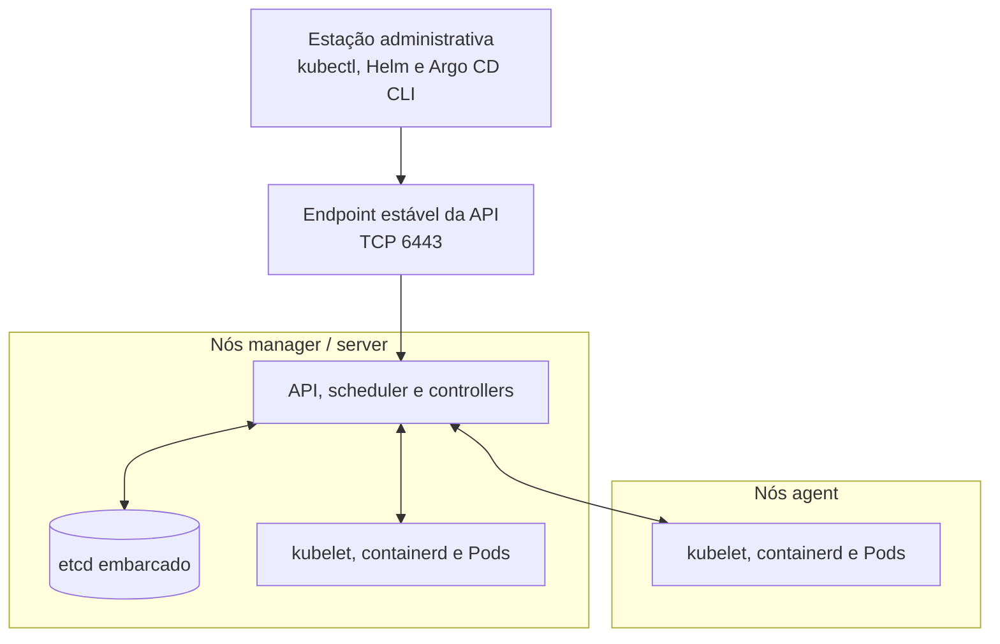
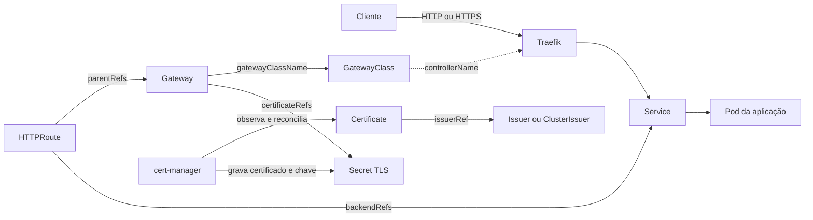
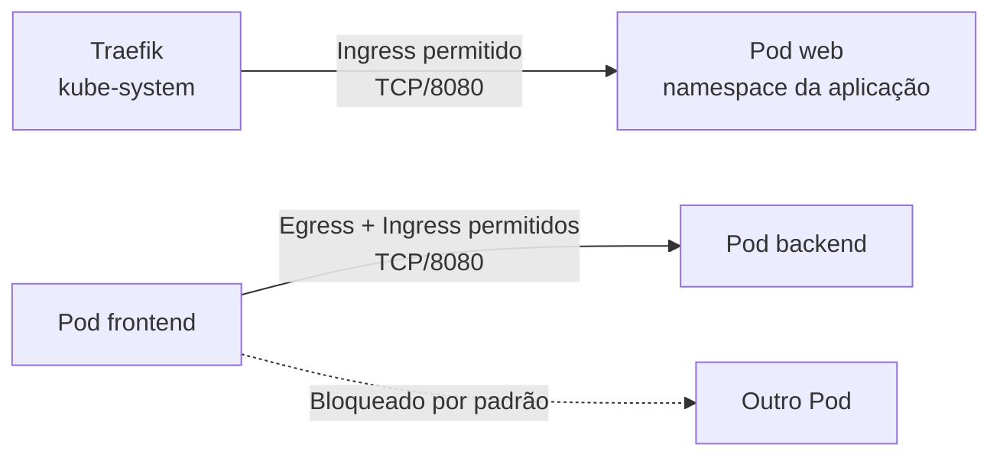
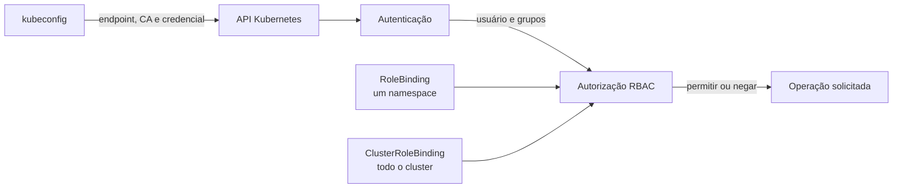

# Gestão dos nós K3s

[Voltar ao guia principal](../README.md)

## O que é e como o cluster se organiza

Kubernetes mantém aplicações em containers de acordo com recursos declarativos enviados à sua API. Em vez de descrever uma sequência de comandos para criar cada processo, o usuário declara o **estado desejado** em objetos como Deployments e Services. Controllers observam continuamente esses objetos, comparam o estado desejado com o estado atual e executam ações para aproximar os dois; esse ciclo é chamado de **reconciliação**.

Alguns recursos aparecem repetidamente neste guia e nos templates:

| Recurso ou conceito | Função |
| --- | --- |
| Pod | Menor unidade executável do Kubernetes; reúne um ou mais containers que compartilham rede e volumes |
| Deployment | Mantém a quantidade desejada de réplicas de uma aplicação e coordena atualizações dos Pods |
| Service | Fornece um nome e um endereço estáveis para alcançar um conjunto variável de Pods |
| Namespace | Separa logicamente recursos e ajuda a delimitar nomes, políticas e permissões |
| Secret | Armazena dados sensíveis usados por recursos do cluster; não é criptografado automaticamente apenas por existir como Secret |
| CRD | Estende a API Kubernetes com um novo tipo de recurso, como `Certificate`, `Gateway` ou `Application` |
| Controller | Observa recursos e reconcilia o sistema; Traefik, cert-manager, Longhorn e Argo CD adicionam controllers ao cluster |

O K3s é uma distribuição Kubernetes que empacota o control plane, o runtime de containers e componentes de rede e operação em uma instalação simplificada. Os recursos e as APIs continuam sendo Kubernetes; ferramentas como `kubectl`, Helm e Argo CD não precisam de um modo especial para trabalhar com K3s.

Um nó **server**, chamado de **manager** neste guia, executa a API Kubernetes, scheduler, controllers e o datastore, além dos componentes de agent. Por isso, um manager também pode executar Pods, salvo quando forem aplicados taints ou outras restrições de agendamento. Um nó **agent** executa kubelet, runtime de containers e componentes de rede, mas não hospeda o control plane nem o datastore.

O primeiro servidor deste guia usa `cluster-init: true`, portanto inicializa etcd embarcado. Os servidores adicionais participam do mesmo control plane e do quorum do etcd; os agents registram-se pelo endpoint estável da API e executam os workloads atribuídos pelo Kubernetes.



Referência: [arquitetura do K3s](https://docs.k3s.io/architecture).

## Planejamento e segredos

Antes da instalação:

- use um nome único para cada nó;
- defina um nome DNS ou IP estável para a API do cluster;
- para HA com etcd embarcado, use três ou mais servidores em quantidade ímpar;
- use o mesmo token e os mesmos valores críticos de configuração em todos os servidores;
- armazene o token fora dos nós, pois ele também é necessário em restaurações;
- confirme os requisitos de rede do K3s antes de adicionar nós.

Referências:

- [HA com etcd embarcado](https://docs.k3s.io/datastore/ha-embedded)
- [Requisitos de rede](https://docs.k3s.io/installation/requirements#networking)
- [Opções de configuração](https://docs.k3s.io/installation/configuration)

Os blocos das próximas seções são autocontidos: solicitam os valores pelo terminal, gravam a configuração persistente, instalam o K3s e executam as validações. Tokens informados são lidos com echo desabilitado para não aparecer no histórico ou na tela; um token gerado para o primeiro servidor é exibido uma única vez para que seja armazenado.

Depois da instalação, o token persistido pode ser consultado no primeiro servidor. Guarde-o imediatamente em um gerenciador de segredos:

> **Executar em:** primeiro nó manager, como `root`.

```bash
cat /var/lib/rancher/k3s/server/node-token
```

## Primeiro servidor

Execute em um host novo. Pressione Enter no prompt do token para gerar um valor aleatório. O script exigirá a confirmação de que o valor foi guardado antes de continuar.

> **Executar em:** host que será o primeiro nó manager, como `root`.

```bash
bash <<'EOF'
set -euo pipefail

if (( EUID != 0 )); then
  printf 'Execute este bloco em um shell root aberto com sudo -i.\n' >&2
  exit 1
fi

read -r -p "Versão do K3s [v1.36.1+k3s1]: " K3S_VERSION </dev/tty
K3S_VERSION="${K3S_VERSION:-v1.36.1+k3s1}"

read -r -p "IP deste nó: " K3S_NODE_IP </dev/tty
read -r -p "Nome único deste nó: " K3S_NODE_NAME </dev/tty
read -r -p "Host ou IP estável da API: " K3S_API_HOST </dev/tty
read -r -s -p \
  "Token do cluster (Enter para gerar): " \
  K3S_TOKEN \
  </dev/tty
printf '\n' >/dev/tty

for REQUIRED_VAR in K3S_NODE_IP K3S_NODE_NAME K3S_API_HOST; do
  if [[ -z "${!REQUIRED_VAR}" ]]; then
    printf '%s não pode ficar vazio.\n' "${REQUIRED_VAR}" >&2
    exit 1
  fi
done

if [[ -z "${K3S_TOKEN}" ]]; then
  K3S_TOKEN="$(openssl rand -hex 64)"
  printf '\nToken gerado; guarde-o agora em um gerenciador de segredos:\n%s\n\n' \
    "${K3S_TOKEN}" \
    >/dev/tty

  read -r -p "O token foi guardado com segurança? [s/N]: " TOKEN_SAVED </dev/tty
  if [[ "${TOKEN_SAVED,,}" != "s" ]]; then
    printf 'Instalação cancelada antes de alterar o host.\n' >&2
    exit 1
  fi
fi

install -d -o root -g root -m 0700 /etc/rancher/k3s

umask 077
cat >/etc/rancher/k3s/config.yaml <<K3S_CONFIG
token: "${K3S_TOKEN}"
node-ip: "${K3S_NODE_IP}"
node-name: "${K3S_NODE_NAME}"
tls-san:
  - "${K3S_API_HOST}"
  - "${K3S_NODE_IP}"
disable:
  - local-storage
secrets-encryption: true
cluster-init: true
K3S_CONFIG

chmod 0600 /etc/rancher/k3s/config.yaml

curl -sfL https://get.k3s.io \
  | INSTALL_K3S_VERSION="${K3S_VERSION}" sh -s - server

export KUBECONFIG=/etc/rancher/k3s/k3s.yaml

systemctl --no-pager --full status k3s
kubectl wait --for=condition=Ready "node/${K3S_NODE_NAME}" --timeout=180s
kubectl get nodes -o wide
kubectl get pods --all-namespaces
EOF
```

## Gateway API e Traefik

### O que são e como se relacionam

A Gateway API é uma especificação de recursos para configurar entrada e roteamento de tráfego no Kubernetes. Instalar seus CRDs ensina a API Kubernetes a armazenar objetos como `GatewayClass`, `Gateway` e `HTTPRoute`, mas os CRDs sozinhos não abrem portas nem encaminham tráfego. É necessário um controller que implemente a especificação.

O Traefik é o controller de entrada usado pelo K3s neste guia. Com o provider `kubernetesGateway` habilitado, ele observa os recursos da Gateway API, configura listeners HTTP/HTTPS e encaminha as requisições aceitas para Services Kubernetes.

| Recurso | Escopo e responsabilidade |
| --- | --- |
| `GatewayClass` | Recurso do cluster que identifica qual implementação controla um conjunto de Gateways; neste caso, Traefik |
| `Gateway` | Recurso de namespace que declara listeners, portas, protocolos, certificados e quais Routes podem se conectar |
| `HTTPRoute` | Recurso de namespace que associa hostnames, caminhos, filtros e regras aos Services de destino |
| `Service` | Backend estável que seleciona os Pods da aplicação |

O fluxo abaixo separa o caminho percorrido pela requisição das relações declarativas que configuram esse caminho:



Um `HTTPRoute` somente é aceito quando referencia um Gateway compatível e um listener desse Gateway permite a associação. A separação possibilita que a equipe responsável pela infraestrutura controle Gateways e certificados enquanto as equipes das aplicações mantêm suas próprias rotas. Referências: [introdução à Gateway API](https://gateway-api.sigs.k8s.io/docs/introduction/) e [provider Gateway API do Traefik](https://doc.traefik.io/traefik/reference/install-configuration/providers/kubernetes/kubernetes-gateway/).

Instale primeiro os CRDs Standard da Gateway API. O cert-manager e o provider Gateway API do Traefik dependem deles.

> **Executar em:** qualquer máquina com `KUBECONFIG` e acesso administrativo à API.

```bash
read -r -p "Versão da Gateway API [v1.5.1]: " GATEWAY_API_VERSION
GATEWAY_API_VERSION="${GATEWAY_API_VERSION:-v1.5.1}"

kubectl apply --server-side=true \
  -f "https://github.com/kubernetes-sigs/gateway-api/releases/download/${GATEWAY_API_VERSION}/standard-install.yaml"
```

Valide os CRDs principais:

> **Executar em:** qualquer máquina com `KUBECONFIG` e acesso à API.

```bash
kubectl get crd \
  gatewayclasses.gateway.networking.k8s.io \
  gateways.gateway.networking.k8s.io \
  httproutes.gateway.networking.k8s.io
```

Configure o Traefik empacotado pelo K3s:

> **Executar em:** qualquer máquina com `KUBECONFIG` e acesso administrativo à API.

```bash
kubectl apply -f - <<'EOF'
apiVersion: helm.cattle.io/v1
kind: HelmChartConfig
metadata:
  name: traefik
  namespace: kube-system
spec:
  valuesContent: |-
    providers:
      kubernetesGateway:
        enabled: true

    gateway:
      enabled: false

    ports:
      web:
        port: 80
        exposedPort: 80
        expose:
          default: true

      websecure:
        port: 443
        exposedPort: 443
        expose:
          default: true
EOF
```

Espere a reconciliação e confira os logs:

> **Executar em:** qualquer máquina com `KUBECONFIG` e acesso à API.

```bash
kubectl --namespace kube-system rollout status deployment/traefik --timeout=180s
kubectl --namespace kube-system get pods -l app.kubernetes.io/name=traefik
kubectl --namespace kube-system logs deployment/traefik --tail=100
```

O chart não cria um `Gateway` por padrão. Crie `GatewayClass`, `Gateway` e rotas de acordo com a topologia do ambiente.

## Isolamento de rede com NetworkPolicy

O modelo de rede Kubernetes permite comunicação entre Pods por padrão. Uma `NetworkPolicy` seleciona Pods por labels e determina quais conexões de entrada (`Ingress`) e saída (`Egress`) são aceitas nas camadas de rede e transporte. O K3s inclui um controller de NetworkPolicy baseado no kube-router; as políticas deixam de ser efetivas se o cluster for iniciado com `--disable-network-policy`.

As políticas são limitadas ao namespace em que existem e são aditivas. Um `default-deny-all` com `podSelector: {}` isola todos os Pods daquele namespace, enquanto outras políticas acrescentam fluxos permitidos. Para uma conexão entre dois Pods isolados funcionar, o egress da origem e o ingress do destino precisam permitir simultaneamente o protocolo e a porta.



O baseline mínimo normalmente contém:

| Política | Seleção | Permissão |
| --- | --- | --- |
| `default-deny-all` | Todos os Pods do namespace | Nenhuma; ativa isolamento de ingress e egress |
| `allow-dns` | Todos os Pods do namespace | Egress UDP/TCP 53 somente para CoreDNS |
| Fluxo de aplicação | Pods identificados por labels | Origem, destino, protocolo e porta necessários |
| Traefik para workload | Pods publicados | Ingress vindo apenas dos Pods Traefik na porta do workload |

Uma regra permitindo Traefik deve ser criada no namespace do workload publicado. Não crie isoladamente uma política egress selecionando Traefik em `kube-system`: a existência dessa política passaria a isolar o egress do Traefik e poderia interromper todas as rotas ainda não permitidas. Se os Pods Traefik não estiverem isolados para egress, basta liberar o ingress no destino.

### Hardening recomendado

Use namespaces diferentes para workloads com fronteiras de confiança diferentes e trate os labels referenciados pelas policies como parte do controle de segurança. Um **usuário** ou controller capaz de alterar os labels dos Pods pode fazê-los entrar ou sair de um seletor permitido; RBAC e revisão do Git precisam proteger tanto as NetworkPolicies quanto os Deployments que produzem esses Pods.

Evite permissões sem `from` ou `to`, `namespaceSelector: {}` e CIDRs globais como `0.0.0.0/0` e `::/0`. Policies são aditivas: uma regra ampla não pode ser anulada por uma regra mais restritiva. Prefira combinar no mesmo item um `namespaceSelector` com o label imutável `kubernetes.io/metadata.name` e um `podSelector` específico.

O fluxo GitOps usa um AppProject dedicado que autoriza somente o repositório configurado, os namespaces listados e recursos `NetworkPolicy`. A Application habilita `FailOnSharedResource=true`, mantém duas proteções contra prune automático e não cria namespaces. Proteja esses arquivos com revisão obrigatória, pois uma mudança pode interromper tráfego ou ampliar movimento lateral e egress de dados.

NetworkPolicy não é uma fronteira absoluta contra tráfego do nó ou Pods `hostNetwork`, não oferece controle L7 ou por FQDN, não cifra conexões e não registra obrigatoriamente decisões de allow/deny. Use firewall do host, RBAC, TLS/mTLS, Gateway ou service mesh e controles da aplicação conforme o risco. A documentação oficial também ressalta que o tráfego entre Pods é aberto e não cifrado por padrão em cenários multi-tenant.

O template [`templates/gitops/apps/security/network-policies`](../templates/gitops/apps/security/network-policies/) oferece manifests independentes e um script que gera três tipos de configuração sem aplicar nada no cluster:

- `baseline`: deny de ingress/egress e liberação de DNS para um namespace;
- `flow`: egress na origem e ingress no destino para comunicação entre workloads isolados;
- `traefik`: ingress no workload para o tráfego encaminhado pelo Traefik.

Copie o template GitOps, entre no diretório e execute o gerador interativo:

> **Executar em:** estação administrativa, no repositório GitOps de destino.

```bash
read -r -p "Diretório do template GitOps [gitops]: " GITOPS_DIRECTORY
GITOPS_DIRECTORY="${GITOPS_DIRECTORY:-gitops}"

cd "${GITOPS_DIRECTORY}/apps/security/network-policies"
./generate.sh baseline
./generate.sh flow
./generate.sh traefik
```

Os arquivos são gravados em `manifests/<namespace>/`. Revise labels, portas e namespaces, valide em homologação e somente depois habilite `applications/network-policies-project.yaml.example` e `applications/network-policies.yaml.example` no App-of-Apps. Não aplique primeiro em namespaces de infraestrutura como `kube-system`, `cert-manager`, `longhorn-system` e `argocd`, pois DNS, webhooks, métricas, acesso à API e APIs externas precisarão de permissões explícitas.

Audite os namespaces já endurecidos. O script usa apenas operações de leitura e falha se não encontrar deny completo ou se detectar padrões amplos conhecidos:

> **Executar em:** qualquer máquina com `KUBECONFIG`, `kubectl`, Python 3 e acesso de leitura à API, no diretório `gitops/apps/security/network-policies`.

```bash
read -r -p "Namespace que será auditado: " NETWORK_POLICY_NAMESPACE
./audit.sh "${NETWORK_POLICY_NAMESPACE}"
```

NetworkPolicy não seleciona Services por nome e não interpreta hostnames, URLs HTTP ou identidades de usuário. Ela também não substitui TLS, autenticação, RBAC ou backups. Consulte o [guia completo do template](../templates/gitops/apps/security/network-policies/README.md), a [documentação de NetworkPolicy do Kubernetes](https://kubernetes.io/docs/concepts/services-networking/network-policies/), as [recomendações de isolamento multi-tenant](https://kubernetes.io/docs/concepts/security/multi-tenancy/) e a [documentação de rede do K3s](https://docs.k3s.io/networking/networking-services#network-policy-controller).

## Servidor adicional

Em cada servidor adicional, execute o bloco e informe o token recuperado do gerenciador de segredos:

> **Executar em:** host que será acrescentado como nó manager, como `root`.

```bash
bash <<'EOF'
set -euo pipefail

if (( EUID != 0 )); then
  printf 'Execute este bloco em um shell root aberto com sudo -i.\n' >&2
  exit 1
fi

read -r -p "Versão do K3s [v1.36.1+k3s1]: " K3S_VERSION </dev/tty
K3S_VERSION="${K3S_VERSION:-v1.36.1+k3s1}"

read -r -p "IP deste nó: " K3S_NODE_IP </dev/tty
read -r -p "Nome único deste nó: " K3S_NODE_NAME </dev/tty
read -r -p "Host ou IP estável da API: " K3S_API_HOST </dev/tty
read -r -s -p "Token do cluster: " K3S_TOKEN </dev/tty
printf '\n' >/dev/tty

for REQUIRED_VAR in K3S_NODE_IP K3S_NODE_NAME K3S_API_HOST K3S_TOKEN; do
  if [[ -z "${!REQUIRED_VAR}" ]]; then
    printf '%s não pode ficar vazio.\n' "${REQUIRED_VAR}" >&2
    exit 1
  fi
done

install -d -o root -g root -m 0700 /etc/rancher/k3s

umask 077
cat >/etc/rancher/k3s/config.yaml <<K3S_CONFIG
server: "https://${K3S_API_HOST}:6443"
token: "${K3S_TOKEN}"
node-ip: "${K3S_NODE_IP}"
node-name: "${K3S_NODE_NAME}"
tls-san:
  - "${K3S_API_HOST}"
  - "${K3S_NODE_IP}"
disable:
  - local-storage
secrets-encryption: true
K3S_CONFIG

chmod 0600 /etc/rancher/k3s/config.yaml

curl -sfL https://get.k3s.io \
  | INSTALL_K3S_VERSION="${K3S_VERSION}" sh -s - server

export KUBECONFIG=/etc/rancher/k3s/k3s.yaml

systemctl --no-pager --full status k3s
kubectl wait --for=condition=Ready "node/${K3S_NODE_NAME}" --timeout=180s
kubectl get nodes -o wide
EOF
```

> [!NOTE]
> Um cluster de dois servidores com etcd embarcado não oferece o quorum esperado para HA. Prefira três servidores.

## Agente

Em cada agente, execute o bloco e informe o token recuperado do gerenciador de segredos:

> **Executar em:** host que será acrescentado como nó agent, como `root`.

```bash
bash <<'EOF'
set -euo pipefail

if (( EUID != 0 )); then
  printf 'Execute este bloco em um shell root aberto com sudo -i.\n' >&2
  exit 1
fi

read -r -p "Versão do K3s [v1.36.1+k3s1]: " K3S_VERSION </dev/tty
K3S_VERSION="${K3S_VERSION:-v1.36.1+k3s1}"

read -r -p "IP deste nó: " K3S_NODE_IP </dev/tty
read -r -p "Nome único deste nó: " K3S_NODE_NAME </dev/tty
read -r -p "Host ou IP estável da API: " K3S_API_HOST </dev/tty
read -r -s -p "Token do cluster: " K3S_TOKEN </dev/tty
printf '\n' >/dev/tty

for REQUIRED_VAR in K3S_NODE_IP K3S_NODE_NAME K3S_API_HOST K3S_TOKEN; do
  if [[ -z "${!REQUIRED_VAR}" ]]; then
    printf '%s não pode ficar vazio.\n' "${REQUIRED_VAR}" >&2
    exit 1
  fi
done

install -d -o root -g root -m 0700 /etc/rancher/k3s

umask 077
cat >/etc/rancher/k3s/config.yaml <<K3S_CONFIG
server: "https://${K3S_API_HOST}:6443"
token: "${K3S_TOKEN}"
node-ip: "${K3S_NODE_IP}"
node-name: "${K3S_NODE_NAME}"
K3S_CONFIG

chmod 0600 /etc/rancher/k3s/config.yaml

curl -sfL https://get.k3s.io \
  | INSTALL_K3S_VERSION="${K3S_VERSION}" sh -s - agent

systemctl --no-pager --full status k3s-agent
EOF
```

Em um servidor ou estação com kubeconfig, valide o nó:

> **Executar em:** qualquer máquina com `KUBECONFIG` e acesso à API.

```bash
kubectl get nodes -o wide
```

## Acesso remoto ao cluster

O `kubectl` não precisa ser executado em um nó do cluster. Ele envia requisições HTTPS para a API Kubernetes e usa um **kubeconfig** para descobrir o endpoint, a autoridade certificadora, a identidade do usuário e o contexto selecionado. Portanto, qualquer máquina com conectividade até a API e credenciais autorizadas pode administrar o cluster.

Um contexto combina cluster, usuário e namespace padrão. O arquivo gerado pelo K3s para o administrador possui privilégios amplos; copiar esse arquivo equivale a copiar uma credencial administrativa, não apenas uma configuração de endereço. Use somente kubeconfigs confiáveis, mantenha permissões restritas e crie identidades com privilégios menores para outros usuários e automações. Referência: [organização de acesso com kubeconfig](https://kubernetes.io/docs/concepts/configuration/organize-cluster-access-kubeconfig/).

Copie `/etc/rancher/k3s/k3s.yaml` para `~/.kube/config` na estação administrativa, substitua o endereço `127.0.0.1` pelo endpoint estável da API e proteja o arquivo:

> **Executar em:** estação administrativa onde o kubeconfig foi copiado e que possui acesso à API.

```bash
chmod 0600 ~/.kube/config
kubectl cluster-info
kubectl auth can-i '*' '*' --all-namespaces
```

> [!WARNING]
> Esse kubeconfig é administrativo. Não o compartilhe com aplicações nem com usuários que não devam ter acesso total ao cluster.

### Identidade, autenticação e autorização

Um kubeconfig não cria um usuário dentro do Kubernetes. Ele reúne o endereço e a CA do cluster, uma credencial e um contexto. Quando o cliente apresenta a credencial, a API primeiro autentica a identidade e depois consulta os autorizadores, como RBAC, para decidir se aquela identidade pode executar a operação solicitada. Kubernetes não possui objetos persistentes do tipo `User`; nomes de usuários e grupos são strings produzidas pelo mecanismo de autenticação e referenciadas por `RoleBinding` ou `ClusterRoleBinding`.



Neste guia, as identidades humanas individuais usam certificados X.509 de cliente emitidos pela API de `CertificateSigningRequest`. O `Common Name` (`CN`) do certificado torna-se o nome do usuário. O script não inclui organizações (`O`) no certificado e, portanto, não fixa grupos de autorização dentro da credencial; as permissões ficam explícitas e removíveis no RBAC.

Não emita certificados individuais com grupo `system:masters`. O kubeconfig administrativo do K3s usa `system:admin` e `system:masters` e possui acesso irrestrito, mas uma identidade administrativa comum pode receber o `ClusterRole` `cluster-admin` por `ClusterRoleBinding`. Assim, o binding pode ser removido sem compartilhar o kubeconfig mestre nem depender de um grupo privilegiado embutido no certificado.

### Criar um kubeconfig individual

O script [`scripts/kubernetes/create-client-kubeconfig.sh`](../scripts/kubernetes/create-client-kubeconfig.sh) usa o contexto administrativo atual para:

1. gerar uma chave privada local;
2. criar uma CSR com o nome individual no `CN`;
3. mostrar a identidade e pedir confirmação antes da aprovação;
4. solicitar um certificado de cliente com validade limitada;
5. montar um kubeconfig independente com certificado, chave e CA incorporados;
6. remover o objeto CSR depois de recuperar o certificado.

Ele não cria nenhum binding. Uma identidade recém-emitida autentica como membro de `system:authenticated`, mas não recebe automaticamente permissão para administrar workloads.

> **Executar em:** qualquer máquina com `KUBECONFIG` administrativo, `kubectl`, OpenSSL, acesso à API e permissão de escrita para o arquivo de saída.

```bash
curl -sfL \
  https://raw.githubusercontent.com/guesant/cluster-management-notes/refs/heads/main/scripts/kubernetes/create-client-kubeconfig.sh \
  | bash -
```

Os prompts solicitam o nome da identidade, o endpoint acessível da API, a validade em segundos e o arquivo de saída. O valor padrão de 2.592.000 segundos corresponde a 30 dias; o signer pode reduzir a validade de acordo com a configuração máxima do cluster. Se o endpoint atual for `https://127.0.0.1:6443`, informe o DNS ou IP estável alcançável pela máquina que usará a credencial.

O arquivo gerado contém uma chave privada e deve permanecer com permissão `0600`. Entregue cada kubeconfig somente ao respectivo usuário por um canal seguro. Para pessoas em uma organização maior, prefira integrar o cluster a um provedor OIDC com login central, MFA e sessões curtas, em vez de administrar muitos certificados manualmente.

### Administrador de todo o cluster

O `ClusterRole` padrão `cluster-admin` permite qualquer operação em qualquer recurso e namespace. Vincule-o diretamente ao nome exato informado ao gerar a credencial:

> **Executar em:** qualquer máquina com `KUBECONFIG` administrativo e acesso à API.

```bash
bash <<'EOF'
set -euo pipefail

USERNAME=""
while [[ -z "${USERNAME}" ]]; do
  read -r -p "Nome da identidade que será administradora: " USERNAME </dev/tty
done

BINDING_ID="$(
  printf '%s' "${USERNAME}" \
    | tr '[:upper:]' '[:lower:]' \
    | tr -cs 'a-z0-9' '-'
)"
BINDING_ID="${BINDING_ID#-}"
BINDING_ID="${BINDING_ID%-}"
BINDING_NAME="${BINDING_ID:-user}-cluster-admin"

kubectl create clusterrolebinding "${BINDING_NAME}" \
  --clusterrole cluster-admin \
  --user "${USERNAME}" \
  --dry-run=client \
  --output yaml \
  | kubectl apply -f -

kubectl auth can-i '*' '*' \
  --all-namespaces \
  --as "${USERNAME}"
EOF
```

Use esse nível apenas para quem realmente administra o cluster inteiro. Um administrador total pode ler Secrets, alterar RBAC, executar Pods privilegiados e modificar os componentes que protegem o ambiente.

### Acesso limitado por namespace

Os `ClusterRoles` padrão podem ser associados por `RoleBinding` a somente um namespace:

| Papel | Escopo quando usado por RoleBinding | Observação importante |
| --- | --- | --- |
| `view` | Leitura da maioria dos recursos | Não permite ler Secrets nem alterar Roles e RoleBindings |
| `edit` | Leitura e alteração da maioria dos workloads | Pode ler Secrets e executar Pods usando ServiceAccounts do namespace |
| `admin` | Administração ampla do namespace | Pode criar Roles e RoleBindings no namespace, mas não alterar o próprio Namespace nem ResourceQuotas |

O bloco abaixo pergunta usuário, namespace e papel, cria ou atualiza o binding e mostra as permissões efetivas simuladas:

> **Executar em:** qualquer máquina com `KUBECONFIG` administrativo e acesso à API.

```bash
bash <<'EOF'
set -euo pipefail

USERNAME=""
NAMESPACE=""

while [[ -z "${USERNAME}" ]]; do
  read -r -p "Nome da identidade: " USERNAME </dev/tty
done

while [[ -z "${NAMESPACE}" ]]; do
  read -r -p "Namespace permitido: " NAMESPACE </dev/tty
done

read -r -p "Papel [view/edit/admin, padrão view]: " ACCESS_ROLE </dev/tty
ACCESS_ROLE="${ACCESS_ROLE:-view}"

case "${ACCESS_ROLE}" in
  view | edit | admin) ;;
  *)
    printf 'Papel inválido: %s\n' "${ACCESS_ROLE}" >&2
    exit 1
    ;;
esac

BINDING_ID="$(
  printf '%s' "${USERNAME}-${ACCESS_ROLE}" \
    | tr '[:upper:]' '[:lower:]' \
    | tr -cs 'a-z0-9' '-'
)"
BINDING_ID="${BINDING_ID#-}"
BINDING_ID="${BINDING_ID%-}"
BINDING_NAME="${BINDING_ID:-user-access}"

kubectl --namespace "${NAMESPACE}" create rolebinding "${BINDING_NAME}" \
  --clusterrole "${ACCESS_ROLE}" \
  --user "${USERNAME}" \
  --dry-run=client \
  --output yaml \
  | kubectl apply -f -

kubectl auth can-i --list \
  --namespace "${NAMESPACE}" \
  --as "${USERNAME}"
EOF
```

Repita o RoleBinding nos outros namespaces que a mesma pessoa deve acessar. Um RoleBinding nunca amplia o papel para os demais namespaces, mesmo quando referencia um ClusterRole.

### Permissões personalizadas

Quando `view` é insuficiente e `edit` é amplo demais, crie um `Role` contendo somente os recursos e verbos necessários. O exemplo interativo aceita listas separadas por vírgula e restringe o papel a um namespace:

> **Executar em:** qualquer máquina com `KUBECONFIG` administrativo e acesso à API.

```bash
bash <<'EOF'
set -euo pipefail

USERNAME=""
NAMESPACE=""
ROLE_NAME=""

while [[ -z "${USERNAME}" ]]; do
  read -r -p "Nome da identidade: " USERNAME </dev/tty
done

while [[ -z "${NAMESPACE}" ]]; do
  read -r -p "Namespace permitido: " NAMESPACE </dev/tty
done

while [[ -z "${ROLE_NAME}" ]]; do
  read -r -p "Nome do papel personalizado: " ROLE_NAME </dev/tty
done

read -r -p \
  "Recursos [pods,services,configmaps,deployments.apps,statefulsets.apps]: " \
  RESOURCES \
  </dev/tty
read -r -p \
  "Verbos [get,list,watch]: " \
  VERBS \
  </dev/tty

RESOURCES="${RESOURCES:-pods,services,configmaps,deployments.apps,statefulsets.apps}"
VERBS="${VERBS:-get,list,watch}"

kubectl --namespace "${NAMESPACE}" create role "${ROLE_NAME}" \
  --resource "${RESOURCES}" \
  --verb "${VERBS}" \
  --dry-run=client \
  --output yaml \
  | kubectl apply -f -

BINDING_ID="$(
  printf '%s' "${USERNAME}-${ROLE_NAME}" \
    | tr '[:upper:]' '[:lower:]' \
    | tr -cs 'a-z0-9' '-'
)"
BINDING_ID="${BINDING_ID#-}"
BINDING_ID="${BINDING_ID%-}"
BINDING_NAME="${BINDING_ID:-custom-access}"

kubectl --namespace "${NAMESPACE}" create rolebinding "${BINDING_NAME}" \
  --role "${ROLE_NAME}" \
  --user "${USERNAME}" \
  --dry-run=client \
  --output yaml \
  | kubectl apply -f -

kubectl auth can-i --list \
  --namespace "${NAMESPACE}" \
  --as "${USERNAME}"
EOF
```

Não adicione `secrets`, recursos RBAC, criação de Pods, `pods/exec`, impersonação ou recursos de segurança sem analisar caminhos de escalada. Permitir a criação ou alteração de Deployments, StatefulSets, DaemonSets, Jobs ou CronJobs também permite controlar o template dos Pods e pode aproveitar os ServiceAccounts disponíveis no namespace. Depois de testar a política, versione o `Role` e o `RoleBinding` no repositório GitOps para manter revisão e histórico.

### Revogar e validar o acesso

Para retirar o acesso administrativo total, exclua o ClusterRoleBinding criado para a identidade:

> **Executar em:** qualquer máquina com `KUBECONFIG` administrativo e acesso à API.

```bash
read -r -p "Nome do ClusterRoleBinding que será removido: " BINDING_NAME
kubectl delete clusterrolebinding "${BINDING_NAME}"
```

Para retirar um acesso limitado, exclua o RoleBinding no namespace correspondente:

> **Executar em:** qualquer máquina com `KUBECONFIG` administrativo e acesso à API.

```bash
read -r -p "Namespace do binding: " NAMESPACE
read -r -p "Nome do RoleBinding que será removido: " BINDING_NAME
kubectl --namespace "${NAMESPACE}" delete rolebinding "${BINDING_NAME}"
```

Confirme a autorização simulada pelo usuário e teste também usando o kubeconfig entregue:

> **Executar em:** qualquer máquina com `KUBECONFIG` administrativo e acesso à API.

```bash
read -r -p "Nome da identidade que será verificada: " USERNAME
read -r -p "Namespace que será verificado: " NAMESPACE

kubectl auth can-i --list \
  --namespace "${NAMESPACE}" \
  --as "${USERNAME}"
```

> **Executar em:** máquina que possui o kubeconfig individual e conectividade com a API.

```bash
read -r -p "Caminho do kubeconfig individual: " USER_KUBECONFIG
read -r -p "Namespace que será verificado: " NAMESPACE

kubectl \
  --kubeconfig "${USER_KUBECONFIG}" \
  auth can-i --list \
  --namespace "${NAMESPACE}"
```

Remover bindings interrompe as permissões fornecidas por eles, mas não invalida o certificado e não remove acessos concedidos por outros bindings. Kubernetes não oferece revogação de certificados de cliente: um certificado emitido continua autenticando até expirar. Em caso de comprometimento, remova imediatamente todos os bindings aplicáveis e verifique outros vínculos para o mesmo usuário; invalidar criptograficamente o certificado antes da expiração exige substituir a CA de clientes, uma operação ampla e disruptiva que afeta outras credenciais. Por isso, use certificados curtos e prefira OIDC quando precisar de revogação central, MFA e gestão frequente de usuários.

Referências: [acesso ao cluster no K3s](https://docs.k3s.io/cluster-access), [autenticação por certificado no Kubernetes](https://kubernetes.io/docs/reference/access-authn-authz/authentication/#x509-client-certs), [CertificateSigningRequest e signers](https://kubernetes.io/docs/reference/access-authn-authz/certificate-signing-requests/) e [autorização RBAC](https://kubernetes.io/docs/reference/access-authn-authz/rbac/).

## Backup, atualização e remoção

### Snapshot do etcd

O etcd é o datastore consistente usado pelo control plane para guardar o estado da API Kubernetes: objetos, configurações, metadados e Secrets. Em um cluster com etcd embarcado, os managers mantêm cópias coordenadas desse estado e só podem confirmar mudanças enquanto existe quorum. Com três managers, o cluster tolera a indisponibilidade de um membro; adicionar apenas um quarto membro não aumenta essa tolerância e amplia a quantidade de membros necessários para o quorum.

Um snapshot do etcd permite recuperar o estado Kubernetes, mas não contém os dados gravados dentro dos volumes Longhorn, arquivos externos ao cluster nem imagens de containers. Por isso, snapshot do etcd, backup dos volumes e cópia segura do token do K3s são proteções diferentes e todas podem ser necessárias para uma restauração completa.

Em clusters com etcd embarcado, crie e liste um snapshot antes de alterações:

> **Executar em:** um nó manager com etcd embarcado, como `root`.

```bash
k3s etcd-snapshot save --name "manual-$(date +%Y%m%d-%H%M%S)"
k3s etcd-snapshot list
```

Copie os snapshots e o token de servidor para armazenamento externo. Um snapshot preso ao mesmo host não protege contra perda do nó ou do disco. Consulte o [procedimento oficial de backup e restauração](https://docs.k3s.io/datastore/backup-restore).

### Atualização

1. Leia as notas da versão e verifique a compatibilidade dos componentes.
2. Crie e copie um snapshot.
3. Atualize um servidor por vez e valide o cluster entre os nós.
4. Atualize os agentes depois dos servidores.

Como a configuração está em `/etc/rancher/k3s/config.yaml`, a atualização não depende de repetir todos os argumentos:

> **Executar em:** nó manager que está sendo atualizado, como `root`.

```bash
K3S_VERSION=""
while [[ -z "${K3S_VERSION}" ]]; do
  read -r -p "Versão exata do K3s que será instalada: " K3S_VERSION
done

curl -sfL https://get.k3s.io \
  | INSTALL_K3S_VERSION="${K3S_VERSION}" sh -s - server
```

Nos agents, use a mesma versão e execute:

> **Executar em:** nó agent que está sendo atualizado, como `root`.

```bash
K3S_VERSION=""
while [[ -z "${K3S_VERSION}" ]]; do
  read -r -p "Versão exata do K3s que será instalada: " K3S_VERSION
done

curl -sfL https://get.k3s.io \
  | INSTALL_K3S_VERSION="${K3S_VERSION}" sh -s - agent
```

Em caso de falha, pare e siga o [procedimento oficial de rollback](https://docs.k3s.io/upgrades/roll-back); não remova o banco de dados manualmente sem um snapshot válido e uma janela de manutenção.

### Remoção de nó

Antes de remover um agente ou servidor que hospeda workloads:

> **Executar em:** qualquer máquina com `KUBECONFIG` e acesso administrativo à API.

```bash
read -r -p "Nome do nó que será removido: " K3S_NODE_NAME
kubectl cordon "${K3S_NODE_NAME}"
kubectl drain "${K3S_NODE_NAME}" \
  --ignore-daemonsets \
  --delete-emptydir-data
```

> [!CAUTION]
> Confirme a réplica dos dados e o quorum do etcd antes de remover um servidor. Não execute o desinstalador no último servidor a menos que deseje apagar o cluster.

No nó removido, execute o desinstalador correspondente:

> **Executar em:** nó agent que será removido, como `root`.

```bash
/usr/local/bin/k3s-agent-uninstall.sh
```

> **Executar em:** nó manager que será removido, como `root`.

```bash
/usr/local/bin/k3s-uninstall.sh
```

Por fim, remova o objeto do cluster, se ainda existir:

> **Executar em:** qualquer máquina com `KUBECONFIG` e acesso administrativo à API.

```bash
read -r -p "Nome do nó que será removido do Kubernetes: " K3S_NODE_NAME
kubectl delete node "${K3S_NODE_NAME}"
```
