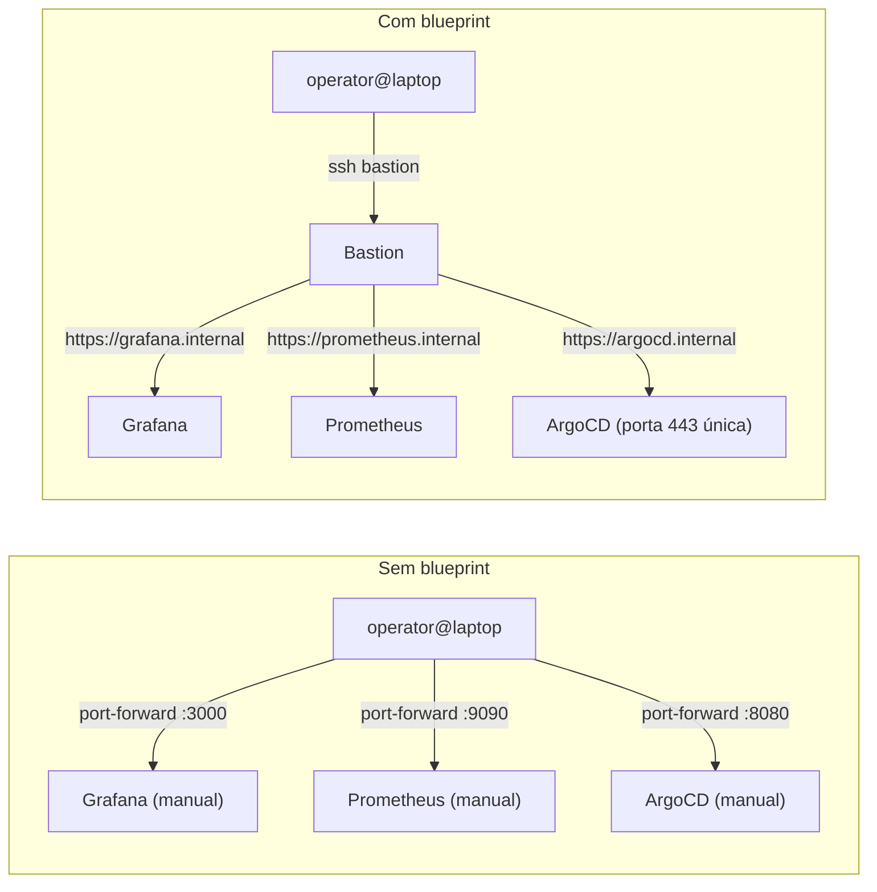
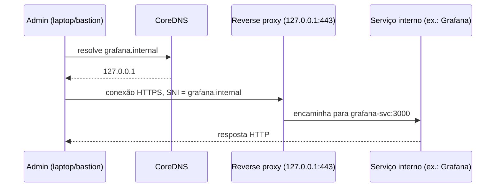
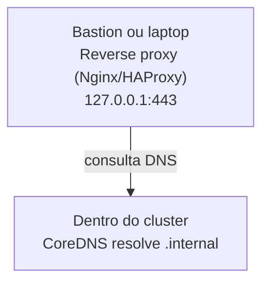

> **Público-alvo:** operadores que querem acessar serviços internos (Grafana, Prometheus, ArgoCD etc.) sem `kubectl port-forward` manual.
> **Versões testadas:** CoreDNS 1.10+, Nginx 1.25+, K3s 1.36.

Este blueprint substitui port-forwards manuais por um setup permanente. O **CoreDNS** resolve
domínios internos (`grafana.internal`) para `127.0.0.1`, e um **reverse proxy** (Nginx,
HAProxy ou Traefik) escutando na porta 443 do mesmo host roteia cada conexão para o serviço
correto usando SNI (o nome de domínio que o cliente TLS envia antes da negociação, visível mesmo
sem descriptografar o tráfego).

O problema que ele resolve aparece assim que o número de serviços internos cresce. Cada
`kubectl port-forward` ocupa um terminal, usa uma porta diferente e cai sempre que o processo
local termina ou a conexão SSH reconecta; não há nada persistente para lembrar qual porta
correspondia a qual serviço.

À esquerda, cada serviço exige um túnel manual independente, amarrado a uma porta local
específica e a uma sessão de terminal ativa. À direita, o operador só precisa de uma conexão ao
bastion; a resolução de nomes e o roteamento por porta 443 ficam permanentes, e adicionar um novo
serviço interno não exige negociar mais uma porta local.

## O que este blueprint cobre

O setup completo tem duas partes independentes que se combinam: resolução de nomes e roteamento
de tráfego. As páginas abaixo tratam de cada parte separadamente, na ordem em que normalmente são
configuradas.

- [Split-horizon DNS](../../../learn/networking/split-horizon-dns/): o conceito por trás de um
  domínio resolver de forma diferente conforme a origem da consulta, que é o que permite
  `grafana.internal` existir só na rede interna.
- [Reverse proxy: fundamentos](../../../learn/networking/reverse-proxy-basics/): como um proxy
  decide para onde encaminhar uma conexão TLS sem terminar a criptografia antes de saber o
  destino.
- [Configurar CoreDNS para resolução interna](../../tasks/networking/setup-coredns-internal/):
  o procedimento de configuração do DNS.
- [Configurar reverse proxy em localhost](../../tasks/networking/setup-reverse-proxy-localhost/):
  o procedimento de configuração do proxy, com Nginx ou HAProxy.

Não existe uma página de validação separada para o conjunto: cada guia de configuração já inclui
seus próprios passos de teste (resolução de nomes no guia de CoreDNS, conectividade HTTPS no guia
de reverse proxy). Depois de seguir os dois, confirme que a cadeia completa funciona resolvendo
um domínio interno e acessando-o via HTTPS a partir da estação administrativa.

## Topologia

O diagrama a seguir mostra a ordem real das operações quando um operador acessa um serviço
interno pela primeira vez: uma consulta DNS antes de qualquer conexão HTTP.

O CoreDNS só participa da primeira etapa, a resolução do nome; ele não vê nem participa do
tráfego HTTPS que vem depois. O reverse proxy, por outro lado, nunca resolve nomes: ele recebe a
conexão já destinada a `127.0.0.1` e decide o destino olhando o campo SNI da negociação TLS. Essa
separação de responsabilidades é o que permite trocar de reverse proxy (Nginx, HAProxy, Traefik)
sem tocar na configuração do CoreDNS, e vice-versa.

## Quando usar este blueprint

Use este blueprint quando o acesso for administrativo e a rede de origem for confiável (SSH ou
VPN até o cluster): dashboards de monitoramento, interface do Argo CD, ferramentas de CI/CD e
qualquer serviço que só deveria ser alcançável por operadores. Ele não substitui a exposição
pública de uma aplicação, que exige DNS público, um certificado emitido para um domínio real e
geralmente um WAF ou load balancer na frente; para isso, veja
[Gateway API e Traefik](../../tasks/networking/configure-traefik-gateway-api/). Também não vale a
pena adotá-lo para acessar um único serviço ocasionalmente: nesse caso, um `kubectl port-forward`
pontual continua sendo mais simples do que manter DNS e proxy permanentes.

## Variantes

As três variantes abaixo resolvem o mesmo problema com topologias diferentes. A escolha depende
de onde o CoreDNS já roda e de que tipo de acesso administrativo o ambiente tem.

### Variante A: CoreDNS no cluster com reverse proxy local (recomendado)

O CoreDNS roda como o resolvedor padrão do próprio cluster K3s (é o comportamento de fábrica), e
o reverse proxy roda separadamente no bastion ou laptop administrativo, consultando esse CoreDNS
pela rede.

**Quando usar:** é a variante padrão para um cluster K3s com múltiplos administradores, porque
reaproveita o CoreDNS que já existe no cluster em vez de duplicar a infraestrutura de resolução
de nomes.

### Variante B: CoreDNS e reverse proxy externos ao cluster

Ambos os componentes rodam fora do cluster, por exemplo um Pi-hole fazendo o papel de CoreDNS e
um Nginx no mesmo bastion, sem depender de nenhum recurso do Kubernetes.

**Quando usar:** o operador não tem privilégio administrativo sobre o cluster para editar o
`ConfigMap` do CoreDNS, ou já existe um resolvedor DNS interno rodando fora do cluster que pode
assumir esse papel.

### Variante C: roteamento integrado ao Traefik já instalado

Quando o cluster já usa Traefik como ingress controller na porta 443, o mesmo ponto de entrada
pode, em princípio, servir também domínios internos, adicionando rotas específicas para eles
sem introduzir um segundo processo de reverse proxy.

**Quando usar:** o cluster já tem Traefik instalado (via
[Gateway API e Traefik](../../tasks/networking/configure-traefik-gateway-api/)) e o objetivo é
evitar rodar um proxy adicional só para o tráfego interno.

## Próximos passos

1. Leia [Split-horizon DNS](../../../learn/networking/split-horizon-dns/) para entender a arquitetura.
2. Escolha a variante (A, B ou C, descritas acima) de acordo com onde o CoreDNS já roda.
3. Siga [Configurar CoreDNS para resolução interna](../../tasks/networking/setup-coredns-internal/).
4. Siga [Configurar reverse proxy em localhost](../../tasks/networking/setup-reverse-proxy-localhost/).
5. Confirme a cadeia completa resolvendo um domínio interno e acessando-o via HTTPS, usando os
   passos de teste descritos em cada um dos dois guias acima.

## Considerações de segurança

O reverse proxy expõe a porta 443 apenas em `127.0.0.1`, isolada da rede pública; o alcance real
depende de quem consegue chegar até essa interface (SSH, VPN ou a rede local do bastion). O
CoreDNS, por sua vez, só precisa ser alcançável pela rede interna que faz as consultas, nunca pela
internet. Para TLS, certificados auto-assinados são aceitáveis em laboratório, já que o objetivo é
criptografar a conexão, não provar identidade a um público externo; em produção, prefira
certificados emitidos por uma CA interna ou por Let's Encrypt com um domínio que a organização
controla. O sufixo `.internal` usado nos exemplos é reservado pela IANA especificamente para uso
não roteável na internet (RFC 9476), o que evita duas armadilhas: colidir com o `.local`
reservado por multicast DNS (RFC 6762), e colidir com `cluster.local`, o domínio que o próprio
Kubernetes/K3s usa internamente para resolver Services e Pods via CoreDNS. Declarar uma zona
adicional para `cluster.local` no CoreDNS pode sobrepor o plugin `kubernetes` responsável por essa
resolução interna e quebrar o DNS do próprio cluster; por isso este blueprint usa `.internal` para
os domínios administrativos, e não o domínio interno do Kubernetes. Nenhuma das duas variantes
citadas aqui adiciona autenticação por padrão: se o serviço interno não tiver login próprio, a
autenticação (basic auth, OAuth) precisa ser configurada no reverse proxy.

## Tópicos relacionados

- [NetworkPolicy](../../tasks/networking/configure-network-policies/): restringe de qual
  namespace ou pod o tráfego pode alcançar os serviços internos expostos por este blueprint, uma
  camada de controle independente da resolução de nomes.
- [DNS e registro de domínios](../../../learn/networking/dns/): a base conceitual que este
  blueprint presume, incluindo o papel do CoreDNS entre as [implementações de servidor
  DNS](../../../learn/networking/dns/dns-servers/#coredns-o-papel-que-este-notebook-já-usa) e a
  razão de usar `.internal`, não `.local`, já explicada em [mDNS e DNS-SD](../../../learn/networking/dns/mdns-and-service-discovery/).

## Fontes e leitura adicional

- [CoreDNS Documentation](https://coredns.io/): referência oficial.
- [Nginx Reverse Proxy Guide](https://docs.nginx.com/nginx/admin-guide/web-server/reverse-proxy/): setup detalhado.
- [HAProxy Configuration](https://www.haproxy.org/#docs): alternativa a Nginx.
- [RFC 6762 (mDNS)](https://tools.ietf.org/html/rfc6762): especificação do domínio `.local` reservado para multicast DNS.
- [RFC 9476](https://www.rfc-editor.org/rfc/rfc9476): reserva o domínio `.internal` para uso interno não roteável, o sufixo usado neste blueprint.
