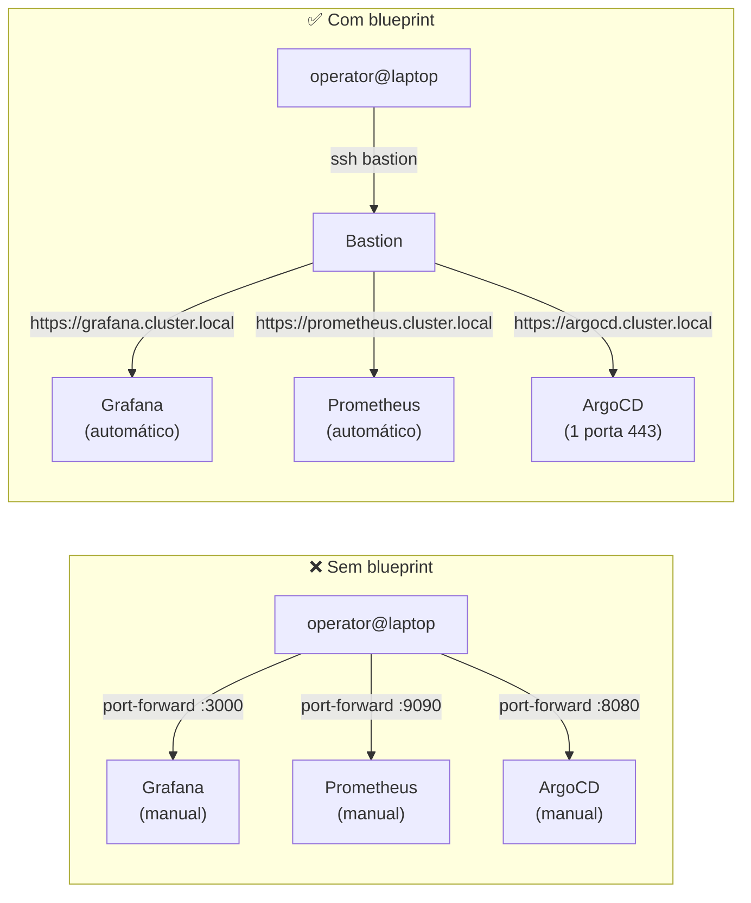
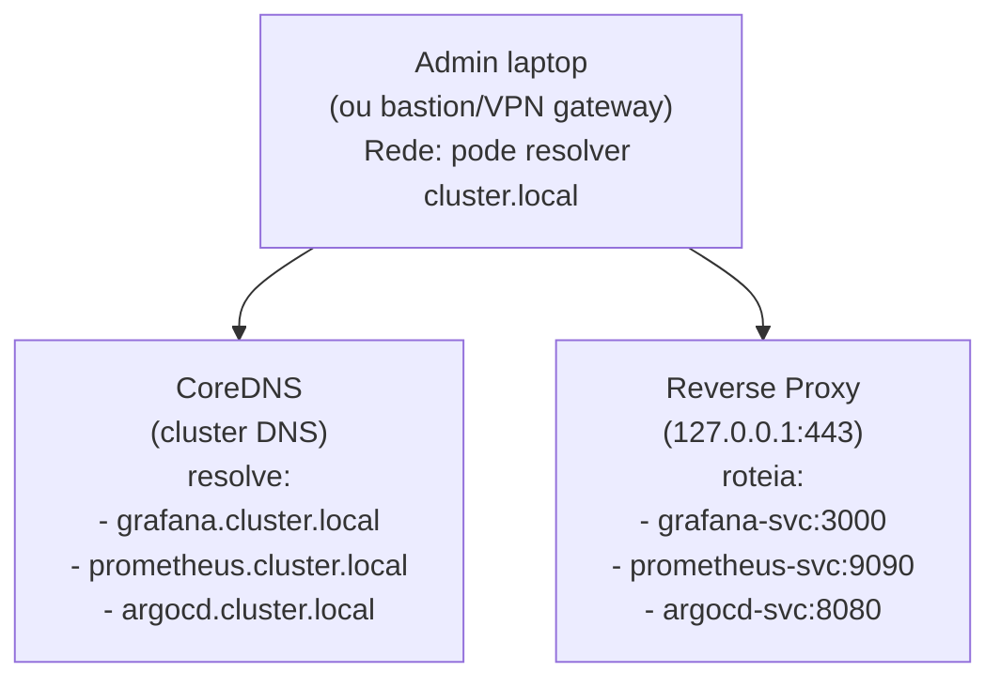
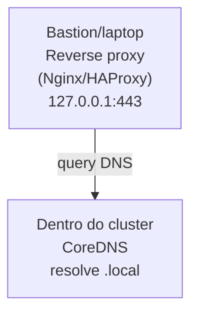
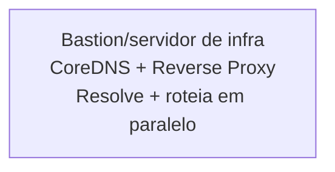

> **Público-alvo:** operadores que querem acessar serviços internos (Grafana, Prometheus, ArgoCD, etc.) sem `kubectl port-forward` manual.
> **Versões testadas:** CoreDNS 1.10+, Nginx 1.25+, K3s 1.36.

Este blueprint substitui port-forwards manuais por um setup permanente: **CoreDNS** resolve domínios internos (`grafana.cluster.local`) para `127.0.0.1`, e um **reverse proxy** (Nginx, HAProxy, ou Traefik) na porta 443 roteia por SNI para os serviços.

## O problema que este blueprint resolve



## O que está aqui

- [Conceitos: split-horizon DNS e reverse proxy](../../learn/networking/split-horizon-dns/) — entender domínios internos
- [Conceitos: reverse proxy basics](../../learn/networking/reverse-proxy-basics/) — como roteia
- [Setup CoreDNS para resolução interna](../../tasks/networking/setup-coredns-internal/) — configurar DNS
- [Setup reverse proxy em localhost](../../tasks/networking/setup-reverse-proxy-localhost/) — configurar proxy
- [Validação pós-setup](../../tasks/networking/validate-dns-and-proxy/) — checklist

## Topologia



## Quando usar este blueprint

- ✅ **Serviços internos:** dashboard admin, monitoramento, CI/CD
- ✅ **Homelab/produção privada:** acesso via SSH ou VPN
- ✅ **Zero downtime para access:** sem port-forward manual
- ✅ **Múltiplos serviços:** consolidar em uma porta
- ❌ **Serviços públicos:** use DNS público + WAF/LB
- ❌ **Sem acesso SSH/VPN:** use `kubectl port-forward`

## Variantes

### Variante A: CoreDNS no cluster + Reverse proxy local (recomendado)

CoreDNS rodando como serviço no cluster, reverse proxy no bastion/laptop:



**Quando:** cluster K3s com múltiplos admins.

### Variante B: CoreDNS externo + Reverse proxy externo

Ambos rodando fora do cluster (ex.: Pihole + Nginx no bastion):



**Quando:** cluster sem privilégio de admin, ou CoreDNS já rodando externamente.

### Variante C: Traefik integrado (se já tem Traefik)

Se está usando Traefik como ingress controller, pode configurar roteamento interno:

```yaml
Traefik já está na porta 443
  └─ adicionar IngressRoute para domínios internos
  └─ roteia para serviços por SNI
```

**Quando:** K3s com Traefik já instalado (Fase 2).

## Próximos passos

1. Ler [Split-horizon DNS](../../learn/networking/split-horizon-dns/) para entender a arquitetura
2. Escolher variant (A, B, ou C acima)
3. Seguir [Setup CoreDNS](../../tasks/networking/setup-coredns-internal/)
4. Seguir [Setup reverse proxy](../../tasks/networking/setup-reverse-proxy-localhost/)
5. [Validar](../../tasks/networking/validate-dns-and-proxy/)

## Considerações de segurança

- **TLS:** use certificados (auto-assinados ok para lab, Let's Encrypt para produção)
- **Acesso:** reverse proxy em `127.0.0.1` (isolado); CoreDNS acessível apenas na rede interna
- **Domínios:** `.cluster.local` é reservado para uso local (RFC 6762)
- **Authentication:** reverse proxy pode validar credenciais (basic auth, OAuth, etc.)

## Tópicos relacionados

- [Split-horizon DNS](../../learn/networking/split-horizon-dns/) — conceitos
- [Reverse proxy basics](../../learn/networking/reverse-proxy-basics/) — como roteia
- [Gateway API e Traefik](../../tasks/networking/configure-traefik-gateway-api/) — ingress controller (público)
- [Network policies](../../tasks/networking/configure-network-policies/) — segurança de rede

## Fontes e leitura adicional

- [CoreDNS Documentation](https://coredns.io/): referência oficial.
- [Nginx Reverse Proxy Guide](https://docs.nginx.com/nginx/admin-guide/web-server/reverse-proxy/): setup detalhado.
- [HAProxy Configuration](https://www.haproxy.org/#docs): alternativa a Nginx.
- [RFC 6762 — mDNS](https://tools.ietf.org/html/rfc6762): especificação de `.local`.
