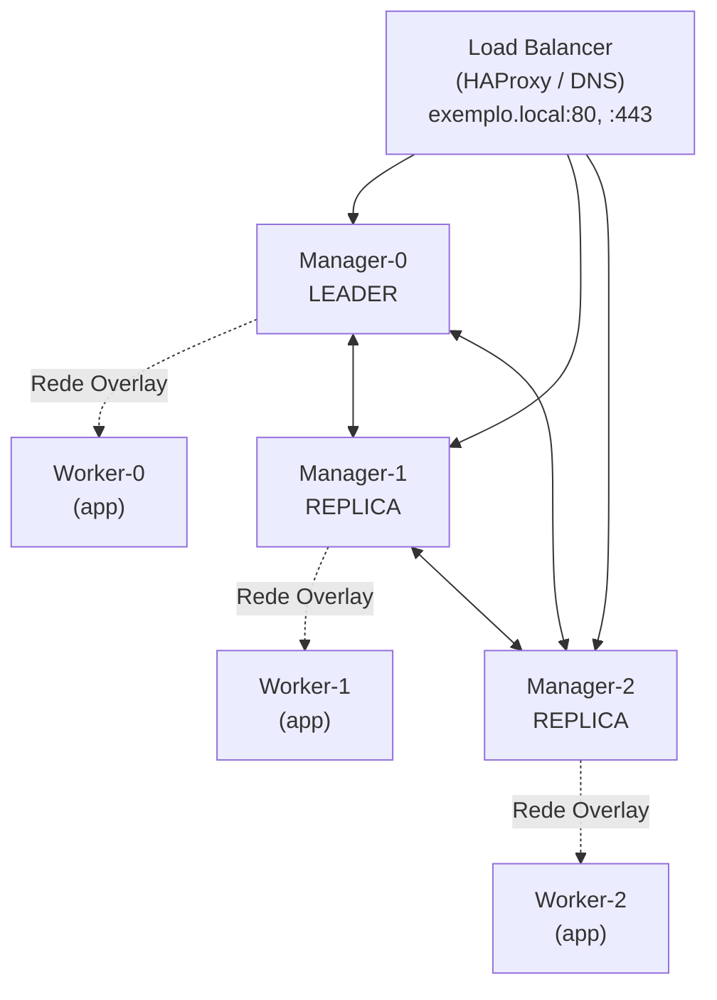

> **Para quem é:** quem precisa orquestrar múltiplos containers em um cluster pequeno, com simplicidade operacional acima de flexibilidade.
> **Pré-requisito:** Docker instalado em múltiplas máquinas Debian/Ubuntu.

Docker Swarm é um orquestrador de containers embutido no próprio Docker: não exige instalar
componentes adicionais nem migrar para uma ferramenta separada se o ambiente já roda Docker. Este
blueprint cobre um cluster Swarm de 3 ou 5 managers com múltiplos workers, incluindo rede overlay,
publicação de portas, secrets, volumes e os procedimentos de manutenção necessários para operá-lo
depois de instalado.

## Diferenças contra Kubernetes/K3s

Swarm é mais simples de operar: um único comando (`docker swarm init`) já cria o cluster, um
arquivo Compose funciona como stack sem conversão, e o número de conceitos que o operador precisa
aprender é menor do que em Kubernetes. Essa simplicidade tem contrapartida: não há CNI de
terceiros, controle de acesso baseado em papéis (RBAC) fino, autoscaling horizontal (HPA) ou
service mesh nativo. Para equipes pequenas ou clusters com menos de 50 nós, onde esses recursos
avançados raramente são necessários, a simplicidade operacional costuma pesar mais do que a
flexibilidade que se perde.

## Topologia recomendada

O diagrama a seguir mostra a topologia-alvo deste blueprint: um load balancer externo distribui
requisições entre os managers, enquanto a rede overlay conecta managers e workers entre si
independentemente de qual host físico cada um ocupa.

Os managers trocam mensagens de consenso entre si (as setas bidirecionais no topo do diagrama) e
também podem rodar workloads, o que os diferencia dos workers, que só recebem tarefas e nunca
participam do consenso. Usar 3 ou 5 managers, sempre em número ímpar, dá ao cluster quorum
suficiente para tolerar a queda de 1 ou 2 managers, respectivamente, sem perder a capacidade de
tomar decisões; um número par de managers não melhora essa tolerância na mesma proporção, pelo
mesmo raciocínio de quorum que se aplica a outros sistemas de consenso distribuído.

## Próximas seções

1. [Arquitetura](architecture/): managers, workers, raft, quorum.
2. [Managers e workers](managers-and-workers/): instalação e entrada de nós.
3. [Rede e discovery](networking/): overlay, ingress routing mesh, DNS.
4. [Secrets e configs](secrets-and-configs/): gestão segura de dados de configuração.
5. [Dados persistentes](persistent-data/): volumes, mounts, backup.
6. [Implantação de aplicações](application-deployment/): services, tasks, constraints.
7. [Atualizações e rollbacks](updates-and-rollbacks/): atualização gradual sem downtime.
8. [Backup e recuperação](backup-and-recovery/): snapshot do estado do cluster.

## Antes de começar

- Docker >= 20.10 em todos os nós.
- Conectividade de rede entre hosts (UDP/TCP porta 2377 para consenso, 7946 para gossip, 4789 para overlay).
- Firewall aberto para essas portas entre os managers e entre managers e workers.

Ao longo deste blueprint, `docker service` e `docker container` aparecem lado a lado com
frequência: não são sinônimos. Um service é o primitivo de orquestração do Swarm, a declaração de
quantas réplicas rodar e onde; um container é a instância real que o Docker executa para cumprir
essa declaração. Comandos de manutenção geralmente operam sobre o service, não sobre containers
individuais.

## Referências

- [Docker Swarm mode overview](https://docs.docker.com/engine/swarm/): documentação oficial.
- [Raft Consensus Algorithm](https://raft.io/): base teórica do consenso de managers.
