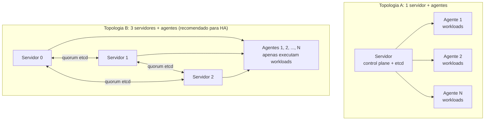

> **Para quem é:** quem tem servidores K3s rodando e quer adicionar máquinas worker.
> **Pré-requisitos:** [primeiro servidor em execução](../first-server/), [servidores adicionais (opcional)](../additional-servers/).

Agentes, também chamados "workers", são nós que apenas executam workloads: não participam do
quorum de etcd nem expõem a API. Esta é a topologia mais comum em produção, com o control plane
concentrado nos servidores e os workloads distribuídos entre agentes.

## Topologias



## Instalação de agentes

### Passo 1: Preparar o host

No novo agente, execute os mesmos passos de preparação de host da Fase 2:
[Preparar um servidor Debian](../../../tasks/host/prepare-debian-server/) e, ao final,
[Validar requisitos do host](../../../tasks/host/validate-host-requirements/). O agente precisa
de Debian ou Ubuntu com `sudo` disponível, kernel 5.x ou mais recente, arquitetura amd64 ou
arm64, e o firewall já configurado para permitir o tráfego dos servidores conforme
[requisitos de rede](../network-requirements/).

### Passo 2: Instalar K3s como agente

Execute **em cada agente novo**:

```bash
curl -sfL https://get.k3s.io | INSTALL_K3S_VERSION=v1.36.0+k3s1 K3S_URL=https://<ip-servidor>:6443 K3S_TOKEN=<seu-token> sh -
```

Onde:
- `<ip-servidor>`: IP de **qualquer servidor** (ex.: `10.0.0.10`)
- `<seu-token>`: mesmo token de `/var/lib/rancher/k3s/server/node-token` do servidor

Exemplo:

```bash
curl -sfL https://get.k3s.io | INSTALL_K3S_VERSION=v1.36.0+k3s1 K3S_URL=https://10.0.0.10:6443 K3S_TOKEN='K102abc123::server:xyz789' sh -
```

### Passo 3: Aguardar registro

Aguarde de 10 a 15 segundos. Em qualquer servidor, verifique:

```bash
sudo kubectl get nodes
```

O novo agente deve aparecer como `Ready`:

```text
NAME         STATUS   ROLES          AGE     VERSION
servidor-0   Ready    control-plane  10m     v1.36.0+k3s1
agente-1     Ready    worker         20s     v1.36.0+k3s1
```

## Diferenças entre servidor e agente

| Aspecto | Servidor | Agente |
| --- | --- | --- |
| **Função** | Control plane + etcd + API | Apenas workloads |
| **Quorum** | Participa | Não participa |
| **Roles** | `control-plane`, `master` | `<none>` ou labels customizadas |
| **Portas críticas** | 2379-2380 (etcd), 6443 (API) | 10250 (kubelet) |
| **Backup necessário** | Sim (etcd) | Não (estado efêmero) |
| **Pode ser removido?** | Sim, se quorum não quebra | Sim, sem efeito no cluster |
| **Podem correr workloads?** | Sim (opcional) | Sim (padrão) |

## Taint e tolerate (avançado)

Se você quer que servidores não corram workloads, dedicando-os exclusivamente a control plane,
adicione um taint:

```bash
# Em um servidor
sudo kubectl taint nodes <nome-servidor> node-role.kubernetes.io/control-plane=:NoSchedule
```

Pods agora só correm em agentes, a menos que declarem uma toleration explícita para esse taint.

Para reverter:

```bash
sudo kubectl taint nodes <nome-servidor> node-role.kubernetes.io/control-plane:NoSchedule-
```

## Distribuição de workloads

Depois que os agentes estão `Ready`, o scheduler distribui pods entre eles automaticamente. Para
testar:

```bash
# Criar um pod de teste
kubectl run nginx --image=nginx:latest

# Verificar em qual nó foi criado
kubectl get pod nginx -o wide
```

## Remoção de agentes

Se precisar remover um agente:

```bash
# 1. Drenar o agente (move workloads para outros nós)
kubectl drain <nome-agente> --ignore-daemonsets --delete-emptydir-data

# 2. Remover o agente do cluster
kubectl delete node <nome-agente>

# 3. No agente mesmo, parar K3s
sudo systemctl stop k3s-agent
sudo systemctl disable k3s-agent
```

Veja [Remover um nó K3s](../../../tasks/kubernetes/remove-k3s-node/) para o procedimento completo,
incluindo o que fazer se o agente estiver inacessível para o passo 3.

## Problemas comuns

### Agente fica "NotReady"

**Causa:** firewall, conectividade ou falta de recursos.

**Solução:**

```bash
# No agente
sudo journalctl -u k3s-agent -n 50

# No servidor
kubectl describe node <nome-agente>
```

### "Unable to register with server"

**Causa:** token inválido, IP do servidor inacessível ou firewall bloqueando a porta 6443.

**Solução:**

```bash
# No agente, testar conectividade
sudo nc -zv <ip-servidor> 6443

# Verificar token novamente em um servidor
sudo cat /var/lib/rancher/k3s/server/node-token
```

## Próximo passo

- [Balancear a API](../api-endpoint/): configurar endpoint estável.
- [Validar o cluster](../validation/): checklist de verificação.
- [Operação nó a nó](../node-maintenance/): manutenção sem downtime.

## Fontes e leitura adicional

- [K3s: Worker Node Setup](https://docs.k3s.io/architecture#nodes-and-architecture): especificação de agentes.
- [Kubernetes: Node Affinity](https://kubernetes.io/docs/concepts/scheduling-eviction/assign-pod-node/): como controlar em quais nós pods rodam.
