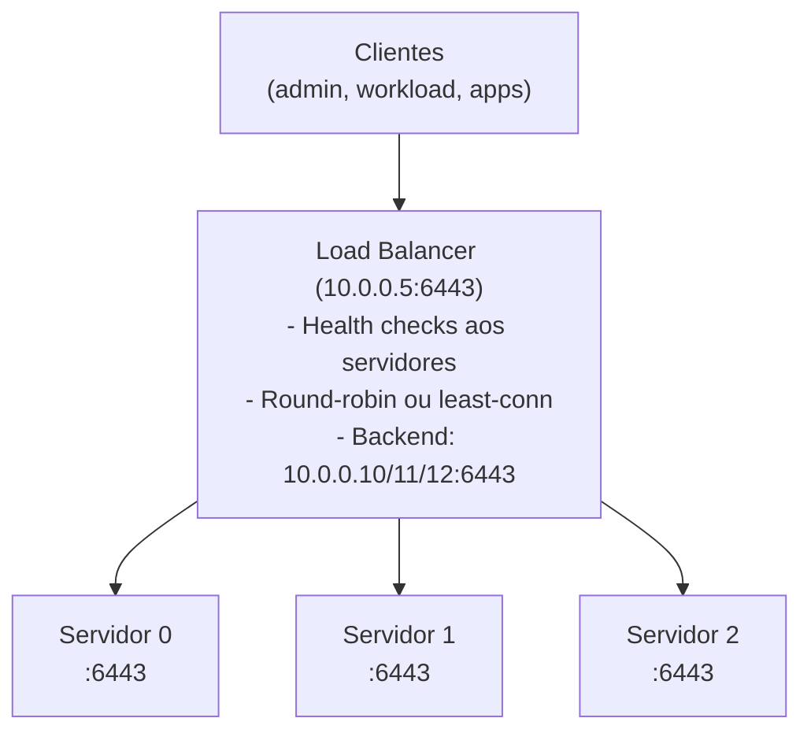

> **Para quem é:** quem tem 2+ servidores e quer um endpoint único/estável para acessar a API.
> **Contexto:** sem balanceamento, clientes apontam para um servidor único (SPOF); com balanceamento, o endpoint não muda mesmo se um servidor falhar.

Em um cluster com 3 servidores K3s, cada servidor tem a API rodando na porta 6443. Um balanceador de carga distribui requisições entre eles e oferece um endpoint único. Este guia cobre as opções.

## Opção 1: DNS round-robin (simples)

Crie um registro DNS apontando para todos os IPs dos servidores, um registro `A` por servidor sob
o mesmo nome:

```text
api.seu-cluster.local.  A   10.0.0.10  ; servidor-0
api.seu-cluster.local.  A   10.0.0.11  ; servidor-1
api.seu-cluster.local.  A   10.0.0.12  ; servidor-2
```

**Vantagens:**
- Sem infraestrutura extra
- Fácil de configurar

**Desvantagens:**
- Sem health check (se um servidor cair, DNS ainda retorna seu IP)
- Cliente talvez erre na primeira tentativa

## Opção 2: Load balancer dedicado (robusto)

Coloque um load balancer (Nginx, HAProxy, ou managed LB em nuvem) na frente dos servidores:



**Vantagens:**
- Health checks (remove servidores falhos automaticamente)
- Balanceamento inteligente
- TLS termination opcional

**Desvantagens:**
- Mais um componente para manter
- Pode ficar SPOF se não tiver HA própria

### Exemplo: HAProxy simples

Em um host dedicado (ou em um dos servidores, se suportar):

```text
# /etc/haproxy/haproxy.cfg

global
    maxconn 4096
    log stdout local0

defaults
    mode tcp
    timeout connect 5000
    timeout client 50000
    timeout server 50000

listen api_k3s
    bind *:6443
    mode tcp
    balance roundrobin
    default_backend servers

backend servers
    mode tcp
    server server0 10.0.0.10:6443 check
    server server1 10.0.0.11:6443 check
    server server2 10.0.0.12:6443 check
```

Depois, reinicie o HAProxy para aplicar a configuração:

```bash
sudo systemctl restart haproxy
```

Clientes agora apontam para `10.0.0.5:6443` (ou DNS alias `api.seu-cluster.local:6443`).

### Exemplo: Nginx simples

```text
# /etc/nginx/sites-available/k3s-api

upstream k3s_servers {
    server 10.0.0.10:6443 max_fails=2 fail_timeout=10s;
    server 10.0.0.11:6443 max_fails=2 fail_timeout=10s;
    server 10.0.0.12:6443 max_fails=2 fail_timeout=10s;
}

server {
    listen 6443 ssl;
    server_name api.seu-cluster.local;

    ssl_certificate     /etc/ssl/certs/api-cert.crt;
    ssl_certificate_key /etc/ssl/private/api-key.key;

    location / {
        proxy_pass https://k3s_servers;
        proxy_ssl_verify off;  # K3s usa certs auto-assinados
    }
}
```

## Opção 3: Traefik (se já está usando Traefik)

Se você já tem Traefik como ingress controller no cluster, pode usá-lo para balancear a API:

```yaml
apiVersion: traefik.io/v1alpha1
kind: IngressRoute
metadata:
  name: k3s-api
  namespace: kube-system
spec:
  entryPoints:
    - kubesecure  # HTTPS
  routes:
    - match: "Host(`api.seu-cluster.local`)"
      kind: Rule
      services:
        - name: kubernetes
          port: 443
          scheme: https
```

**Atenção:** o Traefik usado como balanceador da própria API precisa rodar fora do control plane
(por exemplo, em um agente dedicado), nunca em um servidor cujo Traefik dependa dessa mesma API
para inicializar. Se o pod do Traefik só conseguir subir depois que a API responder, e a API só
ficar acessível através desse mesmo Traefik, o cluster fica em deadlock: nenhum dos dois consegue
iniciar primeiro.

## Certificados TLS

A API do K3s vem com certificados auto-assinados cobrindo apenas `localhost` e o nome de cada nó
individualmente. Em um cluster multinode com endpoint compartilhado, o certificado da API precisa
cobrir todos os nomes pelos quais ela é alcançada:

```text
api.seu-cluster.local
10.0.0.5  (IP do LB)
10.0.0.10, 10.0.0.11, 10.0.0.12  (IPs dos servidores)
```

### Opção A: Usar cert-manager (certificados Let's Encrypt)

Se tem cert-manager instalado e `api.seu-cluster.local` é um domínio público:

```yaml
apiVersion: cert-manager.io/v1
kind: Certificate
metadata:
  name: api-cert
spec:
  secretName: api-tls
  issuerRef:
    name: letsencrypt-prod
  dnsNames:
    - api.seu-cluster.local
```

### Opção B: Auto-assinado

Para laboratório ou testes, gere um certificado auto-assinado que cubra todos os IPs:

```bash
openssl req -x509 -nodes -days 365 -newkey rsa:2048 \
  -keyout api-key.key -out api-cert.crt \
  -subj "/CN=api.seu-cluster.local" \
  -addext "subjectAltName=DNS:api.seu-cluster.local,IP:10.0.0.5,IP:10.0.0.10,IP:10.0.0.11,IP:10.0.0.12"

sudo cp api-cert.crt /etc/ssl/certs/
sudo cp api-key.key /etc/ssl/private/
```

Depois, distribua o certificado para os clientes que acessam a API diretamente por IP ou nome,
já que um certificado auto-assinado não é validado automaticamente por eles.

## Configurar clientes para usar o novo endpoint

Depois que LB/DNS está pronto, os clientes apontam para o novo endpoint. Exemplo:

```yaml
# ~/.kube/config
apiVersion: v1
clusters:
  - cluster:
      server: https://api.seu-cluster.local:6443
      certificate-authority-data: <base64-ca-cert>
    name: seu-cluster
contexts:
  - context:
      cluster: seu-cluster
      user: seu-usuario
    name: seu-cluster
current-context: seu-cluster
users:
  - name: seu-usuario
    user:
      token: <seu-token>
```

## Verificação

Confirme que o balanceamento funciona antes de apontar clientes de produção para o novo endpoint:

```bash
# Do cliente
curl -k https://api.seu-cluster.local:6443/healthz
# Esperado: "ok"
```

```bash
kubectl cluster-info
# Esperado: "Kubernetes control plane is running at https://api.seu-cluster.local:6443"
```

Se `curl` retornar `ok` mas `kubectl cluster-info` falhar, o problema geralmente está no
kubeconfig (certificado ou token incorretos), não no balanceamento em si, já que o `healthz`
confirma que a camada de rede e TLS já está funcionando.

## Próximo passo

- [Validar o cluster](../validation/): checklist pós-implantação.
- [Operação nó a nó](../node-maintenance/): manutenção sem downtime.

## Fontes e leitura adicional

- [K3s: API Configuration](https://docs.k3s.io/cli/server): configuração de endpoint na instalação.
- [HAProxy Documentation](http://www.haproxy.org/): referência completa de HAProxy.
