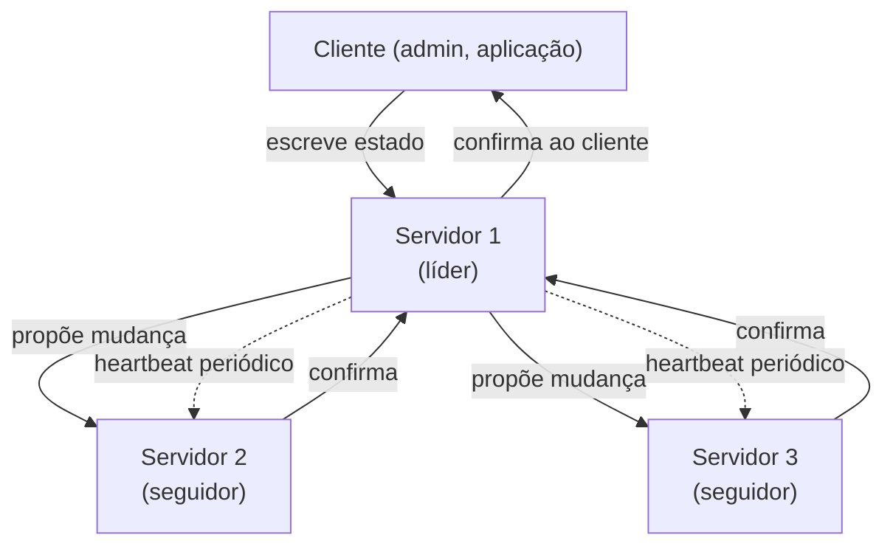
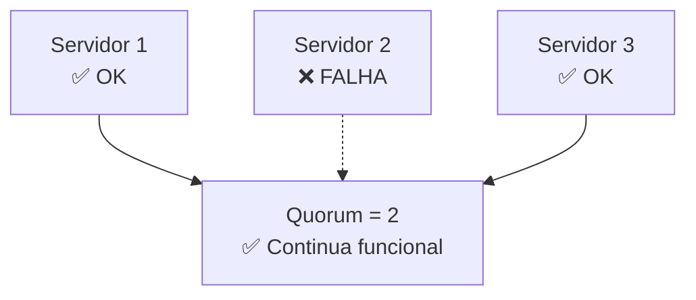
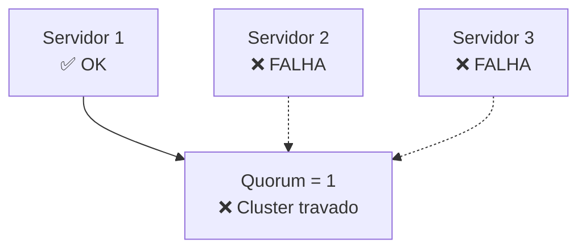
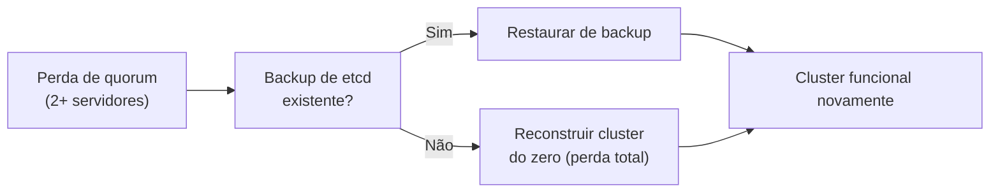

> **Para quem é:** operadores que precisam entender como K3s mantem consenso em múltiplos servidores, antes de começar o operacional.

Em um cluster K3s multinode com etcd embarcado, os servidores se comunicam para manter um registro distribuído do estado do cluster. Essa comunicação segue o algoritmo **Raft**, que exige um **quorum**: um consenso entre a maioria dos servidores. Sem um quorum funcional, o cluster trava.

## Como funciona

Um **servidor líder** coordena todas as escritas. Cada mudança é proposta aos **seguidores**; assim que a maioria (quorum) confirma, a mudança é commitada. Se o líder falhar, os seguidores elegem um novo líder.

## Quorum

O quorum é a quantidade mínima de servidores que precisam estar saudáveis para que o cluster
continue funcionando. Para um cluster com N servidores, o quorum é `floor(N / 2) + 1`: o menor
número inteiro que já representa mais da metade de N. É por isso que adicionar um servidor a mais
em um cluster com número par nem sempre aumenta a tolerância a falhas, como a tabela mostra a
seguir.

| Servidores | Quorum | Tolerância de falha |
| --- | --- | --- |
| 1 | 1 | 0 (qualquer falha = travado) |
| 2 | 2 | 0 (qualquer falha = travado) |
| 3 | 2 | 1 (pode perder 1) |
| 5 | 3 | 2 (pode perder 2) |
| 7 | 4 | 3 (pode perder 3) |

Em 3 servidores, o quorum é 2: é possível perder 1 servidor e o cluster continua operacional. Se perder 2, o cluster fica travado, e nenhuma nova decisão pode ser tomada.

## Cenários de falha

### Perda de 1 servidor em 3 (quorum OK)

- Workloads continuam rodando.
- O cluster elege um novo líder entre os 2 vivos.
- Você pode atualizar ou reparar o servidor falho.

### Perda de 2 servidores em 3 (quorum QUEBRADO)

- Nenhuma nova mudança pode ser commitada (API retorna erro).
- Pods existentes continuam rodando, mas não podem ser criados/atualizados/deletados.
- O cluster está efetivamente indisponível.

## Recuperação de perda de quorum

Se o cluster perder quorum, você precisa restaurar o etcd a partir de um backup. Isso é um procedimento manual (veja [Falha e recuperação](../failure-and-recovery/)).

**Por isso backups regulares de etcd são críticos:**

## Tópicos relacionados

- [Topologias recomendadas](../topologies/): escolher entre 1/3/N servidores.
- [Requisitos de rede](../network-requirements/): quais portas etcd usa entre nós.
- [Falha e recuperação](../failure-and-recovery/): runnbooks para perda de quorum.
- [Manutenção de nó](../node-maintenance/): como atualizar/reparar sem quebrar quorum.

## Fontes e leitura adicional

- [K3s: High Availability Etcd](https://docs.k3s.io/datastore/ha-embedded): implementação de HA no K3s.
- [etcd Raft Consensus](https://etcd.io/docs/v3.5/learning/design-client/): especificação do algoritmo Raft usado pelo etcd.
- [K3s: Disaster Recovery](https://docs.k3s.io/datastore/backup-restore): backup e restore de etcd no K3s.
