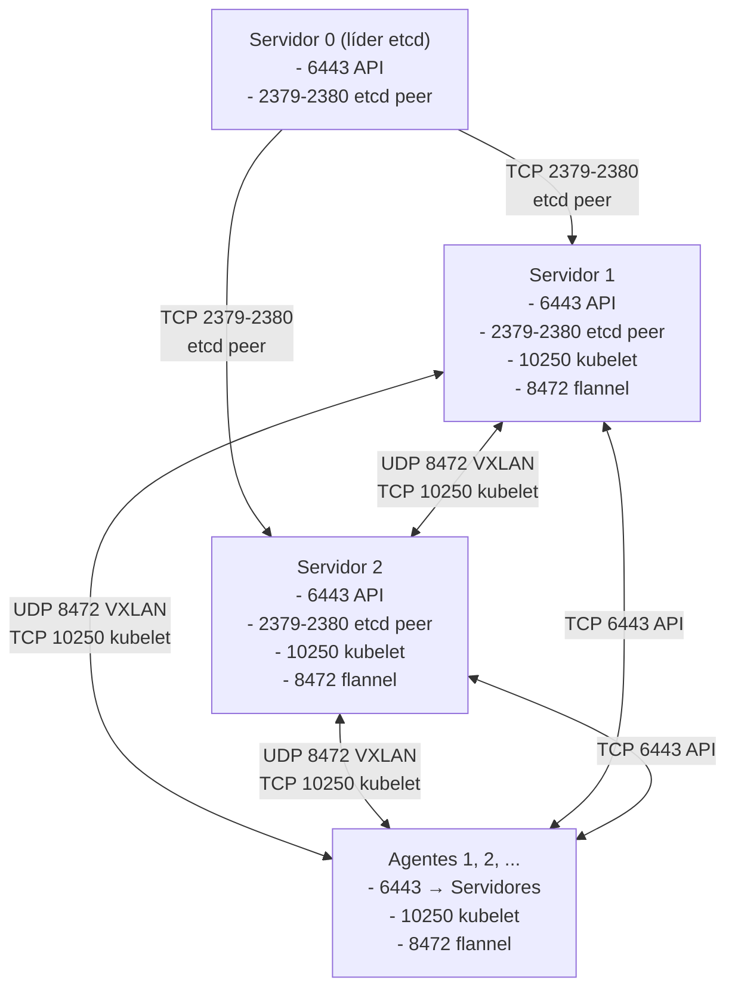

> **Para quem é:** quem está configurando firewall ou rede entre múltiplos nós K3s antes de começar a implantação.

Um cluster K3s multinode exige comunicação entre nós em portas específicas: servidores se
coordenam via etcd, agentes conectam à API, e todos precisam falar com flannel, a rede overlay
padrão do K3s. Este guia documenta quais portas abrir, em qual direção e entre quem.

## Quadro de referência

Assumindo:
- **Topologia:** 3 servidores + N agentes (adaptar para sua topologia)
- **Firewall:** cada nó tem firewall local (UFW/firewalld) + regras entre nós
- **Rede:** nós em subnet `10.0.0.0/24` (ajustar à sua realidade)
- **Control plane:** servidor-0, servidor-1, servidor-2
- **Workers:** agentes rodando em máquinas separadas

## Portas: visão geral

| Porta | Protocolo | Origem | Destino | Finalidade |
| --- | --- | --- | --- | --- |
| 6443 | TCP | agentes + admin | servidores | API Kubernetes |
| 2379–2380 | TCP | servidores | servidores | etcd peer (quorum) |
| 10250 | TCP | kubelet em qualquer nó | kubelet em qualquer nó | comunicação kubelet |
| 8472 | UDP | qualquer nó | qualquer nó | VXLAN (flannel overlay network) |
| 179 | TCP | servidores | agentes (opcional) | BGP (se ativado) |

### Portas extras por serviço

Se você tiver instalado:

| Serviço | Porta | Protocolo | Origem | Observação |
| --- | --- | --- | --- | --- |
| Traefik (ingress controller) | 80, 443 | TCP | internet | entrada de HTTP/HTTPS (publish no host) |
| Prometheus (observabilidade) | 9090 | TCP | localhost | acesso administrativo (não publish) |
| CoreDNS (DNS interno) | 53 | UDP | pods | resolução DNS dentro do cluster (não precisa firewall, é rede interna) |

## Diagrama



## Configuração passo a passo

### 1. Firewall local em cada nó (allow cluster traffic)

Em cada nó (servidor e agente), permitir tráfego dos nós do cluster:

```bash
# Exemplo: nós em 10.0.0.0/24

# API Kubernetes (requer acesso ao servidor)
sudo ufw allow from 10.0.0.0/24 to any port 6443 proto tcp

# kubelet (node-to-node)
sudo ufw allow from 10.0.0.0/24 to any port 10250 proto tcp

# flannel VXLAN (overlay network)
sudo ufw allow from 10.0.0.0/24 to any port 8472 proto udp

# etcd peer (somente entre servidores)
sudo ufw allow from 10.0.0.0/24 to any port 2379 proto tcp
sudo ufw allow from 10.0.0.0/24 to any port 2380 proto tcp
```

Se seu firewall usa `firewalld`, a sintaxe é similar:

```bash
# firewalld: adicionar zona trusted para subnet do cluster
sudo firewall-cmd --permanent --zone=trusted --add-source=10.0.0.0/24
sudo firewall-cmd --permanent --zone=trusted --add-port=6443/tcp
sudo firewall-cmd --permanent --zone=trusted --add-port=2379/tcp
sudo firewall-cmd --permanent --zone=trusted --add-port=2380/tcp
sudo firewall-cmd --permanent --zone=trusted --add-port=10250/tcp
sudo firewall-cmd --permanent --zone=trusted --add-port=8472/udp
sudo firewall-cmd --reload
```

### 2. Firewall entre redes (se nós estão em subnets diferentes)

Se seus servidores estão em uma rede (ex.: `10.0.0.0/24`) e agentes em outra (ex.:
`10.1.0.0/24`), você precisa encaminhar tráfego entre elas. Faça isso no roteador ou gateway,
não no UFW de cada nó:

- Rota entre `10.0.0.0/24` e `10.1.0.0/24` nas portas 6443, 10250 e 8472.
- Se o roteador tiver firewall próprio, adicione as regras lá também.

### 3. Balanceamento da API (se está usando load balancer)

Se está usando um load balancer (física ou virtual) na frente dos servidores:

- **LB precisa alcançar:** porta 6443 TCP em cada servidor (`10.0.0.x:6443`)
- **Clientes alcançam:** LB na porta 6443 TCP (ex.: `api.seu-cluster.local:6443`)

Veja [Balancear a API](../api-endpoint/) para mais.

### 4. Validação

Depois de configurar o firewall, teste a conectividade entre nós:

```bash
# Em um agente, testar conexão à API do servidor
telnet <ip-do-servidor> 6443

# Ou usando nc (netcat)
nc -zv <ip-do-servidor> 6443
```

Uma conexão bem-sucedida confirma que o firewall permite o tráfego nessa porta específica; repita
para cada porta da tabela de referência que for relevante à sua topologia, já que uma porta aberta
não garante que as demais também estejam.

## Considerações adicionais

### Subredes IPv6

Se está usando IPv6, adicione as mesmas portas para IPv6. O UFW aceita a mesma sintaxe com um
prefixo IPv6:

```bash
sudo ufw allow from <ipv6-prefix>/64 to any port 6443 proto tcp
```

### NAT e redes privadas

Se os nós estão atrás de NAT (por exemplo, em uma nuvem privada), a rede interna (`10.0.0.0/24`)
ainda funciona normalmente; a única exigência é que o firewall interno permita o tráfego. A NAT em
si é transparente para o Kubernetes, desde que os nós consigam se alcançar internamente pelos
endereços privados.

### BGP (se Flannel estiver em modo BGP)

BGP usa a porta 179 TCP entre nós. Esse modo é raro nesta infraestrutura (o padrão é VXLAN), mas
se estiver em uso, adicione também:

```bash
sudo ufw allow from 10.0.0.0/24 to any port 179 proto tcp
```

## Tópicos relacionados

- [Topologias recomendadas](../topologies/): entender o número de servidores/agentes que você tem.
- [Balancear a API](../api-endpoint/): certificados e DNS para acesso de admin/cliente.
- [Configurar firewall entre nós K3s](../../../tasks/kubernetes/configure-k3s-firewall-rules/): task guide de UFW/firewalld.

## Fontes e leitura adicional

- [K3s: Networking](https://docs.k3s.io/networking): especificação completa de portas K3s.
- [Flannel: Network Model](https://github.com/flannel-io/flannel#how-it-works): como flannel gerencia o overlay network.
