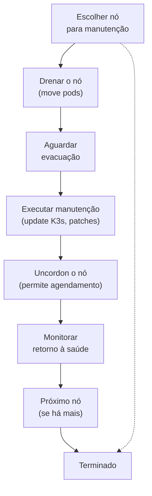

> **Para quem é:** quem precisa atualizar K3s, aplicar patches de segurança ou fazer manutenção em um nó sem derrubar o cluster.
> **Contexto:** em multinode com quorum, você pode tirar 1 nó de cada vez enquanto os outros continuam rodando.

A técnica chama-se **drain**: move workloads de um nó para outros, depois você reinicia/atualiza/desliga o nó. Isso garante que as aplicações não sofram downtime.

## Fluxo geral



## Passo 1: Drenar um nó

Escolha um nó (ex.: agente-1) e draine-o:

```bash
kubectl drain agente-1 \
  --ignore-daemonsets \
  --delete-emptydir-data \
  --grace-period=30
```

**Flags:**
- `--ignore-daemonsets`: DaemonSets (Flannel, Longhorn agent etc.) não são drenáveis; a flag diz ao `drain` para ignorá-los em vez de falhar.
- `--delete-emptydir-data`: pods que usam `emptyDir` (dados temporários) são deletados sem aviso, já que esse tipo de volume não sobrevive à saída do pod de qualquer forma.
- `--grace-period=30`: aguarda 30 segundos para os pods terminarem graciosamente antes de forçar o encerramento.

**Saída esperada:**

```text
node/agente-1 already cordoned
pod/nginx-abc123 evicted
pod/my-app-def456 evicted
node/agente-1 evicted
```

Se `drain` falhar, veja a seção "Problemas comuns" abaixo.

## Passo 2: Executar manutenção

Agora o nó está `CordonSchedulingDisabled`, o que significa que nenhum novo pod é agendado nele.
A partir daqui você pode:

### Atualizar K3s

```bash
# SSH para o nó
ssh admin@agente-1

# Parar K3s
sudo systemctl stop k3s-agent

# Executar instalador (refaz a instalação, mesmo arquivo de config)
curl -sfL https://get.k3s.io | sh -

# K3s reinicia automaticamente
sudo systemctl status k3s-agent
```

Ou, se estiver usando um servidor:

```bash
sudo systemctl stop k3s

curl -sfL https://get.k3s.io | INSTALL_K3S_SKIP_START=true sh -

sudo systemctl start k3s
```

### Aplicar patches do SO

```bash
sudo apt update && sudo apt upgrade -y
sudo reboot
```

K3s reinicia automaticamente após o reboot.

### Substituir hardware

Se o nó está danificado e não vai voltar, remova-o do cluster antes de desligá-lo definitivamente:

```bash
kubectl delete node agente-1
ssh admin@agente-1 'sudo shutdown -h now'
```

**Atenção:** `kubectl delete node` remove o registro do nó da API imediatamente, não apenas o
marca como indisponível. Use esse comando apenas quando o nó realmente não vai retornar; se houver
qualquer chance de repará-lo, prefira apenas drenar e desligar sem remover o registro, e liberá-lo
de volta com `kubectl uncordon` quando ele voltar. Um nó removido precisa ser reingressado do zero,
seguindo [Adicionar um agente K3s](../../../tasks/kubernetes/join-k3s-agent/).

## Passo 3: Uncordon o nó

Depois que manutenção termina e o nó está saudável, libere-o para receber workloads novamente:

```bash
kubectl uncordon agente-1
```

**Saída esperada:**

```text
node/agente-1 uncordoned
```

## Passo 4: Monitorar retorno

Aguarde ~10 segundos e verifique:

```bash
kubectl get nodes

# Esperado: agente-1 volta a "Ready"
# NAME         STATUS   ROLES    AGE     VERSION
# agente-1     Ready    <none>   10m     v1.36.0+k3s1
```

Se o nó fica `NotReady`, confira logs:

```bash
kubectl describe node agente-1
kubectl logs -n kube-system <kubelet-log-pod>
```

## Operações em servidores (controle plane)

Drenar um servidor é similar, mas com mais impacto:

```bash
# Drenar servidor-0
kubectl drain servidor-0 \
  --ignore-daemonsets \
  --delete-emptydir-data

# Executar manutenção
# (update, patches, reboot)

# Uncordon
kubectl uncordon servidor-0
```

**Cuidado:** enquanto um servidor está down, quorum pode ficar comprometido. Com 3 servidores:

- Draining servidor-0: quorum = servidor-1 + servidor-2 ✅
- Draining servidor-1 também: quorum quebrado ❌ (só 1 vivo)

**Regra:** drene apenas 1 servidor por vez em um cluster 3-servidor. Se tem 5 servidores, pode drener 2 simultaneamente (quorum = 3).

## Problemas comuns

### "cannot evict pod: it doesn't have a replication controller"

O pod não é gerenciado por Deployment, StatefulSet ou DaemonSet: é um pod solo, que o `drain`
recusa remover por padrão porque não há um controlador que vá recriá-lo depois. Solução:

```bash
# Opção A: deletar o pod (é solo, recreável)
kubectl delete pod <nome-pod> -n <namespace>

# Opção B: drenar com --force (pode interromper o pod)
kubectl drain <nó> --force --ignore-daemonsets --delete-emptydir-data
```

### "Drain timed out"

Pods não terminam em tempo. Aumentar `--grace-period` ou investigar por quê:

```bash
# Checar status de pods em drain
kubectl get pods --all-namespaces | grep <nó>

# Forçar timeout menor (mata pods)
kubectl drain <nó> --grace-period=5 --force --ignore-daemonsets
```

### Nó fica `NotReady` após uncordon

Logs indicam falha ao reiniciar K3s. Conferir:

```bash
# No nó
sudo journalctl -u k3s-agent -n 50

# Causa comum: disco cheio, permissões, rede
# Consertar manualmente e tentar novamente
sudo systemctl restart k3s-agent
```

## Rolling update de cluster completo

Para atualizar o cluster inteiro (ex.: K3s 1.35 → 1.36):

1. Atualizar os 3 servidores um por um (drain → update → uncordon)
2. Depois atualizar os agentes um por um
3. Verificar que cluster está `Ready` após cada nó

```bash
# Script para atualizar todos os servidores
for server in servidor-0 servidor-1 servidor-2; do
  echo "Updating $server..."
  kubectl drain $server --ignore-daemonsets --delete-emptydir-data
  ssh admin@$server 'sudo systemctl stop k3s && curl -sfL https://get.k3s.io | sh - && sudo systemctl status k3s'
  kubectl uncordon $server
  sleep 30  # Aguardar retorno à saúde
done

# Idem para agentes
for agent in agente-1 agente-2; do
  echo "Updating $agent..."
  kubectl drain $agent --ignore-daemonsets --delete-emptydir-data
  ssh admin@$agent 'sudo systemctl stop k3s-agent && curl -sfL https://get.k3s.io | K3S_URL=... K3S_TOKEN=... sh -'
  kubectl uncordon $agent
  sleep 30
done

echo "Cluster updated successfully"
```

## Próximo passo

- [Falha e recuperação](../failure-and-recovery/): runbooks para cenários inesperados.

## Fontes e leitura adicional

- [Kubernetes: Safely Drain a Node](https://kubernetes.io/docs/tasks/administer-cluster/safely-drain-node/): guia oficial.
- [K3s: Upgrades](https://docs.k3s.io/upgrades): informações de versão e procedimento.
