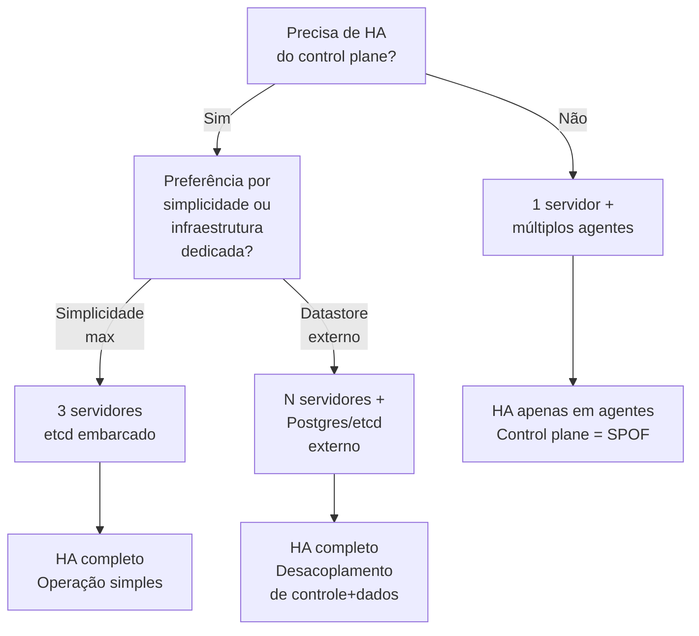

> **Para quem é:** quem está entre single-node e multinode e precisa escolher qual topologia usar.

A escolha de topologia define quantos servidores (control plane), agentes (workers) e quorum você
terá. Não existe uma única resposta correta: cada topologia se torna ideal em um contexto
específico, dependendo de quanto valor a HA do control plane tem para o ambiente e de quanta
complexidade operacional adicional é aceitável em troca dela.

## Topologia 1: Um servidor + múltiplos agentes

**Quando usar:** ambientes de teste, desenvolvimento, ou quando infraestrutura é limitada a um único host "bom".

| Aspecto | Detalhes |
| --- | --- |
| **Servidores** | 1 (control plane = SPOF) |
| **Agentes** | 1+ (workloads ficam distribuídos se houver múltiplos) |
| **Quorum** | N/A (sem quorum, pois só 1 servidor) |
| **Datastore** | etcd embarcado no servidor |
| **HA do control plane** | ❌ Não: perda do servidor é perda total |
| **HA de workloads** | ✅ Sim, se houver múltiplos agentes |
| **Complexidade operacional** | Baixa: é essencialmente o single-node com agentes |
| **Requisitos de rede** | Comunicação entre nós; firewall TCP 6443 (API), 10250 (kubelet), UDP 8472 (flannel) |

**Quando evitar:** se HA do control plane for requisito.

## Topologia 2: Três servidores + etcd embarcado

**Quando usar:** HA completo com operação simples; infraestrutura "normal" com 3 máquinas decentes.

| Aspecto | Detalhes |
| --- | --- |
| **Servidores** | 3 (control plane + etcd embarcado; quorum = 2) |
| **Agentes** | 0+ (servidores podem correr workloads, ou dedicar para control plane) |
| **Quorum** | Sim: 3 servidores, quorum = 2 (perda de 1 = cluster funciona; perda de 2 = travado) |
| **Datastore** | etcd embarcado e replicado entre servidores |
| **HA do control plane** | ✅ Sim: perda de 1 servidor, cluster continua |
| **HA de workloads** | ✅ Sim, se Longhorn replicar volumes |
| **Complexidade operacional** | Média: coordenação de etcd, rolling updates, backup de etcd |
| **Requisitos de rede** | TCP 2379-2380 (etcd peer); TCP 6443, 10250; UDP 8472 |

**Quando evitar:** se preferir total desacoplamento entre control plane e datastore.

## Topologia 3: N servidores + datastore externo

**Quando usar:** HA máximo com independência operacional; infraestrutura que já tem Postgres/etcd gerenciado.

| Aspecto | Detalhes |
| --- | --- |
| **Servidores** | N (sem número mínimo; podem ser 1, 2, 5, etc.) |
| **Agentes** | 0+ (servidores podem correr workloads) |
| **Quorum** | No datastore externo (geralmente gerenciado por terceiro) |
| **Datastore** | PostgreSQL ou etcd externo (não embarcado no K3s) |
| **HA do control plane** | ✅ Sim: múltiplos servidores apontam para o mesmo datastore |
| **HA de workloads** | ✅ Sim, se Longhorn replicar volumes |
| **Complexidade operacional** | Alta: gestão do datastore externo é responsabilidade sua |
| **Requisitos de rede** | TCP 6443; 10250; 5432 ou 2379 para o datastore externo |

**Quando evitar:** se não tiver infraestrutura de datastore externo ou preferir evitar outra camada operacional.

## Comparação visual

| Critério | Topologia 1 | Topologia 2 | Topologia 3 |
| --- | --- | --- | --- |
| Máquinas necessárias | 2+ (1 servidor, 1+ agentes) | 3 | 3+ servidores + datastore externo |
| HA control plane | ❌ | ✅ | ✅ |
| Complexidade operacional | Baixa | Média | Alta |
| Backup exigido | etcd do servidor | etcd entre servidores | datastore externo |
| Custo (infraestrutura) | Baixo | Médio | Médio-Alto |
| Recomendado para | Dev/test, espaço limitado | Produção pequena-média | Produção com muitos dados |

## Próximo passo

Escolheu a topologia? Vá para [requisitos de rede e portas](../network-requirements/).

## Fontes e leitura adicional

- [K3s: High Availability Etcd](https://docs.k3s.io/datastore/ha-embedded): guia oficial de HA com etcd embarcado.
- [K3s: External Datastore](https://docs.k3s.io/datastore/external-datastore): integração com Postgres e etcd externos.
