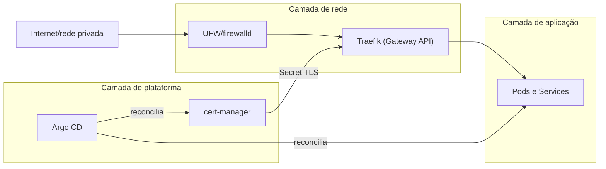
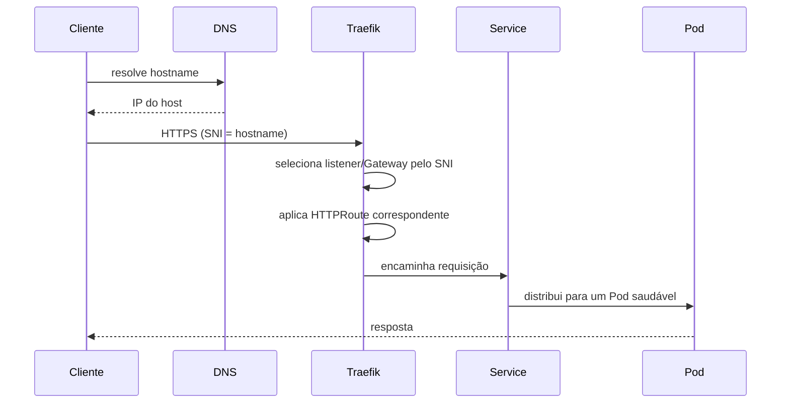
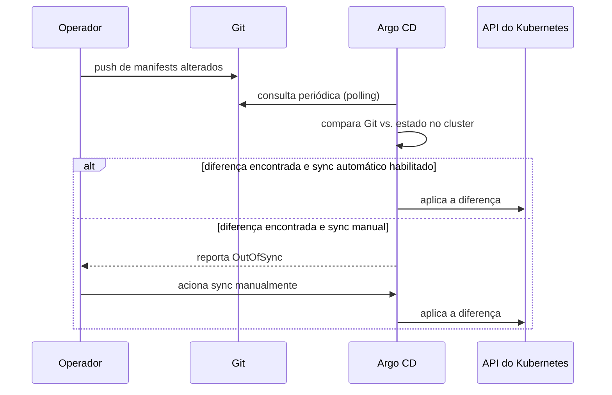

Este blueprint concentra control plane, workloads, ingress e entrega contínua em um único host. Esta página detalha as camadas dessa arquitetura; a visão de conjunto está em [visão geral do blueprint](../k3s-single-node-gitops/).

## Camadas

A camada de rede decide o que chega ao host e como o tráfego é roteado até um Service. A camada de plataforma fornece certificados e reconciliação declarativa para as duas camadas vizinhas. A camada de aplicação é o conjunto de workloads que o cluster existe para executar; este blueprint não prescreve quais.

## Fluxo de uma requisição publicada

O certificado usado no handshake TLS foi emitido antecipadamente pelo cert-manager e gravado como Secret referenciado pelo `Gateway`; a emissão não acontece no momento da requisição.

## Fluxo de reconciliação GitOps

O Argo CD roda dentro do mesmo cluster que gerencia: se a API ficar indisponível, a reconciliação para junto com o restante do cluster, e a recuperação segue o procedimento em [operação](../k3s-single-node-gitops/operations/), não um fluxo de auto-recuperação do próprio Argo CD.

## Fontes e leitura adicional

- [K3s: Architecture](https://docs.k3s.io/architecture): base da camada de control plane usada neste blueprint.
- [Arquitetura do K3s](../../../../learn/clusters/k3s-architecture/): explicação conceitual dos papéis de manager e agent referenciada por este blueprint.
