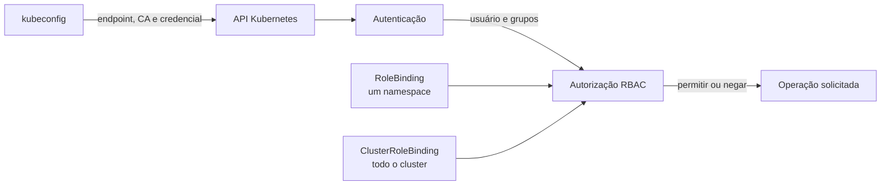

import ScriptHelper from '../../../../../components/ScriptHelper.astro';
import grantClusterAdminScript from '../../../../../scripts/grant-cluster-admin.sh?raw';
import grantNamespaceAccessScript from '../../../../../scripts/grant-namespace-access.sh?raw';
import createCustomRoleScript from '../../../../../scripts/create-custom-role.sh?raw';

Um kubeconfig não cria um usuário dentro do Kubernetes. Ele reúne o endereço e a CA do cluster, uma credencial e um contexto. Quando o cliente apresenta a credencial, a API primeiro autentica a identidade e depois consulta os autorizadores, como RBAC, para decidir se aquela identidade pode executar a operação solicitada. Kubernetes não possui objetos persistentes do tipo `User`; nomes de usuários e grupos são strings produzidas pelo mecanismo de autenticação e referenciadas por `RoleBinding` ou `ClusterRoleBinding`.



Neste guia, as identidades humanas individuais usam certificados X.509 de cliente emitidos pela API de `CertificateSigningRequest`. O `Common Name` (`CN`) do certificado torna-se o nome do usuário. O script não inclui organizações (`O`) no certificado e, portanto, não fixa grupos de autorização dentro da credencial; as permissões ficam explícitas e removíveis no RBAC.

Não emita certificados individuais com grupo `system:masters`. O kubeconfig administrativo do K3s usa `system:admin` e `system:masters` e possui acesso irrestrito, mas uma identidade administrativa comum pode receber o `ClusterRole` `cluster-admin` por `ClusterRoleBinding`. Assim, o binding pode ser removido sem compartilhar o kubeconfig mestre nem depender de um grupo privilegiado embutido no certificado.

## Criar um kubeconfig individual

O script [`scripts/kubernetes/create-client-kubeconfig.sh`](https://github.com/guesant/infrastructure-and-cluster-notebook/blob/main/scripts/kubernetes/create-client-kubeconfig.sh) usa o contexto administrativo atual para:

1. gerar uma chave privada local;
2. criar uma CSR com o nome individual no `CN`;
3. mostrar a identidade e pedir confirmação antes da aprovação;
4. solicitar um certificado de cliente com validade limitada;
5. montar um kubeconfig independente com certificado, chave e CA incorporados;
6. remover o objeto CSR depois de recuperar o certificado.

Ele não cria nenhum binding. Uma identidade recém-emitida autentica como membro de `system:authenticated`, mas não recebe automaticamente permissão para administrar workloads.

> **Executar em:** qualquer máquina com `KUBECONFIG` administrativo, `kubectl`, OpenSSL, acesso à API e permissão de escrita para o arquivo de saída.

```bash
curl -sfL \
  https://raw.githubusercontent.com/guesant/infrastructure-and-cluster-notebook/refs/heads/main/scripts/kubernetes/create-client-kubeconfig.sh \
  | bash -
```

Os prompts solicitam o nome da identidade, o endpoint acessível da API, a validade em segundos e o arquivo de saída. O valor padrão de 2.592.000 segundos corresponde a 30 dias; o signer pode reduzir a validade de acordo com a configuração máxima do cluster. Se o endpoint atual for `https://127.0.0.1:6443`, informe o DNS ou IP estável alcançável pela máquina que usará a credencial.

O arquivo gerado contém uma chave privada e deve permanecer com permissão `0600`. Entregue cada kubeconfig somente ao respectivo usuário por um canal seguro. Para pessoas em uma organização maior, prefira integrar o cluster a um provedor OIDC com login central, MFA e sessões curtas, em vez de administrar muitos certificados manualmente.

## Administrador de todo o cluster

O `ClusterRole` padrão `cluster-admin` permite qualquer operação em qualquer recurso e namespace. Vincule-o diretamente ao nome exato informado ao gerar a credencial:

<ScriptHelper
  runWhere="qualquer máquina com `KUBECONFIG` administrativo e acesso à API"
  script={grantClusterAdminScript}
  fields={[
    { var: 'USERNAME', label: 'Nome da identidade que será administradora' },
  ]}
/>

Use esse nível apenas para quem realmente administra o cluster inteiro. Um administrador total pode ler Secrets, alterar RBAC, executar Pods privilegiados e modificar os componentes que protegem o ambiente.

## Acesso limitado por namespace

Os `ClusterRoles` padrão podem ser associados por `RoleBinding` a somente um namespace:

| Papel | Escopo quando usado por RoleBinding | Observação importante |
| --- | --- | --- |
| `view` | Leitura da maioria dos recursos | Não permite ler Secrets nem alterar Roles e RoleBindings |
| `edit` | Leitura e alteração da maioria dos workloads | Pode ler Secrets e executar Pods usando ServiceAccounts do namespace |
| `admin` | Administração ampla do namespace | Pode criar Roles e RoleBindings no namespace, mas não alterar o próprio Namespace nem ResourceQuotas |

O bloco abaixo pergunta usuário, namespace e papel, cria ou atualiza o binding e mostra as permissões efetivas simuladas:

<ScriptHelper
  runWhere="qualquer máquina com `KUBECONFIG` administrativo e acesso à API"
  script={grantNamespaceAccessScript}
  fields={[
    { var: 'USERNAME', label: 'Nome da identidade' },
    { var: 'NAMESPACE', label: 'Namespace permitido' },
    { var: 'ACCESS_ROLE', label: 'Papel [view/edit/admin]', defaultValue: 'view' },
  ]}
/>

Repita o RoleBinding nos outros namespaces que a mesma pessoa deve acessar. Um RoleBinding nunca amplia o papel para os demais namespaces, mesmo quando referencia um ClusterRole.

## Permissões personalizadas

Quando `view` é insuficiente e `edit` é amplo demais, crie um `Role` contendo somente os recursos e verbos necessários. O exemplo interativo aceita listas separadas por vírgula e restringe o papel a um namespace:

<ScriptHelper
  runWhere="qualquer máquina com `KUBECONFIG` administrativo e acesso à API"
  script={createCustomRoleScript}
  fields={[
    { var: 'USERNAME', label: 'Nome da identidade' },
    { var: 'NAMESPACE', label: 'Namespace permitido' },
    { var: 'ROLE_NAME', label: 'Nome do papel personalizado' },
    { var: 'RESOURCES', label: 'Recursos', defaultValue: 'pods,services,configmaps,deployments.apps,statefulsets.apps' },
    { var: 'VERBS', label: 'Verbos', defaultValue: 'get,list,watch' },
  ]}
/>

Não adicione `secrets`, recursos RBAC, criação de Pods, `pods/exec`, impersonação ou recursos de segurança sem analisar caminhos de escalada. Permitir a criação ou alteração de Deployments, StatefulSets, DaemonSets, Jobs ou CronJobs também permite controlar o template dos Pods e pode aproveitar os ServiceAccounts disponíveis no namespace. Depois de testar a política, versione o `Role` e o `RoleBinding` no repositório GitOps para manter revisão e histórico.

## Revogar e validar o acesso

Para retirar o acesso administrativo total, exclua o ClusterRoleBinding criado para a identidade:

> **Executar em:** qualquer máquina com `KUBECONFIG` administrativo e acesso à API.

```bash
read -r -p "Nome do ClusterRoleBinding que será removido: " BINDING_NAME
kubectl delete clusterrolebinding "${BINDING_NAME}"
```

Para retirar um acesso limitado, exclua o RoleBinding no namespace correspondente:

> **Executar em:** qualquer máquina com `KUBECONFIG` administrativo e acesso à API.

```bash
read -r -p "Namespace do binding: " NAMESPACE
read -r -p "Nome do RoleBinding que será removido: " BINDING_NAME
kubectl --namespace "${NAMESPACE}" delete rolebinding "${BINDING_NAME}"
```

Confirme a autorização simulada pelo usuário e teste também usando o kubeconfig entregue:

> **Executar em:** qualquer máquina com `KUBECONFIG` administrativo e acesso à API.

```bash
read -r -p "Nome da identidade que será verificada: " USERNAME
read -r -p "Namespace que será verificado: " NAMESPACE

kubectl auth can-i --list \
  --namespace "${NAMESPACE}" \
  --as "${USERNAME}"
```

> **Executar em:** máquina que possui o kubeconfig individual e conectividade com a API.

```bash
read -r -p "Caminho do kubeconfig individual: " USER_KUBECONFIG
read -r -p "Namespace que será verificado: " NAMESPACE

kubectl \
  --kubeconfig "${USER_KUBECONFIG}" \
  auth can-i --list \
  --namespace "${NAMESPACE}"
```

Remover bindings interrompe as permissões fornecidas por eles, mas não invalida o certificado e não remove acessos concedidos por outros bindings. Kubernetes não oferece revogação de certificados de cliente: um certificado emitido continua autenticando até expirar. Em caso de comprometimento, remova imediatamente todos os bindings aplicáveis e verifique outros vínculos para o mesmo usuário; invalidar criptograficamente o certificado antes da expiração exige substituir a CA de clientes, uma operação ampla e disruptiva que afeta outras credenciais. Por isso, use certificados curtos e prefira OIDC quando precisar de revogação central, MFA e gestão frequente de usuários.

## Fontes e leitura adicional

- [Acesso ao cluster no K3s](https://docs.k3s.io/cluster-access): explica o kubeconfig administrativo, seus privilégios e o acesso externo com `kubectl`.
- [Autenticação no Kubernetes](https://kubernetes.io/docs/reference/access-authn-authz/authentication/#x509-client-certs): documenta identidades, grupos e certificados X.509 de cliente.
- [CertificateSigningRequest e signers](https://kubernetes.io/docs/reference/access-authn-authz/certificate-signing-requests/): detalha criação, aprovação, emissão e validade de certificados pela API.
- [Autorização](https://kubernetes.io/docs/reference/access-authn-authz/authorization/): apresenta a etapa posterior à autenticação e os modos de autorização disponíveis.
- [Autorização RBAC](https://kubernetes.io/docs/reference/access-authn-authz/rbac/): referência de `Role`, `ClusterRole`, bindings e papéis agregados padrão.
- [Boas práticas de RBAC](https://kubernetes.io/docs/concepts/security/rbac-good-practices/): cobre privilégio mínimo e riscos de escalada por workloads, Secrets, bindings e impersonação.
