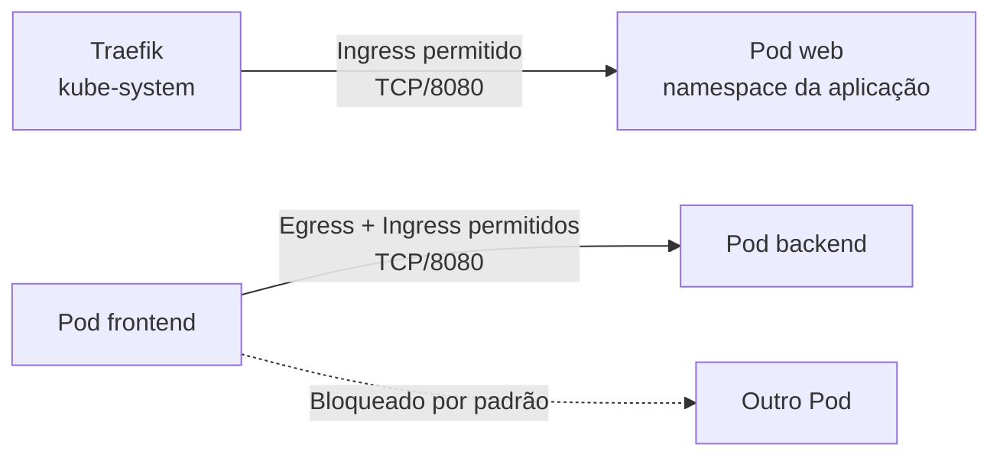

O modelo de rede Kubernetes permite comunicação entre Pods por padrão. Uma `NetworkPolicy` seleciona Pods por labels e determina quais conexões de entrada (`Ingress`) e saída (`Egress`) são aceitas nas camadas de rede e transporte. O K3s inclui um controller de NetworkPolicy baseado no kube-router; as políticas deixam de ser efetivas se o cluster for iniciado com `--disable-network-policy`.

As políticas são limitadas ao namespace em que existem e são aditivas. Um `default-deny-all` com `podSelector: {}` isola todos os Pods daquele namespace, enquanto outras políticas acrescentam fluxos permitidos. Para uma conexão entre dois Pods isolados funcionar, o egress da origem e o ingress do destino precisam permitir simultaneamente o protocolo e a porta.



O baseline mínimo normalmente contém:

| Política | Seleção | Permissão |
| --- | --- | --- |
| `default-deny-all` | Todos os Pods do namespace | Nenhuma; ativa isolamento de ingress e egress |
| `allow-dns` | Todos os Pods do namespace | Egress UDP/TCP 53 somente para CoreDNS |
| Fluxo de aplicação | Pods identificados por labels | Origem, destino, protocolo e porta necessários |
| Traefik para workload | Pods publicados | Ingress vindo apenas dos Pods Traefik na porta do workload |

Uma regra permitindo Traefik deve ser criada no namespace do workload publicado. Não crie isoladamente uma política egress selecionando Traefik em `kube-system`: a existência dessa política passaria a isolar o egress do Traefik e poderia interromper todas as rotas ainda não permitidas. Se os Pods Traefik não estiverem isolados para egress, basta liberar o ingress no destino.

## Hardening recomendado

Use namespaces diferentes para workloads com fronteiras de confiança diferentes e trate os labels referenciados pelas policies como parte do controle de segurança. Um **usuário** ou controller capaz de alterar os labels dos Pods pode fazê-los entrar ou sair de um seletor permitido; RBAC e revisão do Git precisam proteger tanto as NetworkPolicies quanto os Deployments que produzem esses Pods.

Evite permissões sem `from` ou `to`, `namespaceSelector: {}` e CIDRs globais como `0.0.0.0/0` e `::/0`. Policies são aditivas: uma regra ampla não pode ser anulada por uma regra mais restritiva. Prefira combinar no mesmo item um `namespaceSelector` com o label imutável `kubernetes.io/metadata.name` e um `podSelector` específico.

O fluxo GitOps usa um AppProject dedicado que autoriza somente o repositório configurado, os namespaces listados e recursos `NetworkPolicy`. A Application habilita `FailOnSharedResource=true`, mantém duas proteções contra prune automático e não cria namespaces. Proteja esses arquivos com revisão obrigatória, pois uma mudança pode interromper tráfego ou ampliar movimento lateral e egress de dados.

NetworkPolicy não é uma fronteira absoluta contra tráfego do nó ou Pods `hostNetwork`, não oferece controle L7 ou por FQDN, não cifra conexões e não registra obrigatoriamente decisões de allow/deny. Use firewall do host, RBAC, TLS/mTLS, Gateway ou service mesh e controles da aplicação conforme o risco. A documentação oficial também ressalta que o tráfego entre Pods é aberto e não cifrado por padrão em cenários multi-tenant.

O template [`templates/gitops/apps/security/network-policies`](https://github.com/guesant/infrastructure-and-cluster-notebook/tree/main/templates/gitops/apps/security/network-policies) oferece manifests independentes e um script que gera três tipos de configuração sem aplicar nada no cluster:

- `baseline`: deny de ingress/egress e liberação de DNS para um namespace;
- `flow`: egress na origem e ingress no destino para comunicação entre workloads isolados;
- `traefik`: ingress no workload para o tráfego encaminhado pelo Traefik.

Copie o template GitOps, entre no diretório e execute o gerador interativo:

> **Executar em:** estação administrativa, no repositório GitOps de destino.

```bash
read -r -p "Diretório do template GitOps [gitops]: " GITOPS_DIRECTORY
GITOPS_DIRECTORY="${GITOPS_DIRECTORY:-gitops}"

cd "${GITOPS_DIRECTORY}/apps/security/network-policies"
./generate.sh baseline
./generate.sh flow
./generate.sh traefik
```

Os arquivos são gravados em `manifests/<namespace>/`. Revise labels, portas e namespaces, valide em homologação e somente depois habilite `applications/network-policies-project.yaml.example` e `applications/network-policies.yaml.example` no App-of-Apps. Não aplique primeiro em namespaces de infraestrutura como `kube-system`, `cert-manager`, `longhorn-system` e `argocd`, pois DNS, webhooks, métricas, acesso à API e APIs externas precisarão de permissões explícitas.

Audite os namespaces já endurecidos. O script usa apenas operações de leitura e falha se não encontrar deny completo ou se detectar padrões amplos conhecidos:

> **Executar em:** qualquer máquina com `KUBECONFIG`, `kubectl`, Python 3 e acesso de leitura à API, no diretório `gitops/apps/security/network-policies`.

```bash
read -r -p "Namespace que será auditado: " NETWORK_POLICY_NAMESPACE
./audit.sh "${NETWORK_POLICY_NAMESPACE}"
```

NetworkPolicy não seleciona Services por nome e não interpreta hostnames, URLs HTTP ou identidades de usuário. Ela também não substitui TLS, autenticação, RBAC ou backups. Consulte também o [guia completo do template](https://github.com/guesant/infrastructure-and-cluster-notebook/blob/main/templates/gitops/apps/security/network-policies/README.md).

## Fontes e leitura adicional

- [Network Policies no Kubernetes](https://kubernetes.io/docs/concepts/services-networking/network-policies/): define isolamento, seleção de Pods, regras aditivas e o comportamento combinado de ingress e egress.
- [Multi-tenancy](https://kubernetes.io/docs/concepts/security/multi-tenancy/): contextualiza NetworkPolicy como um dos controles necessários para separar tenants e fronteiras de confiança.
- [Checklist de segurança do Kubernetes](https://kubernetes.io/docs/concepts/security/security-checklist/): reúne recomendações complementares para rede, RBAC, Pods, Secrets e exposição da API.
- [Network Policy Controller do K3s](https://docs.k3s.io/networking/networking-services#network-policy-controller): descreve o controller incluído no K3s, sua desativação e a limpeza das regras aplicadas.
