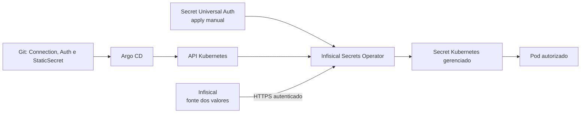

Os comandos desta página devem ser executados em um servidor ou em uma estação administrativa que tenha `kubectl`, Helm, acesso à API e um kubeconfig válido.

Um Secret Kubernetes codificado em base64 não está criptografado e não deve ser commitado em claro. Neste modelo, os valores ficam no Infisical; o Git contém apenas recursos declarativos que indicam qual projeto, ambiente e caminho devem ser sincronizados. O Infisical Secrets Operator autentica uma Machine Identity, busca os valores e mantém um Secret Kubernetes atualizado.



O template [`templates/gitops/apps/security/infisical-secrets`](https://github.com/guesant/infrastructure-and-cluster-notebook/tree/main/templates/gitops/apps/security/infisical-secrets) usa a API recomendada `v1beta1`, com `InfisicalConnection`, `InfisicalAuth` e `InfisicalStaticSecret`. O único objeto Kubernetes sensível criado manualmente é um Secret de bootstrap com o `clientId` e o `clientSecret` de uma Machine Identity Universal Auth. Esse Secret não entra no Git nem é administrado pelo Argo CD.

O fluxo recomendado é:

1. Criar no Infisical uma Machine Identity Universal Auth com leitura limitada ao projeto, ambiente e caminho necessários.
2. Manter inicialmente somente `applications/infisical-secrets-operator.yaml` no diretório observado pelo `root` e aguardar o operator e seus CRDs.
3. Executar o script de bootstrap para aplicar manualmente `infisical-operator-system/universal-auth-credentials`.
4. Personalizar conexão, autenticação, origem e destino dos segredos.
5. Adicionar `applications/infisical-secrets-example.yaml` e verificar o estado dos CRDs sem imprimir os valores do Secret.

> **Executar em:** qualquer máquina com `KUBECONFIG` administrativo e acesso à API, no diretório `gitops/apps/security/infisical-secrets` do repositório de destino.

```bash
./bootstrap-secret.sh
```

O operator do exemplo é instalado em modo cluster-wide porque precisa sincronizar Secrets em namespaces de aplicações. Em ambientes multi-tenant, avalie `scopedNamespaces` e `scopedRBAC`, restrinja o RBAC e use uma Machine Identity diferente por fronteira de acesso. Universal Auth minimiza o bootstrap, mas mantém uma credencial estática no cluster; rotacione-a e revogue a anterior depois de validar a nova. O Infisical recomenda Kubernetes Auth com tokens curtos quando a configuração adicional do TokenReview é aceitável.

Os valores sincronizados continuam existindo como Secrets na API Kubernetes. As instalações novas deste guia habilitam `secrets-encryption: true`; em clusters existentes, confirme `k3s secrets-encrypt status`, limite leitura de Secrets por RBAC e nunca imprima `data`, `stringData` ou credenciais em logs. Com NetworkPolicy default-deny, permita explicitamente o egress HTTPS do operator até a API Infisical e o acesso necessário à API Kubernetes.

:::caution
A documentação atual do Infisical lista Kubernetes 1.29 a 1.33 como suportados pelo operator. O K3s 1.36 sugerido neste guia está fora dessa matriz declarada; valide a combinação em homologação ou use versões oficialmente compatíveis antes de produção.
:::

## Fontes e leitura adicional

- [Infisical Secrets Operator](https://infisical.com/docs/integrations/platforms/kubernetes/overview): apresenta arquitetura, requisitos e fluxo de sincronização do operator.
- [`InfisicalAuth`](https://infisical.com/docs/integrations/platforms/kubernetes/infisical-auth-crd): referência oficial dos métodos e campos de autenticação disponíveis.
- [`InfisicalStaticSecret`](https://infisical.com/docs/integrations/platforms/kubernetes/infisical-static-secret-crd): documenta origem, destino, ressincronização e comportamento do Secret gerenciado.
- [Universal Auth](https://infisical.com/docs/documentation/platform/identities/universal-auth): explica a credencial de bootstrap usada pelo exemplo e seu ciclo de vida.
- [K3s: Criptografia de Secrets](https://docs.k3s.io/cli/secrets-encrypt): documenta habilitação, estado e rotação da criptografia no datastore.
- [Kubernetes: Boas práticas para Secrets](https://kubernetes.io/docs/concepts/security/secrets-good-practices/): reúne controles de acesso, criptografia e precauções no uso de Secrets.
