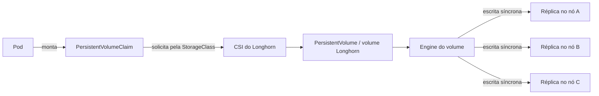

import ScriptHelper from '../../../../../components/ScriptHelper.astro';
import installLonghornPreflightScript from '../../../../../scripts/install-longhorn-preflight.sh?raw';
import installLonghornScript from '../../../../../scripts/install-longhorn.sh?raw';

Os comandos desta página devem ser executados em um servidor ou em uma estação administrativa que tenha `kubectl`, Helm, acesso à API e um kubeconfig válido.

## Como o Longhorn fornece armazenamento

Containers e Pods são substituíveis; os dados que precisam sobreviver a essa substituição devem ficar em armazenamento persistente. No Kubernetes, uma aplicação cria um `PersistentVolumeClaim` (PVC) para solicitar capacidade e características de armazenamento. Uma `StorageClass` indica qual provisionador atende à solicitação, e o provisionador cria um `PersistentVolume` (PV) que é associado ao PVC.

Longhorn é um sistema de armazenamento distribuído em blocos e um provisionador CSI para Kubernetes. Para cada volume, ele executa um engine associado ao workload e mantém réplicas síncronas em discos elegíveis, preferencialmente em nós diferentes. Se uma réplica fica indisponível e ainda há uma cópia saudável, o Longhorn pode reconstruí-la em outro local.



O provisionador `local-storage` foi desabilitado na configuração K3s deste guia para que ele não se torne acidentalmente a classe padrão: seus dados ficam vinculados ao disco de um único nó e não recebem replicação Longhorn. Replicação, contudo, não é backup. Exclusão acidental, corrupção lógica ou credenciais comprometidas podem afetar todas as réplicas; mantenha backups em um destino independente do cluster e valide RPO, RTO e restauração pelo [guia de backup e recuperação](../../../../operations/backups/backup-and-recovery/). Referência: [arquitetura e conceitos do Longhorn](https://longhorn.io/docs/1.12.0/concepts/).

Consulte os [requisitos do Longhorn 1.12.0](https://longhorn.io/docs/1.12.0/deploy/install/) antes de preparar os nós. Todos os nós que receberão volumes precisam cumprir os requisitos.

## Dependências dos nós

Em Debian e Ubuntu:

> **Executar em:** cada nó manager ou agent que armazenará volumes Longhorn, como `root`.

```bash
apt-get update
apt-get install --yes \
  bash \
  cryptsetup \
  curl \
  dmsetup \
  gawk \
  grep \
  nfs-common \
  open-iscsi \
  util-linux

systemctl enable --now iscsid.socket
systemctl start iscsid.service
```

`findmnt`, `blkid` e `lsblk` são fornecidos por `util-linux`; não instale `findmnt` como se fosse um pacote separado.

Carregue os módulos usados pelo engine V1 e por volumes criptografados:

> **Executar em:** cada nó manager ou agent que armazenará volumes Longhorn, como `root`.

```bash
modprobe iscsi_tcp
modprobe nfs
modprobe dm_crypt
```

Persista os módulos para os próximos boots:

> **Executar em:** cada nó manager ou agent que armazenará volumes Longhorn, como `root`.

```bash
cat >/etc/modules-load.d/longhorn.conf <<'EOF'
nfs
dm_crypt
iscsi_tcp
EOF
```

Valide cada nó antes de instalar o chart:

> **Executar em:** qualquer máquina com `KUBECONFIG`, acesso à API e `longhornctl`.

```bash
longhornctl check preflight
```

Se optar pelo instalador automático de dependências, revise o impacto e fixe a imagem na mesma versão:

<ScriptHelper
  runWhere="qualquer máquina com `KUBECONFIG`, acesso administrativo à API e `longhornctl`"
  script={installLonghornPreflightScript}
  fields={[
    { var: 'LONGHORN_VERSION', label: 'Versão da imagem longhorn-cli', defaultValue: 'v1.12.0' },
  ]}
/>

## Instalação

<ScriptHelper
  runWhere="qualquer máquina com `KUBECONFIG`, Helm e acesso administrativo à API"
  script={installLonghornScript}
  fields={[
    { var: 'LONGHORN_VERSION', label: 'Versão do chart Longhorn', defaultValue: '1.12.0' },
  ]}
/>

Valide a instalação:

> **Executar em:** qualquer máquina com `KUBECONFIG`, acesso à API e `longhornctl`.

```bash
kubectl --namespace longhorn-system get pods
kubectl --namespace longhorn-system get daemonsets
helm --namespace longhorn-system status longhorn
longhornctl check preflight
```

## Acesso à interface

Quando `kubectl` e o kubeconfig estiverem na estação local:

> **Executar em:** estação administrativa com `KUBECONFIG` e acesso à API.

```bash
read -r -p "Porta local para a interface do Longhorn [8080]: " LOCAL_PORT
LOCAL_PORT="${LOCAL_PORT:-8080}"

kubectl --namespace longhorn-system \
  port-forward service/longhorn-frontend "${LOCAL_PORT}:80"
```

Acesse `http://127.0.0.1:PORTA_LOCAL` enquanto o comando estiver em execução, substituindo `PORTA_LOCAL` pelo valor informado.

Quando o port-forward precisar rodar em um manager, execute nele:

> **Executar em:** nó manager com `KUBECONFIG` e acesso à API.

```bash
read -r -p "Porta no manager para a interface do Longhorn [8080]: " MANAGER_PORT
MANAGER_PORT="${MANAGER_PORT:-8080}"

kubectl --namespace longhorn-system \
  port-forward service/longhorn-frontend "${MANAGER_PORT}:80"
```

Em outro terminal da estação, crie o túnel:

> **Executar em:** estação administrativa com acesso SSH ao nó que executa o port-forward.

import setupLonghornTunnelScript from '../../../../../scripts/setup-longhorn-ssh-tunnel.sh?raw';

<ScriptHelper
  script={setupLonghornTunnelScript}
  fields={[
    { var: 'SSH_USER', label: 'Usuário SSH' },
    { var: 'SSH_HOST', label: 'Host ou IP do manager' },
    { var: 'MANAGER_PORT', label: 'Porta do port-forward no manager', defaultValue: '8080' },
    { var: 'LOCAL_PORT', label: 'Porta nesta máquina', defaultValue: '8080' },
  ]}
/>

O túnel depende de encaminhamento SSH; ele não funcionará se `DisableForwarding yes` estiver ativo no servidor.

:::danger
Antes de atualizar ou remover o Longhorn, confirme a saúde das réplicas, o destino de backup e o procedimento específico da versão. A remoção incorreta pode causar perda de dados.
:::

## Fontes e leitura adicional

- [Longhorn: Arquitetura e conceitos (1.12.0)](https://longhorn.io/docs/1.12.0/concepts/): fundamenta engines, réplicas, CSI, snapshots e armazenamento secundário.
- [Longhorn: Requisitos e instalação (1.12.0)](https://longhorn.io/docs/1.12.0/deploy/install/): lista sistemas suportados, dependências dos nós e métodos oficiais de instalação.
- [Longhorn: `longhornctl`](https://longhorn.io/docs/1.12.0/advanced-resources/longhornctl/): documenta os comandos de preflight, operação, recuperação e diagnóstico usados nesta página.
- [Longhorn: Backup e restauração](https://longhorn.io/docs/1.12.0/snapshots-and-backups/backup-and-restore/): orienta a configuração do destino, a criação de backups e a restauração de volumes.
- [Longhorn: Boas práticas](https://longhorn.io/docs/1.12.0/best-practices/): reúne recomendações de réplicas, discos, capacidade, desempenho e operação.
