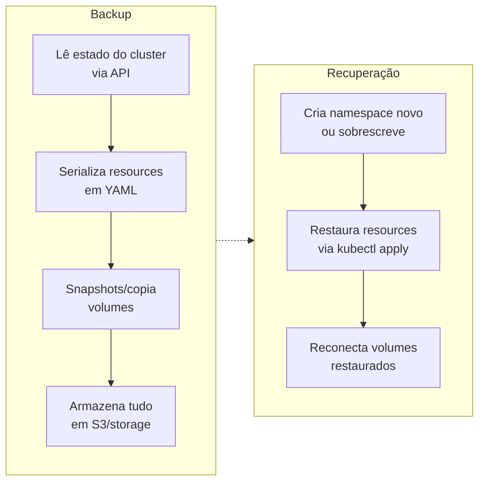

> **Para quem é:** operadores de clusters Kubernetes que precisam de backup de estado do cluster + workloads (PVCs).

Velero é um backup automático para Kubernetes e volumes persistentes. Diferente de um snapshot de etcd (que cobre o estado da API), Velero também cobre:

- Dados de volumes (PVCs) — replicados ou snapshotados no storage provider.
- Manifests de resources (Deployments, Services, etc.) — via serialização de objetos API.
- Namespaces completos.
- Integração com provedores (AWS S3, GCP, Azure Blob, MinIO).

## Como funciona

## Diferença: etcd snapshot vs. Velero

| Aspecto | etcd snapshot | Velero |
| --- | --- | --- |
| **O que cobre** | API state (etcd) | API state + volumes + workload data |
| **Granularidade** | Cluster inteiro | Cluster, namespace, resource |
| **Volume data** | Não | Sim (snapshot ou cópia) |
| **Restore** | Cluster inteiro | Seletivo (restaurar 1 namespace) |
| **Portabilidade** | Etcd-específico | Kubernetes-agnóstico |
| **RTO/RPO** | Rápido (segundos) | Mais lento (minutos) |

## Quando usar Velero

- Backup de **workloads específicos** (não precisa backup de tudo).
- **Recuperação seletiva** — restaurar só 1 namespace sem afetar o resto.
- **Migração de cluster** — mover aplicação K3s → EKS.
- **Replicação geográfica** — backups em múltiplas regiões.
- **Conformidade** — manter snapshots de versões de aplicação.

## Quando **não** usar Velero (use etcd snapshot)

- Recuperação rápida de quorum perdido (segundos vs. minutos).
- Cluster pequeno sem volumes.
- RTO crítico (<1 minuto).

## Provedores suportados

Velero fala com provedores via plugins:

- **AWS S3** — nativo, S3 + EBS snapshots.
- **GCP** — GCS + GCE snapshots.
- **Azure** — Blob Storage + Azure Disks.
- **MinIO** — S3-compatível, on-prem.
- **Longhorn** — snapshots de volumes Longhorn.
- **Velero Uploader** — upload de volume para S3 (alternativa a snapshot).

## Trade-offs

**Vantagens:**

- Backup granular (não é tudo ou nada).
- Restore seletivo.
- Integração com diferentes provedores.
- Histórico de backups.

**Desvantagens:**

- Mais complexo que etcd snapshot.
- Depende de storage externo (custo).
- Restore é mais lento.
- Requer plugin para cada provider.

## Próximas seções

- [Instalar e configurar Velero](../../../guides/tasks/backup/install-velero/) — setup com MinIO ou cloud provider.
- [Backup automático com Velero](../../../operations/backups/setup-velero-backups/) — agendamento e retenção.

## Referências

- [Velero documentation](https://velero.io/docs/): documentação oficial.
- [Velero plugins](https://velero.io/plugins/): lista de providers.
