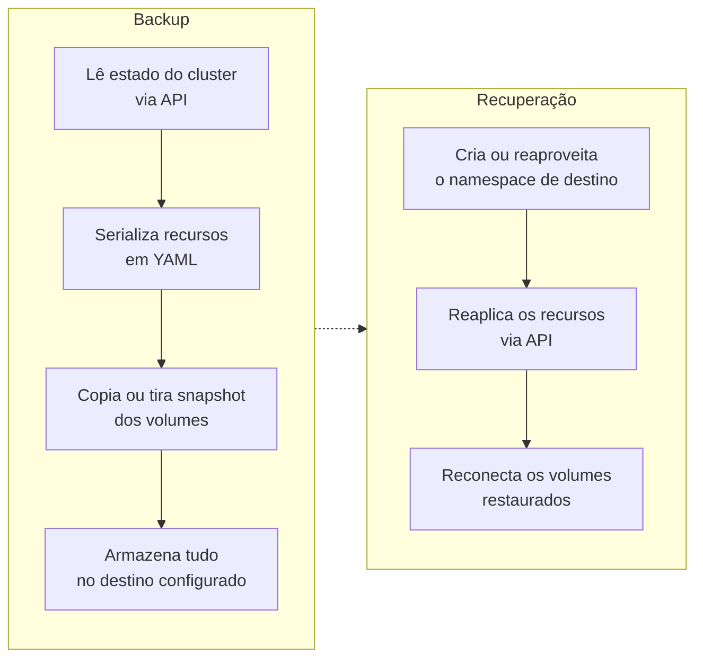

> **Para quem é:** operadores que já conhecem o snapshot do etcd e precisam decidir se também precisam do Velero para cobrir volumes e workloads.

Um snapshot do etcd cobre apenas o estado declarado da API Kubernetes (veja [estado do cluster versus dados de aplicação](../../backups/cluster-state-vs-application-data/)). O Velero cobre uma camada adicional: ele lê os manifests dos recursos via API, os serializa e, quando configurado para isso, também copia ou tira snapshot dos dados dentro dos volumes persistentes referenciados por esses recursos.

## Como funciona

A granularidade é a diferença prática mais relevante: um snapshot do etcd restaura o cluster inteiro de uma vez, enquanto o Velero pode restaurar um único namespace ou um subconjunto de recursos selecionado por label, sem tocar no restante do cluster.

| Aspecto | Snapshot do etcd | Velero |
| --- | --- | --- |
| O que cobre | Estado da API (etcd) | Estado da API, mais volumes e dados de workload quando configurado |
| Granularidade | Cluster inteiro | Cluster, namespace ou recurso individual |
| Dados de volume | Não | Sim, via snapshot do storage ou File System Backup |
| Restauração seletiva | Não | Sim |
| Portabilidade | Específica do formato do etcd | Agnóstica de distribuição Kubernetes |

## Quando o Velero é necessário

Sempre que a recuperação precisa ser seletiva (restaurar um namespace sem afetar o resto do cluster), envolver dados de volumes persistentes, ou servir como base para migrar workloads entre clusters ou distribuições diferentes (por exemplo, de K3s para outra distribuição). Veja [instalar e configurar o Velero](../../../guides/tasks/backup/install-velero/) para o procedimento.

## Quando o snapshot do etcd é suficiente

Para um cluster sem volumes persistentes relevantes, onde o objetivo é recuperar o cluster inteiro de uma vez após uma falha do control plane. O snapshot do etcd também é o caminho mais direto quando a recuperação não precisa ser seletiva: restaurá-lo já recompõe todo o estado da API de uma vez, sem a etapa adicional de reaplicar recursos e reconectar volumes que o Velero exige.

## Provedores e mecanismos de volume

O Velero separa duas responsabilidades por meio de plugins diferentes, e confundi-las é uma fonte comum de configuração incorreta. Um **provider de BackupStorageLocation** é para onde os manifests serializados (e, dependendo do mecanismo escolhido, os próprios dados de volume) são enviados: object storage compatível com S3, como AWS S3, GCS, Azure Blob ou MinIO on-premises. Um **provider de VolumeSnapshotLocation** é quem sabe tirar um snapshot nativo de um volume em um storage específico, como os snapshots CSI do Longhorn ou os snapshots de disco de um provedor de nuvem.

Quando o storage de volumes não oferece snapshot nativo integrável, o Velero oferece uma terceira opção: o File System Backup (mecanismo baseado em Kopia, habilitado com a flag `--default-volumes-to-fs-backup` na instalação, veja [instalar o Velero](../../../guides/tasks/backup/install-velero/)), que copia o conteúdo do volume arquivo por arquivo em vez de depender de um snapshot do storage. Ele funciona com qualquer backend de armazenamento persistente, ao custo de ser mais lento que um snapshot nativo.

## Decisões que isso implica

Adotar o Velero soma uma dependência de storage externo (o destino do backup) e um mecanismo de volume adicional para manter testado, sobre o que o snapshot do etcd já oferece. Isso só compensa quando a granularidade de restauração seletiva, a cobertura de volumes, ou a portabilidade entre clusters realmente importam para o ambiente; caso contrário, o snapshot do etcd sozinho é mais simples de operar e de testar. Veja [testes de restauração](../../backups/restore-testing/) para validar qualquer uma das duas estratégias na prática.

## Páginas relacionadas

- [Fundamentos de backup](../../backups/backup-fundamentals/)
- [Estado do cluster versus dados de aplicação](../../backups/cluster-state-vs-application-data/)
- [Instalar e configurar o Velero](../../../guides/tasks/backup/install-velero/)
- [Backup automático com Velero](../../../operations/backups/setup-velero-backups/)

## Referências

- [Velero: documentação oficial](https://velero.io/docs/): arquitetura, backup, restauração e configuração.
- [Velero: plugins](https://velero.io/plugins/): lista de providers de BackupStorageLocation e VolumeSnapshotLocation.
