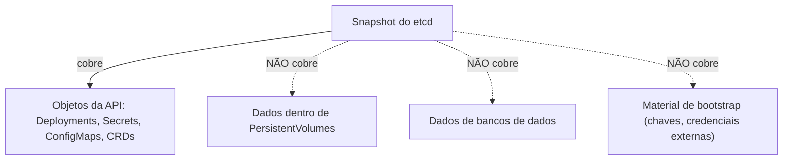

> **Para quem é:** quem já configurou snapshot do etcd e presume, incorretamente, que isso já cobre o backup do cluster inteiro.

Um erro comum é tratar o snapshot do etcd como "o backup do cluster": ele protege apenas um tipo de dado, entre vários que um cluster real acumula.

## Como funciona

O etcd armazena o **estado declarado da API Kubernetes**: objetos, ConfigMaps, Secrets, metadados. Ele não armazena o conteúdo de um `PersistentVolume`, nem dados de um banco de dados (que vivem dentro do volume, não no etcd), nem imagens de containers.

Um cluster completo tem pelo menos quatro categorias de dado que precisam de estratégias de backup próprias: estado da API (etcd), dados de volumes (Longhorn), dados de bancos de dados (PostgreSQL/CloudNativePG), e material de bootstrap que vive fora do cluster por design (chaves age, credenciais de secret store).

## Alternativas

Para um cluster sem volumes persistentes nem bancos de dados, o snapshot do etcd realmente cobre a maior parte do estado, mas essa é a exceção, não a regra, para qualquer cluster que executa aplicações reais.

## Quando o snapshot do etcd é suficiente

Apenas para clusters que não têm PVCs nem bancos de dados: um cenário raro além de laboratórios muito simples.

## Quando não é suficiente

Assim que qualquer workload usa armazenamento persistente ou um banco de dados, o que inclui a maioria dos cenários cobertos por este notebook a partir da Fase 4.

## Decisões que isso implica

Cada categoria de dado precisa de sua própria linha na matriz de proteção (veja [backup e recuperação](../../../operations/backups/backup-and-recovery/#modelo-de-matriz-de-proteção)), com RPO, RTO, frequência e teste de restauração próprios.

## Páginas relacionadas

- [Fundamentos de backup](../backup-fundamentals/)
- [Backup do etcd](../../../operations/backups/backup-k3s-etcd/)
- [Backup de volumes Longhorn](../../../operations/backups/backup-longhorn-volumes/)
- [Backup do PostgreSQL](../../../operations/backups/backup-postgresql/)

## Referências

- [K3s: Backup and Restore](https://docs.k3s.io/datastore/backup-restore): confirma o escopo exato do snapshot do etcd.
