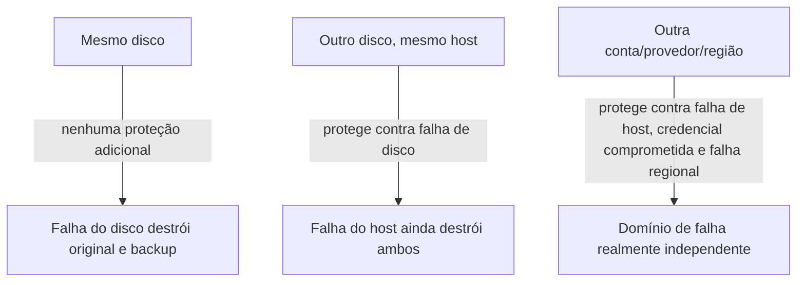

> **Para quem é:** quem já tem backups configurados e quer confirmar se eles realmente sobrevivem à perda do cluster inteiro.

Um backup que permanece no mesmo host, mesma conta, ou mesmo storage do dado original está sujeito ao mesmo evento que poderia destruir o original: não é, na prática, um backup independente.

## Como funciona

"Fora do cluster" precisa ser avaliado por domínio de falha real, não apenas por localização nominal:

Um "outro bucket" na mesma conta de object storage não é isolamento suficiente contra uma credencial administrativa comprometida: quem tem acesso a um bucket geralmente tem acesso ao outro. Contas, projetos ou provedores separados isolam melhor contra esse cenário específico.

## Alternativas

Para ambientes pessoais sem orçamento para uma segunda conta/provedor, um disco externo físico, mantido desconectado entre backups, é um isolamento mínimo aceitável contra falha do host, desde que genuinamente guardado em outro local físico.

## Quando o isolamento mínimo (outro disco) é suficiente

Proteção apenas contra falha de disco isolada, não contra perda do host inteiro nem comprometimento de credenciais.

## Quando isolamento total (outra conta/local físico) é necessário

Sempre que o cenário de recuperação inclui perda completa do host, comprometimento de credenciais administrativas, ou exigências de conformidade que pedem separação de domínio.

## Decisões que isso implica

Avalie o destino real dos backups do etcd, do Longhorn e do PostgreSQL configurados neste notebook contra esse critério; veja [destino e controles de segurança](../../../operations/backups/backup-and-recovery/#destino-e-controles-de-segurança) para a checklist completa.

## Páginas relacionadas

- [Fundamentos de backup](../backup-fundamentals/)
- [Estratégias de retenção](../retention-strategies/)
- [Backup e recuperação (runbook completo)](../../../operations/backups/backup-and-recovery/)

## Referências

- [K3s: `etcd-snapshot`](https://docs.k3s.io/cli/etcd-snapshot): documenta o envio de snapshots para storage compatível com S3 externo ao host.
