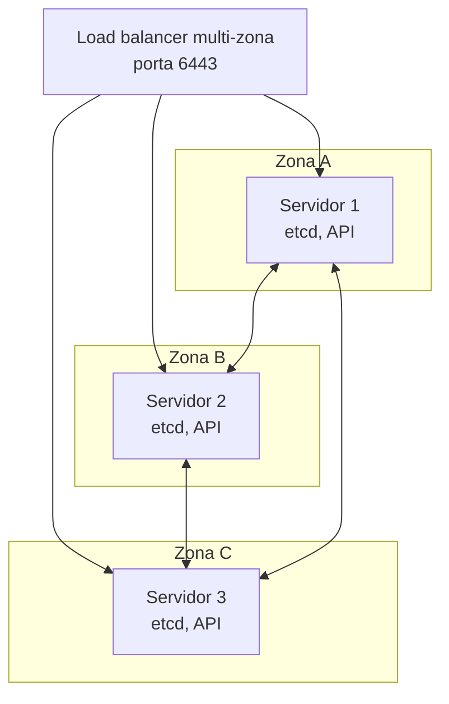

> **Para quem é:** operadores com um cluster K3s multinó já funcionando (veja o [blueprint K3s multinó](../../../guides/blueprints/k3s-multinode/)) que precisam de resiliência além da perda de um único servidor.

Um cluster K3s multinó com três ou mais servidores (veja [quorum em clusters distribuídos](../quorum/)) já tolera a perda de um servidor sem interrupção. Alta disponibilidade avançada vai além disso: tolera a perda de um datacenter ou zona inteira, remove o endpoint único da API como ponto de falha, e desacopla o datastore do ciclo de vida dos próprios servidores K3s. Nenhum desses três pontos é coberto pelas páginas de instalação padrão deste notebook; esta página explica o que cada um resolve e por que a maioria dos clusters não precisa deles.

## Distribuição geográfica dos servidores

Em um cluster multinó comum, os três servidores tipicamente ficam na mesma rede local ou no mesmo datacenter: perder o datacenter inteiro (energia, rede, ou o provedor de nuvem) derruba o cluster mesmo com quorum interno saudável. Distribuir os servidores entre zonas ou datacenters diferentes, com um load balancer multi-zona na frente do endpoint da API, remove esse domínio de falha único:

Perder a zona A inteira ainda deixa quorum entre B e C (dois de três), então o cluster continua operando. O custo dessa topologia é a latência de replicação do etcd entre zonas fisicamente distantes: o algoritmo Raft usado pelo etcd exige confirmação da maioria antes de cada escrita, então zonas com latência de rede alta entre si tornam cada escrita mais lenta. Essa topologia só compensa quando a infraestrutura já opera em múltiplas zonas ou datacenters; replicar um cluster de laboratório entre duas VPCs só para simular HA multi-zona adiciona complexidade sem o benefício real de isolamento físico.

## Load balancer na frente da API

Sem um load balancer, o kubeconfig aponta para o endereço de um único servidor (`server: https://k3s-1:6443`), que volta a ser um ponto único de falha mesmo em um cluster com três servidores saudáveis: perder exatamente esse servidor interrompe o acesso administrativo, ainda que o cluster continue funcionando internamente. Um load balancer de camada 4 na frente dos três servidores (um balanceador do provedor de nuvem, ou Nginx/HAProxy com um IP flutuante em ambientes on-premises) redireciona o kubeconfig e os agents para qualquer servidor saudável, eliminando esse ponto único sem afetar o quorum do etcd, que continua sendo um mecanismo separado entre os próprios servidores.

## Datastore desacoplado do control plane

O etcd embarcado do K3s liga o quorum de dados ao número de servidores em execução (veja [etcd embarcado versus datastore externo](../embedded-vs-external-datastore/) para o trade-off completo). Um datastore externo replicado (PostgreSQL em modo HA, ou um cluster etcd dedicado fora dos servidores K3s) desacopla essas duas responsabilidades: os servidores K3s passam a ser stateless, e a resiliência do datastore é gerenciada separadamente, com suas próprias ferramentas de failover (Patroni, para PostgreSQL, por exemplo). Isso soma uma segunda superfície de operação a manter, então normalmente só compensa quando o datastore externo já é operado por uma equipe dedicada ou uma oferta gerenciada.

## Backup permanece obrigatório

Nenhuma das três medidas acima substitui backup: elas reduzem a chance de indisponibilidade por falha de infraestrutura, não protegem contra um erro lógico (exclusão acidental, corrupção, um `kubectl delete` no namespace errado). Continue com o snapshot do etcd e, para dados de workloads e volumes, o [Velero](../../backup/velero-overview/), independentemente de qual topologia de HA for adotada.

## Quando adotar HA avançada

Quando o cluster precisa sobreviver à perda de um datacenter inteiro, não apenas de um servidor, ou quando o SLA contratado com os usuários do cluster já exige esse nível de tolerância. Para a maioria dos clusters de equipe pequena ou de laboratório, o quorum de três servidores na mesma rede já cobre o cenário de falha mais provável (perda de uma máquina), e a complexidade operacional adicional de distribuir zonas, gerenciar um load balancer dedicado e operar um datastore externo raramente se paga.

## Tópicos relacionados

- [Quorum em clusters distribuídos](../quorum/): a base para entender por que perder mais da metade dos servidores é o cenário que qualquer topologia de HA precisa evitar.
- [etcd embarcado versus datastore externo](../embedded-vs-external-datastore/): o trade-off central por trás de desacoplar o datastore do control plane.
- [Blueprint K3s multinó](../../../guides/blueprints/k3s-multinode/): a topologia de HA básica (três servidores, mesma rede) que esta página assume como ponto de partida.

## Fontes e leitura adicional

- [K3s: High Availability with Embedded DB](https://docs.k3s.io/datastore/ha-embedded): referência oficial de HA com etcd embarcado.
- [etcd: Clustering Guide](https://etcd.io/docs/v3.5/op-guide/clustering/): configuração de um cluster etcd, incluindo topologias distribuídas.
- [Velero: documentação oficial](https://velero.io/docs/): backup de workloads e volumes, complementar a qualquer topologia de HA.
