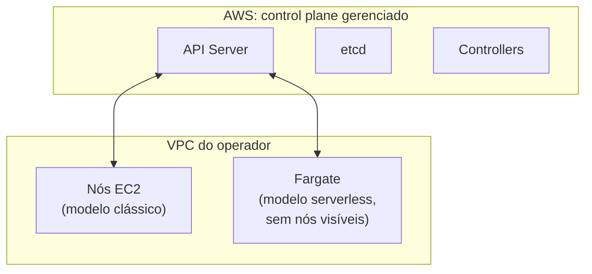

> **Para quem é:** equipes na AWS avaliando se compensa parar de manter o control plane do próprio cluster.

Amazon EKS (Elastic Kubernetes Service) é Kubernetes padrão com o control plane operado pela AWS. A API que uma aplicação ou um operador usa é a mesma de qualquer outra distribuição; a diferença está em quem mantém a API Server, o etcd e os controllers no ar.

## O que muda de responsabilidade

A AWS assume o control plane (API Server, etcd, controllers), a emissão e renovação dos certificados internos, os patches de versão e os backups do etcd. O operador continua responsável pelos worker nodes (EC2, Fargate, ou uma combinação dos dois), pelo CNI escolhido (Flannel, Cilium, Calico), pelas aplicações e por sua própria configuração de rede dentro da VPC.

| Aspecto | K3s | RKE2 | EKS |
| --- | --- | --- | --- |
| Setup | Segundos | Minutos | Minutos, via console ou `eksctl` |
| Infraestrutura | VMs geridas pelo operador | VMs geridas pelo operador | Control plane gerido pela AWS |
| Escala | Centenas de nós | Milhares de nós | Sem limite prático imposto pela distribuição |
| Compliance | Nenhuma certificação nativa | CIS, FIPS | CIS, FedRAMP, HIPAA, conforme a região e configuração |
| Portabilidade | Total | Total | Preso ao ecossistema AWS (EC2, IAM, RDS) |

## Quando EKS compensa

Quando a equipe já opera na AWS e quer delegar o control plane em vez de mantê-lo, quando o ambiente precisa de um SLA formal sobre a disponibilidade da API, quando a certificação de compliance nativa da AWS já cobre o requisito regulatório do ambiente, ou quando a integração entre RBAC e IAM simplifica a gestão de acesso de uma equipe pequena sem especialista dedicado em Kubernetes.

## Quando EKS não é a escolha certa

Quando o ambiente precisa ser portável entre provedores de nuvem (K3s e RKE2 não têm esse acoplamento), quando evitar lock-in com a AWS é uma prioridade arquitetural, quando o orçamento não comporta o custo fixo do control plane gerenciado além do custo dos nós, ou quando o ambiente é inteiramente on-premises, já que o EKS depende da infraestrutura da AWS por definição.

## Arquitetura



Nós EC2 oferecem controle total sobre o hardware subjacente, com custo fixo independente de uso; Fargate cobra por recurso efetivamente consumido, sem expor a máquina virtual por trás do Pod, o que favorece cargas em lote, ambientes de desenvolvimento e workloads com picos irregulares de demanda.

## Provisionar um cluster

> **Executar em:** estação administrativa com `eksctl` e credenciais AWS configuradas.

```bash
eksctl create cluster --name my-cluster --region us-east-1
aws eks update-kubeconfig --region us-east-1 --name my-cluster
kubectl apply -f app.yaml
```

## Integração com o ecossistema AWS

O EKS se integra nativamente com IAM (RBAC ligado a roles da AWS), ECR (registry de imagens), RDS (bancos de dados gerenciados fora do cluster), Secrets Manager, CloudWatch (logs e métricas centralizados) e o Application Load Balancer da AWS como ingress nativo. Essa integração é o principal argumento a favor do EKS para equipes já profundamente investidas no ecossistema AWS; é também o principal fator de lock-in para quem valoriza portabilidade.

## Custo

O EKS cobra uma taxa fixa por hora pelo control plane, além do custo normal dos nós EC2 ou Fargate e da transferência de dados. Os valores mudam com frequência e variam por região; consulte a [calculadora oficial de preços do EKS](https://aws.amazon.com/eks/pricing/) para uma estimativa atual em vez de confiar em números fixados neste texto. Esse custo do control plane é o principal trade-off financeiro frente a um cluster self-hosted como K3s: o operador paga pela conveniência de não operar o control plane, não apenas pelos nós.

## Próximas seções

- [RKE2 vs. K3s](../rke2-vs-k3s/): compara as duas opções self-hosted deste notebook entre si.
- [Kubernetes gerenciado vs. self-hosted](../managed-vs-selfhosted/): aprofunda a decisão entre delegar o control plane ou operá-lo, usando o EKS como exemplo de opção gerenciada.

## Referências

- [AWS: documentação do EKS](https://docs.aws.amazon.com/eks/): guia oficial.
- [eksctl: documentação oficial](https://eksctl.io/): ferramenta de linha de comando para provisionar e gerenciar clusters EKS.
- [AWS: Kubernetes on AWS](https://aws.amazon.com/kubernetes/): visão geral da oferta.
