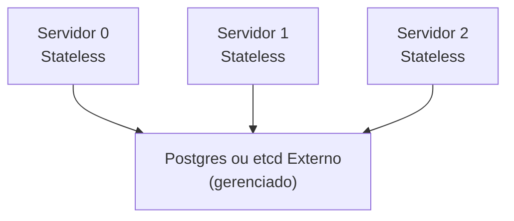

Em um cluster K3s, o estado do cluster é armazenado em um **datastore** (banco de dados). K3s oferece dois caminhos: etcd embarcado (dentro de cada servidor K3s) ou um datastore externo (Postgres, MySQL, etcd separado).

A escolha impacta arquitetura, operação, e resiliência. Este guia compara os dois.

## etcd embarcado

Cada servidor K3s vem com etcd embutido. Os servidores se coordenam via replicação de etcd entre eles.

```mermaid
graph TB
    S0["Servidor 0<br/>etcd"]
    S1["Servidor 1<br/>etcd"]
    S2["Servidor 2<br/>etcd"]
    
    S0 ↔|Raft<br/>replicação| S1
    S1 ↔|Raft<br/>replicação| S2
    S0 ↔|Raft<br/>replicação| S2
    
    Note["quorum = 2/3"]
```

### Vantagens

- **Simples:** não há componente externo para gerenciar
- **Acoplado:** K3s cuida de quorum, replicação, backup
- **Replicação automática:** mudanças são replicadas entre servidores
- **Sem dependência:** se você não tem Postgres/etcd externo disponível, este é seu caminho

### Desvantagens

- **Quorum em K3s:** você precisa de número ímpar de servidores (3, 5, 7...)
- **Perda de quorum = perda total:** sem datastore externo para recuperar, você precisa de backup de etcd
- **Operação de etcd:** você gerencia backup, restore, possíveis corrupções de etcd
- **Escalabilidade:** etcd tem limites (não é feito para 100+ nós)
- **Tightly coupled:** dificuldade em separar control plane de dados

## Datastore externo

O estado é armazenado em um banco de dados separado (Postgres, MySQL, etcd externo), e os servidores K3s são **stateless**.



### Vantagens

- **Desacoplado:** K3s não gerencia quorum — o datastore externo faz
- **Simples topologia:** você pode ter 1, 2, 5, ou 100 servidores K3s
- **Escalabilidade:** datastore externo gerencia sua própria replicação
- **Menos operação de etcd:** você não gerencia etcd embarcado
- **Simples recuperação:** restaurar datastore = restaurar cluster

### Desvantagens

- **Dependência adicional:** datastore externo é crítico; se cair, todo K3s cai
- **Operação duplicada:** você precisa manter HA do datastore (não é automático)
- **Custoso:** Postgres/etcd gerenciado em nuvem é caro
- **Complexidade:** setup inicial é mais envolvido

## Comparação lado a lado

| Aspecto | etcd embarcado | Datastore externo |
| --- | --- | --- |
| **Setup** | Simples (K3s faz tudo) | Complexo (precisa de DBA/sysadmin) |
| **Número de servidores** | Deve ser ímpar (3, 5, 7...) | Qualquer número (1, 2, 3, 10, 100...) |
| **Quorum** | Gerenciado por K3s | Gerenciado pelo datastore |
| **Backup** | Você faz snapshot de etcd | Datastore externo faz (geralmente automático) |
| **Recuperação** | Manual: restaurar etcd, reiniciar K3s | Manual: restaurar datastore, reiniciar K3s |
| **Perda de 1 servidor** | Se quorum OK, continua | K3s continua (pode perder todos os servidores, datastore sobrevive) |
| **Perda do datastore** | N/A (não é externo) | Total (todos os servidores ficam inacessíveis) |
| **Custo (infra)** | 3-5 máquinas boas | 3-5 máquinas boas + gerenciamento do datastore |
| **Custo (operação)** | Médio (etcd é complexo) | Alto (DBA, monitoramento, backups) |

## Quando usar cada um?

### Use etcd embarcado se:

- ✅ Você quer HA simples (3-5 servidores)
- ✅ Não tem infraestrutura de banco de dados existente
- ✅ Seus servidores têm disco rápido (etcd é I/O intensivo)
- ✅ Você consegue gerenciar quorum (números ímpares)
- ✅ Você está disposto a fazer backup/restore de etcd

### Use datastore externo se:

- ✅ Você já tem Postgres/MySQL/etcd gerenciado
- ✅ Você quer flexibilidade no número de servidores K3s
- ✅ Você tem DBA disponível para gerenciar o datastore
- ✅ Seu cluster vai crescer muito (100+ nós)
- ✅ Você quer máxima separação entre control plane e dados

## Exemplo: Labs vs. Produção

### Lab (etcd embarcado)

```yaml
# 3 máquinas virtuais (8GB RAM cada, disco SSD)
# Fácil para estudar, testar, mudar configuração

for i in 0 1 2; do
  curl -sfL https://get.k3s.io | \
    K3S_URL=https://servidor-0:6443 \
    K3S_TOKEN=... sh -
done
```

### Produção (datastore externo, Postgres gerenciado)

```yaml
# N servidores K3s apontando para Postgres (RDS, CloudSQL, ou self-hosted)
# Mais robusto, mas exige operação do banco

for i in 0 1 2 3 4; do
  curl -sfL https://get.k3s.io | \
    sh -s - server \
      --datastore-endpoint=postgres://... \
      --write-kubeconfig-mode 644
done
```

## Migrar de etcd embarcado para externo

Possível, mas complexo. Exigência: backup de etcd embarcado, restauração em Postgres, atualização dos servidores.

**Não é recomendado durante operação em produção.** Deixe para planejamento de upgrade major.

## Tópicos relacionados

- [Topologias recomendadas](../../guides/blueprints/k3s-multinode/topologies/): escolher entre 1/3/N servidores
- [Quorum em clusters distribuídos](./quorum/): entender quorum e replicação
- [K3s — Datastore Configuration](https://docs.k3s.io/datastore/): documentação oficial

## Fontes e leitura adicional

- [K3s — External Datastore](https://docs.k3s.io/datastore/external-datastore): setup com Postgres/MySQL/etcd
- [K3s — High Availability](https://docs.k3s.io/datastore/ha-embedded): etcd embarcado
- [Postgres — High Availability](https://www.postgresql.org/docs/current/different-replication-solutions.html): se você escolher Postgres externo
