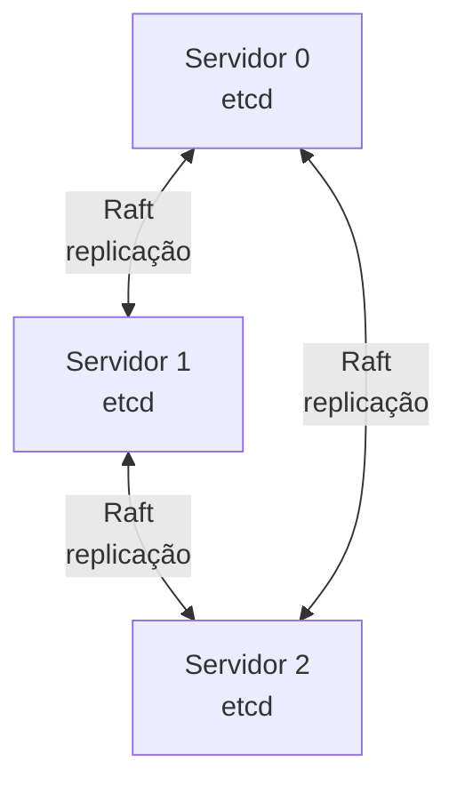
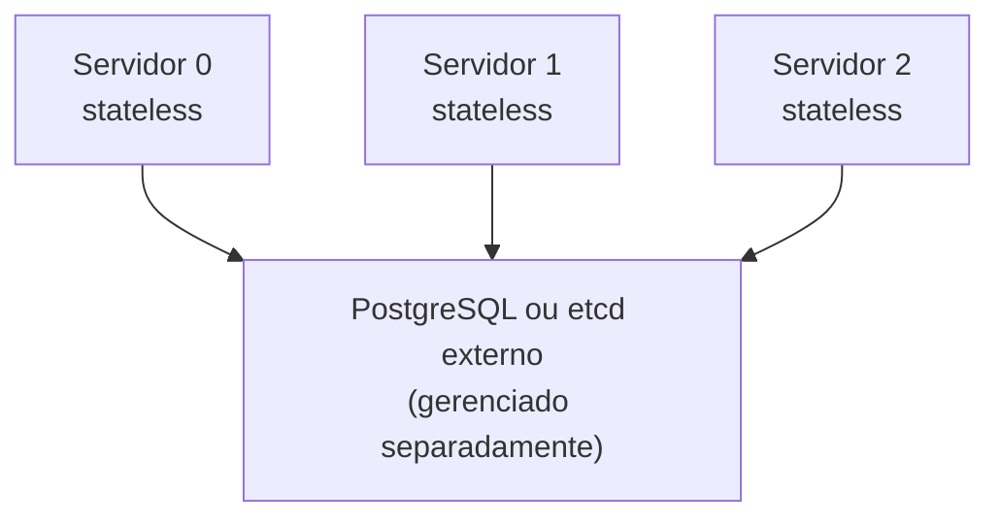

Em um cluster K3s, o estado do cluster é armazenado em um datastore. K3s oferece dois caminhos: etcd embarcado, rodando dentro de cada servidor, ou um datastore externo (PostgreSQL, MySQL, ou um cluster etcd separado). A escolha afeta a arquitetura, a operação e a forma como o cluster se recupera de uma falha.

## etcd embarcado

Cada servidor K3s roda seu próprio etcd, e os servidores se coordenam entre si por replicação Raft.

A vantagem central é a simplicidade: não há nenhum componente externo para provisionar ou operar, e o próprio K3s cuida de quorum, replicação e snapshot. Isso soma duas restrições diretas. Primeiro, o número de servidores precisa ser ímpar (veja [quorum em clusters distribuídos](../quorum/) para o porquê), o que limita a flexibilidade de escala do control plane. Segundo, perder quorum (mais da metade dos servidores ao mesmo tempo) trava o cluster inteiro sem um datastore externo para recuperar o estado; a única saída é restaurar um snapshot do etcd.

## Datastore externo

O estado fica em um banco separado, e os servidores K3s passam a ser stateless.

Desacoplar o datastore do control plane remove a exigência de número ímpar de servidores (é possível ter um, dois, dez) e transfere a responsabilidade de quorum e replicação para o datastore externo, que tipicamente já tem sua própria estratégia de alta disponibilidade madura (replicação do PostgreSQL, por exemplo). O custo é uma segunda superfície de operação: o datastore externo se torna crítico (se ele cai, todos os servidores K3s caem com ele), sua alta disponibilidade não é automática só por estar "fora" do K3s, e mantê-la tem um custo real, seja em infraestrutura própria ou em uma oferta gerenciada de banco de dados.

## Comparação

| Aspecto | etcd embarcado | Datastore externo |
| --- | --- | --- |
| Setup | Simples, o K3s cuida de tudo | Mais envolvido, exige operar o banco |
| Número de servidores | Precisa ser ímpar (3, 5, 7...) | Qualquer número |
| Quorum | Gerenciado pelo K3s | Gerenciado pelo datastore |
| Backup | Snapshot de etcd | O mecanismo de backup do datastore escolhido |
| Perda de um servidor | Cluster continua, se o quorum se mantiver | Cluster continua, servidores são substituíveis |
| Perda do datastore | Não aplicável (não existe datastore externo) | Todos os servidores ficam inacessíveis |
| Custo de operação | Médio (operar etcd bem exige atenção) | Alto (soma a operação do datastore) |

## Quando usar etcd embarcado

Quando o objetivo é HA simples com três a cinco servidores, não existe infraestrutura de banco de dados já disponível para reaproveitar, os discos dos servidores são rápidos o suficiente para o padrão de I/O intensivo do etcd, e a equipe está disposta a manter uma rotina real de backup e restauração de etcd testada.

## Quando usar datastore externo

Quando já existe PostgreSQL, MySQL ou etcd gerenciado disponível para reaproveitar, a topologia precisa de flexibilidade no número de servidores K3s, o cluster deve crescer muito além do que o etcd embarcado suporta confortavelmente, ou a separação entre control plane e dados é uma exigência arquitetural explícita.

## Migrar de embarcado para externo

É possível, mas exige um processo cuidadoso: backup do etcd embarcado, restauração dos dados no novo datastore, e reconfiguração de cada servidor para apontar para ele. Não é uma migração recomendada durante operação em produção sem uma janela de manutenção planejada; trate como parte de um projeto de upgrade maior, não como um ajuste incremental.

## Tópicos relacionados

- [Topologias recomendadas](../../../guides/blueprints/k3s-multinode/topologies/): escolher entre uma, três ou mais réplicas de servidor.
- [Quorum em clusters distribuídos](../quorum/): entender quorum e replicação antes de escolher a topologia do datastore.
- [Alta disponibilidade avançada](../advanced-ha/): o que fica além da escolha entre etcd embarcado e datastore externo.

## Fontes e leitura adicional

- [K3s: Datastore Configuration](https://docs.k3s.io/datastore): documentação oficial das opções de datastore.
- [K3s: External Datastore](https://docs.k3s.io/datastore/external-datastore): setup com PostgreSQL, MySQL ou etcd externo.
- [K3s: High Availability with Embedded DB](https://docs.k3s.io/datastore/ha-embedded): setup com etcd embarcado.
- [PostgreSQL: High Availability, Load Balancing, and Replication](https://www.postgresql.org/docs/current/different-replication-solutions.html): referência para quem escolher PostgreSQL externo.
