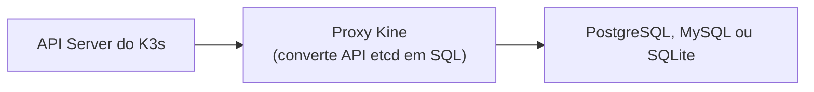

> **Para quem é:** operadores K3s que querem evitar o etcd embarcado sem assumir a complexidade completa de um datastore externo clássico.

Kine é um proxy que traduz a API que o K3s espera de um etcd em consultas SQL, permitindo usar PostgreSQL, MySQL ou SQLite como datastore. Ele ocupa um meio-termo entre o etcd embarcado (simples, mas acopla o quorum ao número de servidores) e um datastore externo clássico (flexível, mas exige operar etcd ou um banco dedicado separadamente).

## Como funciona

O proxy roda dentro de cada servidor K3s, não como um daemon separado; para a API Server, o backend continua parecendo etcd, mas os dados residem em um banco relacional comum. Isso torna o Kine tecnicamente uma forma de datastore externo, só que com uma API compatível embutida em vez de um daemon etcd dedicado, e com a opção de reaproveitar um banco de dados que a equipe já opera.

## Quando o Kine é útil

Quando já existe PostgreSQL ou MySQL disponível e reaproveitá-lo evita provisionar um datastore dedicado, quando o objetivo é um ambiente de desenvolvimento leve com SQLite (um único arquivo, sem processo de banco separado), ou quando a migração de etcd embarcado para um banco externo precisa acontecer de forma gradual, sem introduzir imediatamente a operação completa de um etcd externo.

## Quando o etcd embarcado continua sendo a escolha melhor

Quando a prioridade é desempenho máximo de escrita: etcd é otimizado especificamente para a carga de trabalho do Kubernetes, e o Kine soma a sobrecarga de traduzir cada operação em SQL. Um cluster já rodando etcd embarcado sem problemas também não tem motivo para migrar: trocar o datastore é uma mudança estrutural, não uma otimização incremental a ser feita sem necessidade concreta.

## Comparação

| Aspecto | etcd embarcado | Kine + PostgreSQL | Kine + SQLite |
| --- | --- | --- | --- |
| Setup | Trivial | Reaproveita banco existente | Um único arquivo |
| Desempenho | Alto | Médio, com a sobrecarga de SQL | Baixo, adequado só para desenvolvimento |
| Escala | Milhares de nós | Limitada pelo banco | Limitada a um processo |
| Persistência | Integrada ao K3s | Herdada do banco | Arquivo local |
| Backup | Snapshot de etcd | Backup do banco | Cópia do arquivo |

## Decisões que isso implica

Adotar Kine com múltiplas réplicas de servidor não elimina a necessidade de operar um proxy Kine em cada uma delas: a complexidade não desaparece, apenas muda de forma. A escolha entre etcd embarcado, Kine e um datastore externo clássico deve seguir o mesmo raciocínio de [etcd embarcado versus datastore externo](../embedded-vs-external-datastore/), com o Kine como uma variante que troca desempenho por flexibilidade de backend.

## Próximas seções

- [etcd embarcado versus datastore externo](../embedded-vs-external-datastore/): o trade-off geral entre as duas famílias de opções, do qual o Kine é uma variante.

## Referências

- [Kine: repositório oficial](https://github.com/k3s-io/kine): código-fonte e documentação do projeto.
- [K3s: Cluster Datastore](https://docs.k3s.io/datastore): opções de datastore suportadas pelo K3s.
