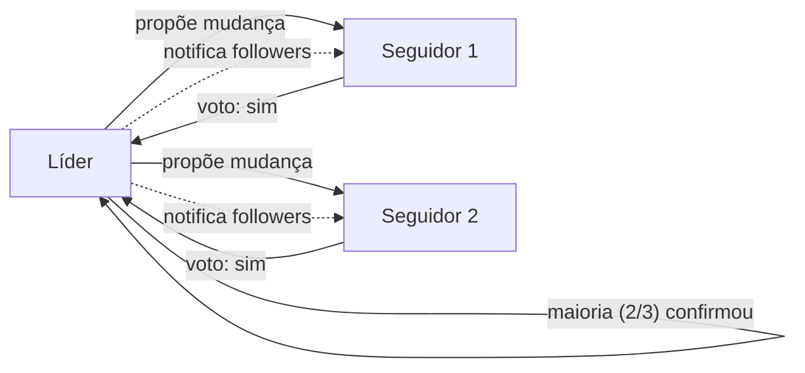

O quorum é o conceito central que torna clusters distribuídos resilientes a falhas. Sem entender quorum, é fácil configurar um cluster que aparenta estar em HA mas que quebra da primeira vez que você perde um nó.

## O que é quorum?

Um quorum é um **consenso entre a maioria**: em um grupo de N participantes, o quorum é `floor(N/2) + 1`. Nada é decidido sem quorum.

Exemplos:

| N | Quorum | Significado |
| --- | --- | --- |
| 1 | 1 | 1 servidor: qualquer falha trava o cluster (sem HA) |
| 2 | 2 | 2 servidores: perder 1 trava o cluster (não é HA) |
| 3 | 2 | 3 servidores: perder 1 ainda funciona |
| 5 | 3 | 5 servidores: perder 2 ainda funciona |

## Por quê quorum?

Servidores em um cluster precisam concordar sobre o estado: "qual é a versão atual da configuração? qual pod está rodando onde? quanto espaço disco tem?"

Se todos pudessem responder diferente, não haveria consenso. Se você deixasse 1 servidor decidir sozinho (sem consenso), e aquele servidor falhasse, o cluster pararia.

**Quorum garante:** mesmo que alguns servidores falhem, a maioria viva pode concordar e continuar operando. Assim que a minoria volta, ela sincroniza com a maioria que continuou decidindo.

## Eleição de líder (Raft)

Servidores em um cluster K3s com etcd embarcado usam o algoritmo **Raft** para concordar. Raft funciona assim:

1. **Líder eleito:** um servidor vira "líder"; os outros são "seguidores"
2. **Líder propõe mudanças:** "vamos adicionar pod X no agente Y"
3. **Seguidores votam:** "ok, vi a mudança"
4. **Maioria confirma = decisão:** assim que quorum confirma, a mudança é commitada



## Cenário: perda de 1 servidor em 3

```text
Antes:       Srv-0 (líder)   Srv-1 (seguidor)   Srv-2 (seguidor)
Srv-1 cai:   Srv-0 (vivo)    Srv-1 (caído)      Srv-2 (vivo)

Dois de três servidores continuam vivos: quorum de 2 mantido.
Um novo líder é eleito entre Srv-0 e Srv-2; o cluster continua decidindo normalmente.
```

Quorum de 2 (em 3 servidores) significa: o cluster tolera no máximo 1 falha antes de travar.

## Cenário: perda de quorum (2 ou mais em 3)

```text
Antes:              Srv-0   Srv-1   Srv-2
Srv-1 e Srv-2 caem:  Srv-0 (vivo)   Srv-1 (caído)   Srv-2 (caído)

Apenas 1 de 3 servidores continua vivo; o quorum exigido é 2.
Nenhuma decisão pode ser tomada: o cluster trava.
```

Srv-0 fica sozinho. Mesmo que seja o líder anterior, não consegue convencer os outros (não consegue alcançá-los) de que uma mudança é válida. É bom que ele não decida sozinho: a decisão dele poderia estar errada enquanto os outros 2 concordam em algo diferente "lá fora".

Quando Srv-1 e Srv-2 voltarem, eles terão uma verdade diferente. Qual é certa? O sistema não arruma isso automaticamente.

**Por isso você precisa de backup e restore de etcd** quando perde quorum.

## Números recomendados

| Topologia | Servidores | Quorum | Tolerância a falha | Recomendação |
| --- | --- | --- | --- | --- |
| Nó único | 1 | Não aplicável | Nenhuma (qualquer falha derruba o cluster) | Apenas dev/teste |
| 1 servidor + agents | 1 | Não aplicável | Nenhuma no control plane | HA só nos workloads, não no control plane |
| 2 servidores | 2 | 2 | Nenhuma (perder 1 já trava) | Nunca use 2 servidores |
| 3 servidores | 3 | 2 | 1 servidor | Recomendado como padrão |
| 5 servidores | 5 | 3 | 2 servidores | Para escala maior |
| 7 servidores | 7 | 4 | 3 servidores | Raramente necessário |

**Regra de ouro:** sempre números ímpares (1, 3, 5, 7). Números pares não adicionam tolerância e gastam recurso.

Exemplo: 2 servidores tem quorum 2; perda de 1 = travado. 3 servidores tem quorum 2; perda de 1 = funciona. Dois a mais de máquinas, 1 a mais de redundância.

## Datastore externo

Com PostgreSQL ou etcd externo em vez de etcd embarcado (veja [etcd embarcado versus datastore externo](../embedded-vs-external-datastore/)), o quorum passa a ser gerenciado pelo datastore externo, não pelos servidores K3s. Isso libera o número de servidores K3s de qualquer restrição de paridade: um único servidor K3s não precisa de quorum próprio, e dez servidores podem apontar para o mesmo banco sem problema. O quorum passa a existir só no datastore: se ele cair, todos os servidores K3s caem com ele, mesmo que estejam saudáveis individualmente. É um desacoplamento real (o K3s deixa de cuidar de consenso), pago com uma camada de operação a mais para manter.

## Quando evitar HA

Um único servidor é a escolha certa para laboratórios e desenvolvimento, onde a simplicidade importa mais do que a tolerância a falha, para ambientes onde a perda é aceitável (um ambiente de CI que pode ser desligado e reconstruído a qualquer momento), ou quando o orçamento não comporta as múltiplas máquinas que HA exige. Fora desses casos, se a aplicação precisa rodar de forma contínua sem janelas de indisponibilidade, quorum deixa de ser opcional.

## Tópicos relacionados

- [Topologias recomendadas](../../../guides/blueprints/k3s-multinode/topologies/): escolher número de servidores.
- [Arquitetura de quorum e etcd](../../../guides/blueprints/k3s-multinode/architecture/): detalhamento técnico.
- [etcd embarcado versus datastore externo](../embedded-vs-external-datastore/): trade-offs de armazenamento de estado.

## Fontes e leitura adicional

- [etcd: Consensus using Raft](https://etcd.io/docs/v3.5/learning/design-client/): especificação de Raft.
- [K3s: High Availability Setup](https://docs.k3s.io/datastore/ha-embedded): configuração de HA em K3s.
- [Wikipedia: Consensus (computer science)](https://en.wikipedia.org/wiki/Consensus_(computer_science)): fundamentos de consenso.
