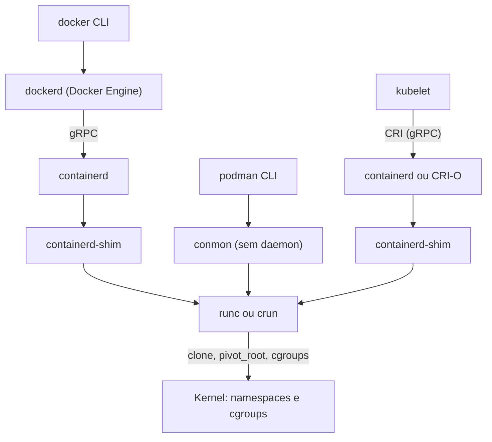

> **Para quem é:** quem já sabe o que a [Runtime Spec](../oci-specifications/#oci-runtime-specification-o-contrato-que-um-runtime-de-baixo-nível-cumpre) exige de um runtime, e quer saber o que exatamente acontece entre digitar `docker run` (ou o Kubernetes agendar um Pod) e um processo confinado começar a rodar.

Docker, Podman, containerd e runc não são alternativas concorrentes entre si: são camadas diferentes da mesma pilha, cada uma responsável por uma parte distinta do trabalho. Um **engine** (Docker Engine, Podman) é a ferramenta com que uma pessoa interage: gerencia imagens, redes, volumes e a experiência de linha de comando. Um **runtime de alto nível** (containerd, CRI-O) gerencia o ciclo de vida de containers individuais: busca imagens, prepara o filesystem, entrega o trabalho de execução propriamente dita a uma camada ainda mais baixa. Um **shim** desacopla o processo do container do processo do runtime que o criou. Um **runtime de baixo nível** (runc, crun) é quem finalmente faz as chamadas de sistema (`clone`, `pivot_root`, escrita em cgroups) que a [Runtime Spec](../oci-specifications/#oci-runtime-specification-o-contrato-que-um-runtime-de-baixo-nível-cumpre) descreve.

## A pilha em camadas

O caminho até o processo confinado difere dependendo de quem inicia o container, mas todos convergem no mesmo runtime de baixo nível:

## Engine: Docker Engine e Podman

Docker Engine (`dockerd`) é um daemon que roda continuamente como root (ou em modo rootless, com as ressalvas já tratadas em [user namespaces](../user-namespaces/#rootless-vs-rootful-na-prática)), gerenciando imagens, redes, volumes e delegando a execução de cada container ao `containerd` via uma API interna. É esse daemon que o socket do Docker expõe, e por isso montar esse socket equivale a acesso administrativo ao host.

Podman não tem daemon: cada comando `podman` roda, executa a operação pedida e termina, sem um processo de longa duração coordenando tudo. Em vez de delegar a `containerd`, o Podman usa sua própria biblioteca (`libpod`) para gerenciar containers diretamente, com um processo leve chamado `conmon` fazendo o papel de supervisor por container, sem passar por `containerd` nem por um shim equivalente ao do Docker. Essa diferença arquitetural, não apenas a ausência de daemon, é aprofundada na próxima página desta trilha, que compara os dois diretamente.

## Runtime de alto nível: containerd e CRI-O

`containerd` nasceu como parte do Docker Engine e foi extraído como projeto independente, hoje graduado pela CNCF; gerencia o ciclo de vida completo de um container (puxar a imagem, preparar as camadas via snapshotter, invocar o runtime de baixo nível, supervisionar o processo resultante), mas não tem CLI voltada ao usuário final nem gerencia redes da forma que um engine gerencia — essa parte fica com quem chama `containerd`, seja o Docker Engine, seja o kubelet via CRI.

CRI-O foi criado especificamente para implementar a CRI (Container Runtime Interface, explicada abaixo) do Kubernetes, sem nenhum outro propósito além disso: não tem CLI de uso geral, não gerencia volumes fora do que o Kubernetes já gerencia, é deliberadamente mais enxuto que `containerd` porque resolve só o subconjunto de funcionalidade que o kubelet precisa.

## Shim: o que `containerd-shim` resolve

Um shim é o processo que fica entre o runtime de alto nível e o processo do container em si. Ele resolve dois problemas distintos: primeiro, runtimes de baixo nível como `runc` são processos de vida curta, criados para configurar o container e depois terminar (não ficam rodando durante toda a vida do container), então algum processo precisa continuar existindo como pai do processo do container depois que `runc` já encerrou; segundo, se `containerd` reiniciar ou travar, os containers em execução não podem morrer junto, porque o shim, não o `containerd`, é quem efetivamente segura essa posição de pai do processo. `containerd-shim` cumpre esse papel específico para `containerd`; no caso do Podman, `conmon` cumpre um papel equivalente, mas com uma implementação própria, sem relação de código com `containerd-shim`.

## Runtime de baixo nível: `runc` e `crun`

`runc` é a implementação de referência da OCI Runtime Spec, escrita em Go, mantida pela própria OCI e originada do código do Docker Engine; recebe um bundle (rootfs mais `config.json`, já detalhados na página anterior desta trilha) e faz as chamadas de sistema que efetivamente criam os namespaces, aplicam os limites de cgroup e trocam a raiz do filesystem do processo.

`crun` é uma implementação alternativa da mesma spec, escrita em C; seu apelo prático é inicialização mais rápida e menor consumo de memória que `runc`, especialmente perceptível em ambientes com muitos containers de vida curta. Podman e CRI-O costumam usar `crun` como padrão em instalações mais recentes, mas ambas as ferramentas aceitam qualquer runtime de baixo nível compatível com a Runtime Spec, incluindo `runc`; a troca entre os dois é uma opção de configuração, não uma dependência rígida de qual runtime de alto nível está em uso.

## CRI: a interface que o Kubernetes usa para falar com essa pilha

CRI (Container Runtime Interface) é uma API gRPC que o `kubelet` usa para pedir a criação, o encerramento e a inspeção de containers a um runtime, sem precisar conhecer detalhes específicos de qual runtime está do outro lado. Isso é o que permite ao Kubernetes trocar de `containerd` para `CRI-O` (ou vice-versa) sem alterar o comportamento observável de um Pod, e é também o motivo pelo qual o Kubernetes não depende mais do Docker Engine diretamente: o kubelet fala CRI com `containerd` ou `CRI-O`, contornando inteiramente a camada de engine (que existe para atender um humano na linha de comando, uma necessidade que o kubelet não tem). K3s, a distribuição usada neste notebook, empacota `containerd` e o configura como o runtime padrão atendendo ao kubelet via CRI; veja [arquitetura do K3s](../../clusters/k3s-architecture/) para como isso se encaixa no restante dos componentes do K3s.

## Referências

- [containerd: documentação oficial](https://containerd.io/docs/): arquitetura, snapshotters e a API que o Docker Engine e o CRI plugin consomem.
- [CRI-O: documentação oficial](https://cri-o.io/): escopo do projeto e sua relação exclusiva com a CRI do Kubernetes.
- [Podman: documentação oficial](https://docs.podman.io/en/latest/): arquitetura sem daemon e o papel do `conmon`.
- [Kubernetes: Container Runtime Interface (CRI)](https://kubernetes.io/docs/concepts/architecture/cri/): definição oficial da interface entre kubelet e o runtime.
- [runc: repositório oficial](https://github.com/opencontainers/runc): implementação de referência da OCI Runtime Spec.
- [crun: repositório oficial](https://github.com/containers/crun): implementação alternativa em C da OCI Runtime Spec.
