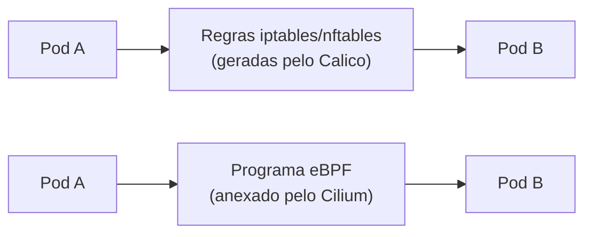

> **Para quem é:** operadores de K3s ou Kubernetes avaliando a substituição do Flannel (CNI padrão do K3s) por um plugin com network policies mais completas.

O K3s instala Flannel como CNI padrão porque ele é suficiente para o caso comum: conectividade entre Pods, sem exigir configuração adicional. Flannel não implementa `NetworkPolicy`, então um cluster que precisa restringir tráfego entre namespaces ou entre workloads precisa substituí-lo por um CNI que suporte políticas de rede. Cilium e Calico são as duas opções mais usadas para isso, e a escolha entre elas depende menos de qual é "melhor" e mais de qual modelo técnico se encaixa no kernel disponível e no tipo de política que o cluster precisa aplicar.

## Como cada um implementa a filtragem

Calico é o mais antigo dos dois e, na configuração padrão, gera regras iptables (ou nftables, dependendo da versão e distribuição) para aplicar suas políticas, seguindo o mesmo modelo descrito em [fundamentos de firewall no Linux](./firewalls/linux-firewall-fundamentals/). Esse caminho é bem entendido, funciona em kernels antigos e permite roteamento via BGP nativo, útil em topologias que já usam BGP para anunciar rotas entre hosts. O suporte a `NetworkPolicy` do Calico cobre as camadas 3 e 4 (endereço IP, porta, protocolo).

Cilium usa eBPF, um mecanismo do kernel Linux que permite executar programas restritos e verificados diretamente dentro do kernel, sem depender de módulos externos nem de regras iptables tradicionais. Isso exige um kernel recente (5.8 ou superior é o mínimo prático para os recursos usados pelo Cilium) e limita seu uso a hosts Linux, mas permite que o Cilium implemente políticas de camada 7 (por exemplo, restringir uma conexão a métodos HTTP específicos ou a consultas DNS para domínios determinados), algo que Calico não faz nativamente. O Cilium também inclui o Hubble, uma ferramenta de observabilidade de rede que usa os mesmos pontos de instrumentação eBPF para mostrar fluxos de tráfego entre Pods sem exigir sidecars.



A diferença de mecanismo explica a maior parte das diferenças práticas entre os dois: overhead de latência, requisitos de kernel, alcance das políticas de rede e disponibilidade de observabilidade nativa.

## Quando cada um se encaixa

Calico é a escolha mais direta quando o cluster roda em um kernel anterior ao exigido pelo Cilium, quando a topologia de rede já depende de BGP para anunciar rotas entre nós (comum em clusters bare metal com switches que participam do roteamento), ou quando as políticas necessárias não passam de filtragem por IP, porta e protocolo. Ambientes que já usam Calico em outros clusters também se beneficiam de manter a mesma ferramenta, evitando duas curvas de aprendizado.

Cilium se justifica quando o cluster precisa de políticas de rede em camada de aplicação (por exemplo, permitir apenas requisições `GET` a um serviço específico, ou restringir a quais domínios um Pod pode resolver DNS), quando a observabilidade de tráfego entre serviços é um requisito operacional e o Hubble evita a necessidade de instrumentar cada aplicação separadamente, ou quando o cluster já roda em hosts modernos o suficiente para atender o requisito de kernel sem esforço adicional.

Nenhum dos dois é necessário quando o cluster não precisa de `NetworkPolicy` alguma. Nesse caso, manter o Flannel padrão do K3s evita a complexidade operacional de substituir o CNI sem um benefício correspondente.

## Instalação

A instalação de qualquer CNI alternativo em um cluster K3s exige desabilitar o Flannel embutido na inicialização do servidor (`--flannel-backend=none`) antes de instalar o CNI escolhido; substituir o CNI depois que o cluster já está rodando com Flannel normalmente exige recriar os nós, porque as regras de rede já aplicadas por um CNI não são removidas de forma limpa ao trocar de plugin.

Instalação do Cilium via Helm:

```bash
helm repo add cilium https://helm.cilium.io
helm install cilium cilium/cilium \
  --namespace kube-system \
  --set kubeProxyReplacement=strict
```

A flag `kubeProxyReplacement=strict` faz o Cilium substituir o kube-proxy inteiramente, usando eBPF também para o roteamento de Services. Isso reduz uma camada de indireção, mas exige validar que o cluster não depende de comportamento específico do kube-proxy antes de habilitar essa opção em produção.

Instalação do Calico via manifest do operador Tigera:

```bash
kubectl apply -f https://raw.githubusercontent.com/projectcalico/calico/v3.26.1/manifests/tigera-operator.yaml
```

A versão fixada no manifest (`v3.26.1` neste exemplo) deve ser conferida contra a versão atual recomendada pela documentação do Calico antes de aplicar em um cluster novo; releases de CNI têm compatibilidade estreita com versões específicas de Kubernetes.

Depois de instalado qualquer um dos dois, confirme que os nós estão prontos com `kubectl get nodes` e que os Pods de sistema do CNI (`cilium-*` ou `calico-*`, conforme o caso, em `kube-system`) estão em execução antes de considerar a instalação concluída.

## Política de rede básica

O recurso `NetworkPolicy` do Kubernetes é suportado por ambos e funciona da mesma forma na definição, independentemente de qual CNI a implementa por baixo:

```yaml
apiVersion: networking.k8s.io/v1
kind: NetworkPolicy
metadata:
  name: deny-all
spec:
  podSelector: {}
  policyTypes:
    - Ingress
    - Egress
```

Essa política, sem seletores adicionais em `ingress` ou `egress`, bloqueia todo o tráfego de entrada e saída para os Pods selecionados por `podSelector: {}` (todos os Pods do namespace). É o ponto de partida comum para depois liberar exceções específicas.

Quando as políticas exigem controle além do que `NetworkPolicy` padrão oferece, o Cilium expõe o recurso `CiliumNetworkPolicy`, que estende a especificação com regras de camada 7 (métodos HTTP, nomes DNS) não disponíveis na API padrão do Kubernetes nem em Calico.

## Páginas relacionadas

- [Fundamentos de firewall no Linux](./firewalls/linux-firewall-fundamentals/)
- [Configurar network policies (procedimento)](../../guides/tasks/networking/configure-network-policies/)

## Referências

- [Cilium (documentação oficial)](https://docs.cilium.io/): guia completo de instalação, arquitetura e recursos do Cilium.
- [Calico (documentação oficial)](https://docs.tigera.io/calico/latest/about/): guia completo de instalação, arquitetura e recursos do Calico.
- [Network Policies (Kubernetes)](https://kubernetes.io/docs/concepts/services-networking/network-policies/): especificação oficial do recurso `NetworkPolicy`.
