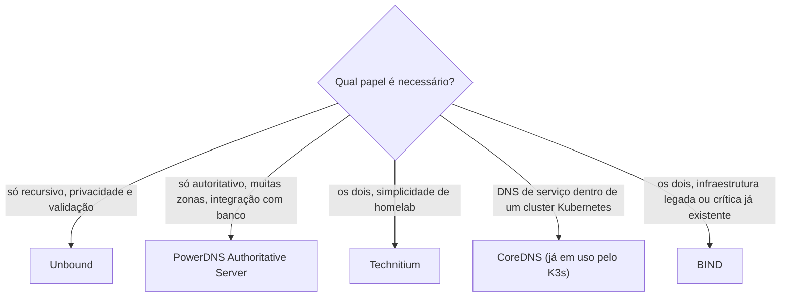

> **Para quem é:** quem já entende os papéis de resolver e nameserver autoritativo (a primeira página desta trilha) e quer saber quais softwares reais implementam cada papel, e por que a resposta raramente é "um só".

As páginas anteriores trataram resolver e autoritativo como papéis conceituais. Na prática, esses papéis são implementados por softwares específicos, e a decisão de qual usar depende do papel que o operador realmente precisa cobrir, não de uma preferência genérica por "o melhor servidor DNS". Esta página apresenta e compara, sem procedimento de instalação: cada projeto citado já tem (ou pode ter) um guia operacional próprio se a demanda surgir; aqui o objetivo é decidir, não instalar.

## Por que autoritativo e recursivo costumam ser softwares diferentes

Um servidor autoritativo e um resolvedor recursivo resolvem problemas de engenharia opostos. O autoritativo precisa responder rápido, de forma previsível, a partir de dados que ele mesmo controla (a zona configurada), sem nunca precisar confiar em outro servidor; o risco que ele gerencia é sobretudo de disponibilidade e de exatidão dos próprios dados. O recursivo precisa navegar uma cadeia de servidores que não controla, decidir em quem confiar a cada salto, e defender-se de respostas forjadas vindas de qualquer ponto dessa cadeia (o problema que motivou o [DNSSEC](../dnssec/)); o risco que ele gerencia é sobretudo de segurança e de cache envenenado. Um software otimizado para o primeiro problema carrega, por padrão, superfícies de risco desnecessárias se também expõe recursão a qualquer cliente; um software otimizado para o segundo raramente tem os recursos de gerenciamento de zona (interface de edição, transferência de zona, DNSSEC signing automatizado) que uma operação autoritativa séria exige. Separar os dois softwares, cada um endurecido e configurado para seu próprio papel, é a prática mais comum em operações de porte real; misturar os dois no mesmo processo é mais comum em ambientes pequenos, onde a superfície de risco extra é aceitável em troca da simplicidade operacional.

## PowerDNS: a separação como decisão de arquitetura

O PowerDNS é o exemplo mais explícito dessa separação, porque a torna literal em vez de apenas recomendada: o projeto distribui dois produtos distintos, o **PowerDNS Authoritative Server** e o **PowerDNS Recursor**, com bases de código, processos e configuração completamente separados, ainda que sob o mesmo projeto guarda-chuva. Um operador que precisa só de autoridade sobre zonas próprias roda apenas o Authoritative Server; um que precisa só de resolução recursiva para uma rede roda apenas o Recursor; os dois juntos não compartilham processo nem estado, mesmo rodando na mesma organização. O Authoritative Server se destaca por armazenar zonas em backends plugáveis (arquivos de zona tradicionais, mas também bancos de dados relacionais como PostgreSQL/MySQL), o que facilita integração com sistemas de provisionamento automatizado, um caso de uso comum quando o número de zonas gerenciadas cresce além do que editar arquivos manualmente comporta.

## Unbound e BIND: os papéis clássicos

**Unbound** é um resolvedor recursivo validador, focado especificamente nesse papel: não gerencia zonas próprias como autoridade (embora aceite dados estáticos locais para casos pontuais), é leve, e prioriza segurança e validação DNSSEC por padrão. É a escolha comum quando o objetivo é só "ter um resolvedor recursivo confiável e privado na rede local", sem a ambição de também administrar zonas.

**BIND** (Berkeley Internet Name Domain) é o servidor DNS mais antigo em uso contínuo, e o único desta lista capaz de operar nos dois papéis (autoritativo e recursivo) no mesmo software, embora a documentação do próprio projeto recomende separar as duas funções em instâncias diferentes pelo mesmo motivo de superfície de risco já descrito. Seu peso histórico é real: grande parte do vocabulário operacional do DNS (arquivos de zona no formato de master file, `named.conf`) vem do BIND, e ele continua sendo a base autoritativa de infraestrutura crítica em muitas organizações, mas sua superfície de configuração é significativamente maior que a de alternativas mais recentes e especializadas.

## Technitium: o servidor integrado de homelab

**Technitium DNS Server** representa a escolha oposta à separação do PowerDNS: um único processo, com interface web de administração, cobrindo autoritativo, recursivo, bloqueio de domínios (ao estilo Pi-hole) e suporte a DoT/DoH no mesmo pacote. Essa integração é exatamente o que o torna atrativo para homelab: um operador solo gerenciando poucos domínios internos e uma rede doméstica ganha mais com a simplicidade de um único painel do que perde com a superfície de risco combinada, um cálculo que se inverte à medida que a operação cresce em escala ou em exigências de isolamento.

## CoreDNS: o papel que este notebook já usa

O **CoreDNS** é o servidor DNS padrão de qualquer cluster Kubernetes (incluindo o K3s), rodando como um conjunto de plugins encadeados (um "pipeline" de middlewares) em vez de um monólito com configuração fixa; o plugin `kubernetes` é o que o torna autoritativo para a zona `cluster.local`, resolvendo Services e Pods a partir do estado do cluster em tempo real. Este notebook já cobre CoreDNS operacionalmente em dois guias: [configurar CoreDNS para resolução interna](../../../../guides/tasks/networking/setup-coredns-internal/), que adiciona uma zona administrativa separada de `cluster.local` usando o plugin `hosts`, e [CoreDNS como reverse proxy local](../../../../guides/tasks/networking/coredns-local-reverse-proxy/). Essa arquitetura de plugins é o motivo pelo qual o mesmo binário CoreDNS consegue atuar como autoritativo de uma zona (`kubernetes`, `file`, `hosts`) e como recursivo/forwarder para o resto da internet (plugin `forward`) na mesma instância, sem misturar responsabilidades da forma arriscada descrita na primeira seção: cada zona configurada delega explicitamente a um plugin específico, em vez de um único código tentando cobrir os dois papéis de forma implícita.

## Critérios de escolha, sem vencedor universal

Três critérios práticos decidem melhor que uma preferência abstrata por "o servidor mais popular": qual **papel** é realmente necessário (recursivo, autoritativo, ou os dois, decidido nas duas primeiras páginas desta trilha); quem vai **operar** o servidor no dia a dia (um operador solo em homelab ganha mais com a interface integrada do Technitium do que perderia gerenciando dois processos separados; uma equipe com múltiplas zonas e automação de provisionamento ganha mais com backends de banco de dados do PowerDNS); e qual é a **exposição** do servidor (um recursivo exposto a clientes não confiáveis exige hardening e limitação de taxa que um autoritativo interno, servindo só zonas próprias, não precisa da mesma forma). Nenhum destes softwares é estritamente superior aos outros fora de um contexto específico; a escolha errada mais comum é adotar um servidor monolítico com todos os recursos ligados por padrão quando o papel real exigido era só um dos dois.

## Páginas relacionadas

- [Resolução DNS: do stub resolver à resposta autoritativa](../resolution/): os dois papéis conceituais (resolver, autoritativo) que esta página mapeia para softwares reais.
- [Configurar CoreDNS para resolução interna](../../../../guides/tasks/networking/setup-coredns-internal/): procedimento operacional do CoreDNS já usado por este notebook.
- [CoreDNS como reverse proxy local](../../../../guides/tasks/networking/coredns-local-reverse-proxy/): outro uso operacional do CoreDNS já coberto neste notebook.

## Referências

- [PowerDNS Authoritative Server (documentação oficial)](https://doc.powerdns.com/authoritative/): arquitetura e backends de zona.
- [PowerDNS Recursor (documentação oficial)](https://doc.powerdns.com/recursor/): papel de resolvedor recursivo separado do Authoritative Server.
- [Unbound (documentação oficial, NLnet Labs)](https://unbound.docs.nlnetlabs.nl/): foco em resolução recursiva validadora.
- [BIND 9 (documentação oficial, ISC)](https://bind9.readthedocs.io/): histórico, capacidade dual de papéis, e a recomendação do próprio projeto de separar funções.
- [Technitium DNS Server (documentação oficial)](https://technitium.com/dns/): recursos integrados (autoritativo, recursivo, bloqueio, DoT/DoH).
- [CoreDNS (documentação oficial)](https://coredns.io/manual/toc/): arquitetura de plugins e o plugin `kubernetes`.
