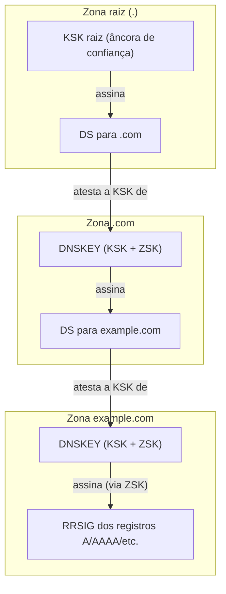

> **Para quem é:** quem já entende zonas, delegação e registros (a página anterior desta trilha) e quer saber como um resolvedor confirma que uma resposta DNS não foi forjada no caminho.

Nada no caminho de resolução descrito nas duas páginas anteriores impede, por si só, que uma resposta seja forjada: um servidor comprometido no meio do caminho, ou um invasor capaz de injetar pacotes UDP com o endereço de origem certo, pode devolver um registro `A` apontando para qualquer lugar, e um resolvedor sem DNSSEC aceita essa resposta como se fosse legítima. DNSSEC (DNS Security Extensions) resolve exatamente esse problema: cada zona assina digitalmente seus próprios registros, e uma cadeia de assinaturas ligada à raiz do DNS permite que um resolvedor confirme que a resposta realmente veio de quem diz ter vindo, sem alteração no caminho.

## Uma consulta sem prova nenhuma

```bash
dig +dnssec example.com
# ... flags: qr rd ra; ...
# (sem "ad" na linha de flags)
```

A ausência da flag `ad` (Authenticated Data) na resposta significa que o resolvedor consultado não validou a resposta criptograficamente, mesmo que `+dnssec` tenha pedido os registros de assinatura. Isso acontece por dois motivos possíveis: a zona não é assinada, ou o resolvedor não faz validação DNSSEC. O restante desta página explica o que precisa existir para que essa mesma consulta volte com `ad` presente, uma prova positiva de que a cadeia de confiança foi verificada de ponta a ponta.

## A cadeia: DNSKEY, RRSIG e DS

Uma zona assinada com DNSSEC publica três tipos de registro além dos já vistos na página anterior. O **DNSKEY** contém a chave pública da zona; cada zona normalmente mantém duas: uma **ZSK** (Zone Signing Key), usada para assinar os registros do dia a dia, e uma **KSK** (Key Signing Key), usada apenas para assinar o próprio conjunto de DNSKEYs, permitindo trocar a ZSK sem precisar reestabelecer confiança com a zona pai a cada rotação. O **RRSIG** é a assinatura em si: para cada conjunto de registros de um nome (todos os `A` de `example.com`, por exemplo), existe um RRSIG correspondente, gerado com a chave privada da ZSK, que um resolvedor verifica contra a DNSKEY pública.

Isso resolve integridade dentro de uma zona isolada, mas não explica por que confiar na DNSKEY publicada por `example.com` em primeiro lugar; qualquer atacante poderia publicar sua própria DNSKEY junto com registros forjados, assinados de forma internamente consistente. O elo que fecha esse buraco é o **DS** (Delegation Signer): um registro publicado na zona **pai**, ao lado do NS que delega a zona filha, contendo o hash da KSK da zona filha. A zona pai, ao assinar seu próprio DS com sua própria chave, atesta "eu confio nesta chave específica para a zona que delego".



A cadeia inteira depende de um único ponto inicial de confiança: a **âncora de confiança** (trust anchor) da zona raiz, a KSK raiz, distribuída fora de banda (embutida nos resolvedores validadores, publicada pela IANA) porque não existe zona pai acima da raiz para assinar um DS dela. Um resolvedor com DNSSEC ativado percorre essa cadeia inteira para cada resposta que precisa validar: confirma que a DNSKEY da raiz bate com a âncora de confiança configurada, segue o DS até a TLD, o DS da TLD até a zona final, e só então confia no RRSIG que assina a resposta original. Se qualquer elo dessa cadeia estiver ausente, incorreto, ou com uma assinatura expirada, a validação falha, e um resolvedor validador rejeita a resposta em vez de aceitá-la sem verificação.

## Validando a mesma consulta

```bash
dig +dnssec example.com
# ... flags: qr rd ra ad; ...
```

A flag `ad` presente confirma que o resolvedor percorreu a cadeia do diagrama acima e validou cada assinatura com sucesso, para essa zona específica; ela não diz nada sobre o caminho entre o resolvedor e o cliente que fez a pergunta, que continua exigindo transporte confiável (o mesmo `dig` local, sem passar por rede insegura entre cliente e resolvedor, ou DoT/DoH, discutidos adiante) para que o próprio cliente confie na flag recebida. Testar contra uma zona propositalmente com DNSSEC quebrado (várias existem publicamente para esse fim de teste) devolve `SERVFAIL` em vez de uma resposta com `ad`, o sinal mais direto de que a validação rejeitou algo na cadeia.

## O que DNSSEC protege, e o que não protege

DNSSEC garante **integridade** (a resposta não foi alterada no caminho) e **autenticidade de origem** (a resposta realmente vem de quem assina a zona), mas não garante **confidencialidade**. Toda consulta e toda resposta DNSSEC continuam trafegando em texto claro; qualquer um capaz de observar o tráfego (um provedor de internet, uma rede Wi-Fi pública, um observador na mesma rede local) vê exatamente qual nome foi consultado, mesmo que não consiga forjar a resposta. Essa distinção derruba uma expectativa comum: DNSSEC não impede um provedor de internet de ver, registrar ou até vender o histórico de consultas DNS de um cliente; ele impede apenas que a resposta seja adulterada sem que o cliente perceba.

## DoT e DoH: um problema diferente

**DoT** (DNS over TLS, RFC 7858) e **DoH** (DNS over HTTPS, RFC 8484) resolvem exatamente o problema que o parágrafo anterior descreveu: encriptam o transporte entre um cliente (ou resolvedor) e o próximo salto, escondendo o conteúdo da consulta de qualquer observador na rede, mas sem validar se a resposta em si é autêntica, o papel que continua sendo do DNSSEC. Os dois mecanismos são independentes e complementares: uma consulta pode usar DoH sem DNSSEC (transporte privado, sem prova de autenticidade), DNSSEC sem DoH (prova de autenticidade, transporte visível a quem observa a rede), os dois juntos, ou nenhum dos dois. Essa página não aprofunda a configuração de DoT/DoH; o ponto central é não confundir os dois problemas que resolvem: DNSSEC autentica a resposta, DoT/DoH escondem a pergunta.

## Páginas relacionadas

- [Zonas, delegação e tipos de registro](../zones-and-records/): os registros NS, DS e o conceito de zona que a cadeia de confiança desta página assina.
- [Resolução DNS: do stub resolver à resposta autoritativa](../resolution/): onde a validação de um resolvedor recursivo se encaixa no caminho de uma consulta.

## Referências

- [RFC 4033 — DNS Security Introduction and Requirements](https://www.rfc-editor.org/rfc/rfc4033): visão geral do modelo de confiança do DNSSEC.
- [RFC 4034 — Resource Records for the DNS Security Extensions](https://www.rfc-editor.org/rfc/rfc4034): formato de DNSKEY, RRSIG e DS.
- [RFC 4035 — Protocol Modifications for the DNS Security Extensions](https://www.rfc-editor.org/rfc/rfc4035): o processo de validação, incluindo a flag `ad`.
- [RFC 7858 — Specification for DNS over Transport Layer Security (TLS)](https://www.rfc-editor.org/rfc/rfc7858): definição do DoT.
- [RFC 8484 — DNS Queries over HTTPS (DoH)](https://www.rfc-editor.org/rfc/rfc8484): definição do DoH.
- [Root DNSSEC (IANA)](https://www.iana.org/dnssec): âncora de confiança da zona raiz e informações sobre KSK/ZSK (até a escrita; confira a página oficial para o estado atual das chaves).
