> **Para quem é:** quem já entende resolução, zonas e DNSSEC (as três páginas anteriores desta trilha) e precisa separar, de uma vez por todas, "quem é dono deste domínio" de "para onde este domínio resolve".

As três páginas anteriores desta trilha tratam inteiramente de **resolução**: o caminho que uma consulta percorre até um endereço, e a cadeia de confiança que garante que essa resposta não foi forjada. Nenhuma delas responde a uma pergunta diferente, mas igualmente comum sobre um domínio: quem o registrou, quando expira, e quais nameservers ele delega. Essa é a pergunta que **WHOIS** e **RDAP** respondem, e a confusão entre as duas categorias é comum o suficiente para merecer a regra central desta página, declarada sem rodeio: **WHOIS e RDAP não resolvem nomes; consultam dados de registro**. Um resolvedor nunca consulta WHOIS ou RDAP para responder a uma pergunta DNS comum; são sistemas completamente separados, operados por organizações diferentes, com propósitos diferentes.

## Registry e registrar: dois papéis, frequentemente confundidos com "dono do domínio"

Um **registry** (registro, no sentido de operador) é a organização que administra uma TLD inteira: mantém o banco de dados autoritativo de todos os domínios registrados sob ela, opera os servidores autoritativos da própria TLD (o salto "TLD" do diagrama de resolução já visto em [resolução DNS](../resolution/)), e define as regras de registro daquela extensão. A Verisign opera o registry de `.com` e `.net`; a Public Interest Registry opera o de `.org`; cada TLD tem exatamente um registry.

Um **registrar** é a empresa com quem um cliente final efetivamente interage para registrar um domínio: aceita o pagamento, gerencia a conta do titular, e retransmite as mudanças (nameservers delegados, dados de contato, renovação) para o registry correspondente através de um protocolo padronizado (EPP, Extensible Provisioning Protocol). Um mesmo registry trabalha com dezenas ou centenas de registrars credenciados; o titular de um domínio nunca fala diretamente com o registry, só com o registrar escolhido.

```mermaid
flowchart LR
    accTitle: Papéis entre o titular de um domínio, o registrar e o registry
    accDescr: O titular do domínio interage com um registrar, que retransmite mudanças via protocolo EPP para o registry da TLD correspondente. O registry publica a delegação, NS e glue, na zona da TLD, entregando os dados de resolução ao resto do caminho DNS.

    Titular["Titular do domínio"] -->|"compra, gerencia nameservers"| Registrar["Registrar"]
    Registrar -->|"protocolo EPP"| Registry["Registry da TLD"]
    Registry -->|"publica NS + glue"| ZonaTLD["Zona da TLD"]
    ZonaTLD -->|"delegação (já coberta em zonas e registros)"| Resolucao["Resto do caminho de resolução"]
```



Mudar os nameservers delegados de um domínio (apontar `example.com` para um novo par de servidores autoritativos) é uma operação que acontece nesse fluxo, não diretamente no DNS: o titular pede a mudança ao registrar, o registrar envia via EPP ao registry, e o registry atualiza o registro NS (e o glue, se aplicável) na zona da TLD. Só depois dessa atualização é que o mecanismo de delegação descrito em [zonas, delegação e tipos de registro](../zones-and-records/) passa a apontar para os novos servidores; a propagação até resolvedores recursivos com cache ainda depende do TTL desses registros, exatamente como qualquer outra mudança de zona.

## WHOIS: o protocolo antigo, em texto livre

**WHOIS** (RFC 3912) é um protocolo simples, de texto plano, que existe desde os anos 1980: um cliente abre uma conexão TCP na porta 43, envia o nome de um domínio, e recebe de volta um bloco de texto sem formato padronizado, com dados como data de registro, data de expiração, nameservers delegados, e o registrar responsável. A falta de formato padronizado é o problema histórico do WHOIS: cada registry (e às vezes cada registrar) formata a resposta de um jeito diferente, o que torna difícil escrever software que interprete a resposta de forma confiável entre TLDs diferentes.

```bash
whois example.com
# Domain Name: EXAMPLE.COM
# Registry Domain ID: ...
# Registrar WHOIS Server: whois.iana.org
# Registrar URL: ...
# Updated Date: ...
# Creation Date: ...
# Registry Expiry Date: ...
# Registrar: ...
# Name Server: A.IANA-SERVERS.NET
# Name Server: B.IANA-SERVERS.NET
```

Além do problema de formato, WHOIS não tem um mecanismo de autenticação ou controle de acesso granular embutido no protocolo: historicamente, isso levou registries e registrars a mascarar ou redigir dados de contato pessoal em massa (parcialmente em resposta a regulações de privacidade como a GDPR europeia), porque o protocolo em si não oferece um jeito de expor dados completos só para quem tem motivo legítimo de acessá-los.

## RDAP: o sucessor estruturado

**RDAP** (Registration Data Access Protocol, RFC 7482 e RFCs relacionadas) resolve diretamente os dois problemas do WHOIS: responde em JSON estruturado sobre HTTPS, o que torna a resposta previsível e fácil de processar por software, e define um modelo de controle de acesso diferenciado, permitindo que um registry exponha mais dados a consultas autenticadas do que a consultas anônimas. A IANA mantém um serviço de bootstrap que, dado um domínio ou um TLD, informa qual servidor RDAP é autoritativo para consultá-lo, exatamente o mesmo problema de "para quem eu pergunto" que a delegação DNS resolve, mas para o sistema de registro, não para resolução.

```bash
curl -s https://rdap.org/domain/example.com | jq
# {
#   "objectClassName": "domain",
#   "handle": "...",
#   "ldhName": "EXAMPLE.COM",
#   "nameservers": [...],
#   "events": [
#     { "eventAction": "registration", "eventDate": "..." },
#     { "eventAction": "expiration", "eventDate": "..." }
#   ],
#   ...
# }
```

RDAP não substitui WHOIS de forma instantânea e universal: até a escrita, a ICANN exige suporte a RDAP dos registries e registrars sob contrato, e o suporte já é amplo entre as TLDs genéricas mais usadas, mas WHOIS continua ativo e é, em alguns casos, a única opção para TLDs específicas ou consultas legadas; confira o [RDAP Bootstrap Service da IANA](https://www.iana.org/help/rdap) para o estado de cobertura atual antes de depender de RDAP como única fonte.

## Um exemplo de uso real: verificar expiração e delegação antes de um problema acontecer

A aplicação mais concreta de WHOIS/RDAP neste notebook não é curiosidade acadêmica: um domínio que expira sem renovação para de resolver por completo, incluindo qualquer serviço interno ou externo que dependa dele, um tipo de incidente inteiramente evitável consultando a data de expiração periodicamente. Da mesma forma, confirmar que os nameservers delegados batem com o que se espera (o par configurado no registrar aponta de fato para os servidores autoritativos corretos) é uma checagem rápida via WHOIS/RDAP quando uma zona parece não responder e a suspeita recai sobre delegação desatualizada, antes mesmo de investigar o próprio servidor autoritativo.

```bash
curl -s https://rdap.org/domain/example.com | jq '.events[] | select(.eventAction=="expiration")'
# confirma a data de expiração sem depender do formato de texto livre do WHOIS
```

Esse tipo de consulta é sobre **dados de registro**, nunca sobre o estado atual de resolução: WHOIS/RDAP podem informar que um domínio delega para `ns1.example.com` e `ns2.example.com` sem que isso garanta que esses servidores estão de fato respondendo agora. Confirmar que a resolução funciona de verdade continua sendo trabalho do `dig`/dos comandos já cobertos no [cookbook de comandos de DNS](../../../../toolbox/commands/dns/), não do WHOIS/RDAP.

## Páginas relacionadas

- [Zonas, delegação e tipos de registro](../zones-and-records/): o registro NS e o glue record que o registry publica na zona da TLD depois de uma mudança de nameservers.
- [Resolução DNS: do stub resolver à resposta autoritativa](../resolution/): o caminho que continua dependendo só de DNS, não de WHOIS/RDAP, depois que a delegação está publicada.
- [Comandos de DNS (cookbook)](../../../../toolbox/commands/dns/): como confirmar que a resolução de fato funciona, depois de uma consulta WHOIS/RDAP.

## Referências

- [RFC 3912 — WHOIS Protocol Specification](https://www.rfc-editor.org/rfc/rfc3912): definição formal (mínima) do protocolo WHOIS.
- [RFC 7482 — Registration Data Access Protocol (RDAP) Query Format](https://www.rfc-editor.org/rfc/rfc7482): formato de consulta do RDAP.
- [RFC 9083 — RDAP JSON Responses](https://www.rfc-editor.org/rfc/rfc9083): formato das respostas JSON do RDAP.
- [RDAP (ICANN)](https://www.icann.org/rdap): visão geral e motivação da transição de WHOIS para RDAP (até a escrita; confira a página oficial para o estado atual da exigência contratual).
- [IANA RDAP Bootstrap Service](https://www.iana.org/help/rdap): mecanismo de descoberta de qual servidor RDAP é autoritativo para um domínio ou TLD.
