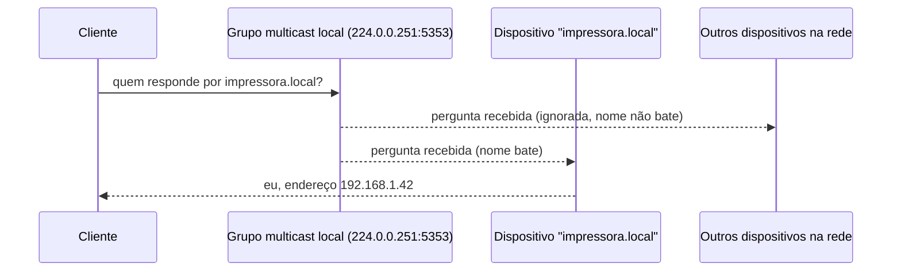

> **Para quem é:** quem já entende resolver, autoridade, zonas e delegação (as páginas anteriores desta trilha) e se depara com um dispositivo respondendo por `algumacoisa.local` sem nenhum servidor DNS configurado em lugar nenhum.

Toda página anterior desta trilha presume infraestrutura: um resolvedor recursivo em algum lugar, uma zona com autoridade definida, um caminho de delegação até a raiz. **mDNS** (Multicast DNS) resolve exatamente o caso em que essa infraestrutura não existe: uma impressora recém-ligada numa rede doméstica, sem nenhum servidor DNS configurado, ainda assim responde por um nome como `impressora.local` para qualquer dispositivo na mesma rede local. Entender como isso funciona exige abandonar, por um momento, o modelo de resolução das páginas anteriores: não há resolvedor recursivo, não há autoridade centralizada, não há delegação.

## Como funciona sem servidor

Um dispositivo com suporte a mDNS não espera ser consultado por um cliente específico; ele participa de um grupo multicast na rede local (o endereço `224.0.0.251` para IPv4, `ff02::fb` para IPv6, porta UDP 5353) e responde diretamente quando alguém pergunta por seu próprio nome. Quando um cliente precisa resolver `impressora.local`, ele não envia a pergunta a um resolvedor único; envia um pacote multicast para toda a rede local, perguntando "quem responde por este nome?", e o próprio dispositivo dono do nome responde diretamente, sem intermediário.

Esse desenho inverte a relação de confiança do DNS tradicional: em vez de confiar numa cadeia de servidores até uma autoridade conhecida (o problema que o [DNSSEC](../dnssec/) endereça), um cliente mDNS confia em qualquer dispositivo que responda afirmando ser o dono do nome perguntado, o que só é uma decisão de risco aceitável porque o alcance é limitado à rede local (multicast não atravessa roteadores por padrão) e porque o domínio `.local` (reservado pela RFC 6762 especificamente para esse uso) nunca deveria resolver através de um resolvedor recursivo tradicional. É exatamente esse conflito de sufixo que o guia [configurar CoreDNS para resolução interna](../../../../guides/tasks/networking/setup-coredns-internal/) evita deliberadamente, usando `.internal` (RFC 9476) em vez de `.local` para zonas administrativas de cluster: declarar uma zona `.local` num resolvedor tradicional colide com o espaço de nomes que qualquer estação com mDNS ativo já espera resolver por multicast, não por um servidor configurado.

## DNS-SD: descoberta de serviço, não só de nome

mDNS sozinho resolve "qual é o endereço deste nome", o mesmo problema de sempre, só que sem servidor. **DNS-SD** (DNS-based Service Discovery, RFC 6763) resolve um problema mais amplo, que também pode reaproveitar mDNS como transporte: "quais serviços de um determinado tipo existem nesta rede, e como me conectar a cada um". A ideia central do DNS-SD é elegante o suficiente para valer a pena explicar: ele reaproveita os tipos de registro DNS já existentes, sem inventar um formato novo, para responder a essa pergunta.

Um serviço se anuncia sob um nome no formato `_serviço._protocolo.domínio` (o mesmo formato de nome que o registro `SRV`, já visto em [zonas, delegação e tipos de registro](../zones-and-records/), usa). Uma consulta por `PTR` nesse nome devolve a lista de instâncias específicas daquele tipo de serviço disponíveis (por exemplo, todas as impressoras da rede anunciando `_ipp._tcp.local`); para cada instância encontrada, uma consulta `SRV` devolve o host e a porta reais, e uma consulta `TXT` devolve metadados adicionais específicos do serviço (capacidades, versão, caminho). O resultado é descoberta de serviço completa (o quê, onde, como) construída inteiramente a partir de tipos de registro que já existiam antes do DNS-SD ser especificado, sem exigir nenhum novo tipo de registro DNS.

## Bonjour: o nome comercial, não uma tecnologia própria

**Bonjour** é o nome que a Apple dá à sua implementação de mDNS e DNS-SD, integrada ao macOS, iOS e a diversos produtos de terceiros que licenciam a implementação de referência da Apple (mDNSResponder). Não é um protocolo próprio nem uma tecnologia distinta: é uma marca comercial sobre exatamente os dois protocolos já descritos nesta página. A confusão é comum porque muitos usuários encontram o nome "Bonjour" antes de saberem que ele é mDNS/DNS-SD por baixo, especialmente ao instalar software da Apple no Windows, onde o instalador do iTunes historicamente também instalava o serviço Bonjour como dependência separada.

## Avahi: a implementação de referência no Linux

No Linux, **Avahi** é a implementação de referência de mDNS/DNS-SD, presente por padrão em muitas distribuições desktop para permitir descoberta automática de impressoras, compartilhamentos de arquivo e outros serviços na rede local. Em um nó de cluster, esse mesmo serviço é candidato natural a desabilitar: um servidor não precisa anunciar ou descobrir impressoras na rede, e o [guia de desabilitar serviços desnecessários do host](../../../../guides/tasks/host/disable-unnecessary-services/) já lista o Avahi entre os serviços tipicamente presentes em imagens desktop que competem por CPU e memória com o K3s sem cumprir função no papel de servidor.

## Por que este assunto está aqui, e não no resto da trilha

Esta página quebra deliberadamente o padrão do restante da Fase 15: onde as páginas anteriores presumem resolver, autoridade e delegação, mDNS/DNS-SD funcionam exatamente porque abrem mão de toda essa infraestrutura. Vale a pena entender os dois modelos lado a lado, mas não como alternativas intercambiáveis: mDNS resolve o problema de "rede local sem nenhuma infraestrutura de DNS configurada" (o caso comum de uma rede doméstica com dispositivos plug-and-play); o resto desta trilha resolve o problema de "rede com infraestrutura de DNS deliberadamente operada" (o caso comum de qualquer domínio público ou zona administrativa de um cluster). Um ambiente pode ter os dois convivendo, desde que os domínios `.local` (mDNS) e o domínio real usado pela infraestrutura DNS nunca se sobreponham, o exato cuidado que o guia de CoreDNS já toma.

## Páginas relacionadas

- [Zonas, delegação e tipos de registro](../zones-and-records/): o formato de registro SRV que o DNS-SD reaproveita.
- [Configurar CoreDNS para resolução interna](../../../../guides/tasks/networking/setup-coredns-internal/): por que uma zona administrativa de cluster usa `.internal`, não `.local`, para não colidir com mDNS.
- [Desabilitar serviços desnecessários do host](../../../../guides/tasks/host/disable-unnecessary-services/): o Avahi como candidato a desabilitar num nó de cluster.

## Referências

- [RFC 6762 — Multicast DNS](https://www.rfc-editor.org/rfc/rfc6762): especificação completa do mDNS, incluindo a reserva do domínio `.local`.
- [RFC 6763 — DNS-Based Service Discovery](https://www.rfc-editor.org/rfc/rfc6763): especificação do DNS-SD sobre os tipos de registro PTR, SRV e TXT.
- [Avahi (documentação oficial)](https://www.avahi.org/): implementação de referência de mDNS/DNS-SD no Linux.
