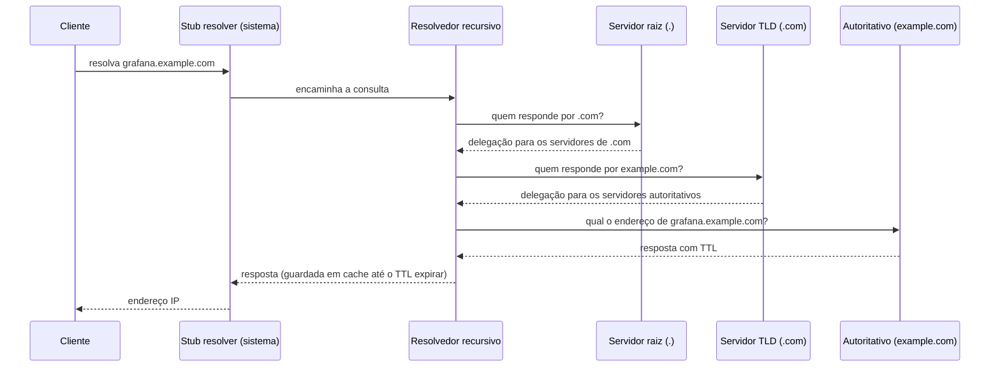

> **Para quem é:** quem já usa `dig`/`nslookup` no dia a dia mas nunca viu o que acontece entre digitar um domínio e receber um endereço IP de volta.

Uma consulta simples como `dig grafana.internal` devolve uma resposta em milissegundos, o que esconde uma cadeia de decisões: quem respondeu, se a resposta veio de um cache ou foi buscada de verdade, e quantos servidores diferentes foram consultados pelo caminho. Entender essa cadeia é o que separa "o DNS está falhando" de um diagnóstico específico (o resolvedor do sistema, o resolvedor recursivo da rede, ou a autoridade da zona), a distinção que todo o resto desta fase depende.

## Uma consulta que esconde o caminho

```bash
dig +noall +answer example.com
# example.com.  86400  IN  A  93.184.215.14
```

Essa saída não diz se a resposta veio de um cache local, de um cache do resolvedor da rede, ou de uma consulta completa até a autoridade da zona `example.com`. `+trace` reconstrói o caminho real, forçando o `dig` a começar pelos servidores raiz e seguir a cadeia de delegação manualmente, em vez de confiar num resolvedor recursivo para fazer isso por baixo:

```bash
dig +trace example.com
# consulta os servidores raiz (.), recebe a delegação para os servidores da TLD .com,
# consulta a TLD, recebe a delegação para os servidores autoritativos de example.com,
# consulta um desses servidores autoritativos, recebe a resposta final
```

O restante desta página explica cada um desses saltos, e por que, na prática, quase nenhuma consulta percorre esse caminho inteiro.

## Os dois papéis: resolver e nameserver

O DNS distingue dois papéis que frequentemente se confundem porque ambos "respondem a consultas DNS": um **resolver** (resolvedor) busca a resposta em nome de um cliente, potencialmente consultando vários outros servidores pelo caminho; um **nameserver autoritativo** guarda a informação de uma zona específica e a entrega diretamente, sem consultar mais ninguém. Um servidor pode acumular os dois papéis, o caso comum em homelab, mas conceitualmente são funções distintas: resolver decide "para onde perguntar"; autoritativo decide "qual é a resposta certa para esta zona".

## O caminho completo de uma consulta recursiva



Cada seta de "quem responde por" é uma **delegação**: um servidor pai não guarda os registros da zona filha, apenas aponta para quem guarda (o mecanismo exato, incluindo o registro NS e o glue record que evita uma referência circular, é o assunto de [zonas, delegação e tipos de registro](../zones-and-records/)). O servidor raiz não sabe o endereço de `example.com`; sabe apenas quais servidores respondem pela TLD `.com`. A TLD, por sua vez, não sabe o endereço final; sabe quais servidores são autoritativos para `example.com`. Só o último salto, o servidor autoritativo da zona, tem a resposta de fato.

## Cache e TTL: por que a maioria das consultas não percorre esse caminho

O caminho completo do diagrama acima só acontece quando nenhum servidor intermediário já tem a resposta em cache. Cada registro DNS carrega um **TTL** (Time To Live, em segundos) que diz por quanto tempo qualquer resolvedor pode reutilizar essa resposta sem consultar a autoridade de novo. Um TTL de `86400` (24 horas) significa que, depois da primeira consulta bem-sucedida, o resolvedor recursivo responde da própria memória para qualquer cliente que pergunte pelo mesmo nome, até o TTL expirar. Esse é o motivo pelo qual medir a latência de DNS (já coberto no [cookbook de comandos de DNS](../../../../toolbox/commands/dns/#medir-a-latência-de-uma-resolução)) mostra a primeira consulta bem mais lenta que as seguintes: só a primeira percorre a cadeia até a autoridade.

TTLs baixos (segundos a poucos minutos) fazem sentido para registros que mudam com frequência, como um endpoint atrás de um balanceador com failover ativo; TTLs altos (horas a dias) reduzem carga na infraestrutura de resolução para registros estáveis, ao custo de propagação mais lenta quando o registro muda. Baixar o TTL de um registro **antes** de uma migração planejada, e restaurá-lo depois, é uma prática comum para reduzir a janela em que clientes ainda respondem com o endereço antigo.

## O resolver do sistema não é o resolver da rede

Uma confusão comum ao diagnosticar DNS é tratar "o DNS não funciona" como um problema único, quando na prática existem pelo menos duas camadas de resolvedor entre um cliente e a internet: o **resolver do sistema operacional** (o "stub resolver") e o **resolvedor recursivo da rede**.

O stub resolver é a peça mais simples da cadeia: não faz recursão nenhuma, apenas encaminha toda consulta para o resolvedor configurado e devolve a resposta como veio. Em sistemas Linux tradicionais, essa configuração vive em `/etc/resolv.conf`, um arquivo de texto simples com uma ou mais linhas `nameserver`. Em distribuições que usam `systemd-resolved` (o caso comum hoje), `/etc/resolv.conf` costuma ser um link simbólico gerenciado automaticamente, e a configuração real por interface é consultada com `resolvectl status`, não editando o arquivo diretamente, porque qualquer edição manual tende a ser sobrescrita na próxima vez que o `systemd-resolved` atualiza o estado.

O resolvedor recursivo é a peça que efetivamente faz o trabalho descrito no diagrama de sequência: recebe a consulta do stub resolver (ou de outro cliente qualquer) e resolve o nome do zero, ou responde a partir do próprio cache se já tiver a resposta. Pode ser um serviço público (`8.8.8.8` do Google, `1.1.1.1` da Cloudflare), o resolvedor do provedor de internet, ou um resolvedor rodando na própria rede local, como o CoreDNS de um cluster K3s (o caso de [split-horizon DNS](../../split-horizon-dns/), onde o resolvedor recursivo interno responde de forma diferente do resolvedor público para o mesmo nome). Diagnosticar "para qual resolvedor a consulta está indo" antes de assumir que a autoridade da zona está com problema é o primeiro passo prático descrito no [fluxo de diagnóstico de rede no Linux](../../linux/diagnostics/): `dig @<IP>` (já coberto no cookbook) força a consulta contra um resolvedor específico, isolando se o problema está no resolvedor configurado ou mais adiante na cadeia.

## Validando o caminho depois de entender as peças

Com os papéis de stub resolver, resolvedor recursivo, delegação e cache explicados, a saída de `dig +trace` do início desta página fica legível como uma sequência de decisões, não como uma lista opaca de servidores:

```bash
dig +trace grafana.internal
```

Cada bloco da saída corresponde a um salto do diagrama de sequência: a seção inicial lista os servidores raiz consultados: a seguinte, a delegação recebida para a TLD (ou, no caso de um domínio interno sem TLD pública, o ponto em que a cadeia pública termina e um resolvedor interno como o CoreDNS assume a resposta); a última seção mostra a resposta final vinda diretamente do servidor autoritativo, sem passar pelo cache de um recursivo intermediário, já que `+trace` desativa esse atalho de propósito para expor o caminho completo.

## Páginas relacionadas

- [Zonas, delegação e tipos de registro](../zones-and-records/): o mecanismo de NS e glue record por trás de cada seta de delegação nesta página.
- [Split-horizon DNS](../../split-horizon-dns/): um caso real em que o resolvedor recursivo da rede responde diferente do público para o mesmo nome.
- [Fluxo de diagnóstico de rede no Linux](../../linux/diagnostics/): onde `dig @<resolvedor>` se encaixa na ordem geral de investigação de um problema de rede.
- [Comandos de DNS (cookbook)](../../../../toolbox/commands/dns/): sintaxe rápida de `dig`, `resolvectl` e medição de latência.

## Referências

- [RFC 1034 — Domain Names, Concepts and Facilities](https://www.rfc-editor.org/rfc/rfc1034): define os papéis de resolver e nameserver, e o modelo de delegação.
- [RFC 1035 — Domain Names, Implementation and Specification](https://www.rfc-editor.org/rfc/rfc1035): formato de mensagens, TTL e cache.
- [resolvectl(1) — man7.org](https://man7.org/linux/man-pages/man1/resolvectl.1.html): comandos de consulta e status do `systemd-resolved`.
- [resolv.conf(5) — man7.org](https://man7.org/linux/man-pages/man5/resolv.conf.5.html): formato e uso do arquivo de configuração do stub resolver.
