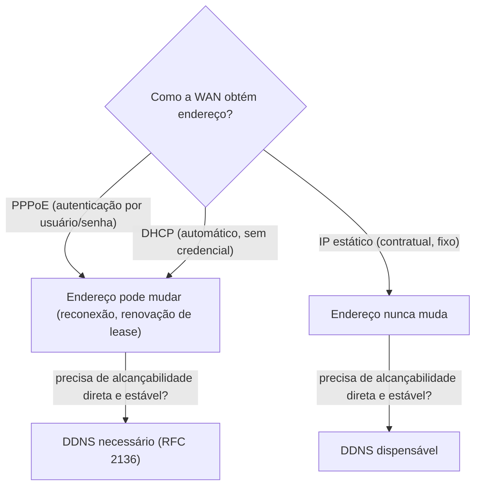

> **Para quem é:** quem já entende DNS dinâmico como resposta a "meu IP público muda" (discutido em páginas anteriores do notebook) e quer entender de onde vem essa mudança, ou a ausência dela, no ponto de partida da rede.

Toda página desta trilha presume que um host já tem acesso à internet antes de fazer qualquer consulta DNS. Essa suposição esconde uma decisão anterior, tomada uma vez na configuração do roteador de borda: como esse roteador obtém seu próprio endereço IP público. Essa decisão, mais do que qualquer configuração de DNS em si, é o que determina se um operador precisa de DNS dinâmico para expor um serviço, o problema que [DDNS](../../fundamentals/exposure-tunnels/#ddns-a-alternativa-quando-existe-ip-público-só-que-instável) já resolve na Fase 14 desta documentação.

## PPPoE: autenticação antes de qualquer endereço

**PPPoE** (Point-to-Point Protocol over Ethernet, RFC 2516) é o protocolo que muitos provedores de fibra e DSL exigem na porta WAN antes de entregar qualquer endereço IP: o roteador do cliente autentica com usuário e senha fornecidos pelo provedor, encapsulando quadros PPP dentro de Ethernet, e só depois dessa autenticação bem-sucedida recebe um endereço IP (tipicamente via um mecanismo de configuração dentro do próprio PPP, não um DHCP separado). A diferença prática mais visível de PPPoE frente aos outros dois modos desta página é a exigência de credenciais: sem usuário e senha corretos configurados no roteador, a conexão nunca sobe, mesmo com o cabeamento físico perfeito. Provedores que usam PPPoE normalmente fazem isso para controlar acesso por assinante na própria camada de enlace, antes de qualquer endereçamento IP entrar em jogo.

## DHCP: o modo automático mais comum

**DHCP** (Dynamic Host Configuration Protocol, RFC 2131) é o modo mais comum em conexões a cabo, e cada vez mais comum em fibra também: o roteador de borda simplesmente pede um endereço na porta WAN, sem autenticação de usuário/senha na camada de enlace, e o provedor responde com IP, máscara, gateway e servidores DNS recomendados, da mesma forma que qualquer dispositivo numa rede local recebe endereço de um roteador doméstico. A diferença central entre DHCP e PPPoE não é técnica de endereçamento, é de controle de acesso: DHCP identifica o assinante por outros meios (endereço MAC registrado, autenticação na própria infraestrutura física do provedor), enquanto PPPoE exige uma credencial explícita configurada no equipamento do cliente.

## IP estático: o único modo que dispensa DDNS

O terceiro modo não depende de negociação nenhuma: o provedor atribui, contratualmente, um endereço IP fixo, configurado manualmente no roteador (ou entregue sempre igual via DHCP, o que produz o mesmo efeito prático). É o único dos três modos em que o endereço público nunca muda sem aviso, e por isso é o único que dispensa DDNS por completo: se o problema que DDNS resolve é "o IP muda e o registro DNS precisa acompanhar", um IP que nunca muda elimina o problema pela raiz, não apenas mitiga.

Essa é exatamente a mesma lógica já aplicada ao endereçamento IPv6 delegado por DHCPv6-PD, coberta em [o problema do prefixo público rotacionado](../../fundamentals/ipv4-and-ipv6/#o-problema-do-prefixo-público-rotacionado): um prefixo IPv6 que pode ser reatribuído pelo provedor é, na prática, o mesmo problema de um IPv4 dinâmico via PPPoE ou DHCP, só que em escala de bloco em vez de endereço único. Em ambos os casos, a resposta operacional é a mesma: ou o plano interno se apoia em algo que não muda com a WAN (ULA no caso do IPv6, um registro DNS atualizado dinamicamente no caso geral), ou o operador aceita a instabilidade e resolve alcançabilidade de outra forma, como um [túnel de exposição](../../fundamentals/exposure-tunnels/) que nunca depende do IP público do lado exposto permanecer o mesmo.

## Uma nota sobre SFP+

**SFP+** é um padrão de transceptor óptico (ou, com um módulo específico, elétrico) usado para uplinks de 10 Gigabit Ethernet, comum em roteadores de borda dedicados e switches de homelab mais sérios, ao lado das portas RJ45 tradicionais. Os sistemas operacionais de rede dedicados já cobertos em [plataformas dedicadas de rede](../../fundamentals/dedicated-network-platforms/) (RouterOS, pfSense) frequentemente oferecem uma porta SFP+ justamente para o uplink WAN de maior capacidade, quando o provedor entrega uma conexão de fibra mais rápida do que uma porta Gigabit comum comporta. Esta página não aprofunda óptica, tipos de módulo (SR, LR) ou cabeamento; o ponto relevante aqui é só reconhecer o termo e seu papel: uma camada puramente física, independente de qual dos três modos (PPPoE, DHCP, estático) opera sobre ela.

## Páginas relacionadas

- [DDNS: a alternativa quando existe IP público, só que instável](../../fundamentals/exposure-tunnels/#ddns-a-alternativa-quando-existe-ip-público-só-que-instável): o problema que PPPoE/DHCP tornam relevante, e que IP estático dispensa.
- [O problema do prefixo público rotacionado](../../fundamentals/ipv4-and-ipv6/#o-problema-do-prefixo-público-rotacionado): a mesma lógica de instabilidade de endereço, aplicada a um prefixo IPv6 delegado.
- [Plataformas dedicadas de rede](../../fundamentals/dedicated-network-platforms/): RouterOS e pfSense, onde uma porta SFP+ de uplink WAN normalmente aparece.

## Referências

- [RFC 2516 — A Method for Transmitting PPP Over Ethernet (PPPoE)](https://www.rfc-editor.org/rfc/rfc2516): especificação do PPPoE.
- [RFC 2131 — Dynamic Host Configuration Protocol](https://www.rfc-editor.org/rfc/rfc2131): especificação do DHCP.
