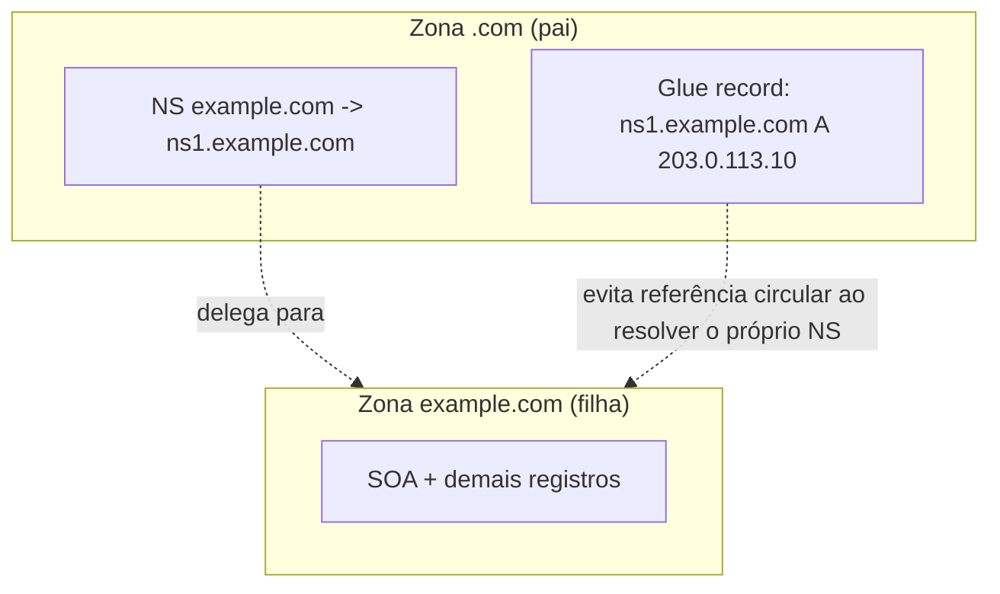

> **Para quem é:** quem já entende o caminho de uma consulta (a página anterior desta trilha) e precisa saber o que de fato existe dentro de uma zona: quem é dono dela, como ela delega parte do espaço de nomes para outra zona, e o que cada tipo de registro guarda.

A [página anterior](../resolution/) tratou delegação como uma seta em um diagrama: "o servidor raiz aponta para quem responde por `.com`". Essa seta é, na prática, um registro DNS como qualquer outro, guardado dentro de uma zona, e o mecanismo que a torna confiável (sem criar uma referência circular) é um detalhe que vale entender antes de configurar qualquer zona de verdade.

## O que é uma zona

Uma **zona** é a porção do espaço de nomes DNS pela qual um conjunto específico de servidores é autoritativo. `example.com` é uma zona; `sub.example.com`, se for delegada separadamente, é outra zona distinta, mesmo fazendo parte do mesmo domínio visualmente. Essa distinção importa porque autoridade é definida por zona, não por domínio: um servidor pode ser autoritativo para `example.com` sem saber nada sobre os registros de `sub.example.com`, se essa parte foi delegada para outro conjunto de servidores.

Toda zona começa com um registro **SOA** (Start of Authority), que não aponta para um endereço, mas descreve a própria zona: qual servidor é a fonte primária dos dados, um endereço de contato do responsável, um número de série (incrementado a cada mudança, usado por servidores secundários para saber se precisam sincronizar), e um conjunto de temporizadores que controlam replicação e expiração entre um primário e seus secundários. Um resolvedor recursivo comum nunca precisa interpretar o SOA em detalhe; ele importa principalmente para quem opera a zona.

## Delegação: o registro NS e o problema do glue

**Delegar** uma zona significa apontar, a partir da zona pai, para os servidores responsáveis pela zona filha, através de um ou mais registros **NS** (Name Server). Quando o servidor raiz "delega" `.com` para seus servidores de TLD, o que existe de fato é um conjunto de registros NS na zona raiz, cada um apontando para o nome de um servidor de TLD.

Esse mecanismo esconde um problema sutil quando o próprio servidor de nomes de uma zona tem um nome dentro dela: para delegar `example.com` a um servidor chamado `ns1.example.com`, o resolvedor precisaria primeiro descobrir o endereço IP de `ns1.example.com`, o que normalmente exigiria consultar a zona `example.com`, exatamente a zona que ainda não foi possível alcançar. Esse ciclo é resolvido por um **glue record**: um registro A (ou AAAA) do servidor de nomes, publicado diretamente na zona pai, junto com o NS, entregue na mesma resposta de delegação para que o resolvedor nunca precise fechar o ciclo. Glue records só são necessários quando o nome do servidor está dentro (ou abaixo) da própria zona que ele serve; um servidor de nomes com nome fora dessa zona (por exemplo, `ns.outroprovedor.net` respondendo por `example.com`) não precisa de glue, porque seu endereço já é resolvível normalmente, sem depender da zona delegada.

## Os tipos de registro que este notebook usa

Um resolvedor devolve tipos diferentes de registro dependendo do que foi perguntado; a tabela a seguir cobre os tipos que aparecem em uso real neste notebook, não o conjunto completo definido pela IANA.

| Tipo | O que guarda | Uso típico |
| --- | --- | --- |
| `A` | Endereço IPv4 | Aponta um nome para um host ou serviço IPv4. |
| `AAAA` | Endereço IPv6 | Equivalente ao `A` para IPv6. |
| `CNAME` | Um alias para outro nome | Redireciona a resolução de um nome inteiro para outro; não pode coexistir com outros registros no mesmo nome, o motivo pelo qual o apex de um domínio raramente usa CNAME. |
| `TXT` | Texto arbitrário | SPF, DKIM, tokens de verificação de propriedade, e o desafio DNS-01 do ACME que o cert-manager usa para provar controle de um domínio antes de emitir um certificado. |
| `MX` | Servidor de e-mail, com prioridade | Onde entregar e-mail para esse domínio; prioridade menor indica preferência maior. |
| `SRV` | Serviço, protocolo, prioridade, peso, porta e alvo | Descoberta de serviço genérica (o formato `_serviço._protocolo.nome`), usada por protocolos como SIP e XMPP para localizar servidores sem depender de porta fixa. |
| `CAA` | Quais autoridades certificadoras podem emitir certificado para o nome | Restringe emissão de certificado TLS a CAs autorizadas explicitamente; um `ClusterIssuer` do cert-manager emitindo via Let's Encrypt depende implicitamente de a zona não ter um CAA que exclua essa CA. |

O registro `CAA` (RFC 8659) merece destaque por ser o único desta lista pensado puramente como controle de segurança, não como dado de roteamento: ele não muda para onde o tráfego vai, apenas quem tem permissão de emitir certificado para o nome. Um domínio sem nenhum registro CAA permite qualquer CA pública; publicar `example.com. CAA 0 issue "letsencrypt.org"` restringe a emissão a essa CA específica, reduzindo a superfície de um certificado fraudulento emitido por engano ou comprometimento em outra CA. A instalação do cert-manager já coberta em [cert-manager, instalação e diagnóstico](../../../../guides/tasks/certificates/install-cert-manager/) não configura CAA por si só; é uma camada adicional e opcional que o operador da zona decide publicar.

## DNS reverso: o registro PTR

Todos os tipos acima resolvem um nome para um dado. O **PTR** faz o caminho oposto: resolve um endereço IP de volta para um nome, através de uma zona especial (`in-addr.arpa` para IPv4, `ip6.arpa` para IPv6) cujo espaço de nomes é construído a partir do próprio endereço, com os octetos invertidos. Configurar um PTR corretamente depende de quem controla a zona reversa do bloco de IP, tipicamente o provedor de hospedagem ou o RIR responsável pelo bloco, não o dono do domínio direto.

Na prática, PTR tem dois usos concretos que justificam mantê-lo correto: servidores de e-mail SMTP frequentemente rejeitam ou penalizam conexões de um IP sem PTR configurado (ou com um PTR que não bate com o nome anunciado no HELO), porque a ausência de reverso é um sinal comum de infraestrutura mal configurada ou usada por spam; e ferramentas de log e observabilidade usam PTR para resolver o IP de origem de uma conexão de volta a um nome legível, poupando o operador de decorar endereços numéricos ao investigar tráfego. Fora desses dois casos, PTR raramente é crítico, e muitos ambientes internos (como a rede de pods de um cluster) simplesmente não o configuram, sem prejuízo funcional.

## Páginas relacionadas

- [Resolução DNS: do stub resolver à resposta autoritativa](../resolution/): o caminho de consulta que percorre a cadeia de delegação (NS + glue) descrita aqui.
- [DNSSEC: cadeia de confiança e o que ela realmente protege](../dnssec/): como o registro DS, publicado ao lado do NS na zona pai, estende a delegação descrita aqui para uma cadeia de assinaturas verificável.
- [cert-manager, instalação e diagnóstico](../../../../guides/tasks/certificates/install-cert-manager/): o desafio DNS-01 (registro TXT) e a emissão de certificado que um registro CAA pode restringir.

## Referências

- [RFC 1035 — Domain Names, Implementation and Specification](https://www.rfc-editor.org/rfc/rfc1035): formato de zona, SOA, e os tipos de registro básicos (A, CNAME, MX, NS, PTR).
- [RFC 2181 — Clarifications to the DNS Specification](https://www.rfc-editor.org/rfc/rfc2181): define formalmente o conceito de zona como distinto de domínio.
- [RFC 2782 — A DNS RR for specifying the location of services (SRV)](https://www.rfc-editor.org/rfc/rfc2782): formato e uso do registro SRV.
- [RFC 8659 — DNS Certification Authority Authorization (CAA) Resource Record](https://www.rfc-editor.org/rfc/rfc8659): semântica do registro CAA.
