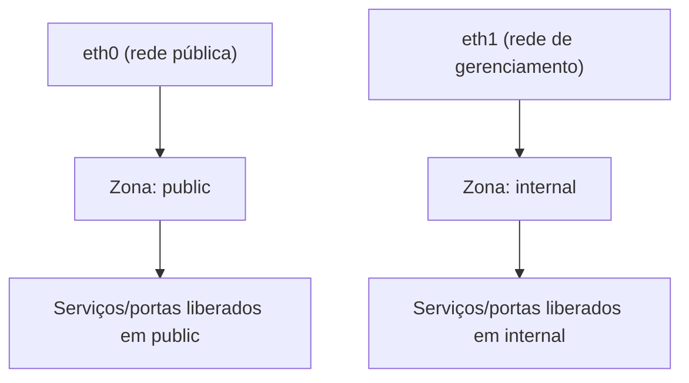

> **Para quem é:** quem vai configurar o firewall de um nó com firewalld e quer entender o modelo de zonas antes de aplicar regras. O procedimento fica em [firewall com firewalld](../../../../guides/tasks/host/configure-firewalld/).

firewalld é uma interface de gerenciamento dinâmico de firewall, comum em distribuições da família RHEL, construída sobre [netfilter](../linux-firewall-fundamentals/) (via nftables em versões recentes). Diferente do modelo de lista única do UFW, o firewalld organiza regras por **zona**.

## Como funciona

Uma **zona** é um conjunto nomeado de regras associado a um nível de confiança: `public`, `internal`, `trusted`, `dmz`, entre outras predefinidas. Cada interface de rede (ou origem, identificada por endereço/rede) pertence a uma zona; o tráfego que chega por essa interface é avaliado pelas regras da zona correspondente. Um host com uma interface pública e uma interface de gerenciamento privada pode associar cada uma a uma zona com nível de confiança diferente, sem precisar replicar exceções por interface em cada regra individual.

Dentro de uma zona, regras podem ser expressas como **serviços** (nomes predefinidos, como `ssh` ou `https`, que já sabem quais portas abrir), **portas** individuais, ou **rich rules**, uma sintaxe mais expressiva para condições que combinam origem, porta, protocolo e ação em uma única regra.

Uma distinção importante do firewalld é **runtime vs. permanent**: uma regra aplicada sem `--permanent` vale apenas para a configuração em memória atual e desaparece em um `--reload` ou reinício; uma regra com `--permanent` é gravada em disco, mas só passa a valer no runtime depois de um `--reload` (ou reinício) explícito. Uma regra pode existir em um estado e não no outro, o que é uma fonte comum de confusão ao diagnosticar "a regra sumiu".

## Alternativas

[UFW](../ufw/) usa uma lista linear de regras em vez de zonas: mais simples para um host com uma única política de confiança, menos expressivo quando interfaces diferentes precisam de tratamento diferente. Veja a [comparação entre os dois](../ufw-vs-firewalld/).

## Quando usar

O modelo de zonas compensa em hosts com múltiplas interfaces de rede que exigem níveis de confiança distintos, ou em ambientes onde a convenção da distribuição/equipe já é firewalld. Misturar as duas ferramentas no mesmo host não é recomendado.

## Quando evitar

Para um host simples de nó único com uma única interface relevante, o modelo de zonas adiciona um conceito a mais sem benefício correspondente: UFW resolve o mesmo caso com menos partes móveis.

## Decisões que isso implica

Escolher firewalld significa não rodar UFW no mesmo host, e lembrar de sempre combinar `--permanent` com `--reload` ao tornar uma regra persistente. Esquecer um dos dois é a causa mais comum de "a regra não aplica" ou "a regra some depois de reiniciar".

## Páginas relacionadas

- [Firewall com firewalld (procedimento)](../../../../guides/tasks/host/configure-firewalld/)
- [Fundamentos de firewall no Linux](../linux-firewall-fundamentals/)
- [UFW](../ufw/)

## Referências

- [Conceitos do firewalld (documentação oficial)](https://firewalld.org/documentation/concepts.html): descreve o modelo de zonas e níveis de confiança.
- [Zones (firewalld)](https://firewalld.org/documentation/zone/): detalha a associação entre interfaces, origens e zonas.
- [`firewall-cmd(1)` (documentação oficial do firewalld)](https://firewalld.org/documentation/man-pages/firewall-cmd.html): referência das configurações de runtime e permanentes.
