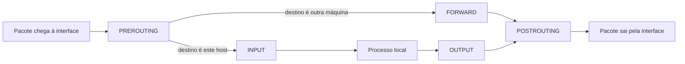

> **Para quem é:** quem vai configurar UFW ou firewalld em um nó de cluster e quer entender o que essas ferramentas fazem por baixo, em vez de copiar comandos sem saber o efeito real.

O firewall de um host Linux moderno não é uma ferramenta única: é uma camada do kernel (netfilter) que outras ferramentas configuram. UFW, firewalld, Docker e o próprio kube-proxy do Kubernetes não implementam filtragem de pacotes cada um à sua maneira; todos geram regras para o mesmo subsistema. Entender essa camada comum explica por que UFW e firewalld não devem rodar juntos, e por que uma regra do Docker pode aparecer "por baixo" de uma política que parecia bloquear tudo.

## Como funciona

**Netfilter** é o framework do kernel Linux que intercepta pacotes de rede em pontos específicos do caminho que eles percorrem: os **hooks** `PREROUTING`, `INPUT`, `FORWARD`, `OUTPUT` e `POSTROUTING`. Cada hook representa um momento diferente na vida de um pacote: antes de decidir o roteamento, ao chegar destinado ao próprio host, ao ser encaminhado para outro destino, ao sair originado do próprio host, e depois de roteado.

**nftables** é a ferramenta atual de espaço de usuário para configurar netfilter, sucessora do **iptables**. Ambas manipulam as mesmas estruturas do kernel; distribuições recentes (incluindo Debian 12) usam nftables por padrão, com uma camada de compatibilidade (`iptables-nft`) para comandos e scripts escritos para a sintaxe antiga.

Uma **chain** é uma lista ordenada de regras associada a um hook. Um pacote percorre a chain regra por regra até encontrar uma correspondência com uma decisão terminal (`ACCEPT`, `DROP`, `REJECT`) ou chegar ao fim, quando a política padrão da chain se aplica. `FORWARD` é o hook relevante para tráfego entre containers e entre Pods: pacotes que passam pelo host sem serem destinados a ele.

**NAT** (Network Address Translation) e **masquerading** reescrevem endereços de origem ou destino de um pacote. O masquerading é o mecanismo que permite que Pods e containers, com endereços privados, iniciem conexões para fora da máquina usando o IP público do host como origem aparente; sem ele, uma resposta não saberia por onde voltar.

## Relação com containers e Kubernetes

Docker e o CNI do Kubernetes (incluindo o Flannel usado pelo K3s) gerenciam suas próprias regras nas chains `FORWARD`, `PREROUTING` e `POSTROUTING` para rotear tráfego entre containers/Pods e para aplicar NAT quando necessário. Essas regras coexistem com as adicionadas por UFW ou firewalld, mas a ordem de avaliação importa: uma regra de container inserida antes da política do firewall de borda pode aceitar um pacote que o operador esperava ver bloqueado.

Esse é o motivo prático por trás do aviso em [portas publicadas pelo Docker](../docker-published-ports/): o Docker manipula netfilter diretamente e nem sempre respeita a política padrão configurada via UFW.

## Alternativas

UFW e firewalld são interfaces de mais alto nível sobre nftables, cada uma com seu próprio modelo mental. Veja [UFW](../ufw/), [firewalld](../firewalld/) e a [comparação entre os dois](../ufw-vs-firewalld/). Nenhuma delas substitui o entendimento de netfilter quando o comportamento observado não bate com a regra configurada na ferramenta de alto nível.

## Quando usar

Entender esta camada é necessário sempre que uma regra de UFW/firewalld parecer não ter efeito, quando outra ferramenta (Docker, K3s) também manipula firewall no mesmo host, ou ao diagnosticar por que um pacote está sendo aceito ou rejeitado de forma inesperada.

## Quando evitar

Editar regras nftables/iptables diretamente em um host gerenciado por UFW ou firewalld cria uma segunda fonte de verdade para o firewall: as duas camadas podem se sobrescrever sem aviso. Prefira sempre a ferramenta de alto nível já adotada no host; use o conhecimento desta página para diagnóstico, não para edição direta rotineira.

## Páginas relacionadas

- [Firewall com UFW](../../../../guides/tasks/host/configure-ufw/)
- [Firewall com firewalld](../../../../guides/tasks/host/configure-firewalld/)
- [Portas publicadas pelo Docker](../docker-published-ports/)

## Referências

- [Netfilter: Packet Flow](https://www.netfilter.org/documentation/index.html#packet-flow): documentação oficial do projeto sobre hooks e o caminho de um pacote.
- [nftables Wiki: Quick Reference](https://wiki.nftables.org/wiki-nftables/index.php/Quick_reference-nftables_in_10_minutes): introdução prática à sintaxe e aos conceitos do nftables.
- [Packet filtering and firewalls (Docker Docs)](https://docs.docker.com/engine/network/packet-filtering-firewalls/): explica como o Docker manipula as chains do netfilter.
