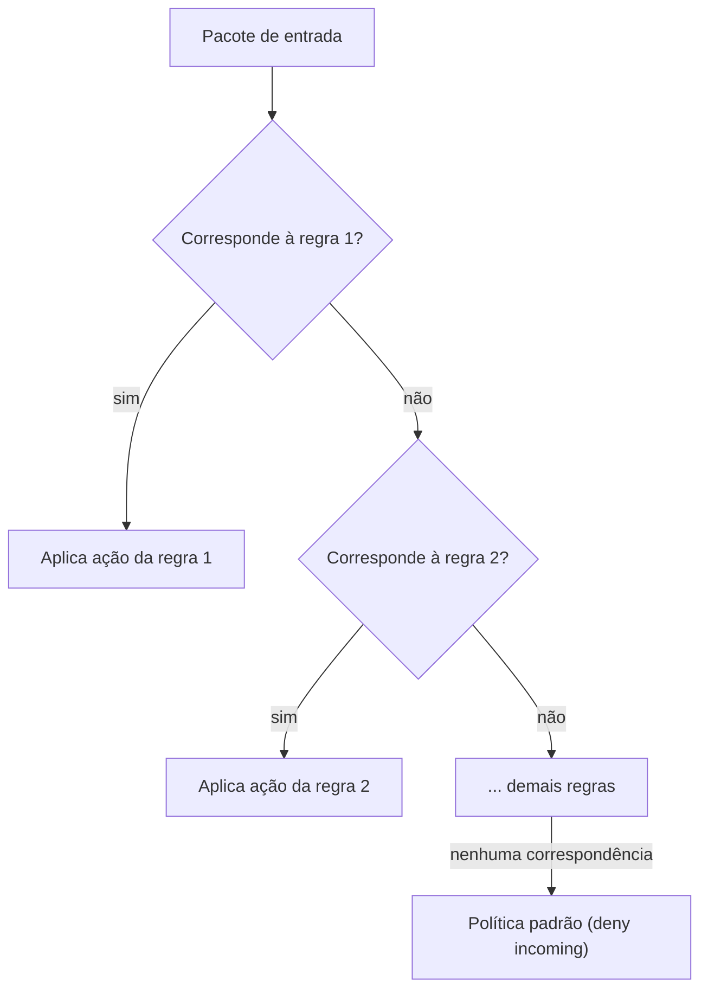

> **Para quem é:** quem vai configurar o firewall de um nó com UFW e quer entender o modelo antes de aplicar regras. O procedimento fica em [firewall com UFW](../../../../guides/tasks/host/configure-ufw/).

UFW (Uncomplicated Firewall) é uma interface de linha de comando sobre [netfilter](../linux-firewall-fundamentals/), pensada para configurar um firewall de host único com uma sintaxe curta, sem exigir conhecimento direto de nftables/iptables.

## Como funciona

O modelo do UFW é uma lista simples de regras, avaliada na ordem em que aparecem, mais uma **política padrão** por direção (`incoming`, `outgoing`, `routed`) aplicada quando nenhuma regra corresponde ao pacote. A convenção recomendada, e usada neste notebook, é `deny incoming` / `allow outgoing`: bloquear tudo que chega por padrão e liberar explicitamente o necessário.

Uma regra pode ser restrita por porta, protocolo, interface de entrada e endereço/rede de origem. Regras adicionadas com o UFW já ativo têm efeito imediato; mudanças na política padrão exigem `ufw reload` (ou reinicialização do serviço) para valer para as conexões novas.

Por baixo, o UFW gera regras iptables/nftables: `ufw status verbose` mostra o resultado em sua própria sintaxe, mas o efeito real está nas chains do kernel. Isso explica a interação com Docker descrita em [portas publicadas pelo Docker](../docker-published-ports/): o Docker insere suas próprias regras de `FORWARD`, que podem processar um pacote antes ou de forma independente das regras geradas pelo UFW.

## Alternativas

[firewalld](../firewalld/) organiza regras por zona em vez de uma lista linear: mais expressivo para hosts com múltiplas interfaces de confiança distinta, mais complexo para um caso simples. Veja a [comparação entre os dois](../ufw-vs-firewalld/).

## Quando usar

UFW é adequado para um host com um conjunto pequeno e estável de portas liberadas: o caso comum de um nó de cluster K3s single-node ou de um servidor com poucos serviços expostos. A sintaxe curta reduz o risco de erro em operações simples.

## Quando evitar

Em hosts com várias interfaces de rede que exigem políticas de confiança diferentes (ex.: uma interface pública e uma interface de gerenciamento privada), o modelo de zonas do firewalld expressa essa diferença de forma mais direta do que regras individuais de interface no UFW.

## Decisões que isso implica

Escolher UFW significa não rodar firewalld no mesmo host: as duas ferramentas manipulam as mesmas regras nftables por baixo e podem se sobrescrever. Ver [portas publicadas pelo Docker](../docker-published-ports/) antes de considerar qualquer porta publicada pelo Docker protegida apenas pela política padrão do UFW.

## Páginas relacionadas

- [Firewall com UFW (procedimento)](../../../../guides/tasks/host/configure-ufw/)
- [Fundamentos de firewall no Linux](../linux-firewall-fundamentals/)
- [firewalld](../firewalld/)

## Referências

- [Firewall (Ubuntu Server documentation)](https://documentation.ubuntu.com/server/how-to/security/firewalls/): guia oficial de políticas, regras e integração de aplicações com UFW.
- [`ufw(8)` (Ubuntu Manpages)](https://manpages.ubuntu.com/manpages/noble/man8/ufw.8.html): referência completa da sintaxe e do comportamento das políticas.
