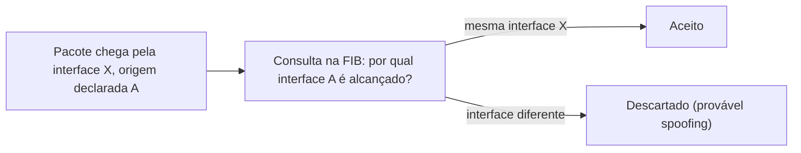

> **Para quem é:** quem já viu "modo BGP" mencionado na configuração do Flannel ou do MetalLB e quer entender o que um Sistema Autônomo é, e quem quer saber como a internet lida (ou deixa de lidar) com rotas anunciadas por quem não tem autorização, e com pacotes de endereço de origem forjado.

Este notebook trata majoritariamente de redes que um único operador controla de ponta a ponta: um cluster, uma VPN, uma rede overlay. BGP (Border Gateway Protocol) resolve um problema diferente, o de trocar rotas entre redes que pertencem a organizações diferentes e não confiam automaticamente umas nas outras, e é o protocolo que, na prática, forma o roteamento da internet pública entre provedores. As três ideias desta página (identidade de rede, prova de autorização de rota, e prova de que um pacote não foi forjado) formam a base de confiança sobre a qual esse roteamento entre organizações se apoia.

## AS e ASN: identidade de roteamento entre redes independentes

Um Sistema Autônomo (AS, Autonomous System) é, pela definição da RFC 1930, um grupo conectado de prefixos IP operado sob uma única política de roteamento clara. Na prática, cada provedor de internet, cada grande nuvem e cada organização que troca rotas diretamente com outras redes (em vez de simplesmente comprar trânsito de um único upstream) é um AS. O ASN (Autonomous System Number) identifica esse AS de forma única perante o BGP: sem um identificador único por AS, o protocolo não teria como expressar "esta rota veio por esta organização" nem detectar um loop de anúncio de rota passando pela mesma organização duas vezes.

Esse conceito aparece neste notebook porque nem todo uso de BGP acontece na internet pública. O Flannel, o CNI embutido no K3s, pode operar em modo BGP em vez do modo VXLAN mais comum (já discutido na página de [vizinhança e camada 2](../../linux/neighbors-and-l2/)); o [blueprint de requisitos de rede do K3s multinode](../../../../guides/blueprints/k3s-multinode/network-requirements/) já libera a porta 179 TCP para esse modo, embora registre que ele é raro nessa infraestrutura específica. Ferramentas de rede de cluster como o MetalLB também usam BGP, para anunciar os IPs de um `Service` do tipo `LoadBalancer` a um roteador de borda, em vez de depender de ARP/NDP gratuito como no modo L2 mais simples.

Redes que fazem esse uso interno de BGP, sem participar do roteamento global da internet, usam ASNs do intervalo reservado para uso privado pela RFC 6996: `64512`–`65534` no espaço de 16 bits tradicional, e uma faixa equivalente no espaço estendido de 32 bits (RFC 6793, que ampliou o campo de ASN depois que o espaço de 16 bits começou a ficar escasso). Esses ASNs privados funcionam exatamente como os blocos de IP privados da RFC 1918: identificam Sistemas Autônomos de forma consistente dentro de uma rede fechada, sem exigir alocação de um registro regional, contanto que nunca precisem ser únicos fora dela. Escolher um ASN privado para o Flannel em modo BGP ou para o MetalLB é, na prática, a mesma decisão que escolher um bloco `10.0.0.0/8`: um identificador que só precisa fazer sentido dentro da rede do cluster.

## RPKI: provando quem tem autorização para anunciar um prefixo

O BGP, do jeito descrito acima, opera sobre uma suposição de confiança que não é verificada por nenhum mecanismo do próprio protocolo: qualquer AS pode anunciar rotas para qualquer prefixo, e os demais ASes normalmente aceitam esse anúncio sem provar que quem anunciou tem autorização real sobre aquele bloco de endereços. Quando esse anúncio é falso, seja por erro de configuração, seja por má-fé, o efeito é um sequestro de rota (route hijack): tráfego destinado a um prefixo passa a ser atraído para uma rota que não deveria anunciá-lo, porque o BGP escolhe caminhos por critérios de política e comprimento de prefixo, não por prova de propriedade.

RPKI (Resource Public Key Infrastructure, RFC 6480) resolve exatamente essa lacuna, criando uma infraestrutura de chaves públicas que espelha a hierarquia de alocação de endereços IP e ASNs já existente (do IANA aos registros regionais, e destes aos detentores finais dos blocos). O documento central desse sistema é a ROA (Route Origin Authorization, RFC 6482): uma atestação assinada criptograficamente de que o detentor de um prefixo autorizou um ASN específico a originar rotas para ele, opcionalmente limitando até que comprimento de prefixo mais específico essa autorização vale. Um roteador (ou, mais comumente, um validador que alimenta o roteador) verifica a cadeia de certificados de uma ROA até uma raiz confiável, exatamente como a cadeia de confiança de um certificado TLS descrita na página de [TLS e mTLS](../tls-and-mtls/), e usa esse resultado (válido, inválido, ou sem ROA registrada) como insumo para decidir se aceita ou rejeita um anúncio BGP recebido. O RPKI não impede um AS mal-intencionado de anunciar o que quiser, ele dá aos demais ASes uma forma verificável de recusar anúncios que não batem com a autorização registrada pelo dono legítimo do prefixo.

## IP spoofing e validação de endereço de origem

Nada no cabeçalho de um pacote IP garante que o endereço de origem declarado é real: qualquer host na origem do caminho pode escrever ali o endereço que quiser, uma falsificação chamada de IP spoofing. Isso importa duplamente porque a suposição de que "quem responde a um pacote está confirmando que ele veio de você" é o que sustenta ataques de reflexão e amplificação: um atacante envia uma requisição pequena a um serviço de terceiros (um resolver DNS, um servidor NTP) com o endereço de origem falsificado para ser o da vítima, e o serviço envia a resposta, normalmente bem maior que a requisição, diretamente para a vítima, sem que o atacante precise ter largura de banda suficiente para gerar esse volume ele mesmo.

A defesa formalizada pela BCP 38 (RFC 2827), chamada de filtragem de entrada (ingress filtering), é conceitualmente simples: um roteador na borda de uma rede sabe, pela topologia, quais blocos de endereço são legitimamente originados atrás de cada interface de entrada; qualquer pacote chegando por uma interface com um endereço de origem que não pertence a esse bloco é descartado, porque não poderia ter vindo de lá de verdade. O uRPF (Unicast Reverse Path Forwarding, RFC 3704) implementa essa mesma ideia consultando a tabela de roteamento em vez de uma lista de prefixos configurada manualmente: no modo estrito, um pacote só passa se a interface por onde chegou for a mesma que o roteador usaria para responder ao endereço de origem dele, o que exige rotas simétricas e por isso serve melhor em bordas de rede com um único caminho; no modo permissivo, o roteador só confirma que existe alguma rota para aquele endereço de origem, sem exigir que seja pela mesma interface, adequado onde o roteamento é assimétrico entre provedores, ao custo de filtrar bem menos.

O Linux implementa uRPF nativamente através do parâmetro de kernel `rp_filter` (`net.ipv4.conf.*.rp_filter`), com os mesmos três modos: `0` desativa a verificação, `1` aplica o modo estrito e `2` aplica o modo permissivo, com o próprio kernel documentando o modo estrito como a prática recomendada para mitigar spoofing usado em DDoS. Esse é um mecanismo do kernel, avaliado antes de qualquer regra de nftables/iptables processar o pacote; a página de netfilter e nftables desta trilha detalha onde esse tipo de verificação se encaixa em relação às chains do netfilter propriamente ditas.

RPKI e uRPF/BCP 38 resolvem duas perguntas diferentes que soam parecidas: RPKI prova que um ASN tem autorização para anunciar um prefixo (a origem de uma rota é confiável); uRPF/BCP 38 confirma que um pacote chegando por uma interface tem um endereço de origem plausível dado o que a tabela de roteamento já sabe (o pacote não foi forjado no caminho). Um cluster ou uma rede pequena normalmente não opera RPKI diretamente (isso é responsabilidade de quem já fala BGP com a internet pública, como o provedor de trânsito), mas se beneficia dele indiretamente: uma internet com adoção ampla de RPKI sofre menos sequestros de rota que poderiam redirecionar tráfego destinado ao cluster para outro lugar.

## Páginas relacionadas

- [Vizinhança e camada 2](../../linux/neighbors-and-l2/): VXLAN como alternativa ao modo BGP do Flannel, e o EVPN do Proxmox SDN que combina os dois.
- [Requisitos de rede do blueprint K3s multinode](../../../../guides/blueprints/k3s-multinode/network-requirements/): a porta 179 TCP do modo BGP, aplicada na prática.
- [VPNs e redes overlay](../vpns-and-overlay-networks/): acesso administrativo a um cluster, o outro tipo de "rede sobre a rede" que este notebook trata.
- [TLS e mTLS](../tls-and-mtls/): a mesma lógica de cadeia de confiança até uma raiz, aplicada a certificados em vez de rotas.

## Referências

- [RFC 1930 — Guidelines for creation, selection, and registration of an Autonomous System (AS)](https://www.rfc-editor.org/rfc/rfc1930): definição de AS e do papel do ASN no BGP.
- [RFC 6996 — Autonomous System (AS) Reservation for Private Use](https://www.rfc-editor.org/rfc/rfc6996): faixas de ASN privado, 16 e 32 bits.
- [RFC 6480 — An Infrastructure to Support Secure Internet Routing](https://www.rfc-editor.org/rfc/rfc6480): visão geral do RPKI.
- [RFC 6482 — A Profile for Route Origin Authorizations (ROAs)](https://www.rfc-editor.org/rfc/rfc6482): estrutura formal de uma ROA.
- [RFC 2827 (BCP 38) — Network Ingress Filtering](https://www.rfc-editor.org/rfc/rfc2827): defesa contra IP spoofing na borda da rede.
- [RFC 3704 — Ingress Filtering for Multihomed Networks](https://www.rfc-editor.org/rfc/rfc3704): uRPF em modo estrito e permissivo.
- [kernel.org — ip-sysctl.txt](https://www.kernel.org/doc/Documentation/networking/ip-sysctl.txt): documentação oficial do parâmetro `rp_filter` do kernel Linux.
