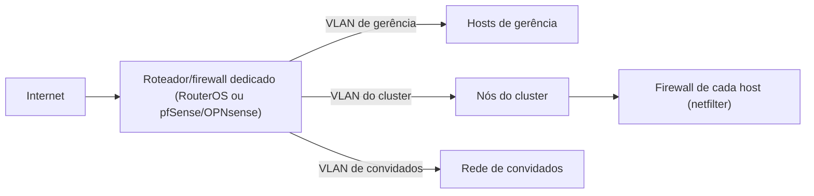

> **Para quem é:** quem está decidindo se a segmentação de rede de um homelab ou cluster deve viver num roteador/firewall dedicado, na frente de tudo, ou só no firewall de cada host, discutido em [fundamentos de firewall no Linux](../../firewalls/linux-firewall-fundamentals/).

Todas as páginas anteriores desta trilha tratam a rede a partir do host: como um host resolve nomes, estabelece TLS, entra numa VPN ou publica um serviço através de um túnel. Antes de qualquer pacote chegar a um host, porém, ele já atravessou algum equipamento de borda, o ponto que decide como a internet entra na rede local e como essa rede local se divide internamente. Um roteador doméstico comum resolve isso de forma limitada: NAT, uma única rede local, talvez uma exceção manual de porta. Quando o objetivo passa a ser segmentar redes de verdade (isolar a rede de gerência de um cluster da rede de convidados, por exemplo) ou aplicar política de firewall antes que o tráfego alcance qualquer host, a resposta comum em ambientes avançados e em homelabs mais sérios é um sistema operacional dedicado de rede, rodando num equipamento próprio ou numa VM com interfaces dedicadas.

## RouterOS: o sistema dos equipamentos MikroTik

RouterOS é o sistema operacional que a MikroTik desenvolve para sua própria linha de hardware (a série RouterBOARD) e que também roda em computadores x86 comuns, transformando qualquer máquina compatível num roteador dedicado. É construído sobre o kernel Linux (a base evoluiu de versões antigas do Linux 2.0/2.2, passando pelo 2.4 e 2.6, até o Linux 5.6 na versão 7 atual), mas o Linux por baixo é um detalhe de implementação: o RouterOS expõe sua própria interface de administração, seja pela ferramenta gráfica Winbox, pela interface web, ou por uma CLI própria com sintaxe hierárquica bem diferente da de `ip`/`nft` discutida nas páginas anteriores.

O que diferencia RouterOS de um roteador doméstico comum não é uma lista de features exclusivas, é a profundidade de cada uma: suporte a protocolos de roteamento dinâmico como OSPF e BGP (o mesmo BGP discutido em [BGP, AS e confiança de rota](../bgp-and-route-trust/), aqui aplicado dentro da própria rede do operador, não entre organizações independentes), um firewall com granularidade equivalente à do netfilter (chains, marcação de conexão, listas de endereços dinâmicas), VLANs completas via 802.1Q, modelagem de tráfego com HTB (Hierarchical Token Bucket) para priorizar ou limitar banda por interface, fila ou endereço, suporte nativo a VPN (WireGuard, OpenVPN, SSTP, GRE) e recursos de rede sem fio quando o hardware inclui rádio (ponto de acesso, backhaul entre prédios, hotspot com portal cativo e autenticação via RADIUS). Um roteador doméstico expõe uma fração pequena e simplificada desse conjunto, porque seu público não precisa configurar VLANs troncais ou uma rota BGP; o RouterOS assume que o operador sabe o que está fazendo e não esconde a complexidade.

## pfSense e a família baseada em FreeBSD

pfSense é uma distribuição de firewall e roteador construída sobre o FreeBSD, distribuída como uma imagem própria que se instala num equipamento dedicado, numa VM, ou em hardware embarcado, com toda a configuração feita por uma interface web que não exige conhecimento do sistema operacional por baixo. O conjunto de recursos cobre firewall stateful, VPN via IPsec e OpenVPN, NAT, VLANs (802.1Q), balanceamento e failover de múltiplos links de WAN, DNS dinâmico e portal cativo, com um sistema de pacotes que estende a instalação base (proxies, IDS/IPS, monitoramento) sem exigir compilação manual.

Em janeiro de 2015, um grupo de desenvolvedores criou o OPNsense como um fork do código-fonte do pfSense da época, motivado por divergências sobre o ritmo de atualização e a governança do projeto original. A separação ficou juridicamente marcada em novembro de 2017, quando um painel da OMPI (Organização Mundial da Propriedade Intelectual) decidiu que a Netgate, detentora dos direitos do pfSense, havia feito uso indevido das marcas do OPNsense e determinou a transferência de domínios para a Deciso, mantenedora do OPNsense. Do ponto de vista de quem escolhe hoje, os dois projetos convergiram para uma mesma categoria (firewall/roteador em FreeBSD, interface web, sistema de pacotes) e a decisão entre eles se resume a critérios como ritmo de lançamento, licenciamento de recursos avançados e preferência de interface, não a uma diferença fundamental de arquitetura.

## O que fica no equipamento de borda e o que fica no host

A pergunta prática para um homelab ou um cluster pequeno não é "RouterOS ou pfSense são melhores que o firewall do host", é onde cada camada de defesa faz mais sentido. Um roteador/firewall dedicado na borda resolve problemas que o firewall de um host individual, discutido em [fundamentos de firewall no Linux](../../firewalls/linux-firewall-fundamentals/), não alcança sozinho: segmentar VLANs antes que o tráfego chegue a qualquer host, aplicar uma política única para toda uma rede sem replicá-la em cada máquina, ou terminar VPNs de acesso administrativo num único ponto em vez de expor a porta em cada nó do cluster. O firewall do host continua necessário mesmo com um equipamento de borda bem configurado, porque ele é a última linha de defesa contra tráfego que já está dentro da rede segmentada (um host comprometido na mesma VLAN, por exemplo), o mesmo raciocínio de defesa em profundidade que já vale para netfilter dentro de um único host.

Um equipamento dedicado faz mais sentido a partir do momento em que existe mais de uma rede lógica para separar (gerência, cluster, convidados, uma DMZ) ou mais de um link de internet para gerenciar; um homelab de host único, sem VLANs, normalmente não precisa desse investimento adicional e resolve tudo no firewall do próprio host. Esta página não cobre procedimento de configuração de nenhuma das duas plataformas: o objetivo é situar onde essa camada entra na arquitetura de rede antes de decidir se ela é necessária.

## Páginas relacionadas

- [Fundamentos de firewall no Linux](../../firewalls/linux-firewall-fundamentals/): a camada equivalente dentro de um único host, complementar a um equipamento de borda, não substituída por ele.
- [BGP, AS e confiança de rota](../bgp-and-route-trust/): o mesmo BGP que o RouterOS pode falar, aqui explicado como protocolo entre organizações independentes.
- [VPNs e redes overlay](../vpns-and-overlay-networks/): WireGuard e OpenVPN, os mesmos protocolos que um RouterOS ou pfSense também podem terminar centralizadamente na borda.

## Referências

- [MikroTik: RouterOS — Wikipédia](https://en.wikipedia.org/wiki/RouterOS): base em kernel Linux, histórico de versões, conjunto de recursos (até a escrita; confira a documentação oficial em `help.mikrotik.com`/`manual.mikrotik.com` para detalhes de configuração e versão atual).
- [Netgate: pfSense](https://www.pfsense.org/): página oficial do projeto, posicionamento como plataforma de firewall/VPN/roteador.
- [pfSense — Wikipédia](https://en.wikipedia.org/wiki/PfSense): base em FreeBSD, histórico do fork do OPNsense em 2015 e a decisão da OMPI de 2017 (até a escrita; confira a documentação oficial em `docs.netgate.com` para procedimentos e versão atual).
- [k3s.guide — Kubernetes Homelab Guide](https://k3s.guide/): leitura complementar sobre a configuração prática de um MikroTik como borda de um homelab com K3s; sem licença explícita publicada, citado aqui como link, não como fonte de texto reaproveitado.
