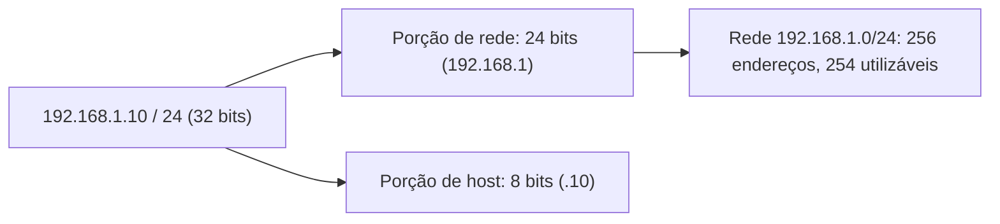
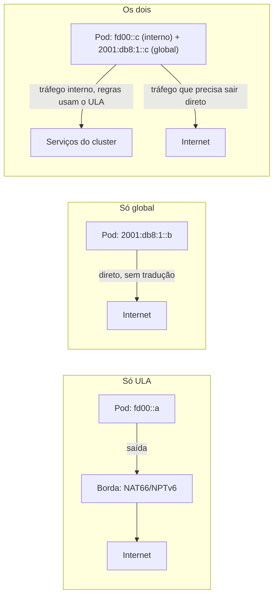

> **Para quem é:** quem já digitou um endereço como `192.168.1.10/24` sem parar para pensar no que o `/24` significa, ou quem precisa entender por que a rede de pods de um cluster K3s usa endereços que nunca aparecem "na internet de verdade".

Todo host que este notebook configura, do nó de um cluster K3s ao container que roda dentro dele, precisa de um endereço IP para ser alcançado. A forma como esses endereços são organizados em blocos, divididos entre redes e sub-redes, e traduzidos entre o que é roteável na internet pública e o que só existe atrás de um NAT é a base sobre a qual toda a rede Linux das próximas páginas desta fase se apoia. IPv4 continua sendo o protocolo dominante na prática, mas entender IPv6 deixou de ser opcional: qualquer host moderno já fala os dois por padrão.

## Endereçamento IPv4: de classes a CIDR

Um endereço IPv4 tem 32 bits, normalmente escrito como quatro octetos decimais separados por ponto (`192.168.1.10`). Nas décadas de 1980 e 1990, o espaço de endereços era dividido em classes fixas: Classe A reservava os primeiros 8 bits para a rede e os 24 restantes para hosts (até 16 milhões de endereços por rede), Classe B dividia 16/16, e Classe C dividia 24/8 (256 endereços por rede). Esse esquema desperdiçava endereços com facilidade: uma organização que precisasse de 300 hosts não cabia em uma Classe C e recebia uma Classe B inteira, sobrando mais de 65 mil endereços não utilizados.

O CIDR (Classless Inter-Domain Routing, RFC 4632) substituiu as classes fixas por uma notação de prefixo variável: `/N` indica quantos bits, a partir da esquerda, pertencem à rede; os bits restantes identificam hosts dentro dela. `192.168.1.0/24` reserva os primeiros 24 bits para a rede e os últimos 8 para hosts, resultando em 256 endereços (254 utilizáveis, descontando o endereço de rede e o de broadcast). `10.0.0.0/8` reserva só os primeiros 8 bits, sobrando 24 bits para hosts, mais de 16 milhões de endereços na mesma rede. As classes ainda aparecem como vocabulário histórico (o "Classe A" de `10.0.0.0/8`), mas nenhum roteador moderno decide alocação por classe; tudo é CIDR.

### Calculando rede, broadcast e sub-redes

Uma máscara de sub-rede é, na prática, uma sequência de bits 1 (a porção de rede) seguida de bits 0 (a porção de host); `/24` equivale à máscara `255.255.255.0`, `/26` equivale a `255.255.255.192`. Três operações bit a bit resolvem as perguntas mais comuns sobre um endereço com prefixo:

- **Endereço de rede**: aplicar E lógico (`AND`) entre o endereço e a máscara. Todos os bits de host viram zero. Para `192.168.1.10/26` (máscara `255.255.255.192`), o resultado é `192.168.1.0`.
- **Endereço de broadcast**: aplicar OU lógico (`OR`) entre o endereço de rede e o complemento da máscara (a máscara com os bits invertidos). Todos os bits de host viram um. Para o mesmo exemplo, o complemento de `/26` é `0.0.0.63`, e o broadcast é `192.168.1.63`.
- **Hosts utilizáveis**: `2^(32 - prefixo) - 2`. Os dois endereços subtraídos são o de rede e o de broadcast, que não podem ser atribuídos a um host. Para `/26`, `2^6 - 2 = 62` hosts utilizáveis, na faixa `192.168.1.1` a `192.168.1.62`.

Dividir uma rede maior em sub-redes menores (subnetting) significa aumentar o prefixo, emprestando bits que antes eram de host para a porção de rede. Um `192.168.1.0/24` dividido em quatro sub-redes de tamanho igual empresta 2 bits (`2^2 = 4` sub-redes), virando quatro blocos `/26`:

| Sub-rede | Endereço de rede | Faixa utilizável | Broadcast |
| --- | --- | --- | --- |
| 1 | `192.168.1.0/26` | `192.168.1.1`–`192.168.1.62` | `192.168.1.63` |
| 2 | `192.168.1.64/26` | `192.168.1.65`–`192.168.1.126` | `192.168.1.127` |
| 3 | `192.168.1.128/26` | `192.168.1.129`–`192.168.1.190` | `192.168.1.191` |
| 4 | `192.168.1.192/26` | `192.168.1.193`–`192.168.1.254` | `192.168.1.255` |

Cada bit emprestado dobra o número de sub-redes e reduz à metade os hosts por sub-rede; é a mesma troca que aparece ao comparar `10.0.0.0/24` (256 endereços, usado no [blueprint de rede do K3s multinode](../../../../guides/blueprints/k3s-multinode/network-requirements/)) com `10.42.0.0/16` (mais de 65 mil endereços, a faixa padrão de Pods do K3s): o prefixo menor deixa mais bits livres para hosts. Ferramentas como `ipcalc` fazem essas contas automaticamente; entender a operação bit a bit é o que permite conferir a saída de `ipcalc` em vez de confiar cegamente nela, e é indispensável para interpretar `ip route` e `ip rule` nas próximas páginas desta fase.

### Endereços privados e NAT

A RFC 1918 reserva três blocos de endereços IPv4 que nunca são roteados na internet pública, porque não pertencem a nenhuma organização: `10.0.0.0/8`, `172.16.0.0/12` e `192.168.0.0/16`. Qualquer rede doméstica, rede de laboratório ou rede interna de datacenter usa endereços desses blocos internamente. O exemplo `10.0.0.0/24` usado no [blueprint de requisitos de rede do K3s multinode](../../../../guides/blueprints/k3s-multinode/network-requirements/) vem exatamente desse espaço privado.

Como esses endereços não são roteáveis na internet, um host que só tem um endereço privado precisa de NAT (Network Address Translation) para iniciar conexões para fora: o roteador de borda reescreve o endereço de origem do pacote para o seu próprio endereço público antes de enviá-lo, e desfaz a tradução na resposta. Esse é o mesmo mecanismo de masquerading que a [base de firewall do Linux](../../firewalls/linux-firewall-fundamentals/) já descreve como o que permite Pods e containers, com endereços privados, alcançarem a internet usando o IP do host como origem aparente.

K3s aplica a mesma lógica dentro do cluster, em outra camada: por padrão, o Flannel (o CNI embutido no K3s) aloca endereços de Pod a partir de `10.42.0.0/16` e endereços de Service a partir de `10.43.0.0/16` (até a escrita; confirme os valores atuais nas [flags `--cluster-cidr` e `--service-cidr` da referência de CLI do servidor K3s](https://docs.k3s.io/cli/server), já que são configuráveis na instalação). Nenhum desses endereços é alcançável fora do cluster sem passar por um Service, um Ingress ou uma rota explícita; a rede de Pods é, na prática, mais um nível de espaço privado dentro do espaço privado do host.

Nem todo NAT é configurado manualmente pelo operador da rede. Dois protocolos permitem que um dispositivo dentro da rede local peça, ele mesmo, para que uma porta seja mapeada através do NAT, sem intervenção humana: **UPnP** (Universal Plug and Play), no perfil IGD (Internet Gateway Device), e o mais recente **PCP** (Port Control Protocol, RFC 6887), sucessor do NAT-PMP criado pela Apple. Os dois resolvem o mesmo problema, um host atrás de NAT conseguindo expor uma porta sem que o operador edite a configuração do roteador manualmente, mas com um custo de segurança real: por padrão, o UPnP não implementa nenhuma autenticação, então qualquer dispositivo na rede local, incluindo malware, pode solicitar o mesmo mapeamento de porta que uma aplicação legítima solicitaria, e falhas de implementação documentadas (como a vulnerabilidade CallStranger, de 2020) já permitiram abusar do mecanismo de subscrição de eventos do UPnP para amplificação de DDoS e exfiltração de dados; é por isso que guias de hardening de rede costumam recomendar desativar UPnP no roteador. PCP tem desenho mais restrito e mais fácil de auditar, mas o risco conceitual de fundo é o mesmo: qualquer dispositivo interno pode pedir exposição para fora sem que o operador aprove cada pedido individualmente.

### Endereços reservados para documentação

Ao escrever exemplos, comandos ou diagramas que precisam de um endereço IPv4 mas não podem sugerir um host real, a RFC 5737 reserva três blocos exatamente para isso: `192.0.2.0/24` (TEST-NET-1), `198.51.100.0/24` (TEST-NET-2) e `203.0.113.0/24` (TEST-NET-3). Este notebook usa esses blocos, e não endereços privados inventados, sempre que um exemplo precisar de um IP público fictício.

## Endereçamento IPv6

Um endereço IPv6 tem 128 bits, escrito em oito grupos de quatro dígitos hexadecimais separados por dois-pontos (`2001:0db8:0000:0000:0000:0000:0000:0001`), com duas convenções de abreviação: zeros à esquerda de cada grupo podem ser omitidos (`2001:db8:0:0:0:0:0:1`), e uma sequência de grupos totalmente zerados pode ser substituída por `::`, uma única vez por endereço (`2001:db8::1`). A RFC 3849 reserva `2001:db8::/32` para documentação, o equivalente IPv6 dos blocos TEST-NET do IPv4; este notebook usa esse prefixo nos próprios exemplos acima.

O espaço de 128 bits existe para resolver o problema que motivou toda a transição: os pouco mais de 4 bilhões de endereços IPv4 já se esgotaram como alocação livre nos registros regionais. Isso muda a arquitetura de rede em duas direções práticas. A primeira é que NAT deixa de ser uma necessidade estrutural: há endereços IPv6 suficientes para que cada host, incluindo cada dispositivo doméstico, tenha um endereço global roteável, então redes IPv6 tendem a depender de firewall com política de negação por padrão, não de NAT, para controlar quem inicia conexões de fora para dentro. A segunda é que a configuração de endereço ganha um mecanismo automático nativo: SLAAC (Stateless Address Autoconfiguration) permite que um host gere seu próprio endereço global a partir do prefixo anunciado pelo roteador e do seu identificador de interface, sem precisar de um servidor DHCP; DHCPv6 continua existindo como alternativa com estado, útil quando a rede precisa de controle centralizado sobre quais endereços são distribuídos (por exemplo, para manter correspondência estável entre um host e seu endereço em um inventário). Nenhuma das duas exclui a outra: redes reais frequentemente combinam SLAAC com anúncios de router advertisement e DHCPv6 só para opções adicionais, como servidores DNS.

Todo host Linux moderno já vem com a pilha IPv6 habilitada por padrão, o que significa que um serviço pode estar acessível por IPv6 mesmo quando o operador só pensou em configurar IPv4; um firewall configurado só com regras IPv4 (por exemplo, só via `iptables` sem o equivalente `ip6tables`, ou só a família `inet` do UFW sem cobrir IPv6) deixa uma rota de acesso sem filtro. O [blueprint de requisitos de rede do K3s multinode](../../../../guides/blueprints/k3s-multinode/network-requirements/) já trata esse ponto ao lembrar que cada regra de firewall precisa do equivalente em IPv6 quando o ambiente usa os dois protocolos.

### IPv6 não é IPv4 com mais bits

O erro mais comum de quem chega ao IPv6 vindo de anos de prática em IPv4 é tratar a mudança como se fosse só uma questão de tamanho: "o mesmo protocolo, só que com um número de 128 bits em vez de 32". Isso é falso em pontos estruturais, não cosméticos, e o efeito prático de carregar esse modelo mental errado é tentar recriar em IPv6 mecanismos do IPv4 que o próprio IPv6 eliminou ou substituiu por outra coisa, o que este notebook chama aqui de gambiarra: uma solução que funciona por acidente, resolve o sintoma errado, ou recria um problema que o protocolo já não tinha.

Algumas diferenças que não são sobre tamanho de endereço:

- **Não existe broadcast.** O IPv6 não tem um tipo de endereço de broadcast; tudo o que o broadcast fazia em IPv4 (incluindo a própria resolução de endereço de enlace) foi redesenhado sobre multicast.
- **ARP não existe.** A resolução entre endereço IP e endereço MAC é feita pelo NDP (Neighbor Discovery Protocol, RFC 4861), que roda sobre ICMPv6, não é um protocolo à parte como o ARP em IPv4. NDP também assume os papéis do ICMP Router Discovery e do ICMP Redirect do IPv4. Isso implica algo contraintuitivo para quem vem do IPv4: bloquear ICMPv6 inteiro num firewall, replicando o hábito antigo de "bloquear todo ICMP por segurança", quebra a própria capacidade da rede IPv6 de descobrir vizinhos e rotas, não é uma medida de dureza equivalente.
- **Só a origem fragmenta.** Um roteador IPv4 pode fragmentar um pacote grande demais no meio do caminho; um roteador IPv6 não pode (RFC 8200). A única fragmentação permitida acontece na origem, e a rede depende de Path MTU Discovery (PMTUD), que por sua vez depende de mensagens ICMPv6 "Packet Too Big" chegando de volta ao remetente. Bloquear ICMPv6 na borda, de novo, quebra PMTUD e produz conexões que travam silenciosamente em payloads grandes, um sintoma clássico de firewall configurado com reflexo de IPv4.
- **O roteador padrão não vem do DHCP.** Em IPv4, é comum o DHCP entregar o gateway padrão (a Option 3). Em IPv6, o DHCPv6 não tem nenhuma opção equivalente: o roteador padrão só é aprendido via Router Advertisement (RA), parte do NDP. DHCPv6 entrega endereços e opções auxiliares (como servidores DNS), mas nunca a rota padrão; configurar DHCPv6 esperando que ele substitua o DHCP do IPv4 por completo é outro tropeço recorrente.
- **O cabeçalho não tem checksum.** O cabeçalho IPv4 carrega um checksum que cada roteador recalcula a cada salto; o cabeçalho IPv6 não tem esse campo, porque a integridade já é responsabilidade da camada de enlace e das camadas superiores (o checksum de UDP, opcional em IPv4, passa a ser obrigatório em IPv6 por essa razão).
- **Múltiplos endereços por interface é o normal, não a exceção.** Uma interface IPv6 tipicamente carrega ao mesmo tempo um endereço link-local, um ou mais endereços globais, e opcionalmente um endereço temporário de privacidade (RFC 4941, que gera um identificador de interface rotativo para dificultar rastreamento por tempo). Ferramentas e scripts que assumem "a interface tem um IP" (um pressuposto razoável em IPv4) quebram silenciosamente diante dessa realidade.
- **Privado não significa escasso.** O bloco de endereços locais únicos (ULA, `fc00::/7`, detalhado adiante) existe para dar identidade estável e não roteável globalmente a uma rede interna, mas não nasceu de escassez de endereços como o RFC 1918 nasceu; nada impede, tecnicamente, que a mesma rede também tenha endereços públicos. Tratar ULA como "o RFC 1918 do IPv6" ajuda a entender a notação, mas não a motivação: um está resolvendo falta de espaço, o outro está resolvendo estabilidade e escopo de roteamento.

Nenhuma dessas diferenças é obscura ou nova; todas estão documentadas nas RFCs fundamentais do protocolo desde os anos 1990 e 2000. A gambiarra não vem de o IPv6 ser mal especificado, vem de portar reflexos operacionais do IPv4 (bloquear ICMP, esperar DHCP como única fonte de gateway, tratar múltiplos IPs como anomalia, aplicar NAT como se fosse óbvio) para um protocolo que resolveu esses mesmos problemas de outra forma. As duas seções seguintes aplicam esse princípio a um caso concreto: como endereçar Pods de um cluster Kubernetes sem repetir, por hábito, decisões que só faziam sentido sob escassez de IPv4.

### Calculando prefixos e sub-redes em IPv6

O cálculo de rede em IPv6 não usa broadcast (o protocolo resolve o que o broadcast fazia em IPv4 com multicast e Neighbor Discovery, assunto da página de vizinhança e L2 desta fase) e raramente é feito bit a bit à mão: a convenção da RFC 6177 fixa os últimos 64 bits de qualquer endereço unicast global como identificador de interface, então subnetting em IPv6 normalmente significa dividir apenas os bits entre o prefixo alocado ao site e esse limite de `/64`, quase sempre em fronteiras de 4 bits (um dígito hexadecimal por vez, chamadas de fronteiras de nibble), não bit a bit como em IPv4.

Um provedor ou registro regional tipicamente aloca a um site um prefixo entre `/48` e `/56` (a RFC 6177 recomenda contra um tamanho único fixo, ao contrário da orientação anterior da RFC 3177, que sugeria `/48` como padrão universal; o tamanho real depende da política de cada operador). A partir desse prefixo, o site tem liberdade para criar até `2^(64 - N)` sub-redes `/64`, onde `N` é o prefixo alocado. Um site com `2001:db8:1234::/48` tem `2^(64-48) = 65536` sub-redes `/64` disponíveis, numeradas pelo quarto grupo hexadecimal: `2001:db8:1234:0000::/64`, `2001:db8:1234:0001::/64`, até `2001:db8:1234:ffff::/64`. Cada uma dessas sub-redes `/64` ainda comporta `2^64` endereços de host, um número tão grande que esgotar uma única sub-rede `/64` por uso normal é praticamente impossível; a escassez que motiva subnetting cuidadoso em IPv4 não se repete dentro de uma sub-rede IPv6, só na divisão entre sub-redes.

## Dual stack

Dual stack é a configuração em que um host, ou um cluster, mantém IPv4 e IPv6 simultaneamente ativos e funcionais, em vez de migrar de um para o outro de uma vez. É o estado mais comum hoje: a internet pública ainda depende fortemente de IPv4 para conectividade universal, então a migração acontece host a host e rede a rede, não como um corte único. K3s aceita dual stack nativamente, com `--cluster-cidr` e `--service-cidr` recebendo um valor IPv4 e um valor IPv6 separados por vírgula (documentado na página de [opções básicas de rede do K3s](https://docs.k3s.io/networking/basic-network-options)); o cluster passa a alocar um endereço de cada família por Pod e por Service.

Na prática, dual stack aumenta a superfície de configuração: cada regra de firewall, cada verificação de conectividade e cada suposição sobre "qual é o IP deste host" precisa considerar que existem dois endereços válidos e potencialmente duas rotas diferentes até o mesmo destino. Isso não é um argumento contra habilitar dual stack, mas é a razão pela qual comandos de diagnóstico de rede (assunto do Lote B desta fase) sempre devem ser interpretados sabendo qual família de endereço está em jogo.

## O futuro do IPv6

A transição para IPv6 não é uma migração hipotética: é uma resposta a um limite físico que já foi atingido. Os registros regionais de internet (RIRs) esgotaram seus blocos livres de IPv4 ao longo da década de 2010 (APNIC em 2011, RIPE NCC em 2019, ARIN em 2015, cada um adotando políticas de reciclagem restrita depois disso), o que significa que endereços IPv4 novos praticamente não existem mais; o que circula hoje é um mercado secundário de endereços já alocados, cada vez mais caro. Isso empurra a adoção de IPv6 de duas direções ao mesmo tempo: operadores de rede que precisam crescer sem conseguir mais IPv4, e provedores de nuvem que começaram a cobrar pelo IPv4 público que antes era abundante. A AWS, por exemplo, passou a cobrar por hora por cada endereço IPv4 público (em uso ou apenas alocado) a partir de fevereiro de 2024, citando o custo crescente de aquisição de IPv4 como justificativa e recomendando arquiteturas dual stack ou IPv6 como alternativa (até a escrita; confira a página oficial de anúncio para o estado atual da cobrança).

A adoção medida do lado do usuário já é maioria em várias regiões, mas está longe de ser universal: as estatísticas públicas do Google mostram a fração de usuários que chega ao Google via IPv6 girando em torno de 45 a 50% globalmente, com países como Índia e Alemanha passando de 60% e outros, como a China, abaixo de 5% (até a escrita; confira a página oficial de estatísticas do Google, que atualiza o gráfico diariamente, para o número corrente). Essa divergência é o motivo pelo qual a internet pública segue precisando de dual stack: um serviço só-IPv6 ainda perde parte real do tráfego de regiões e redes que não migraram.

A rota mais provável não é um "dia da virada" único em que IPv4 deixa de existir, mas uma transição de décadas em que a maioria das redes novas nasce IPv6-only por padrão, cargas legadas continuam em dual stack, e mecanismos de tradução preenchem a lacuna quando uma rede IPv6-only precisa alcançar um destino que só fala IPv4. NAT64 (RFC 6146) e DNS64 (RFC 6147) resolvem esse caso do lado do provedor, sintetizando um endereço IPv6 para representar um destino IPv4 e traduzindo o tráfego no meio do caminho; 464XLAT (RFC 6877) combina um tradutor sem estado do lado do cliente (CLAT) com um tradutor com estado do lado do provedor (PLAT) para dar a aparência de conectividade IPv4 completa a um dispositivo que só tem uma interface IPv6, a técnica usada hoje pela maioria das operadoras móveis que já rodam rede de acesso IPv6-only. Esses mecanismos existem justamente porque IPv4 não vai desaparecer da noite para o dia: sistemas embarcados, equipamentos legados e configurações antigas continuarão dependendo dele por muito tempo depois que a maioria das redes novas já for nativamente IPv6.

## IPv6 no Kubernetes: impactos e futuro

Kubernetes trata dual stack como recurso estável desde a versão 1.23 (o gate `IPv4/IPv6DualStack` amadureceu de alpha, em 1.16, até GA em 1.23), permitindo que um Pod ou um Service receba simultaneamente um endereço de cada família. A configuração espelha o que a seção de dual stack desta página já descreveu para o K3s: `--cluster-cidr` e `--service-cidr` aceitam um valor IPv4 e um valor IPv6 separados por vírgula no control plane, e cada `Service` declara sua política de família via `spec.ipFamilyPolicy` (`SingleStack`, `PreferDualStack` ou `RequireDualStack`) e a ordem de preferência via `spec.ipFamilies`. Clusters totalmente IPv6-only também são suportados pela especificação, mas dependem de o provedor de nuvem, o CNI e o restante da pilha (Ingress controller, service mesh, ferramentas de observabilidade) terem suporte IPv6 completo, o que ainda não é garantido de forma uniforme em todo o ecossistema; confirmar compatibilidade IPv6 de cada componente antes de desligar IPv4 continua sendo trabalho manual do operador, não algo que o Kubernetes garante sozinho.

O impacto prático maior está fora do plano de dados do Kubernetes, na conta de infraestrutura em torno dele. Um cluster hospedado em nuvem pública que expõe muitos `Service` do tipo `LoadBalancer` com IP público, ou um cluster com centenas de nós cada um precisando de um IP público próprio, sente diretamente o mesmo custo crescente de IPv4 público que motiva a cobrança da AWS: dual stack (ou IPv6-only, quando toda a cadeia sustenta) deixa de ser só uma preferência de arquitetura e passa a ser uma forma concreta de reduzir a dependência de um recurso que fica mais caro a cada ano. Isso é reforçado pelo próprio código de endereços de Pod usado como exemplo nesta página: um cluster com centenas de Pods jamais teria IPv4 público suficiente para cada um individualmente, por isso a rede de Pods sempre viveu em espaço privado (`10.42.0.0/16` no K3s) atrás de NAT ou de um proxy; a mesma pressão de escassez que já molda a rede interna do cluster hoje é a que empurra o cluster inteiro, incluindo sua borda pública, na direção de IPv6 amanhã.

### Pod com IPv6 privado, público, ou os dois?

A rede de Pods em `10.42.0.0/16` só existe em espaço privado por necessidade: nunca houve IPv4 suficiente para dar a cada Pod um endereço público de verdade, então a arquitetura "privado + NAT/masquerade na saída do nó" virou o único caminho viável, e décadas de prática acabaram tratando essa necessidade como se fosse também uma boa prática de segurança, mesmo sem ter sido desenhada como uma. Um único `/64` de IPv6 já contém mais endereços do que o espaço IPv4 inteiro multiplicado várias vezes, e uma delegação comum de site (um `/56`, por exemplo, seguindo o intervalo discutido pela RFC 6177 na seção de cálculo acima) já fornece 256 blocos `/64`. Isso muda a pergunta: dar a cada Pod um endereço IPv6 global roteável deixa de ser uma limitação técnica e vira uma decisão de arquitetura, sem escassez forçando a resposta.

Três desenhos são possíveis, e nenhum é universalmente correto:

- **Só ULA (privado)**: o Pod recebe apenas um endereço do bloco de endereços locais únicos (`fc00::/7`, na prática `fd00::/8`, RFC 4193), que não é roteável fora do site, similar em escopo ao `10.42.0.0/16` atual. Saída para a internet exige tradução na borda (NAT66 ou, melhor, NPTv6, adiante). Faz sentido quando o objetivo é reproduzir o mesmo contorno operacional do IPv4 atual (superfície de exposição mínima por padrão, modelo mental já conhecido pelo time) ou quando o prefixo público disponível não é estável o suficiente para virar identidade de Pod, o problema da próxima seção.
- **Só global público**: o Pod recebe um endereço tirado do prefixo público roteado da organização, alcançável diretamente, sem nenhuma camada de tradução no caminho. Faz sentido quando conectividade fim a fim importa de verdade (comunicação Pod a Pod entre clusters, service mesh que depende do IP real do cliente para mTLS ou observabilidade, eliminar a tabela de estado de NAT como gargalo em cargas de alta cardinalidade de conexões). O custo dessa escolha é que a invisibilidade acidental que o NAT do IPv4 sempre deu de graça desaparece: sem tradução escondendo topologia, a única coisa entre um Pod e a internet é a política de firewall/NetworkPolicy realmente configurada, então esse desenho só é seguro com uma postura de negação por padrão explícita, não com a suposição implícita de que "endereço privado" já barrava alguma coisa.
- **Os dois ao mesmo tempo**: como uma interface IPv6 carregar múltiplos endereços é normal (visto na seção anterior), um Pod pode ter um endereço ULA estável para identidade interna (o que `NetworkPolicy`, DNS interno e regras de firewall referenciam) e um endereço global só para o tráfego que realmente precisa sair sem tradução. Isso combina o melhor dos dois: as regras internas do cluster não dependem de um prefixo público que pode mudar, e o Pod ainda tem uma rota direta quando ela é necessária. O ponto fraco é maturidade de implementação: a API do Kubernetes já expressa duas famílias por Pod (`ipFamilies` para IPv4+IPv6), mas dois endereços IPv6 simultâneos com escopos diferentes no mesmo Pod é, até a escrita, mais uma capacidade do CNI escolhido do que algo padronizado pelo núcleo do Kubernetes; confirme suporte na documentação do CNI antes de desenhar em cima disso.

### O problema do prefixo público rotacionado

A resposta muda quando o prefixo público não é garantidamente estável. Um prefixo delegado por DHCPv6 Prefix Delegation (DHCPv6-PD, hoje parte da RFC 8415), a forma comum de um provedor entregar um bloco (frequentemente `/56` ou `/60`) a um roteador de cliente, pode ser reatribuído em eventos como reconexão do link ou renovação de lease, dependendo da política do provedor; nem todo ambiente tem garantia contratual de prefixo público estático. Se o endereçamento de Pods, Services, regras de `NetworkPolicy` e registros DNS internos for construído diretamente sobre esse prefixo, uma rotação derruba tudo isso de uma vez só, porque cada endereço construído a partir do prefixo antigo simplesmente para de existir. `cluster-cidr` e `service-cidr` do Kubernetes (e do K3s) não foram desenhados para renumeração em tempo real: mudar esses valores em um cluster vivo não é uma operação suportada como um rolling update, é próxima de recriar a camada de rede do zero.

É exatamente esse cenário que torna o plano ULA relevante mesmo quando IPv6 público é abundante, não como resquício do hábito de "tudo privado" do IPv4, mas como resposta a um risco específico: um ULA gerado uma vez, pelo algoritmo pseudoaleatório da RFC 4193 (hash SHA-1 sobre timestamp e identificador de sistema, para gerar um Global ID de 40 bits sem precisar de um registro central), nunca muda porque nenhuma entidade externa o delega, então ele pode servir de identidade permanente para tudo que tem estado atrelado ao endereço (seletores de política, DNS interno, entradas de firewall) enquanto o prefixo público é tratado como um detalhe de borda, substituível a qualquer momento sem tocar no resto do cluster.

A ferramenta correta para absorver essa rotação na borda é NPTv6 (Network Prefix Translation IPv6, RFC 6296), não um NAT66 tradicional. NPTv6 é sem estado e puramente algorítmico: substitui só os bits de prefixo de rede, preserva o identificador de interface, e faz isso sem manter tabela de conexões, ao contrário do NAT com estado que o IPv4 usa. Quando o prefixo delegado rotaciona, só a regra de tradução no dispositivo de borda precisa ser atualizada; nenhum host interno muda de endereço. Chamar esse mecanismo de "o NAT do IPv6" e operá-lo com os mesmos hábitos do NAT44 (esperar que ele também sirva de firewall implícito, ou que precise de tabela de estado) é o mesmo erro de portar reflexos de IPv4 descrito na seção anterior: o nome parece o mesmo, o problema que resolve é outro (independência de endereço frente a um upstream que muda, não escassez).

A regra prática para os blueprints deste notebook: se um cluster está atrás de uma conexão com prefixo IPv6 delegado que pode rotacionar (comum em ISPs residenciais, e não garantido em todo ambiente de nuvem sem uma reserva explícita de bloco), não amarre `cluster-cidr`, `service-cidr` ou regras de `NetworkPolicy` ao prefixo público. Mantenha o plano interno em ULA (ou em IPv4 privado, já coberto nesta página, num desenho dual stack), e se alcançabilidade pública direta for realmente necessária para uma carga específica, resolva isso na borda (Ingress ou gateway dedicado), onde um único ponto absorve a rotação do prefixo, em vez de cada Pod individualmente.

## Páginas relacionadas

- [Modelo OSI e modelo TCP/IP](../osi-and-tcpip/): onde o endereçamento IP se encaixa na pilha de camadas.
- [Fundamentos de firewall no Linux](../../firewalls/linux-firewall-fundamentals/): NAT e masquerading como netfilter os implementa.
- [Requisitos de rede do blueprint K3s multinode](../../../../guides/blueprints/k3s-multinode/network-requirements/): uso real de blocos privados IPv4 e regras equivalentes em IPv6.

## Referências

- [RFC 4632 — Classless Inter-domain Routing (CIDR)](https://www.rfc-editor.org/rfc/rfc4632): a especificação que substituiu o endereçamento por classes.
- [RFC 1918 — Address Allocation for Private Internets](https://www.rfc-editor.org/rfc/rfc1918): os três blocos privados de IPv4.
- [RFC 5737 — IPv4 Address Blocks Reserved for Documentation](https://www.rfc-editor.org/rfc/rfc5737): os blocos TEST-NET usados em exemplos.
- [RFC 6887 — Port Control Protocol (PCP)](https://www.rfc-editor.org/rfc/rfc6887): sucessor do NAT-PMP, mapeamento de porta sob NAT solicitado pelo próprio host.
- [UPnP — Wikipédia](https://en.wikipedia.org/wiki/Universal_Plug_and_Play): protocolo IGD e riscos de segurança documentados, incluindo a vulnerabilidade CallStranger (até a escrita; confira a fonte para o estado atual).
- [RFC 8200 — Internet Protocol, Version 6 (IPv6) Specification](https://www.rfc-editor.org/rfc/rfc8200): fragmentação só na origem e ausência de checksum no cabeçalho IPv6.
- [RFC 4861 — Neighbor Discovery for IP version 6](https://www.rfc-editor.org/rfc/rfc4861): NDP substituindo ARP, Router Discovery e Redirect do IPv4, sobre ICMPv6.
- [RFC 8415 — Dynamic Host Configuration Protocol for IPv6 (DHCPv6)](https://www.rfc-editor.org/rfc/rfc8415): por que o roteador padrão vem de Router Advertisement, não do DHCPv6; inclui Prefix Delegation.
- [RFC 4941 — Privacy Extensions for Stateless Address Autoconfiguration in IPv6](https://www.rfc-editor.org/rfc/rfc4941): endereços temporários de privacidade, um dos múltiplos endereços possíveis por interface.
- [RFC 4193 — Unique Local IPv6 Unicast Addresses](https://www.rfc-editor.org/rfc/rfc4193): o bloco ULA (`fc00::/7`/`fd00::/8`) e o algoritmo pseudoaleatório do Global ID.
- [RFC 6296 — IPv6-to-IPv6 Network Prefix Translation (NPTv6)](https://www.rfc-editor.org/rfc/rfc6296): tradução de prefixo sem estado, usada para isolar endereçamento interno de um prefixo público que pode rotacionar.
- [RFC 3849 — IPv6 Address Prefix Reserved for Documentation](https://www.rfc-editor.org/rfc/rfc3849): o prefixo `2001:db8::/32`.
- [RFC 6177 — IPv6 Address Assignment to End Sites](https://www.rfc-editor.org/rfc/rfc6177): recomendação sobre tamanho de prefixo alocado a um site, sem tamanho único fixo.
- [RFC 6146 — Stateful NAT64](https://www.rfc-editor.org/rfc/rfc6146) e [RFC 6147 — DNS64](https://www.rfc-editor.org/rfc/rfc6147): mecanismos de tradução para acesso a IPv4 a partir de rede IPv6-only.
- [RFC 6877 — 464XLAT](https://www.rfc-editor.org/rfc/rfc6877): combinação de CLAT e PLAT usada por operadoras móveis IPv6-only.
- [Google: estatísticas de adoção de IPv6](https://www.google.com/intl/en/ipv6/statistics.html): gráfico atualizado diariamente da fração de tráfego global via IPv6.
- [AWS: New AWS Public IPv4 Address Charge](https://aws.amazon.com/blogs/aws/new-aws-public-ipv4-address-charge-public-ip-insights/): anúncio da cobrança por IPv4 público, em vigor desde fevereiro de 2024.
- [K3s: Basic Network Options](https://docs.k3s.io/networking/basic-network-options): configuração de `cluster-cidr`/`service-cidr`, incluindo dual stack.
- [K3s Server CLI Reference](https://docs.k3s.io/cli/server): valores padrão de `--cluster-cidr` e `--service-cidr` (até a escrita, `10.42.0.0/16` e `10.43.0.0/16`; confirme na fonte antes de assumir).
- [Kubernetes: IPv4/IPv6 Dual-stack](https://kubernetes.io/docs/concepts/services-networking/dual-stack/): configuração de dual stack e IPv6-only no Kubernetes, `ipFamilyPolicy` e `ipFamilies`.
