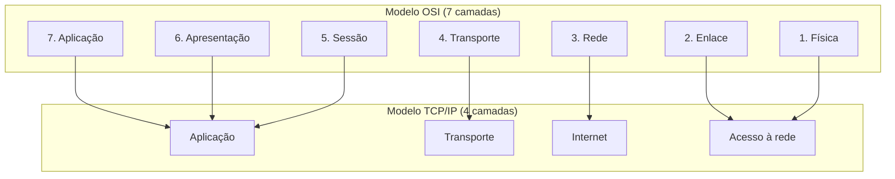

> **Para quem é:** quem já ouviu falar em "camada 4" ou "camada 7" em contextos como balanceadores de carga e o Traefik, mas nunca viu de onde vem essa numeração nem como ela se relaciona com o que o Linux e o TCP/IP realmente implementam.

Quando alguém diz que um balanceador de carga opera em "camada 4" e um reverse proxy como o Traefik opera em "camada 7", está usando o vocabulário do modelo OSI para descrever uma pilha que, na prática, é implementada segundo o modelo TCP/IP. Os dois modelos descrevem a mesma ideia geral (dividir a comunicação em rede em camadas, cada uma resolvendo um problema específico e dependendo apenas da camada imediatamente abaixo), mas nasceram com propósitos diferentes e por isso não coincidem camada a camada. Entender essa diferença evita duas confusões comuns: tratar o OSI como se fosse a arquitetura real da internet, ou estranhar por que a documentação de uma ferramenta às vezes cita "camada 3/4" e às vezes "camada 2".

## Dois modelos, dois propósitos

O modelo OSI (Open Systems Interconnection) foi formalizado pela ISO na década de 1980 como um padrão de referência: uma tentativa de descrever, de forma completa e independente de qualquer implementação específica, todas as funções que um sistema de comunicação em rede poderia precisar. Ele define sete camadas, da física ao aplicativo, e continua sendo publicado como a norma ISO/IEC 7498-1. Nenhuma pilha de rede em uso amplo hoje implementa as sete camadas do OSI à risca; o modelo sobreviveu como vocabulário, não como arquitetura.

O modelo TCP/IP, descrito formalmente em RFCs como a 1122, nasceu do trabalho prático de construir a ARPANET e depois a internet. Ele não foi desenhado como uma referência abstrata; foi extraído da pilha de protocolos que já funcionava. Por isso tem menos camadas (a formulação mais comum usa quatro: acesso à rede, internet, transporte e aplicação) e cada camada corresponde a um conjunto real de protocolos que existem em código, não apenas em diagrama.

A tabela a seguir mapeia as camadas de um modelo no outro. O mapeamento não é exato: a camada de aplicação do TCP/IP absorve as camadas 5, 6 e 7 do OSI, porque a distinção entre sessão, apresentação e aplicação raramente aparece como protocolos separados na prática.

| Camada OSI | Função | Camada TCP/IP | Exemplos no notebook |
| --- | --- | --- | --- |
| 7. Aplicação | Protocolos usados diretamente por aplicações | Aplicação | HTTP, DNS, TLS (acima do transporte) |
| 6. Apresentação | Codificação, serialização, criptografia | Aplicação | Sem correspondência isolada de protocolo |
| 5. Sessão | Controle de sessões de comunicação | Aplicação | Sem correspondência isolada de protocolo |
| 4. Transporte | Entrega fim a fim, portas, controle de fluxo | Transporte | TCP, UDP |
| 3. Rede | Endereçamento lógico e roteamento entre redes | Internet | IPv4, IPv6, ICMP |
| 2. Enlace | Endereçamento físico dentro de uma rede local | Acesso à rede | Ethernet, ARP, bridges e veth pairs de um host Linux |
| 1. Física | Sinal elétrico, óptico ou de rádio | Acesso à rede | Cabeamento, rádio Wi-Fi |

## Onde a numeração do OSI aparece neste notebook

O vocabulário "camada 3", "camada 4" e "camada 7" sobrevive porque é preciso e curto, mesmo quando o sistema descrito não implementa o OSI. Um balanceador de "camada 4" decide para onde encaminhar um pacote olhando IP de destino e porta, sem entender o protocolo transportado; ele opera no nível de TCP/UDP, que no OSI corresponde à camada de transporte. Um reverse proxy de "camada 7", como o [Traefik](../../reverse-proxy-basics/), lê o conteúdo da requisição HTTP (o host, o caminho, os cabeçalhos) para decidir a rota, o que exige entender o protocolo de aplicação inteiro, não só endereço e porta.

Essa diferença de camada explica uma limitação prática: um balanceador de camada 4 pode encaminhar qualquer tráfego TCP, incluindo protocolos que não são HTTP, mas não consegue tomar decisões baseadas em conteúdo (como rotear por caminho de URL). Um proxy de camada 7 pode tomar essas decisões, mas só entende o protocolo que sabe interpretar; TLS passthrough é a técnica de encaminhar bytes de TLS sem terminá-los, quando o proxy precisa se comportar como camada 4 para esse tráfego específico mesmo operando majoritariamente em camada 7.

Dentro do host Linux, a mesma numeração organiza o que a rede de containers e pods manipula: interfaces e endereçamento físico (camadas 1 e 2, onde vivem bridges e veth pairs), roteamento entre redes (camada 3, onde IPv4 e IPv6 decidem o próximo salto) e portas de transporte (camada 4, onde TCP e UDP multiplexam serviços). Essa base de rede do Linux é o assunto do restante desta fase.

## Quando o modelo importa e quando não importa

Usar a numeração de camadas ajuda a comunicar rapidamente em que nível uma ferramenta ou um problema opera, principalmente ao comparar produtos (um firewall de borda "camada 3/4" contra um web application firewall "camada 7") ou ao diagnosticar uma falha (um problema de "camada 2" como um veth pair desconectado não se resolve mexendo em regras de camada 7). Não é necessário memorizar as sete camadas do OSI em detalhe para operar uma infraestrutura; o que importa é reconhecer, diante de um termo como "L4" ou "L7", qual conjunto de decisões aquela camada realmente tem disponível.

## Páginas relacionadas

- [Modelo mental de reverse proxy](../../reverse-proxy-basics/): onde a distinção entre camada 4 e camada 7 aparece na prática, com o Traefik.
- [Cilium vs. Calico](../../cilium-vs-calico/): CNIs que operam em diferentes combinações de camada 3 e camada 4 dentro da rede de pods.

## Referências

- [ISO/IEC 7498-1:1994](https://www.iso.org/standard/20269.html): a norma que define o modelo de referência OSI.
- [RFC 1122 — Requirements for Internet Hosts](https://www.rfc-editor.org/rfc/rfc1122): descreve a arquitetura em camadas efetivamente usada pela internet, base do modelo TCP/IP de quatro camadas.
