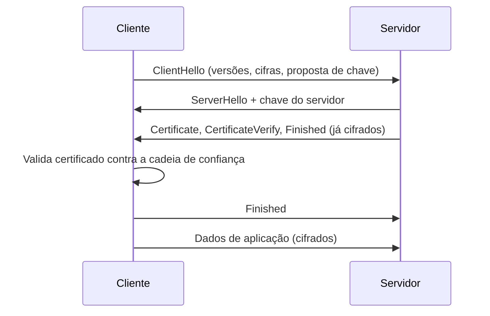

> **Para quem é:** quem já configurou cert-manager ou o Traefik seguindo um passo a passo, mas nunca parou para entender por que um handshake falha, o que o SNI decide antes da conexão ser decifrada, e o que exatamente muda quando o requisito passa a ser mTLS em vez de TLS comum.

TLS (Transport Layer Security) resolve três problemas para uma conexão que já existe em camada de transporte (o TCP visto na [comparação entre modelos de rede](../osi-and-tcpip/)): confidencialidade (ninguém no meio do caminho lê o conteúdo), integridade (ninguém no meio do caminho altera o conteúdo sem ser detectado) e, na configuração mais comum, autenticação do servidor perante o cliente (o cliente tem como confirmar que está falando com quem diz ser). Praticamente todo HTTPS deste notebook, da API do K3s ao painel do ArgoCD, depende dessas três garantias vindas do TLS, não do protocolo de aplicação por cima dele.

## O handshake em modelo mental

A versão atual do protocolo, TLS 1.3 (RFC 8446), completa o handshake em uma única ida e volta (1-RTT) na maioria das conexões. O cliente envia um `ClientHello` com as versões e conjuntos de cifra que suporta, já incluindo uma proposta de material de chave; o servidor responde com um `ServerHello` escolhendo os parâmetros, mais o próprio certificado e uma prova de que possui a chave privada correspondente (`CertificateVerify`). A partir do `ServerHello`, toda mensagem do handshake já viaja cifrada, uma mudança em relação ao TLS 1.2, que expunha mais informação em texto claro durante a negociação. O TLS 1.3 também removeu os mecanismos de troca de chave sem sigilo direto (RSA estático, Diffie-Hellman estático): toda cifra suportada hoje garante forward secrecy, a propriedade de que comprometer uma chave privada no futuro não permite decifrar tráfego capturado no passado.

## Certificados e cadeia de confiança

Um certificado X.509 associa uma chave pública a uma identidade, atestada por uma assinatura de quem o emitiu. A identidade que importa para verificação de host é o campo Subject Alternative Name (SAN); a RFC 6125 formalizou o SAN como o mecanismo correto de verificação e depreciou a prática mais antiga de usar o Common Name (CN) do certificado para esse fim, embora clientes ainda tolerem CN como fallback em certificados legados. É por isso que adicionar um endereço novo à API do K3s exige [atualizar a lista `tls-san`](../../../../guides/tasks/kubernetes/configure-tls-san/) do certificado do servidor: um cliente TLS rejeita a conexão se o nome ou IP usado para conectar não estiver entre os SANs do certificado apresentado, mesmo que a rede funcione perfeitamente.

A confiança em um certificado não nasce dele mesmo: ela sobe uma cadeia até uma autoridade certificadora raiz (CA) que o sistema operacional ou o cliente já confia previamente. Uma CA raiz assina um certificado intermediário, que assina o certificado final (a "folha") apresentado pelo servidor; o cliente valida a cadeia inteira, elo por elo, até encontrar uma raiz em seu repositório de confiança local. Esse é o motivo pelo qual um certificado autoassinado (sem essa cadeia até uma raiz já confiável) produz aviso de segurança em qualquer cliente TLS padrão: a cadeia existe, mas termina em uma raiz que ninguém mais reconhece.

Duas fontes de emissão cobrem praticamente todos os casos deste notebook. Certificados públicos, validados pela CA via ACME (o protocolo que o Let's Encrypt popularizou), servem para qualquer serviço exposto publicamente e são o caminho automatizado pelo [cert-manager](../../../../guides/tasks/certificates/install-cert-manager/), que cuida de solicitar, renovar e armazenar o certificado como um `Secret` do Kubernetes sem intervenção manual recorrente. Uma CA interna (autoassinada ou emitida por um `Issuer` interno do próprio cert-manager) serve para tráfego que nunca sai da rede do operador, como comunicação entre componentes do control plane, porque não há necessidade de confiança de terceiros desconhecidos e a distribuição da CA raiz para os clientes internos é um problema já resolvido pela própria infraestrutura que a criou.

## SNI e a diferença entre terminação e passthrough

O campo SNI (Server Name Indication), parte do `ClientHello`, carrega o nome do domínio desejado em texto claro, antes de qualquer chave de sessão existir. Um reverse proxy pode ler esse campo para decidir a rota sem precisar terminar a conexão TLS ele mesmo; a página de [modelo mental de reverse proxy](../../reverse-proxy-basics/) já detalha esse mecanismo e o uso prático que o Traefik faz dele, e não é repetido aqui.

O que importa reter nesta página é a diferença entre as duas posturas que um proxy pode assumir diante de uma conexão TLS. Na **terminação**, o proxy guarda a chave privada do certificado, decifra a conexão, pode inspecionar e rotear por conteúdo de camada 7 (path, cabeçalhos), e opcionalmente abre uma nova conexão TLS própria até o backend. No **passthrough**, o proxy nunca decifra nada: encaminha os bytes cifrados como estão, escolhendo o backend só pelo SNI, e é o backend quem guarda a chave privada e termina a conexão. A escolha entre as duas depende de quem precisa ter acesso à chave privada e de quanto controle de roteamento por conteúdo é necessário: terminação centraliza a posse da chave e habilita roteamento rico; passthrough mantém a chave só onde o serviço final já confia nela, ao custo de o proxy não conseguir tomar nenhuma decisão baseada no conteúdo da requisição.

## mTLS: autenticação mútua

TLS comum autentica só um lado: o servidor prova sua identidade ao cliente através do certificado, mas o servidor não tem, por padrão, nenhuma garantia sobre quem é o cliente além do que a aplicação decidir verificar depois da conexão estabelecida (login, token, chave de API). mTLS (mutual TLS) muda essa equação: o servidor envia um `CertificateRequest` durante o handshake, exigindo que o cliente também apresente um certificado válido, então os dois lados provam identidade um ao outro antes de qualquer dado de aplicação trafegar.

Esse modelo importa quando não existe um humano interativo para digitar uma senha e a identidade precisa ser verificável só com o que a própria conexão carrega: comunicação entre processos. O K3s usa exatamente esse padrão internamente, com uma PKI própria emitindo certificados de cliente para que o kubelet se autentique perante a API do servidor e para que os membros de um cluster com etcd embutido se autentiquem entre si como pares; nenhuma dessas conexões depende de uma senha compartilhada, depende do certificado apresentado por cada lado. Um [service mesh](../../service-mesh-overview/) como Istio ou Linkerd estende a mesma ideia para dentro da malha de Pods: o sidecar de cada Pod recebe uma identidade própria via certificado, emitida automaticamente pelo mesh, e toda comunicação Pod a Pod passa a ser mTLS por padrão, sem que a aplicação precise saber que isso está acontecendo.

## Custos operacionais: rotação e revogação

Um certificado de vida curta reduz o estrago de uma chave privada comprometida (a janela de uso válido é pequena), mas só é operacionalmente viável com renovação automatizada; é exatamente esse o papel do cert-manager, que reemite um `Certificate` antes do vencimento sem intervenção manual, como já coberto na [página de instalação do cert-manager](../../../../guides/tasks/certificates/install-cert-manager/), não repetida aqui. Service meshes levam essa lógica ao extremo, rotacionando certificados internos de Pod tipicamente na casa de horas, porque a identidade emitida automaticamente e de vida curta é mais barata de operar em escala do que qualquer mecanismo de revogação explícita.

Revogar um certificado antes do vencimento natural é, na prática, um problema mal resolvido pelo ecossistema TLS: listas de revogação (CRL) e verificação online (OCSP) existem, mas dependem de o cliente efetivamente consultá-las, o que nem todo cliente faz de forma confiável, e ambas adicionam uma consulta de rede ao caminho crítico de cada conexão. A resposta prática que a maioria das infraestruturas modernas adota, incluindo os padrões deste notebook, é reduzir a validade do certificado a ponto de a revogação se tornar menos necessária: um certificado que expira em algumas horas ou dias limita o dano de uma chave vazada sem depender de nenhum cliente consultar uma lista de revogação a tempo.

## Páginas relacionadas

- [Modelo OSI e modelo TCP/IP](../osi-and-tcpip/): onde TLS se encaixa como camada acima do transporte.
- [Modelo mental de reverse proxy](../../reverse-proxy-basics/): SNI e terminação TLS aplicados ao Traefik.
- [Visão geral de service mesh](../../service-mesh-overview/): mTLS automático entre Pods via sidecar.
- [Instalar o cert-manager](../../../../guides/tasks/certificates/install-cert-manager/): automação de emissão e renovação.
- [Configurar TLS SAN do K3s](../../../../guides/tasks/kubernetes/configure-tls-san/): efeito prático de um SAN ausente no certificado da API.

## Referências

- [RFC 8446 — The Transport Layer Security (TLS) Protocol Version 1.3](https://www.rfc-editor.org/rfc/rfc8446): especificação do handshake atual, 1-RTT e forward secrecy obrigatório.
- [RFC 6125 — Representation and Verification of Domain-Based Application Service Identity](https://www.rfc-editor.org/rfc/rfc6125): SAN como mecanismo correto de verificação de identidade, CN como legado.
