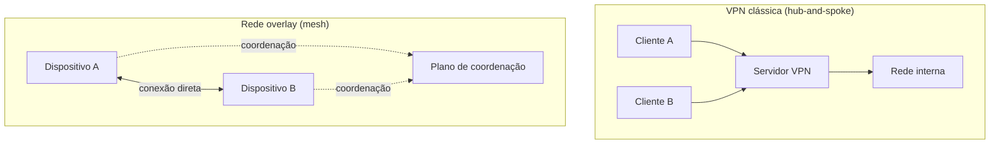

> **Para quem é:** quem precisa alcançar a API de um cluster, um painel administrativo ou um nó de gerência sem publicar essas portas na internet, e está decidindo entre montar uma VPN tradicional ou adotar uma rede overlay gerenciada.

Uma VPN (Virtual Private Network) e uma rede overlay resolvem o mesmo problema de fundo (dar a um dispositivo acesso a uma rede que ele não alcançaria normalmente, com o tráfego cifrado no caminho), mas partem de modelos de arquitetura diferentes. Uma VPN clássica cria um túnel até um ponto central: o cliente passa a enxergar a rede atrás desse ponto como se estivesse fisicamente nela. Uma rede overlay gerenciada cria uma rede virtual própria, sobreposta às redes físicas de cada dispositivo, na qual todo membro tem um endereço estável e pode, quando possível, falar diretamente com qualquer outro membro sem depender de um único ponto central de trânsito.

## VPN clássica: OpenVPN e WireGuard

OpenVPN usa um protocolo de segurança próprio construído sobre TLS/SSL para o handshake e a troca de chaves, no modelo cliente-servidor: um processo servidor aceita conexões de múltiplos clientes, cada um autenticado por certificado, usuário/senha, ou os dois. Ele pode operar sobre uma interface virtual TUN (túnel de camada 3, roteando pacotes IP) ou TAP (túnel de camada 2, encapsulando quadros Ethernet inteiros), o que o torna flexível, mas também mais complexo de configurar e mais pesado em processamento do que alternativas mais recentes.

WireGuard resolve o mesmo problema com uma superfície de configuração muito menor: cada par (peer) tem um par de chaves pública/privada estático, e conectar dois peers é, na prática, trocar chaves públicas do mesmo jeito que se troca uma chave pública SSH. Não há negociação de certificado nem cadeia de confiança como no TLS; a tabela de roteamento por chave criptográfica de cada peer decide quais endereços IP correspondem a qual chave. O protocolo vive no próprio kernel Linux desde a versão 5.6, o que evita a sobrecarga de um processo em espaço de usuário fazendo criptografia, e seu código é deliberadamente pequeno para ficar auditável, ao contrário de bases de código bem maiores como as do OpenVPN ou do IPsec.

Ambos precisam de uma interface de rede virtual no sistema operacional para entregar tráfego do túnel à pilha de rede local (`tun0`, `wg0`); essa interface, junto com as bridges e veth pairs que montam a rede de um container, é tratada em conjunto na página de [vizinhança e camada 2](../../linux/neighbors-and-l2/), para não fragmentar o mesmo assunto (interfaces virtuais) em duas páginas.

## Redes overlay gerenciadas: Tailscale e ZeroTier

Tailscale usa WireGuard como protocolo de transporte de dados, mas acrescenta uma camada de coordenação que o WireGuard sozinho não tem: um plano de controle central que troca chaves entre os dispositivos automaticamente, autentica cada dispositivo pela identidade de um provedor de SSO já existente (em vez de uma chave pré-compartilhada configurada manualmente), e resolve NAT traversal sem exigir redirecionamento de porta ou regra de firewall manual em nenhum dos lados. O resultado prático é uma rede virtual (uma "tailnet") na qual qualquer dispositivo autenticado enxerga qualquer outro por um endereço estável, independente de estarem atrás de NATs diferentes ou em redes físicas sem nenhuma relação.

ZeroTier resolve o mesmo problema de coordenação e NAT traversal, mas com um protocolo próprio, não baseado em WireGuard: cria uma rede virtual de camada 2 (Ethernet), com uma arquitetura de controlador e agentes, na qual um controlador de rede decide quem pode entrar, emite certificados de associação e distribui configuração. A descoberta de rota entre peers usa técnicas de STUN e UDP hole punching, semelhantes ao ICE usado em WebRTC, com uma rede de servidores-raiz auxiliando essa descoberta e servindo de retransmissão quando uma conexão direta não é possível.

Headscale é uma implementação de código aberto, autohospedada, do servidor de coordenação do Tailscale: permite montar o equivalente a uma tailnet sem depender do serviço gerenciado da Tailscale, ao custo de operar essa peça de infraestrutura por conta própria.

Vale registrar, por contraste e fora do escopo operacional deste notebook, um exemplo que leva a mesma coordenação e o mesmo NAT traversal ao extremo: o Snowflake, transporte plugável do Tor Project para driblar censura de rede. Em vez de um peer com identidade estável como numa tailnet, o Snowflake conecta o cliente censurado a um proxy voluntário efêmero (frequentemente a aba de um navegador comum, mantida aberta por quem se voluntaria) via WebRTC, disfarçando o tráfego como uma videochamada comum para dificultar o bloqueio. O paralelo é conceitual, não operacional: a mesma classe de problema (dois pontos atrás de NATs desconhecidos precisando se conectar sem porta aberta) resolvida com WebRTC/ICE no lugar de uma tailnet ou de uma rede ZeroTier; o objetivo de censura não tem relação com o acesso administrativo a um cluster que é o assunto desta página.

## Critérios de escolha

A decisão entre essas opções não depende de qual tem mais recursos, depende de quem deve controlar o plano de coordenação e de quanto trabalho manual de rede o operador está disposto a assumir.

WireGuard puro, sem nenhuma camada de coordenação por cima, exige que cada peer conheça o endereço público (ou pelo menos um caminho de rota) do outro lado com antecedência, e normalmente depende de pelo menos um peer ter uma porta UDP acessível de fora para os demais se conectarem; não há NAT traversal automático. Isso o torna adequado quando a topologia é simples e estável (por exemplo, dois ou três hosts com IP público conhecido) e quando o operador não quer depender de nenhum serviço de coordenação externo, autohospedado ou não.

Tailscale e ZeroTier resolvem exatamente o problema que falta no WireGuard puro (coordenação automática de chaves e NAT traversal sem porta aberta manualmente), ao custo de introduzir uma dependência de um plano de controle, seja o serviço gerenciado de cada projeto, seja uma instância autohospedada (Headscale, no caso do Tailscale). Vale registrar que esse plano de controle vê metadados de coordenação (quais dispositivos existem, quando se conectam, que endereços usam), não o conteúdo do tráfego, que permanece cifrado ponta a ponta pelo protocolo de transporte; ainda assim, é uma superfície de confiança adicional que uma VPN ponto a ponto sem coordenação não tem.

Entre Tailscale e ZeroTier, a escolha comum se resume a modelo de identidade e camada de rede: Tailscale amarra acesso à identidade de um provedor de SSO já usado pela organização, o que facilita revogar acesso quando alguém sai do time; ZeroTier entrega uma rede de camada 2 completa, útil quando o caso de uso depende de comportamento de Ethernet (broadcast, multicast) que uma rede puramente roteada de camada 3 não oferece.

No modelo hub-and-spoke, o servidor central é o único caminho: se ele cai, toda comunicação entre clientes para, mesmo que os clientes estivessem fisicamente próximos o bastante para falar direto. No modelo mesh, o plano de coordenação só participa da etapa de descoberta e troca de chaves; a conexão de dados, quando bem-sucedida, é direta entre os dois dispositivos, e a indisponibilidade do plano de coordenação não derruba conexões já estabelecidas, só impede que novas sejam negociadas.

## Caso de uso do notebook: acesso administrativo sem expor a API na internet

O [blueprint de requisitos de rede do K3s multinode](../../../../guides/blueprints/k3s-multinode/network-requirements/) e a página de [configuração do firewall do K3s](../../../../guides/tasks/kubernetes/configure-k3s-firewall-rules/) já tratam a porta 6443 (API do Kubernetes) como algo a restringir por origem, não a publicar abertamente. Uma VPN ou uma rede overlay é o mecanismo que torna essa restrição praticável sem sacrificar o acesso administrativo: em vez de liberar 6443 para a internet ou para uma faixa ampla, a regra de firewall libera 6443 só para o intervalo de endereços da VPN ou da rede overlay, e qualquer máquina administrativa passa a alcançar a API entrando primeiro nessa rede privada.

Vale desfazer uma possível confusão de nomes aqui: a mesma página de firewall do K3s já menciona WireGuard como um dos backends do Flannel (o CNI embutido no K3s), usado para cifrar o tráfego de pod-a-pod entre nós do cluster. Esse é um uso completamente diferente do WireGuard descrito nesta página: ali, o WireGuard cifra tráfego interno do cluster entre nós que já confiam uns nos outros; aqui, o WireGuard (puro ou por trás de Tailscale) resolve o problema de trazer um operador humano, de fora da rede do cluster, para dentro dela de forma controlada. Os dois podem coexistir sem relação nenhuma entre si. O outro backend do Flannel, VXLAN, e a diferença entre VLAN e VXLAN como mecanismos de segmentação e overlay de infraestrutura (uma camada abaixo do que esta página trata) ficam na página de [vizinhança e camada 2](../../linux/neighbors-and-l2/); o modo BGP do Flannel, e o conceito de Sistema Autônomo que o BGP pressupõe, ficam na página de [BGP, AS e confiança de rota](../bgp-and-route-trust/).

Reaproveitar um servidor com acesso administrativo restrito por VPN/overlay não resolve, por si só, o problema de expor um serviço para fora quando não existe VPN nenhuma do outro lado (o caso de um cliente comum na internet, não de um operador). Esse é o assunto da próxima página desta trilha, [túneis de exposição](../exposure-tunnels/), que também cobre DNS dinâmico (DDNS) como peça complementar quando o endereço público do lado exposto muda.

## Páginas relacionadas

- [Endereçamento IPv4 e IPv6](../ipv4-and-ipv6/): NAT e endereços privados, o pano de fundo que torna NAT traversal necessário.
- [Configurar o firewall do K3s](../../../../guides/tasks/kubernetes/configure-k3s-firewall-rules/): onde restringir a porta 6443 por origem é aplicado na prática.
- [Requisitos de rede do blueprint K3s multinode](../../../../guides/blueprints/k3s-multinode/network-requirements/): o cenário de rede que motiva restringir acesso administrativo.
- [Vizinhança e camada 2](../../linux/neighbors-and-l2/): VLAN, VXLAN e as interfaces TUN/TAP como mecanismo de infraestrutura, não de acesso administrativo.
- [BGP, AS e confiança de rota](../bgp-and-route-trust/): AS e ASN, a identidade que o modo BGP do Flannel pressupõe.
- [Túneis de exposição](../exposure-tunnels/): Cloudflare Tunnel, ngrok e DDNS, o outro lado do problema de alcançabilidade que esta página não cobre.

## Referências

- [WireGuard: site oficial](https://www.wireguard.com/): design, integração no kernel Linux, comparação com IPsec/OpenVPN.
- [Tailscale: What is Tailscale?](https://tailscale.com/kb/1151/what-is-tailscale): uso de WireGuard, identidade via SSO, NAT traversal automático.
- [Headscale: documentação oficial](https://headscale.net/stable/): implementação de código aberto do servidor de coordenação do Tailscale.
- [OpenVPN — Wikipédia](https://en.wikipedia.org/wiki/OpenVPN): modelo cliente-servidor sobre TLS/SSL, TUN vs. TAP (até a escrita; prefira a documentação oficial da OpenVPN Inc. quando disponível).
- [ZeroTier — Wikipédia](https://en.wikipedia.org/wiki/ZeroTier): rede virtual de camada 2, arquitetura de controlador e servidores-raiz, NAT traversal via STUN/hole punching (até a escrita; prefira a documentação oficial da ZeroTier quando disponível).
- [Snowflake (Tor Project)](https://snowflake.torproject.org/): transporte plugável via WebRTC e proxies voluntários efêmeros, citado por contraste conceitual.
