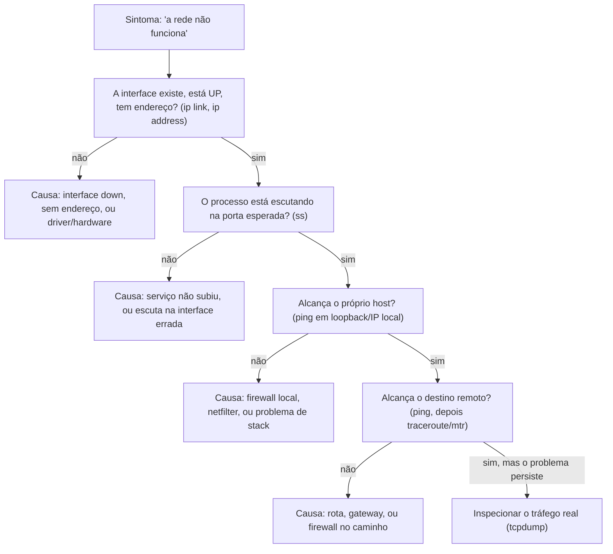

> **Para quem é:** quem chega a um host com "a rede não está funcionando" e precisa de uma ordem de investigação, não de uma lista solta de comandos.

As páginas anteriores desta trilha explicam cada peça isoladamente: interfaces e endereços, rotas, vizinhança de camada 2, netfilter. Um problema de rede real raramente aponta de cara para qual dessas peças falhou; o sintoma é sempre o mesmo tipo de frase vaga ("não consigo acessar o serviço", "a conexão cai", "está lento"), e a tarefa de diagnóstico é reduzir essa vaguidão a uma causa específica. A ordem certa de investigação não é arbitrária: começa pelas verificações mais baratas e locais, que descartam ou confirmam hipóteses inteiras de uma vez, e só avança para ferramentas mais caras ou mais distantes quando as anteriores não explicam o sintoma.

## A ordem: de dentro para fora, do mais barato ao mais caro

Cada etapa deste fluxo existe para eliminar uma classe inteira de causas antes de investigar a próxima, não para ser executada mecanicamente do início ao fim toda vez.

A primeira pergunta nunca deveria ser "o destino está acessível", é "a peça mais próxima do problema existe e está no estado esperado". Confirmar que a interface está `UP`, com `LOWER_UP` (portadora presente, discutido em [interfaces e endereços no Linux](../interfaces-and-addresses/#estados-de-link)) e com o endereço correto atribuído custa um `ip link show`/`ip address show`, elimina de uma vez toda a classe de problemas de camada física ou de configuração básica, e evita a armadilha comum de gastar tempo testando conectividade remota quando a interface local nem está ativa.

## `ss`: o serviço está de fato escutando?

Antes de sequer pensar em rede externa, vale confirmar que existe um processo escutando na porta esperada, na interface esperada. `ss -tlnp` lista sockets TCP em modo de escuta com o processo dono (já coberto com mais detalhe no [cookbook de comandos de rede](../../../../toolbox/commands/networking/#listar-conexões-ativas)); o detalhe que decide o próximo passo é o endereço ao lado da porta na saída: um serviço escutando em `127.0.0.1:8080` nunca vai responder a uma conexão vinda de outra máquina, mesmo com a interface de rede, a rota e o firewall todos corretos, porque o processo simplesmente não aceita conexões chegando por uma interface diferente de loopback. Esse é um sintoma que se parece exatamente com "firewall bloqueando" ou "rota errada" de fora, mas a causa real está inteiramente do lado da aplicação, uma distinção que só o `ss` revela.

## `ping`: alcançável, e por qual caminho

Com a interface e o serviço confirmados, `ping` testa a hipótese mais simples de conectividade: primeiro para o próprio host (`ping -c 3 127.0.0.1` ou o endereço da própria interface), depois para o gateway padrão, depois para o destino final. Cada etapa isola um segmento diferente do caminho: falhar em alcançar o próprio gateway aponta para um problema local (rota, ARP/NDP, ou o próprio gateway fora do ar), enquanto alcançar o gateway mas não o destino final aponta para algo além do host, no meio do caminho ou no próprio destino. A ausência de resposta ao `ping` não é prova definitiva de problema: ICMP pode estar bloqueado por um firewall intermediário mesmo com o serviço real acessível por outro protocolo, o motivo pelo qual esta etapa serve para formar hipótese, não para encerrar a investigação sozinha.

## `traceroute`/`mtr`: por onde o caminho passa

Quando `ping` falha para o destino final mas funciona para o gateway, o próximo passo é descobrir em qual salto intermediário o caminho quebra. `traceroute` mostra uma passagem única pela rota; `mtr` combina `ping` e `traceroute`, atualizando estatísticas de perda e latência por salto continuamente, mais útil para distinguir uma falha total de um salto apenas instável (perda intermitente, não perda total). A leitura correta de saltos marcados como `*` exige cautela: roteadores intermediários costumam limitar ou ignorar deliberadamente o tráfego usado por essas ferramentas, então um `*` no meio do caminho não prova, por si só, que a rota está quebrada ali; o sinal mais confiável é o ponto a partir do qual toda resposta para de chegar, não um salto isolado sem resposta.

## `tcpdump`: quando o comportamento observado não bate com o esperado

As etapas anteriores respondem "alcança ou não alcança". Quando a resposta é "alcança, mas o comportamento não é o esperado" (uma conexão que abre e fecha sozinha, um handshake que nunca completa, um pacote que parece estar sendo descartado sem motivo aparente), a única forma de confirmar o que está de fato acontecendo na rede é capturar o tráfego real. `tcpdump` (sintaxe de captura já coberta no [catálogo de ferramentas de diagnóstico de rede](../../../../toolbox/tools/networking/diagnostic-tools/#tcpdump-e-termshark-captura-e-inspeção-de-pacotes)) é o ponto em que a investigação deixa de ser sobre "alcançável ou não" e passa a ser sobre o conteúdo exato de cada pacote: se o SYN sai da interface, se a resposta chega, em qual ponto exato uma conexão para de progredir. É deliberadamente a última ferramenta deste fluxo, não a primeira, porque interpretar uma captura de pacotes sem já ter eliminado interface, serviço, rota e alcançabilidade básica é gastar esforço analisando dados que uma verificação mais barata já teria explicado.

## `tc`: visão geral

`tc` (traffic control) não diagnostica conectividade, ele governa como o kernel enfileira, prioriza, limita ou descarta pacotes numa interface, através de disciplinas de fila (qdiscs), classes hierárquicas dentro delas, e filtros que decidem em qual classe cada pacote entra. Um sintoma de rede que passa por todas as etapas anteriores sem explicação, especialmente "lento, mas não totalmente fora do ar", pode ter origem numa política de `tc` aplicada deliberadamente (limitação de banda, priorização de outro tipo de tráfego) em vez de uma falha; `tc -s qdisc show dev eth0` mostra as disciplinas de fila ativas numa interface e suas estatísticas de descarte, o primeiro comando para confirmar ou descartar essa hipótese antes de investigar mais fundo a configuração de `tc` em si, que foge do escopo desta página.

## Páginas relacionadas

- [Interfaces e endereços no Linux](../interfaces-and-addresses/): o primeiro passo do fluxo, estado de link e endereço.
- [Roteamento local no Linux](../routing/): a lógica por trás de um `ping` que alcança o gateway mas não o destino final.
- [Netfilter e nftables por dentro](../netfilter-and-nftables/): o que pode estar descartando um pacote silenciosamente antes de ele sair ou depois de chegar.
- [Comandos de rede (cookbook)](../../../../toolbox/commands/networking/): sintaxe rápida de `ping`, `ss`, `traceroute`/`mtr` e `ip route`.
- [Catálogo de ferramentas de diagnóstico de rede](../../../../toolbox/tools/networking/diagnostic-tools/): `tcpdump`, `termshark`, `iperf3` e outras ferramentas dedicadas de captura e sondagem.

## Referências

- [ss(8) — man7.org](https://man7.org/linux/man-pages/man8/ss.8.html): opções de filtragem de sockets e leitura da saída.
- [tcpdump(1) — página de manual oficial](https://www.tcpdump.org/manpages/tcpdump.1.html): sintaxe de filtros de captura (BPF).
- [tc(8) — man7.org](https://man7.org/linux/man-pages/man8/tc.8.html): qdiscs, classes e filtros de traffic control.
