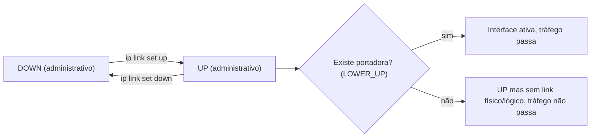

> **Para quem é:** quem precisa confirmar por que uma interface não está passando tráfego antes de investigar rota, firewall ou DNS, e quer entender o que `ip link` e `ip address` mostram antes de decidir o próximo passo.

Toda decisão de rede discutida no restante desta trilha, desde qual rota o kernel escolhe até como um pacote atravessa o netfilter, pressupõe uma coisa que nenhuma delas explica: a existência de uma interface de rede pronta, num estado que permite tráfego, com um endereço atribuído. Esta página cobre essa camada de base: como o Linux representa interfaces (físicas e virtuais), o que significa cada estado de link, o papel do MTU, e as duas ferramentas que o iproute2 oferece para inspecionar e alterar tudo isso, `ip link` e `ip address`.

## Interfaces físicas e virtuais

Para o kernel, uma interface de rede é uma estrutura de dados com um nome, um índice numérico e um conjunto de propriedades, independentemente de existir hardware físico por trás dela ou não. `eth0`, `enp3s0` (o nome mais comum em distribuições atuais, que codifica a localização física do dispositivo em vez de numerar sequencialmente) e `wlan0` representam placas de rede reais; `lo` é a interface de loopback, sempre presente, usada para tráfego que nunca sai da própria máquina; `veth0`, `br0`, `wg0`, `docker0` são interfaces inteiramente virtuais, criadas e destruídas por software, sem nenhum dispositivo físico correspondente. Do ponto de vista das ferramentas de rede, e da maior parte da pilha do kernel, uma interface virtual se comporta como qualquer outra: recebe endereço, aparece na tabela de roteamento como destino possível, pode ser conectada a uma bridge. Essa uniformidade é o que permite que containers, VPNs e redes overlay, todas tratadas nas páginas anteriores desta trilha, funcionem sem exigir hardware dedicado: cada uma cria as interfaces virtuais que precisa, e o resto da pilha de rede não distingue.

## Estados de link

`ip link show` lista as interfaces do host junto com seu estado, que aparece na saída como `UP`, `DOWN` ou `UNKNOWN`. Esse estado combina duas informações que costumam ser confundidas: o estado administrativo, que reflete se o operador (ou um script) pediu explicitamente para ativar a interface (`ip link set eth0 up`) ou desativá-la, e o estado operacional, refletido no campo `LOWER_UP`, que indica se existe portadora física ou lógica de fato, um cabo conectado, um link WiFi associado, ou o par de um veth presente do outro lado. Uma interface pode estar administrativamente `UP` e ainda assim sem `LOWER_UP`, o padrão que aparece quando um cabo é desconectado sem que ninguém tenha desativado a interface no sistema operacional; diagnosticar "a interface não funciona" sem checar os dois estados separadamente é a causa mais comum de confundir um problema de configuração com um problema físico.



## MTU: o limite de tamanho de um quadro

O MTU (Maximum Transmission Unit) de uma interface define o maior payload, em bytes, que ela consegue enviar num único quadro sem fragmentação, tipicamente 1500 bytes numa Ethernet física. Interfaces virtuais herdam ou definem seu próprio MTU, e a diferença entre eles importa quando uma interface encapsula tráfego dentro de outra: o backend VXLAN do Flannel, já discutido em [vizinhança e camada 2](../neighbors-and-l2/#vlan-e-vxlan-segmentar-ou-estender-uma-camada-2), acrescenta um cabeçalho UDP/VXLAN ao quadro original antes de transmiti-lo pela interface física, o que consome parte do orçamento de 1500 bytes disponível. Se o MTU da interface física e o MTU esperado dentro do túnel não estiverem coordenados, o resultado é fragmentação silenciosa ou descarte de pacotes maiores que o limite real, um sintoma que aparece como conexões que travam só acima de um certo tamanho de payload, não como falha total de conectividade. `ip link set eth0 mtu 1450` ajusta o valor manualmente quando uma interface precisa de folga para um encapsulamento por cima dela.

## `ip link` e `ip address`: o par de comandos

`ip link` opera na camada de enlace: mostra e altera propriedades do dispositivo em si, estado (`up`/`down`), MTU, endereço MAC, e o tipo de interface (veth, bridge, vlan, dummy, entre dezenas de outros tipos que o iproute2 sabe criar). `ip address` opera uma camada acima: mostra, adiciona e remove endereços IP atribuídos a uma interface já existente. A separação entre os dois comandos reflete a separação real de camadas: uma interface pode existir, estar `UP`, e ainda não ter nenhum endereço atribuído, o estado normal de uma interface recém-criada antes de qualquer configuração de IP.

```bash
# Listar interfaces e seus estados
ip link show

# Detalhes de uma interface específica
ip link show eth0

# Ativar ou desativar uma interface
sudo ip link set eth0 up
sudo ip link set eth0 down

# Ajustar o MTU
sudo ip link set eth0 mtu 1450

# Listar endereços atribuídos
ip address show

# Adicionar um endereço a uma interface
sudo ip address add 192.0.2.10/24 dev eth0

# Remover um endereço
sudo ip address del 192.0.2.10/24 dev eth0
```

Um detalhe que costuma surpreender quem vem de configurações mais simples: uma interface pode ter mais de um endereço atribuído simultaneamente, sem hierarquia entre eles nem necessidade de uma sintaxe de "alias" separada como versões antigas do `ifconfig` exigiam (`eth0:0`, `eth0:1`). `ip address add` simplesmente acrescenta outro endereço à mesma interface; cada um tem seu próprio escopo, `global` para endereços alcançáveis fora da máquina, `link` para endereços válidos só dentro do segmento de rede local (o caso dos endereços link-local IPv6 discutidos em [endereçamento IPv4 e IPv6](../../fundamentals/ipv4-and-ipv6/)), e `host` para endereços que só o próprio host usa, como o `127.0.0.1` da interface `lo`.

Os comandos de consulta e adição rápida de rota, incluindo a listagem básica de interfaces, também aparecem no [cookbook de comandos de rede](../../../../toolbox/commands/networking/#listar-as-rotas-do-host); esta página foca no modelo mental de interface e estado, não repete a referência rápida de sintaxe.

## Por que `ip` substituiu o `ifconfig`

`ifconfig`, parte do pacote `net-tools`, ainda aparece em sistemas mais antigos e em alguma documentação legada, mas a maioria das distribuições atuais não o instala por padrão. A razão não é só preferência: `ifconfig` não sabe lidar nativamente com muitos dos tipos de interface virtual que uma rede de containers ou uma VPN moderna criam (veth, VXLAN, WireGuard), não expõe a Routing Policy Database usada por `ip rule`, e trata múltiplos endereços por interface através da sintaxe de alias já mencionada, um modelo mais limitado do que o que o kernel realmente oferece hoje. `ip`, do pacote `iproute2`, foi desenhado depois, contra a API de rede mais recente do kernel (netlink), e por isso cobre o que o kernel expõe de forma mais completa; é a ferramenta usada em todo o restante desta trilha.

## Páginas relacionadas

- [Roteamento local no Linux](../routing/): a decisão que usa a interface e o endereço configurados aqui para escolher por onde um pacote sai.
- [Vizinhança e camada 2](../neighbors-and-l2/): o que acontece com um quadro depois que a interface de saída já foi decidida.
- [Namespaces do kernel](../../../containers/namespaces/): o namespace de rede (`CLONE_NEWNET`) que isola o conjunto inteiro de interfaces, endereços e rotas de um container.
- [Comandos de rede (cookbook)](../../../../toolbox/commands/networking/): sintaxe rápida de diagnóstico e rota.

## Referências

- [ip-link(8) — man7.org](https://man7.org/linux/man-pages/man8/ip-link.8.html): estados de link, tipos de interface, `ip link set`.
- [ip-address(8) — man7.org](https://man7.org/linux/man-pages/man8/ip-address.8.html): escopos de endereço, múltiplos endereços por interface.
- [network_namespaces(7) — man7.org](https://man7.org/linux/man-pages/man7/network_namespaces.7.html): o que um namespace de rede isola, incluindo o conjunto de interfaces.
