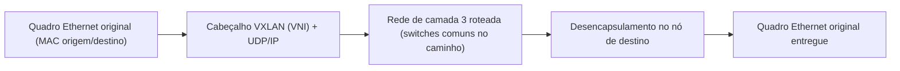

> **Para quem é:** quem já configurou uma VPN ou uma rede de Pods e quer entender o que existe por baixo: como um host descobre o endereço de enlace do vizinho, a interface virtual que carrega o tráfego, e os mecanismos (VLAN, VXLAN) que redes reais usam para segmentar ou estender uma camada 2.

## ARP, Neighbor Discovery e `ip neigh`

Antes de um host conseguir entregar um quadro Ethernet a outro na mesma rede local, ele precisa traduzir o endereço IP de destino para o endereço MAC correspondente; sem essa tradução, a camada de enlace não sabe para qual porta física (ou virtual) encaminhar o quadro. Em IPv4, essa tradução é responsabilidade do ARP (Address Resolution Protocol); em IPv6, do NDP (Neighbor Discovery Protocol), já apresentado na discussão de [IPv6 não ser IPv4 com mais bits](../../fundamentals/ipv4-and-ipv6/#ipv6-não-é-ipv4-com-mais-bits) como o substituto do ARP que roda sobre ICMPv6, não repetido aqui.

O resultado dessas duas traduções, seja qual for o protocolo por trás, fica guardado na tabela de vizinhança do kernel, inspecionável com `ip neigh` (o nome histórico "tabela ARP" sobrevive como vocabulário, mesmo cobrindo também entradas IPv6 resolvidas por NDP). Cada entrada carrega um estado que descreve a confiança do kernel naquela associação IP↔MAC: `REACHABLE` quando a vizinhança foi confirmada recentemente e ainda está dentro da janela de validade; `STALE` quando a entrada ainda é usada, mas já passou tempo suficiente para ser considerada suspeita, sem que isso tenha sido verificado de novo; `INCOMPLETE` enquanto a resolução ainda está em andamento; e `FAILED` quando o número máximo de tentativas de confirmação se esgotou sem resposta, o estado que costuma aparecer quando um vizinho não existe mais na rede, mas o host ainda não percebeu. Esse mecanismo de verificação contínua é o Neighbor Unreachability Detection (NUD): o kernel não confia numa entrada para sempre, ele reconfirma periodicamente, o que explica por que um IP de vizinho que muda de MAC (uma VM recriada, uma failover de IP) eventualmente volta a funcionar sozinho, depois de um intervalo, sem que o operador precise limpar a tabela manualmente.

## TUN e TAP: onde a interface virtual vive

Uma VPN de software, seja [OpenVPN ou WireGuard](../../fundamentals/vpns-and-overlay-networks/), precisa de uma interface de rede virtual no sistema operacional para entregar à pilha de rede local o tráfego que sai do túnel, e para capturar o que deve entrar nele. Essa interface aparece para o kernel como qualquer outra (`tun0`, `wg0`), mas não corresponde a nenhum dispositivo físico; é software simulando a existência de uma placa de rede.

Um **TUN** opera em camada 3: entrega e recebe pacotes IP, sem nenhum cabeçalho de enlace. É o modelo mais comum para VPNs de acesso remoto e para o próprio WireGuard, porque o único objetivo é rotear tráfego IP através do túnel, sem necessidade de simular uma rede Ethernet completa. Um **TAP** opera em camada 2: entrega e recebe quadros Ethernet inteiros, incluindo endereços MAC, o que permite que protocolos dependentes de broadcast de camada 2 funcionem como se as duas pontas estivessem no mesmo segmento físico, inclusive VLANs inteiras passando através do túnel sem que ele saiba disso. O custo é mais overhead por pacote (o cabeçalho Ethernet completo viaja a cada quadro) e mais complexidade de configuração: uma interface TAP normalmente só tem utilidade real quando conectada a uma **bridge**, o equivalente em software a um switch de camada 2, que decide para qual porta (interface) encaminhar cada quadro com base no endereço MAC de destino.

Essa dupla bridge + interface virtual é exatamente o que monta a rede de um container. Cada container recebe um **veth pair**, dois pontos de uma mesma interface virtual ligados um ao outro como as duas pontas de um cabo: `ip link add veth-host type veth peer name veth-container` cria os dois de uma vez, já ligados. Uma ponta é movida para dentro do [network namespace](../../../containers/namespaces/) do container (`ip link set veth-container netns <pid>`), a outra permanece no namespace do host e é conectada a uma bridge (`ip link set veth-host master <bridge>`). O tráfego que sai do container atravessa o veth, chega à bridge, e a bridge decide para onde encaminhar cada quadro.

Essa decisão de encaminhamento não é por adivinhação: a bridge mantém sua própria tabela de aprendizado, a FDB (forwarding database), populada automaticamente conforme quadros chegam por cada porta. `bridge fdb show` lista essa tabela, os endereços MAC já vistos e a porta (interface) associada a cada um; `bridge link show` mostra o estado de cada porta participante da bridge. Quando a bridge recebe um quadro destinado a um MAC que já apareceu na FDB, ela encaminha só para a porta correspondente; quando o MAC de destino ainda é desconhecido, ela inunda (flood) o quadro para todas as portas, exatamente como um switch físico não gerenciado faria antes de aprender a topologia.

É essa combinação, veth pair entrando no namespace de rede do container e bridge no namespace do host, que qualquer runtime de container ou plugin de CNI (Container Network Interface) do Kubernetes monta por baixo, para dar a cada Pod uma interface de rede própria conectada à rede do nó. Quando o destino de um pacote está em outro nó do cluster, a bridge não basta sozinha: o pacote precisa sair da rede local do nó, o caso resolvido pelo túnel VXLAN descrito na próxima seção.

## VLAN e VXLAN: segmentar ou estender uma camada 2

VLAN e VXLAN resolvem dois problemas relacionados, mas diferentes: dividir uma rede física em várias redes lógicas isoladas, e estender uma rede lógica além do que a topologia física permite.

Uma **VLAN** (Virtual LAN, IEEE 802.1Q) marca um quadro Ethernet com uma tag de 12 bits, o VLAN ID, permitindo que um único switch físico (ou um único link) carregue múltiplos domínios de broadcast isolados entre si sem cabeamento separado para cada um. Uma porta de switch em modo *access* pertence a uma única VLAN e não vê a tag; uma porta em modo *trunk* carrega várias VLANs simultaneamente, cada quadro identificado por sua tag, e normalmente é o modo usado no link entre switches ou entre um switch e um hipervisor que hospeda VMs de VLANs diferentes. O limite de 12 bits permite no máximo 4094 VLANs (0 e 4095 são reservados), suficiente para a esmagadora maioria das redes, mas insuficiente para provedores multi-tenant que precisam de um segmento isolado por cliente, e a VLAN sozinha nunca atravessa um roteador: os dois lados de uma mesma VLAN precisam de adjacência física de camada 2.

**VXLAN** (RFC 7348) resolve as duas limitações que a VLAN sozinha não resolve. Em vez de uma tag dentro do quadro Ethernet, VXLAN encapsula o quadro Ethernet completo dentro de um pacote UDP/IP, usando a porta 4789 (padrão IANA), e identifica cada rede virtual por um VNI (VXLAN Network Identifier) de 24 bits, mais de 16 milhões de segmentos possíveis. O resultado é uma rede de camada 2 que pode se estender por cima de uma rede de camada 3 já roteada, inclusive entre datacenters diferentes, sem que os switches físicos no meio do caminho precisem saber nada sobre a rede virtual sendo transportada; para eles, é só mais um pacote UDP.

Esse mesmo mecanismo já está presente neste notebook: o backend VXLAN do Flannel, usado por padrão pelo K3s para a rede de Pods (mencionado na [configuração de firewall do K3s](../../../../guides/tasks/kubernetes/configure-k3s-firewall-rules/)), encapsula o tráfego entre Pods de nós diferentes exatamente dessa forma, com um detalhe que vale destacar: no Linux, esse backend não usa a porta IANA 4789, usa UDP/8472, o valor padrão herdado do módulo VXLAN do kernel Linux desde antes da padronização IANA da porta 4789; no Windows, o mesmo backend usa 4789. Isso não é um bug nem uma escolha arbitrária do K3s, é um detalhe de compatibilidade histórica que explica por que a regra de firewall para liberar VXLAN entre nós do cluster libera 8472, não a porta "oficial" que a RFC 7348 documenta.

Um exemplo concreto de quem configura VLAN e VXLAN diretamente, relevante para o público deste notebook: o **Proxmox VE SDN** (Software Defined Network) permite declarar zonas de rede inteiras no nível do cluster de hipervisores, não host a host. Uma zona `VLAN` mapeia para o modelo 802.1Q tradicional; uma zona `VXLAN` cria uma rede de camada 2 em túnel UDP entre os nós do cluster Proxmox, útil quando os nós físicos não compartilham o mesmo switch; e uma zona `EVPN` combina VXLAN com BGP (o protocolo de roteamento entre redes independentes, com a identidade de AS/ASN que ele pressupõe descrita em [BGP, AS e confiança de rota](../../fundamentals/bgp-and-route-trust/)) para prover roteamento de camada 3 entre as redes virtuais. A vantagem prática é distribuir essa configuração de rede para todos os nós do cluster Proxmox a partir de um único lugar, em vez de editar a configuração de rede de cada hipervisor manualmente.

## Páginas relacionadas

- [Namespaces do kernel](../../../containers/namespaces/): o network namespace que cada veth pair atravessa para isolar a rede de um container.
- [VPNs e redes overlay](../../fundamentals/vpns-and-overlay-networks/): OpenVPN e WireGuard, os usuários mais comuns de uma interface TUN neste notebook.
- [Configurar o firewall do K3s](../../../../guides/tasks/kubernetes/configure-k3s-firewall-rules/): onde a porta UDP 8472 do backend VXLAN do Flannel é liberada na prática.
- [BGP, AS e confiança de rota](../../fundamentals/bgp-and-route-trust/): AS e ASN, o pré-requisito conceitual do modo BGP/EVPN mencionado aqui.
- [Roteamento local no Linux](../routing/): a decisão que acontece antes de um pacote chegar à camada de enlace tratada aqui.

## Referências

- [ip-neighbour(8) — man7.org](https://man7.org/linux/man-pages/man8/ip-neighbour.8.html): a tabela de vizinhança, estados NUD (`REACHABLE`, `STALE`, `FAILED`).
- [bridge(8) — man7.org](https://man7.org/linux/man-pages/man8/bridge.8.html): `bridge link` e `bridge fdb`, a tabela de aprendizado de MAC de uma bridge Linux.
- [RFC 7348 — VXLAN](https://www.rfc-editor.org/rfc/rfc7348): porta UDP 4789, VNI de 24 bits, overlay de camada 2 sobre camada 3.
- [Flannel: Backends](https://github.com/flannel-io/flannel/blob/master/Documentation/backends.md): porta UDP 8472 do backend VXLAN no Linux, 4789 no Windows.
- [Proxmox VE: Software Defined Network](https://pve.proxmox.com/wiki/Software_Defined_Network): zonas VLAN, QinQ, VXLAN e EVPN no Proxmox.
- [OpenVPN — Wikipédia](https://en.wikipedia.org/wiki/OpenVPN): TUN vs. TAP (até a escrita; prefira a documentação oficial da OpenVPN Inc. quando disponível).
