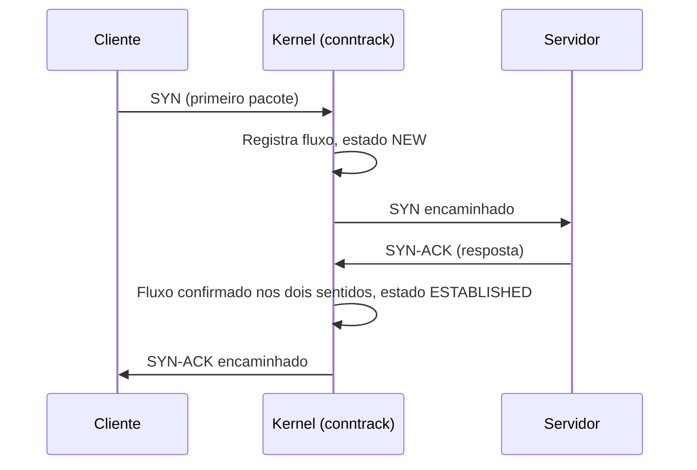

> **Para quem é:** quem já leu os [fundamentos de firewall no Linux](../../firewalls/linux-firewall-fundamentals/) e quer entender o mecanismo por baixo de UFW, firewalld e `iptables`, não só o uso de alto nível dessas ferramentas.

A página de [fundamentos de firewall no Linux](../../firewalls/linux-firewall-fundamentals/) já apresenta o vocabulário essencial: netfilter como o framework do kernel, os hooks `PREROUTING`/`INPUT`/`FORWARD`/`OUTPUT`/`POSTROUTING`, chains como listas ordenadas de regras, e nftables como a interface atual sobre `iptables` como legado. Esta página fica com a parte que aquela deixa para trás por design: o mecanismo interno, como o kernel decide qual chain roda em qual ordem, como uma conexão inteira (não só um pacote isolado) é rastreada, e o que muda estruturalmente entre a arquitetura antiga do `iptables` e a atual do `nftables`. Quem chegou aqui sem ter lido a página de fundamentos deveria ler primeiro; o vocabulário de hooks e chains não é repetido aqui.

## Prioridade de chain: várias chains no mesmo hook

Um hook do netfilter não está limitado a uma única chain. Várias ferramentas (o firewall do host, o CNI de um cluster, o Docker) podem registrar suas próprias chains no mesmo hook, e o kernel precisa de um critério para decidir em qual ordem executá-las quando um pacote passa por ali. Esse critério é a prioridade: um número inteiro associado a cada chain de base (a chain que efetivamente está presa a um hook, em oposição a uma chain regular, que só existe para ser chamada por outra via `jump`). Chains de prioridade mais baixa executam primeiro. É esse mecanismo, não uma convenção informal, que explica por que uma regra de NAT do Docker pode processar um pacote antes que a política de bloqueio configurada pelo UFW tenha chance de vê-lo: as duas chains competem pelo mesmo hook, e a prioridade numérica decide quem processa primeiro, independentemente de qual ferramenta foi configurada por último no host.

## Rastreamento de conexão (conntrack)

Um firewall que decide cada pacote isoladamente, sem lembrar do que já viu, não consegue expressar uma regra tão básica quanto "aceite o tráfego de resposta de uma conexão que este host iniciou". O rastreamento de conexão, o subsistema conhecido como conntrack, resolve isso mantendo uma tabela de estado: para cada fluxo de tráfego observado, o kernel registra endereços e portas de origem e destino, o protocolo, e um estado que descreve a fase da conexão. Um pacote pode ser classificado como `NEW` (o primeiro pacote observado de um fluxo ainda não confirmado), `ESTABLISHED` (o fluxo já teve tráfego confirmado nos dois sentidos), `RELATED` (um pacote de um fluxo secundário, mas ligado a uma conexão já rastreada, o caso clássico do canal de dados do FTP, aberto separadamente do canal de controle, mas reconhecido como parte da mesma sessão lógica) ou `INVALID` (um pacote que não corresponde a nenhum fluxo conhecido nem a um padrão esperado de abertura de conexão).

Esse estado é o que permite escrever uma política de firewall declarando "aceite tudo que for `ESTABLISHED` ou `RELATED`, rejeite o resto por padrão", em vez de enumerar manualmente cada porta de resposta possível. É também o que sustenta o masquerading: sem saber que um pacote de resposta pertence a uma conexão já rastreada e traduzida, o kernel não saberia para qual endereço interno reencaminhá-lo depois de desfazer o NAT.

## nftables: uma máquina virtual dentro do kernel

A diferença estrutural mais importante entre `iptables` e `nftables` não é de sintaxe, é de arquitetura interna. O `iptables` original embute lógica específica de protocolo diretamente no kernel, e essa lógica precisa ser duplicada para cada família de endereço: uma implementação para IPv4 (`iptables`), outra para IPv6 (`ip6tables`), outra para ARP (`arptables`), outra para bridging Ethernet (`ebtables`), cada uma com seu próprio código no kernel. O `nftables`, introduzido no kernel 3.13 (2014), substitui isso por uma máquina virtual genérica dentro do kernel que executa bytecode: as regras que o operador escreve são compiladas para esse bytecode, e uma única engine processa pacotes de qualquer família de endereço, sem duplicar a lógica de filtragem em C para cada protocolo. O resultado prático dessa mudança de design é um kernel mais simples de manter, uma ferramenta de espaço de usuário unificada (`nft`, no lugar de quatro comandos separados), e conjuntos de regras que podem ser substituídos atomicamente, o ruleset inteiro trocado de uma vez, sem a janela em que um firewall parcialmente aplicado deixaria passar tráfego que a política final bloquearia.

Dentro dessa arquitetura, tabelas (`table`) são o contêiner de mais alto nível, associadas a uma família de endereço (`ip`, `ip6`, `inet` para as duas ao mesmo tempo, `arp`, `bridge`, `netdev`); chains vivem dentro de uma tabela, e podem ser de base (presas a um hook do netfilter, com prioridade, como já descrito) ou regulares (só alcançáveis por `jump` a partir de outra chain, um recurso para organizar regras em blocos reutilizáveis que o `iptables` não oferece da mesma forma). Nada disso precisa ser memorizado como sintaxe de configuração nesta página: o ponto é entender que o modelo é declarativo e composicional, tabelas contendo chains contendo regras, em vez do modelo mais rígido de tabelas fixas predefinidas (`filter`, `nat`, `mangle`, `raw`) que o `iptables` impõe.

## `iptables-nft`: a camada de compatibilidade

A maioria das distribuições atuais, incluindo o Debian desde a versão 10 (Buster), não elimina o comando `iptables`: substitui o que ele faz por baixo. `iptables-nft` aceita exatamente a mesma sintaxe de linha de comando que o `iptables` original sempre aceitou, mas traduz cada regra para o subsistema `nf_tables` do kernel em vez de usar as estruturas antigas do `iptables` legado. Scripts, ferramentas e até UFW/firewalld, que geram comandos `iptables`, continuam funcionando sem alteração, e o que efetivamente filtra o tráfego, por baixo, já é `nftables`. `update-alternatives --display iptables` mostra qual backend está ativo no sistema (`iptables-nft` ou `iptables-legacy`); os dois podem coexistir e ser trocados, mas raramente há motivo para voltar ao legado num sistema moderno, exceto compatibilidade com uma ferramenta antiga que dependa de um comportamento específico só presente ali.

Essa é a mesma peça que a página de firewall já menciona de passagem ao explicar por que Docker e UFW podem parecer estar competindo pelas mesmas chains: hoje, na prática, os dois normalmente estão manipulando o mesmo `nftables` por baixo, um através de `iptables-nft`, outro através de regras `nft` diretas ou de sua própria camada de abstração, mas competindo pelo mesmo conjunto de hooks e pela mesma tabela de conntrack descrita acima.

## Páginas relacionadas

- [Fundamentos de firewall no Linux](../../firewalls/linux-firewall-fundamentals/): o vocabulário de hooks, chains e o uso de alto nível via UFW/firewalld, pré-requisito desta página.
- [nftables ou iptables](../nftables-vs-iptables/): comparação direta entre as duas interfaces de configuração, sem repetir o mecanismo já explicado aqui.
- [Portas publicadas pelo Docker](../../firewalls/docker-published-ports/): um caso concreto do problema de prioridade de chain descrito acima.

## Referências

- [nftables — Wikipédia](https://en.wikipedia.org/wiki/Nftables): introdução no kernel 3.13, arquitetura de máquina virtual, unificação de `iptables`/`ip6tables`/`arptables`/`ebtables` (até a escrita; confira a wiki oficial em `wiki.nftables.org` para a referência técnica completa).
- [conntrack-tools: Manual](https://conntrack-tools.netfilter.org/manual.html): estados de conexão (`NEW`, `ESTABLISHED`, `RELATED`, `INVALID`) e o papel do conntrack em firewalls stateful.
- [Debian Wiki: nftables](https://wiki.debian.org/nftables): `update-alternatives` para `iptables-nft`/`iptables-legacy`, nftables como padrão desde o Debian 10.
