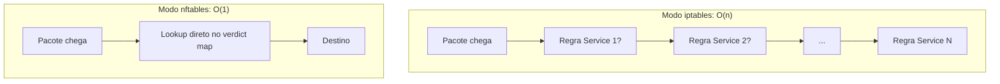

> **Para quem é:** quem já entende o mecanismo comum descrito em [netfilter e nftables por dentro](../netfilter-and-nftables/) e precisa decidir se escreve regras novas em `nft` ou continua usando `iptables`, ou está tentando entender por que as duas parecem coexistir no mesmo host.

Nenhuma das duas interfaces é estritamente superior, no mesmo espírito da comparação entre [UFW e firewalld](../../firewalls/ufw-vs-firewalld/): as duas configuram o mesmo netfilter por baixo, com modelos de sintaxe e de organização diferentes. `netfilter e nftables por dentro` já explica o mecanismo comum (hooks, prioridade de chain, conntrack, a arquitetura de máquina virtual do nftables); esta página não repete isso, foca na escolha prática entre as duas interfaces.

## Comparação por critério

| Critério | `iptables` (legado) | `nftables` |
| --- | --- | --- |
| Modelo de tabelas | Tabelas fixas predefinidas pelo kernel (`filter`, `nat`, `mangle`, `raw`), um binário por família de endereço (`iptables`, `ip6tables`, `arptables`, `ebtables`) | Tabelas e chains declaradas pelo operador, associadas à família de endereço escolhida (`ip`, `ip6`, `inet` para as duas, `arp`, `bridge`, `netdev`) |
| Sintaxe | Uma linha de comando por regra, imperativa (`iptables -A INPUT -p tcp --dport 22 -j ACCEPT`) | Bloco declarativo por chain, com sets e maps nativos para agrupar valores |
| Desempenho em muitas regras | Avaliação sequencial: cada regra é comparada uma a uma até uma decisão terminal | Pode usar estruturas de mapa (verdict maps) para lookup em tempo constante, em vez de percorrer regra por regra |
| Atomicidade de recarga | Recarregar um conjunto de regras substitui parte do estado por vez, com uma janela onde o ruleset fica parcialmente aplicado | Suporta substituição atômica do ruleset inteiro numa única transação |
| Ferramenta unificada | Quatro comandos separados por família | Um único comando (`nft`) para todas as famílias |
| Suporte em distribuições atuais | Ainda presente via `iptables-nft` (tradução de sintaxe para o backend `nftables`) | Backend padrão desde o Debian 10, também padrão em outras distribuições recentes |

## Desempenho: o exemplo concreto do kube-proxy

A diferença de desempenho entre as duas abordagens deixa de ser abstrata no caso do kube-proxy do Kubernetes, que precisa gerar uma regra de encaminhamento para cada combinação de IP e porta de cada Service do cluster. No modo `iptables` (o modo padrão histórico do kube-proxy), essa é uma avaliação sequencial: o kernel percorre a cadeia de regras, uma por Service, até encontrar a que corresponde ao pacote, uma complexidade que cresce linearmente (O(n)) com o número de Services. Em clusters com milhares de Services, essa travessia linear passa a ser mensurável na latência de cada pacote, e a sincronização das regras a cada mudança de Service ou EndpointSlice também fica mais lenta.

O modo `nftables` do kube-proxy, introduzido como alfa no Kubernetes 1.29 e em beta desde a 1.31, resolve isso trocando a cadeia de regras sequenciais por um verdict map: uma única estrutura de mapa que associa IP, protocolo e porta diretamente ao destino, consultada em tempo aproximadamente constante (O(1)), independentemente de o cluster ter dez ou dez mil Services. O ganho não é teórico: medições publicadas pelo próprio projeto Kubernetes mostram que, em clusters com 5 a 10 mil Services, a latência mediana (p50) do modo `nftables` já se aproxima da latência de melhor caso (p01) do modo `iptables`, uma diferença que se acentua ainda mais em clusters acima de 30 mil Services. Apesar disso, `iptables` continua sendo o modo padrão do kube-proxy por compatibilidade, mesmo depois de `nftables` alcançar disponibilidade geral; migrar exige troca explícita de configuração, não acontece sozinho numa atualização de versão.

## Convivência das duas interfaces na mesma máquina

`iptables-nft`, já descrito em [netfilter e nftables por dentro](../netfilter-and-nftables/#iptables-nft-a-camada-de-compatibilidade), permite que comandos escritos na sintaxe antiga continuem funcionando, traduzidos para o backend `nftables` por baixo. Isso resolve compatibilidade de scripts, mas cria um risco operacional real quando um host tem regras escritas diretamente em `nft` e, ao mesmo tempo, ferramentas ou scripts que ainda chamam `iptables` (mesmo que traduzido): as duas fontes de regra passam a coexistir no mesmo ruleset do kernel, cada uma gerenciada por uma ferramenta diferente, sem que nenhuma das duas tenha visão completa do que a outra configurou. Depurar um firewall nessas condições exige inspecionar o ruleset final com `nft list ruleset`, porque nem `iptables -L` nem um arquivo de regras `nft` isolado mostram o quadro completo quando as duas convivem. `update-alternatives --display iptables` mostra qual backend o comando `iptables` está usando no momento (`iptables-nft` ou `iptables-legacy`), o primeiro passo de qualquer diagnóstico nessa situação.

## O que Docker e Kubernetes ainda geram

O Docker usa `iptables` por padrão, mas oferece suporte experimental a um backend `nftables` nativo, selecionável pela opção `firewall-backend` do daemon; até a escrita, o próprio Docker documenta esse backend como experimental e com pequenas diferenças de comportamento em relação ao `iptables` (por exemplo, não habilitar automaticamente o encaminhamento de IP da mesma forma). O Kubernetes, via kube-proxy, oferece os dois modos como já descrito, com `iptables` ainda como padrão. Nenhum dos dois força a migração: um cluster ou host pode continuar rodando inteiramente sobre `iptables-nft` sem perder funcionalidade, e a decisão de migrar para o modo `nftables` nativo de cada ferramenta é operacional, não obrigatória. Confira a [documentação oficial do Docker sobre firewall](https://docs.docker.com/engine/network/packet-filtering-firewalls/) e a [documentação oficial do Kubernetes sobre kube-proxy](https://kubernetes.io/docs/reference/networking/virtual-ips/) para o estado atual de cada backend antes de decidir, porque os dois projetos continuam movendo o padrão ao longo do tempo.

## Quando manter `iptables` e quando migrar

Manter regras em `iptables` (via `iptables-nft`, o caso comum hoje) continua sendo a escolha mais simples quando um host já tem scripts, playbooks de Ansible ou documentação interna escritos nessa sintaxe, e o volume de regras é pequeno o suficiente para que a diferença de desempenho entre as duas abordagens nunca apareça na prática, o caso da maioria dos hosts de borda e nós de cluster deste notebook. Migrar para `nft` nativo faz mais sentido quando o ruleset já é grande o bastante para que a avaliação sequencial do modelo antigo vire um gargalo mensurável (o caso que motivou o próprio modo `nftables` do kube-proxy), quando o operador quer aproveitar sets e maps nativos para simplificar um conjunto de regras hoje repetitivo, ou quando a distribuição em uso já trata `nftables` nativo como o caminho recomendado para configuração nova. Não existe uma resposta única: a escolha depende do tamanho do ruleset, da familiaridade da equipe com cada sintaxe, e de quanto código existente depende da sintaxe `iptables`.

## Páginas relacionadas

- [Netfilter e nftables por dentro](../netfilter-and-nftables/): o mecanismo comum (hooks, prioridade, conntrack, arquitetura) que esta página não repete.
- [UFW ou firewalld](../../firewalls/ufw-vs-firewalld/): o mesmo padrão de comparação sem vencedor universal, aplicado a um par diferente de ferramentas.
- [Fundamentos de firewall no Linux](../../firewalls/linux-firewall-fundamentals/): o ponto de partida conceitual desta trilha.

## Referências

- [Kubernetes Blog: NFTables mode for kube-proxy](https://kubernetes.io/blog/2025/02/28/nftables-kube-proxy/): introdução em alfa na 1.29, beta na 1.31, GA prevista para a 1.33, benchmarks de latência O(1) vs. O(n) (até a escrita; confira a documentação oficial do Kubernetes para o estado atual do recurso).
- [Kubernetes: Service IP address and virtual IP addressing (documentação oficial)](https://kubernetes.io/docs/reference/networking/virtual-ips/): modos de encaminhamento do kube-proxy (`iptables`, `ipvs`, `nftables`), `iptables` como padrão.
- [Docker Docs: Packet filtering and firewalls](https://docs.docker.com/engine/network/packet-filtering-firewalls/): opção `firewall-backend`, suporte experimental a nftables.
- [Debian Wiki: nftables](https://wiki.debian.org/nftables): `update-alternatives` para `iptables-nft`/`iptables-legacy`.
